# 课程 1 —算法工具箱—第 4 部分:动态编程

> 原文：<https://towardsdatascience.com/course-1-algorithmic-toolbox-part-4-dynamic-programming-223ffc01984a?source=collection_archive---------0----------------------->

动态规划是一种非常强大的算法设计技术，用于解决许多指数问题。实际上，动态编程喜欢递归和“重用”。因此，为了解决动态编程的问题，我们分两步来做:

*   找出正确的重现(子问题)。
*   计算并记忆所有子问题的结果以“重复使用”。

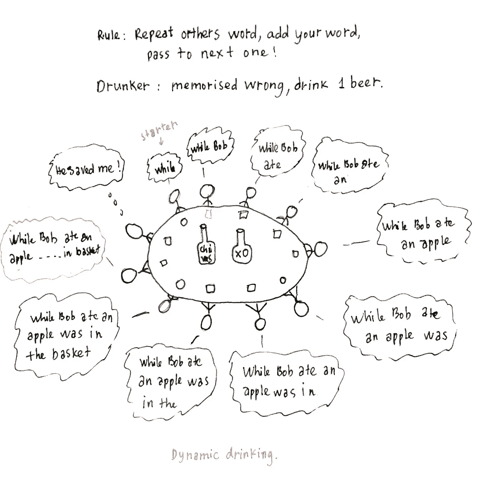

Dynamic Drinking.

让我们来看看**换钱**问题:

我们有 3 种硬币:6 分、5 分和 1 分。兑换 9 美分最少需要多少硬币？

为了用动态规划解决这个问题，我们要做的第一件事是找到这个问题的正确递归。

我们可以看到，需要兑换 9 美分的最小硬币数是我们需要兑换 3(= 9–6)或 4(= 9–5)或 8(= 9–1)的最小硬币数。所以我们有复发:

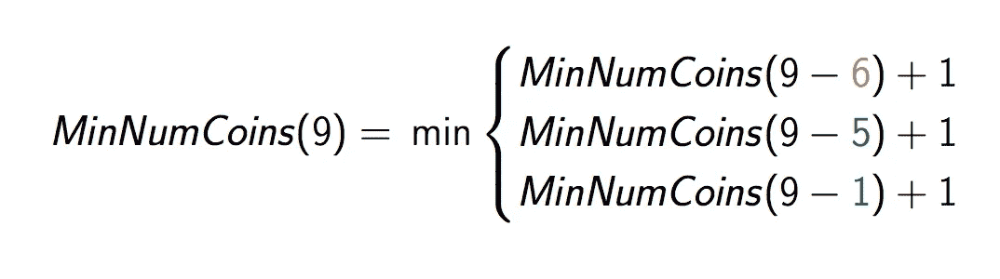

Change Money Recurrence.

我们可以使用递归技术来实现这个问题，但它会非常慢。为什么慢？当我们想改变 76 美分时，看一看递归树:

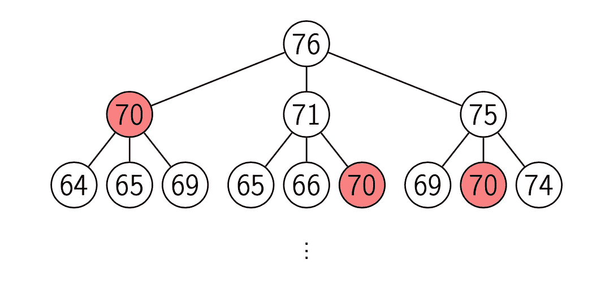

Change 76 cents.

正如我们在可视化的树中看到的，为了计算最小数目的零钱 76 美分，我们计算最小数目的零钱 70 美分、71 美分、75 美分等等……零钱 **70** 的计算重复了 3 次，对于大量的零钱，我们将重复许多子问题。这要花很多时间。所以，动态规划通常喜欢“存储所有子问题的结果并重用”。这个想法是，如果我们计算改变了 70 美分，我们不需要再次计算，我们只是返回计算结果 70 美分。

实现动态编程的好方法是我们首先计算更小的子问题，将结果保存到 dp_array 中，继续直到我们得到结果。例如，要解决兑换 9 美分的问题，我们将计算我们想要兑换 0、1、2、3、4 的最小硬币数…首先，将结果保存到 dp_array 中，继续直到我们计算出 9 美分并得到答案。

让我们一步一步来:

1.  计算兑换 0 美分=> 0 硬币的最小值

dp_array = [0]

2.计算最少兑换 1 美分=> 1 枚硬币

dp_array = [0，1]

3.计算最小找零 2 美分= > 2 个硬币

dp_array = [0，1，2]。

解释:2 分钱= 1 分钱+ 1 分钱。

4.计算最少兑换 3 美分=> 3 枚硬币

dp_array = [0，1，2，3]。

解释:3 分= 1 美分+ 1 美分+ 1 美分。

……

8.计算最少找 7 美分= > 2 美分

dp_array = [0，1，2，3，4，1，1，2]。

**解释:**在我们计算 6 美分的步骤，很容易发现 dp_array = [0，1，2，3，4，1，1]。

要计算 7 美分的变化，按照循环，我们需要找到(compute(6 = 7–1)，compute(2 = 7–5)，compute(1 = 7–6)的最小值。

我们有 dp_array 是计算小钱的缓存结果，所以我们有 compute(6) = 1，compute(2) = 2，compute(1) = 1。这些计算货币的最小值是 1。我们有两个选择:

*   1 from compute(6= 7 -1)表示我们选择 1 美分，需要 6 美分。
*   1 from compute(1 = 7–6)表示我们选择 6 美分，还需要 1 美分。

所以，我们需要 2(= 1 + 1)枚硬币将 1、5、6 美分换成 7 美分。

继续这样做，我们可以构建最终的 dp_array = [0，1，2，3，4，1，1，2，3，4]。

换 9 分钱的答案是 dp_array[9] = 4 个硬币。

总而言之，我们将首先计算更小的子问题，保存结果，在每一步，我们从保存的结果中重用子问题结果。一直做下去，直到我们得到答案。

换钱问题的伪代码:

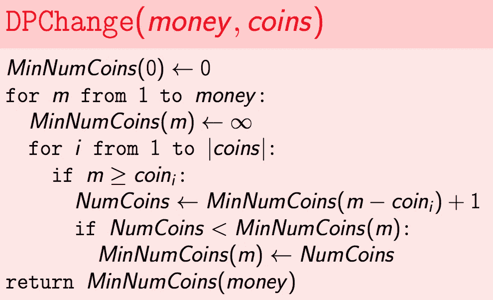

# 编辑距离问题

编辑距离问题有点难以理解的问题和解决的思路。但是一旦你理解了，问题似乎就很清楚了，很容易用动态编程来解决。

你可以看到，当你输入拼写错误的东西时，拼写检查器会通过在字典中查找附近的其他单词来发出警告。什么是测量标准？换句话说，我们如何计算两个字符串之间的距离？

计算两个字符串之间距离的自然方法是扩展，对齐以匹配尽可能多的字符。例如，下雪和晴天的两种可能路线**【1】**

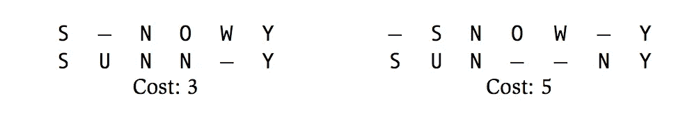

我们试图将下雪和晴天的字符串对齐，以获得尽可能多的匹配字符。匹配的字符越多，我们的距离就越近。如果我们把“S_NOWY”中的“_”叫做**插入运算符**或者**删除运算符**(从 SUNNY 中删除“U”)和“SUNN_Y”中的“_”是一样的，**插入运算符**到 SUNNY 或者**删除运算符**(在 SNOWY 中删除 W)而不匹配(O 和 N)就是不匹配运算符。那么我们可以说，将晴天转换为下雪天需要花费 3 个操作符(插入或删除，不匹配)。它们是"插入 U "、"替换 O-N "和"删除 W "。

**注意:**我们将使用**插入操作符**表示上面字符串中的“_ ”,使用**删除操作符**表示下面字符串中的“_”。

因此，两个字符串的距离是将字符串 A 转换为字符串 b 的插入、删除和不匹配操作符的最小数目。

## **计算编辑距离**

为了计算 A 和 B 的编辑距离，我们需要找出正确的递归。我们有 A[1…n]，B[1…m]叫做字符串 A 有 n 个字符，字符串 B 有 m 个字符。我们会找到子问题的关系:A[1…i]，B[1…j]。我们有 4 种方法来对齐 A[1…i]，B[1…j]。

*   插入:A[1…i， **"_** "]和 B[1…j-1， **B[j]** ]
*   删除:A[1…i-1， **A[i]** 和 B[1…j， **"_"** ]
*   错配 A[1…i-1， **A[i]** 和 B[1…j-1， **B[j]** ]，是 A[i] ≠ B[j]
*   匹配 A[1…i-1， **A[i]** ]和 B[1…j-1， **B[j]** ]，就是 A[i] = B[j]

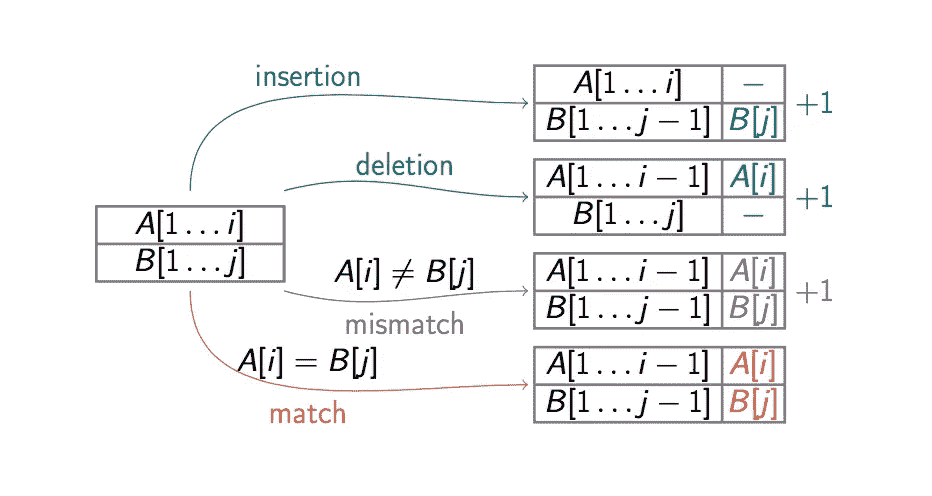

4 ways to align

要计算 A[1…i]和 B[1…j]之间的距离 D(i，j)，我们需要计算 D(i，j-1)，D(i-1，j)，D(i-1，j-1)。

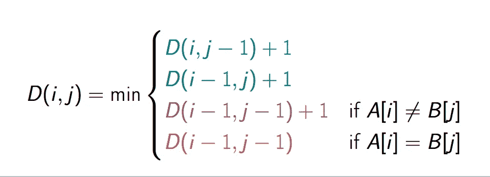

Edit distance recurrences.

因此，我们将使用二维数组来保存计算出的距离 D。

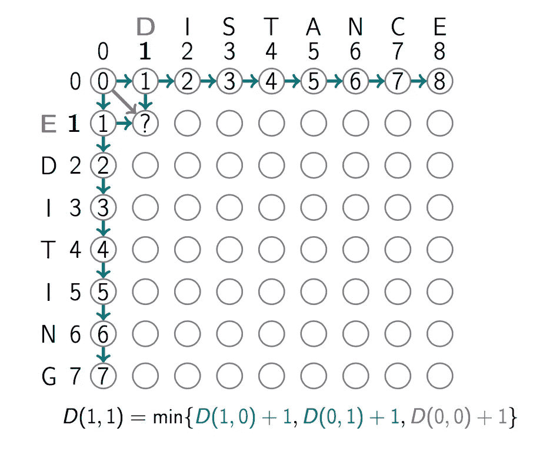

很明显，如果 D(0，j) = j 和 D(i，o) = i。

为了计算 D(1，1)，我们只需要从这个计算出的距离 D 中得到值 D(i，j-1)，D(i-1，j)，D(i-1，j-1)，意味着 D(1，0)，D(0，1)，D(0，0)。

那么 **D(1，1) = min(2，2，1) = 1**

以此类推，我们计算 D(1，2)，D(1，3)…。，D(8，7)。我们有了最终计算出的距离 d。

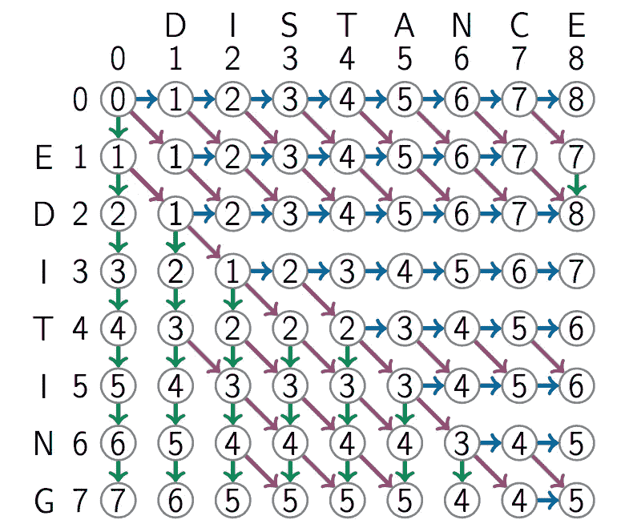

我们看到，编辑和距离的距离是 D(7，8) = 5。

从表中，我们可以很容易地得到距离的编辑和距离是 D(4，8) = 6。每个子问题都被计算、存储以便重复使用。这是动态编程。

编辑距离的伪代码:

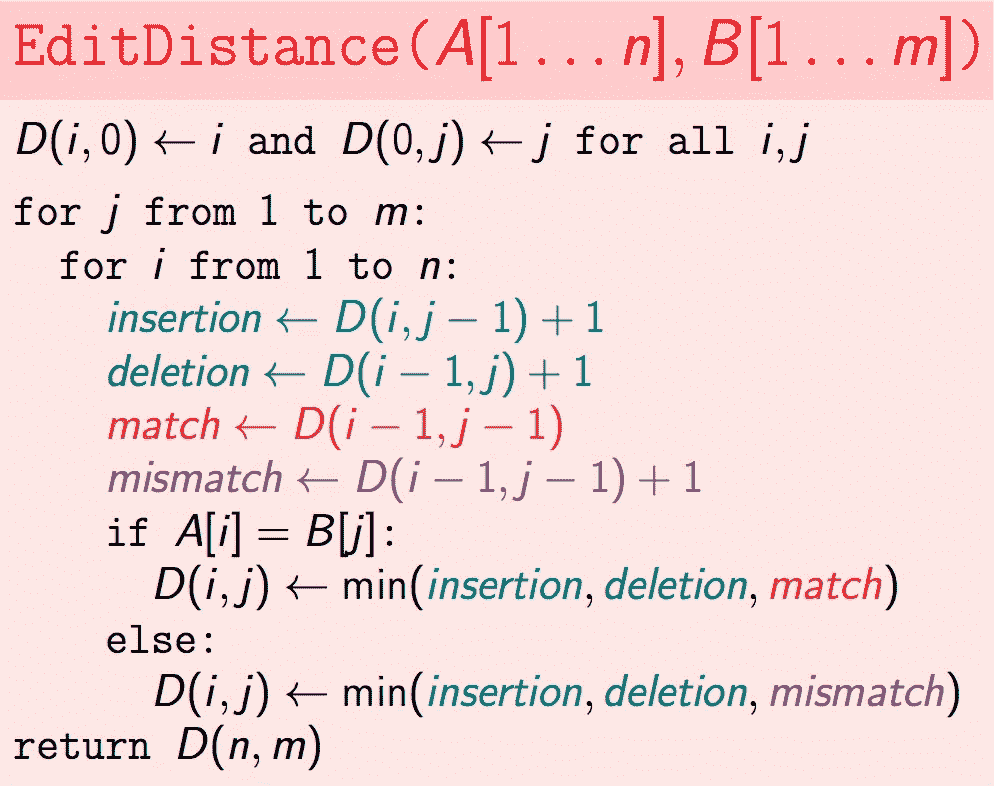

## **回溯**

回溯是动态编程的一部分。我们在编辑和距离之间找到了编辑距离的答案，但是我们怎样才能打印出对齐的结果呢？

如果我们有缓存的结果——计算的距离 d，回溯就很容易。

我们将从 D(7，8)(最终结果)，知道 D(7，8)是如何对齐的，我们只是检查我们如何计算 D(7，8)的值是从 D(7，7)，D(6，8)和 D(6，7)。在这种情况下，D(7，8) = D(6，7) + 1 是不匹配运算符。继续这样做，我们找到最终的排列。

我们可以概括我们回溯结果的方式，要知道 D(i，j)是对齐的，我们需要检查**插入操作符** - D(i，j-1) + 1、**删除操作符**-D(I-1，j) + 1、**不匹配操作符**-D(I-1，j-1)和**匹配操作符** D(i-1，j-1)。D(i，j)是这些值中的一个。

回溯编辑距离的伪代码:

# 离散背包问题

在上一篇关于 Big-O 和 Greedy 算法的文章中，我们讨论了分数背包，也就是物品可以被分割。离散背包问题就不同了，每个物品要么拿，要么不拿。

有两种类型的离散背包:有重复和没有重复。

*   有重复:有无限的项目，你可以采取每个项目多次你想要的。
*   没有重复:每个项目都有一个，所以每个项目，你只能拿一个。

## 重复背包问题。

**输入:**我们有 n 个项目，权重为:w1，w2，…，wn，值为 v1，v2，…，vn。和总容量重量:w

**输出:**重量不超过 w 的物品的最大值**每个物品可以使用任意次。**

为了用动态编程解决这个问题，我们需要找出递归(子问题)并设计缓存结果。

正如我们很容易看到的，要找到项目 W(w1 + w2 + …wi)的最大值，我们需要找到(w2 + w3 + … + wi) + v1，(w1 +w3 + … + wi) + v2，…..、(w1+w2+…+w(i-1)) + wi。形式上，

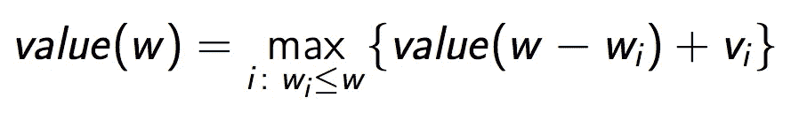

这就是我们需要的重现。所以我们计算 W = 1，W=2，…的最大值..直到我们得到 W = W。我们只需要一个数组 W[0…W]来保存缓存的结果。

重复背包问题的伪代码:

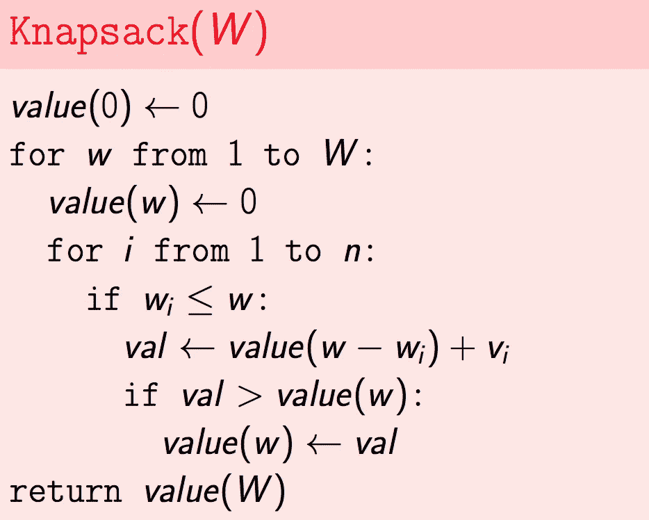

## 背包无重复问题。

**输入:**我们有 n 个项目，权重为:w1，w2，…，wn，值为 v1，v2，…，vn。和总容量重量:w

**输出:**重量不超过 w 的物品最大值**每件物品最多使用一次。**

为了找出这个问题的重复出现，我们需要澄清要点:

*   每一项要么拿，要么不拿。换句话说，W(w1，w2，…)的最大值。wi)由 W(w1，w2，…，wi)或 W(w1，w2，…)的最大值构成。w(i-1))。形式上:

**value(w，i)** = max{ **value(w-wi，i-1) + vi** ， **value(w，i-1)** }

所以，我们需要计算(w = 1，2，…)的最大值。w， **i = 1** )，(w = 1，2…w， **i = 2** )，…。(w= 1，2，…w， **i = n** )得到结果**值(w，n)** 。我们需要一个二维数组来存储缓存的结果。

背包重复问题的伪代码。

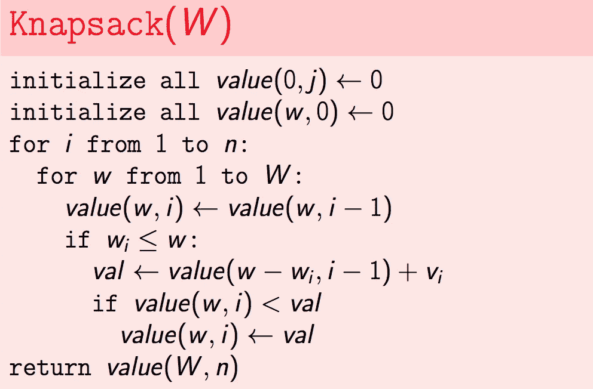

**例子:**

我们有 4 个权重为(w1，v1)= (6，30)，(w2，v2)= (3，14)，(w3，v3)= (4，16)，(w4，v4)= (2，9)的项目。

通过使用该策略，我们可以构建最终表:

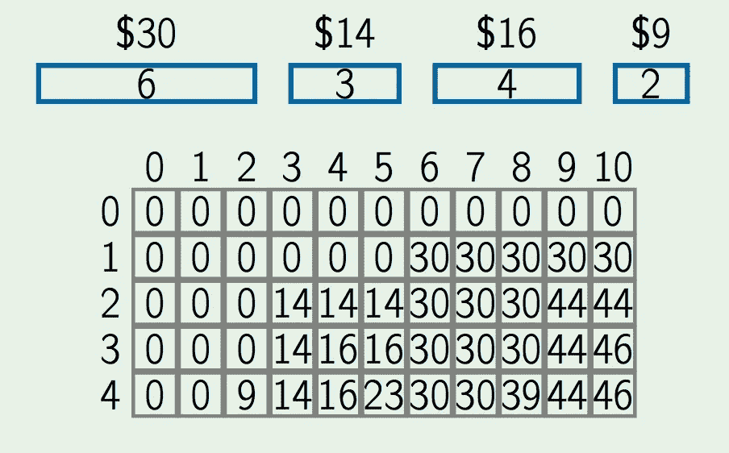

我们可以看到，值[w=10，i=4]是 46。该值的计算公式如下

max{ value[(w=10) —(wi=2)，i=2] + vi=9，value[w=10，i=2]}

= max{value[8，2] + 9，value[10，1] }

= max{ 46，30} = 46。

## **回溯**

在我们建立了这个表之后，它包含了所有的结果值。我们可以用它回溯来标记哪个项目被使用。像上面的例子一样，值(10，4) = 46 选自值(8，2) + 9。因此，我们可以标记第 4 项未使用。

# 放置括号的问题。

动态规划要解决的一个好问题是括号问题。

**输入:**一串数字 d1，.。。、dn 和一系列操作

op1，…，op(n 1)∈{+，，×}。

**输出:**应用这些操作的顺序

表达式的值。**D1 op1 D2 op2 op(n1)dn。**

**例如:**

如何在一个表达式 **1 + 2 — 3 x 4 — 5** 中放置括号使其值最大化？

答案是:((1+2)(3×(45)))= 6。

找出这个问题的正确重现。我们假设表达式**58+7×48+9**的最佳括号中的最后一个操作是 **x.**

所以目标是找出(58+7)**×**(48+9)的最大值

我们现在可以看到子问题，我们有两个子表达式:s1，s2。为了找到 s1 x s2 的最大值，我们将找到 max{ min(s1) x min(s2)，min(s1) x max(s2)，max(s1) x min(s2)，max(s1) x max(s2) }。在此基础上，我们可以计算出**(58+7)×(48+9)**的最大值

min(58+7)=(5(8+7))= 10

max(58+7)=((58)+7)= 4

min(48+9)=(4(8+9))= 13

max(48+9)=((48)+9)= 5

显然，**max((58+7)×(48+9))= 130**

通常，为了找到子表达式 E(i，j)的最大值，我们遵循递归:

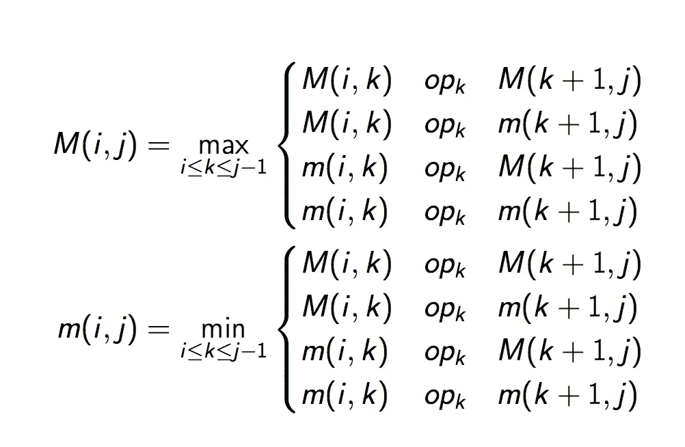

M(i，j)是 E(i，j)的最大值，m(i，j)是 E(i，j)的最小值。

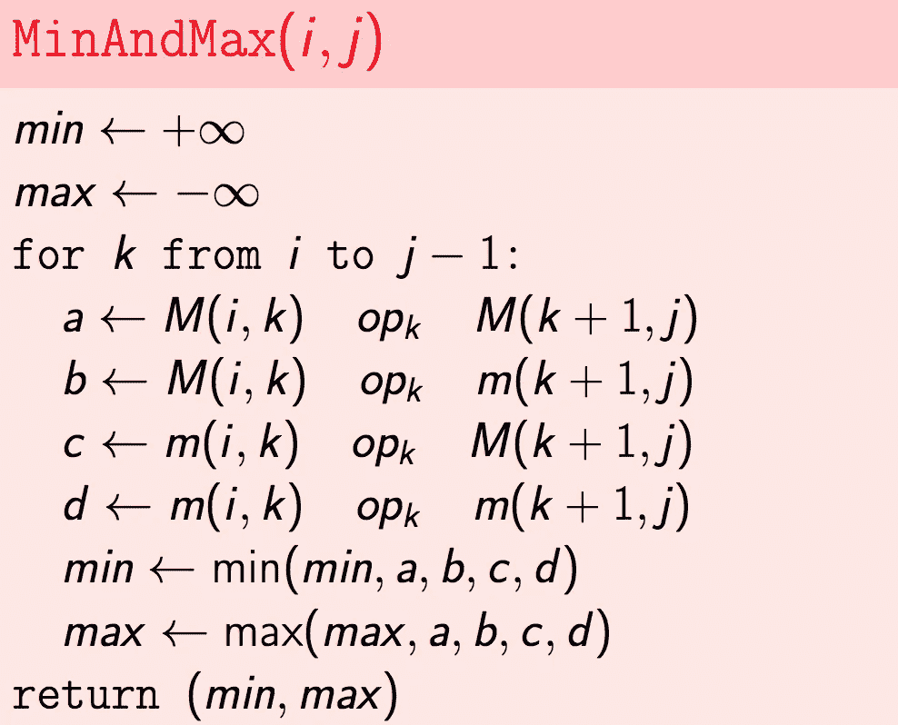

这意味着为了计算 M(i，j ),我们需要首先计算并缓存结果 M(i，k)和 M(k+1，j)。为此，我们将按照(j — i)递增的顺序计算所有子问题。换句话说，我们需要先计算(j-i)= 1，然后(j-I)= 2……例如，为了计算**5 8 + 7×4 8+9，**我们需要先计算(**5 8)，(8+7)，(7 x 4)，(4 8)，(8 + 9)** 子问题，然后计算 **(5 — 8 +7)，(8+7 x 4)，(7 x 4–8)，(4–8+9)**等等……

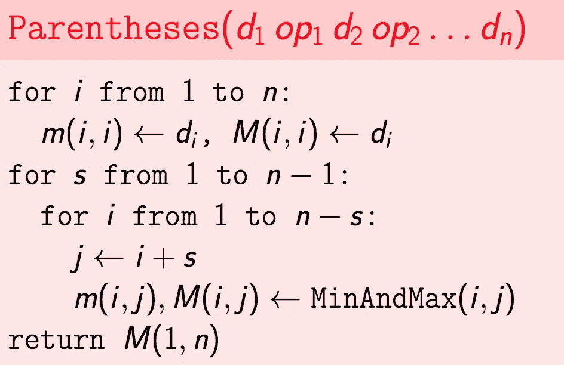

基于该策略，我们可以构建表达式表:**58+7×48+9**

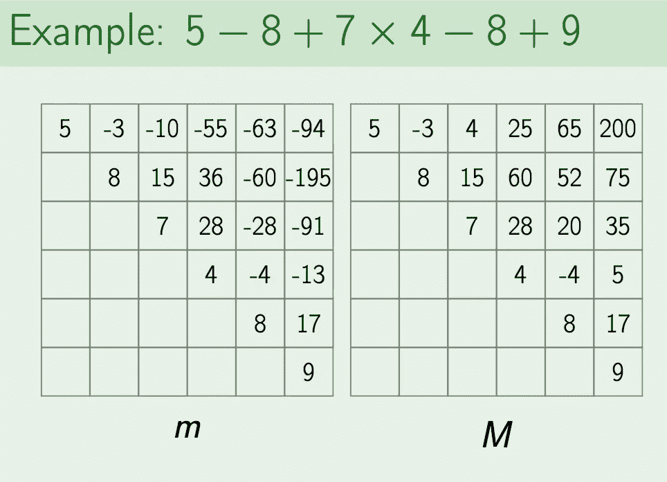

理解每个问题的动态编程需要时间，但是一旦你理解了它并找到了正确的递归，代码就很容易实现了。让我们通过练习一些问题来全面理解动态编程。

# 问题 1:原始计算器

给你一个可以用当前数 x 进行以下三种运算的原始计算器:x 乘以 2，x 乘以 3，或者 x 加 1 .给你的目标是一个正整数 n，求从数 1 开始得到数 n 所需的最小运算次数。

**问题描述**

**任务。**给定一个整数 n，从数字 1 开始计算得到数字 n 所需的最少运算次数。

**输出格式。**在第一行，输出从 1 得到 n 所需的最小运算次数 k。在第二行输出一系列中间数字。也就是说，第二行应该包含正整数 a0，a2，…，a(k-1)使得 a0 =1，a(k-1) =n 并且对于所有 0≤i < k-1，ai + 1 等于 ai+1，2 x ai，或者 3 x ai。如果有许多这样的序列，输出其中的任何一个。

**样品 1。**

**输入:** 5

**输出:**

3

1 2 4 5

**解释:**
这里我们先把 1 乘以 2 两次，然后再加 1((1 x 2)x 2)+1)。还有一种可能是先乘以 3，再加两次 1。因此，在这种情况下,“1 3 4 5”也是有效的输出。

**样品 2:**

**输入:** 96234

**输出:**

14

1 3 9 10 11 22 66 198 594 1782 5346 16038 16039 32078 96234

**解释:**
同样，这种情况下的另一个有效输出是“1 3 9 10 11 33 99 297 891 2673 8019 16038 16039 48117 96234”。

你的目标是为这个问题设计并实现一个动态编程解决方案。在这种情况下，一个自然的子问题如下:C(n)是从 1 得到 n 所需的最小运算数(使用三个基本运算)。如何通过 C(n/3)，C(n/2)，C(n-1)表示 C(n)？

## **解决方案:**

首先要做的是找出这个问题的重现。很容易看出对于 n = 0，2，3。我们只需要一次手术。n = 1 成本 0 操作。

对于 n = 4，我们可以表示为 4 = 4/2 * 2 或 4 =(4–1)+1。

即 C(4) = C(n/2) + 1 或 C(4) = C(n-1) + 1。因为 4 不能被 3 除，所以我们忽略 C(n/3)。

通过这个观察，我们可以推广这个问题的递归性:

C(n) = min{ **C(n/3) + 1 如果 n ⋮ 3** ， **C(n/2) + 1 如果 n ⋮ 2** ， **C(n-1) + 1** }

我们有递归，我们可以很容易地实现它:

在我们计算出运算的最小值后，我们需要**回溯**来给出数列。正如我们之前所说的，在我们计算了最少的操作之后，我们得到了缓存的结果: **result** 。它包含了我们从 0，1，2，… n 需要达到的所有操作数。

例如，对于计算编号 n，我们有一个操作数组:

结果= [0，0，1，1，2， **3** ，2，3，3，2， **3**

如您所见，n = 10 => result[10] = 3。n = 5 = >结果[5] = 3。

为了计算结果[10]，我们将基于结果[10/2] = 3 和结果[10–1]= 2。我们为前一个数字选择较小的运算。所以我们会选择 10 -1 = 9 为前面的数 10 — ( 9 -> 10)用-1 运算。

小心能除以 2 和 3 的数。因此，我们将选择除以 3，以获得更小数量的下一个 n = n/3

# 问题 2:尽可能多拿黄金

这个问题是关于实现无重复背包问题的算法。

**问题描述**

**任务。在这个问题中，给你一套金条，你的目标是将尽可能多的金子放进你的包里。每个条形只有一个副本，对于每个条形，你可以选择接受或不接受(因此你不能接受条形的一部分)。**

**输入格式。输入的第一行包含背包的容量 W 和金条的数量 n。下一行包含 n 个整数 w0，w1，.。。w(n-1)定义金条的重量。**

**输出格式。输出一个容量为 W 的背包所能装下的最大重量的黄金。**

**样品 1。**

**输入:**

10 3

1 4 8

**输出:**

9

**解释:**
这里我们有 W = 10，3 根金条:1，4，8。第一个和最后一个条形的权重之和等于 9。

要解决这个问题，只需仔细实现讲座中涉及的相应算法即可。

## 解决方案:

我们只是实现了背包，没有重复以上。但是我们需要澄清:金条的价值和金条的重量是一样的。

# 问题 3:计算两个字符串之间的编辑距离

两个字符串之间的编辑距离是两个字符串对齐中插入、删除和不匹配的最小数量。

**问题描述**

**任务。这个问题的目标是实现计算两个字符串之间编辑距离的算法。**

**输入格式。**两行输入的每一行都包含一个由小写拉丁字母组成的字符串。

**输出格式。**输出给定的两个字符串之间的编辑距离。

**样品 1。**

**输入**:

短裤

港口

**输出**:

3

说明:
总成本 3 的对齐:

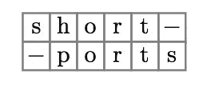

要解决这个问题，只需仔细实现讲座中涉及的相应算法即可。

**解决方案:**

# 问题 4:最大化算术表达式的值

在这个问题中，你的目标是给一个给定的算术表达式加上括号，使其值最大化。

**问题描述**

**任务**。通过使用附加括号指定算术运算的应用顺序，找到算术表达式的最大值。

**输入格式**。输入的唯一一行包含长度为 2n + 1 的字符串 s，对于某些 n，符号为 s0，s1，.。。，s2n。s 的偶数位置上的每个符号是一个数字(即从 0 到 9 的整数)，而奇数位置上的每个符号是{+、-、*}的三种运算之一。

**输出格式。**在应用算术运算的不同顺序中，输出给定算术表达式的最大可能值。

**样品 2。**

**输入:**

5–8+7*4–8+9

**输出:**

200

**解释:**

200 = (5 ((8 + 7) x (4 (8 + 9))))

要解决这个问题，只需仔细实现讲座中涉及的相应算法即可。

## **解决方案:**

# **高级问题 5:三个序列的最长公共子序列**

在这个问题中，你的目标是计算三个序列的最长公共子序列的长度。

**问题描述**

**任务。**给定三个序列 A = (a1，a2，…，an)，B = (b1，b2，…，bm)，C = (c1，c2，…，cl)，求它们的最长公共子序列的长度。

**输入格式。**第一行:n .第二行:a1，a2，.。。，安。第三行:m .第四行:b1，b2，.。。，bm。第五行:l .第六行:c1，c2，…，cl。

**输出。**它们最长公共子序列的长度。

**样品 1。**

**输入:**

3

1 2 3

3

2 1 3

3

1 3 5

**输出:** 2

**解释:** 长度为 2 的一个常见子序列是(1，3)。

首先设计一个寻找两个(而不是三个)序列的最长公共子序列的算法可能更容易。为此，请复习课堂上计算编辑距离的算法。

## **解决方案:**

这个问题最难的工作是找出复发。在每一步，我们如何从 **D(x-1，y，z)** 、 **D(x，y-1，z)** 和 **D(x，y，z-1)之间找到 **D(x，y，z)** 的关系。**

# 最后的话:

这是**课程 1 —算法工具箱**系列的最后一篇文章。我们有 3 种解决问题的策略:贪婪，分而治之，动态规划。我们确实讨论了 Big-O，并解决了许多关于非常大的数据集和边的问题。通过小测试很容易，但是快速、有效地通过测试却一点也不容易。

感谢您抽出时间阅读。如果你觉得不错，你可以点击♡把我的文章推荐给你的朋友。

**如果你喜欢这篇文章，你可能会喜欢:**

[算法工具箱—第 1 部分:简介](https://medium.com/towards-data-science/course-1-algorithmic-toolbox-part-1-introduction-c29b8175430f)

[算法工具箱—第 2 部分:大 O 和贪婪](https://medium.com/towards-data-science/course-1-algorithmic-toolbox-part-2-big-o-and-greedy-6265d9065f05)

[算法工具箱—第三部分:分而治之](https://medium.com/towards-data-science/course-1-algorithmic-toolbox-part-3-divide-and-conquer-dd9022bfa2c0)

**资源:**

[1]:编辑距离:[DPV08]的第 6.3 节

变更问题:[CP]的“动态编程简介:变更问题”一节

背包:[DPV08]第 6.4 节

[麻省理工学院动态编程讲座。](https://ocw.mit.edu/courses/electrical-engineering-and-computer-science/6-006-introduction-to-algorithms-fall-2011/lecture-videos/lecture-21-dp-iii-parenthesization-edit-distance-knapsack/#vid_related)

**进阶阅读:**【CP】第五章“我们如何比较生物序列”

**进阶阅读:** [高级动态编程讲义](http://jeffe.cs.illinois.edu/teaching/algorithms/notes/06-sparsedynprog.pdf)杰夫·埃里克森著

**参考文献:**

Sanjoy Dasgupta、Christos Papadimitriou 和 Umesh Vazirani。算法(第一版)。麦格劳-希尔高等教育。2008.

托马斯·h·科尔曼，查尔斯·e·莱瑟森，罗纳德·L·李维斯特，克利福德·斯坦。算法导论(第三版)。麻省理工学院出版社和麦格劳-希尔。2009.

菲利普·孔波夫，帕维尔·佩夫兹纳。生物信息学算法:一种主动学习方法。主动学习出版商。2014.