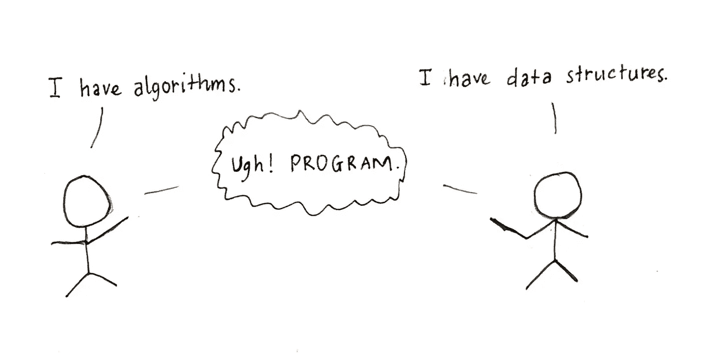
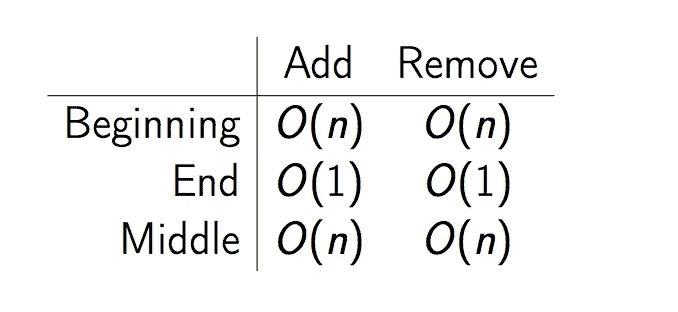
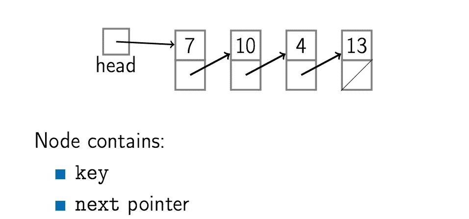
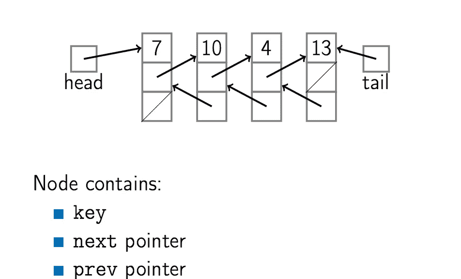
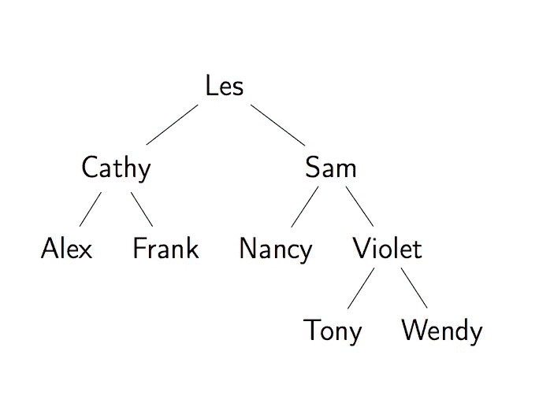
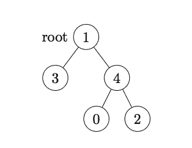
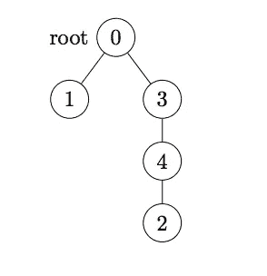

# 课程 2 —数据结构—第 1 部分:基本数据结构

> 原文：<https://towardsdatascience.com/course-2-data-structure-part-1-the-basic-data-structures-4f4b5bd380c1?source=collection_archive---------1----------------------->



algorithms + data structures version 2017

一句名言:**程序=算法+数据结构**。[在上一个系列](https://medium.com/towards-data-science/course-1-algorithmic-toolbox-part-1-introduction-c29b8175430f)中，我们讲了 3 种算法[贪婪](https://medium.com/towards-data-science/course-1-algorithmic-toolbox-part-2-big-o-and-greedy-6265d9065f05)、[分而治之](https://medium.com/towards-data-science/course-1-algorithmic-toolbox-part-3-divide-and-conquer-dd9022bfa2c0)、[动态规划](https://medium.com/towards-data-science/course-1-algorithmic-toolbox-part-4-dynamic-programming-223ffc01984a)来接近一个问题。在下一个系列中，我们将看看数据结构，以帮助我们解决更复杂的问题。让我们从最基本的数据结构开始:数组、链表。看看队列、栈是如何建立在这些数据结构之上的。什么是树？如何不用递归计算树的高度？

# **数组**

数组是由相同大小的元素组成的连续内存区域，这些元素由连续的整数索引。

在内存中，我们只是将指针地址保存到数组中，因为所有元素在内存中是大小相等且连续的，所以要得到第 I 个元素的地址，我们只需计算:**pointer _ address+element _ size * I .**

基于此定义，我们可以很容易地看到阵列上的操作成本:



# 单链表



单链表有许多节点，每个节点包含键(数据)和指向下一个元素的指针。第一个节点叫头，最后一个节点叫尾。基于这个定义，我们可以很容易地实现单链表:

```
def push_front(key): 
    node <- new node
    node.key <- key
    node.next = head
    head <- node
    if tail == nil:
        tail <- headdef pop_front():
    if head == nil:
        ERROR: empty list
    head <- head.next
    if head = nil:
        tail <- nildef push_back(key):
    node <- new node
    node.key <- key
    node.next = nil
    if tail = nil:
        head <- tail <- node
    else:
        tail.next <- node
        tail <- nodedef pop_back():
    if head == nil: ERROR: empty list
    if head == tail:
        head <- tail <- nil
    else:
        p <- head
        while p.next.next != nil:
            p <- p.next
        p.next <- nil; tail <- pdef add_after(node, key):
    node2 <- new node
    node2.key <- key
    node2.next = node.next
    node.next = node2
    if tail == node:
        tail <- node2
```

# 双向链表



在单链表中，我们只有一个节点指向下一个元素，像 PopBack 和 AddBefore 这样的操作需要 O(n)来运行。有了双向链表，我们可以用 O(1)来运行这些操作。我们有两个节点指向下一个元素和前一个元素。

```
def push_back(key):
    node <- new node
    node.key <- key; node.next = nil
    if tail = nil:
        head <- tail <- node
        node.prev <- nil
    else:
        tail.next <- node
        node.prev <- tail
        tail <- nodedef pop_back():
    if head = nil: ERROR: empty list
    if head = tail:
        head <- tail <- nil
    else:
        tail <- tail.prev
        tail.next <- nildef add_after(node, key):
    node2 <- new node
    node2.key <- key
    node2.next <- node.next
    node2.prev <- node
    node.next < node2
    if node2.next != nil:
        node2.next.prev <- node2
    if tail = node:
        tail <- node2def add_before(node, key):
    node2 <- new node
    node2.key <- key
    node2.next <- node
    node2.prev <- node.prev
    node.prev <- node2
    if node2.prev != nill:
        node2.prev.next <- node2
    if head = node:
        head <- node2
```

# 堆

堆栈是具有以下操作的抽象数据类型。

Push(键):将键添加到集合中。

Top():返回最近添加的**键。**

Pop():删除并返回最近添加的**键**

Empty():有没有元素？

堆栈，也称为 LIFO 队列，可以用数组或链表来实现，对于 Push、Pop、Top、Empty 操作有 O(1)。

## 平衡支架问题:

比方说，我们想要一个文本编辑器的检查器。我们要检查文本输入是平衡的括号如下:

平衡的:

*   ([]) [] ()
*   ((([([])]))())

不平衡:

*   ([]]()
*   ][

有了堆栈数据结构，我们可以很容易地解决这个问题:

```
def is_balanced(str):
    Stack stack
    for char in str:
        if char in [ '(', '[' ]:
            stack.push(char)
        else:
            if stack.empty(): return False
            top <- stack.pop()
            if (top = '[' and char != ']') or
                (top = '(' and char != ')'):
                    return False
    return stack.empty()
```

# 队列:

队列是具有以下操作的抽象数据类型:

Enqueue(key):将关键字添加到集合中。

Dequeue():移除并返回**最近最少添加的**键。

Empty():有没有元素？

队列，也称为 FIFO(先进先出)，可以用链表(带尾指针)或数组来实现，并有 O(1)用于入队、出队和空操作。

看这些可视化:[基于数组的栈](http://www.cs.usfca.edu/~galles/visualization/StackArray.html)，[基于列表的栈](http://www.cs.usfca.edu/~galles/visualization/StackLL.html)，[基于数组的队列](http://www.cs.usfca.edu/~galles/visualization/QueueArray.html)，[基于列表的队列](http://www.cs.usfca.edu/~galles/visualization/QueueLL.html)。

# 树

树有一个根节点和许多其他节点，每个节点包含:键、子节点、父节点(可选)。对于二叉树，一个节点包含:key，left，right，parent(可选)。



这是一个二叉树的例子，我们有 Les 作为根和许多其他节点，每个节点有左和右像:Cathy(左)，Sam(右)为根节点。

要计算树的高度，我们可以使用递归:

```
def height(tree):
  if tree = nil:
    return 0
  return 1 + Max(height(tree.left), height(tree.right))
```

我们有两种方法来按特定顺序访问树的节点:

*   **深度优先:**在探索兄弟子树之前，我们完全遍历子树。

```
def post_order_traversal(tree):
  if tree = nil:
    return
  post_order_traversal(tree.left)
  post_order_traversal(tree.right)
  print(tree.key)
```

*   **广度优先:**在前进到下一层之前，我们遍历一层的所有节点。

```
def level_traversal(tree):
  if tree = nil: return
  Queue q
  q.Enqueue(tree)
  while not q.empty():
    node <- q.dequeue()
    print(node)
    if node.left != nil:
      q.enqueue(node.left)
    if node.left != nil:
      q.enqueue(node.right)
```

# 问题 1:检查代码中的括号

在这个问题中，您将为文本编辑器实现一个功能，以查找代码中括号用法中的错误。

**问题描述**

**任务。你的朋友正在为程序员制作一个文本编辑器。他目前正在开发一个功能，可以发现不同类型括号使用中的错误。代码可以包含集合[]{}()中的任何中括号，其中左中括号是[、{、和(对应的右中括号是]、}、和)。**

为了方便起见，文本编辑器不仅应该通知用户括号的使用有错误，还应该指出有问题的括号在代码中的确切位置。首要任务是找到第一个不匹配的右括号，它要么前面没有左括号，如] in ]()，要么结束了错误的左括号，如} in ()[}。如果没有这样的错误，那么它应该会找到第一个不匹配的左括号，后面没有对应的右括号，比如{}([]。如果没有错误，文本编辑器应该通知用户括号的用法是正确的。

除了括号，代码还可以包含大小拉丁字母、数字和标点符号。更正式的说法是，代码中的所有括号都应该分成匹配的括号对，这样每对括号中的开始括号都在结束括号之前，对于任何两对括号，要么其中一个嵌套在另一个中，如(foo[bar])，要么它们是分开的，如 f(a，b)-g[c]。中括号[对应于中括号]，{对应于}，和(对应于)。

**输入格式。**输入包含一个字符串𝑆，它由集合[]{}()中的大小拉丁字母、数字、标点符号和括号组成。

**输出格式。**如果𝑆的代码正确使用了括号，则输出“Success”(不带引号)。否则，输出第一个不匹配的右括号的从 1 开始的索引，如果没有不匹配的右括号，则输出第一个不匹配的左括号的从 1 开始的索引。

**样品 1。**

**输入:**

```
{}[] 
```

**输出:**

```
Success
```

**解释:**括号使用正确:有两对括号——第一对{ and }，第二对[and]——并且这两对不相交。

**样品 2** 。

**输入:**

```
{ 
```

**输出:**

```
1 
```

**解释:**代码{没有正确使用括号，因为括号不能成对(只有一个括号)。没有右括号，第一个不匹配的左括号是{，它的位置是 1，所以我们输出 1。

**样品 3。**

**输入:**

```
{[} 
```

**输出:**

```
3 
```

**解释:**括号}不匹配，因为它前面最后一个不匹配的左括号是【and not】。它是第一个不匹配的右括号，我们的首要任务是输出第一个不匹配的右括号，它的位置是 3，所以我们输出 3。

**样品 3。**

**输入:**

```
foo(bar[i); 
```

**输出:**

```
10 
```

**解释:**)不匹配[，所以)是第一个不匹配的右括号，所以我们输出它的位置，是 10。

要解决这个问题，您可以稍微修改讲座中的 **IsBalanced** 算法，不仅考虑括号，还考虑代码中的其他字符，并且不仅返回代码是否正确使用括号，还返回代码第一个损坏的位置。

## **解决方案:**

在讲座中，IsBalanced 伪代码为我们提供了括号的解决方案:“()[]”。我们只需要检查“{}”并跟踪我们推入堆栈的每个括号的位置。

# **问题 2:计算树高**

树用于操作分层数据，如零售商的类别层次结构或计算机上的目录结构。它们还用于数据分析和机器学习，用于分层聚类和构建复杂的预测模型，包括一些实践中表现最好的算法，如决策树和随机森林上的梯度提升。在本课程后面的模块中，我们将介绍平衡二分搜索法树(BST)，这是一种特殊的树，可以非常高效地存储、操作和检索数据。因此，平衡 BST 在数据库中用于高效存储，并且实际上在几乎任何重要的程序中使用，通常是通过手边编程语言的内置数据结构。在这个问题中，你的目标是适应树木。您需要从输入中读取树的描述，实现树数据结构，存储树并计算其高度。

**问题描述**

**任务。**给你一个有根树的描述。你的任务是计算并输出它的高度。回想一下,(有根的)树的高度是一个节点的最大深度，或者从一片叶子到根的最大距离。给你一棵任意的树，不一定是二叉树。

**输入格式。**第一行包含𝑛.的节点数第二行包含从 1 到𝑛1 的𝑛整数——节点的父节点。如果𝑖-th 其中之一(0≤𝑖≤𝑛1)为 1，则节点𝑖是根，否则它是𝑖-th 节点的父节点的从 0 开始的索引。保证正好有一个根。保证输入代表一棵树。

**输出格式。**输出树的高度。

**样品 1。**

**输入:**

```
5 4 -1 4 1 1 
```

**输出:**

```
3
```

**解释:**输入表示有 5 个节点，编号从 0 到 4，节点 0 是节点 4 的子节点，节点 1 是根节点，节点 2 是节点 4 的子节点，节点 3 是节点 1 的子节点，节点 4 是节点 1 的子节点。为了看到这一点，让我们在一行中写下从 0 到 4 的节点数，并将输入中给出的数字写在下面的第二行中:

```
0 1 2 3 44 -1 4 1 1
```

现在我们可以看到，节点号 1 是根，因为 1 对应于第二行中的根。此外，我们知道节点 3 和 4 是根节点 1 的子节点。此外，我们知道节点 0 和 2 是节点 4 的子节点。



这棵树的高度是 3，因为从根 1 到叶 2 的路径上的顶点数是 3。

**样品 2。**

**输入:**

```
5 -1 0 4 0 3 
```

**输出:**

```
4 
```

**解释:**

输入意味着有 5 个节点，编号从 0 到 4，节点 0 是根，节点 1 是节点 0 的子节点，节点 2 是节点 4 的子节点，节点 3 是节点 0 的子节点，节点 4 是节点 3 的子节点。这棵树的高度是 4，因为从根 0 到叶 2 的路径上的节点数是 4。



为了解决这个问题，用一个适用于任意树的实现来改变课堂上描述的高度函数。请注意，在这个问题中，树可能非常深，所以如果您使用递归，应该小心避免堆栈溢出问题，并且一定要在具有最大可能高度的树上测试您的解决方案。

建议:利用每个树节点的标签都是 0 范围内的整数这一事实..𝑛−1:你可以将每个节点存储在一个数组中，数组的索引是节点的标签。通过将节点存储在一个数组中，您可以对给定标签的任何节点进行𝑂(1 访问。创建一个𝑛节点数组:

```
allocate 𝑛𝑜𝑑𝑒𝑠[𝑛] 
for 𝑖 ← 0 to 𝑛 − 1: 
  𝑛𝑜𝑑𝑒𝑠[𝑖] =new 𝑁𝑜𝑑𝑒
```

然后，读取每个父索引:

```
for 𝑐ℎ𝑖𝑙𝑑_𝑖𝑛𝑑𝑒𝑥 ← 0 to 𝑛 − 1: 
  read 𝑝𝑎𝑟𝑒𝑛𝑡_𝑖𝑛𝑑𝑒𝑥 
  if 𝑝𝑎𝑟𝑒𝑛𝑡_𝑖𝑛𝑑𝑒𝑥 == −1: 
    𝑟𝑜𝑜𝑡 ← 𝑐ℎ𝑖𝑙𝑑_𝑖𝑛𝑑𝑒𝑥 
  else: 
    𝑛𝑜𝑑𝑒𝑠[𝑝𝑎𝑟𝑒𝑛𝑡_𝑖𝑛𝑑𝑒𝑥].𝑎𝑑𝑑𝐶ℎ𝑖𝑙𝑑(𝑛𝑜𝑑𝑒𝑠[𝑐ℎ𝑖𝑙𝑑_𝑖𝑛𝑑𝑒𝑥])
```

一旦你做好了树，你就需要计算它的高度。如果不使用递归，就不用担心堆栈溢出问题。如果没有递归，你将需要一些辅助数据结构来跟踪当前状态(例如，在讲座的广度优先搜索代码中，我们使用了队列)。

## 解决方案:

在我们构建了树之后，我们可以使用 queue 来计算树的高度。为了做到这一点，我们将使用广度优先的旅行，对于每一个水平，我们增加高度 1 多。

# 进阶问题 3:网络封包处理模拟

在这个问题中，你将实现一个程序来模拟网络数据包的处理

**问题描述**

**任务。给你一系列的网络数据包，你的任务是模拟它们的处理过程。数据包以某种顺序到达。对于每个𝑖数据包，你知道它到达𝐴𝑖的时间和处理器处理它𝑃𝑖的时间(都以毫秒计)。只有一个处理器，它按照数据包到达的顺序处理传入的数据包。如果处理器开始处理某个数据包，它不会中断或停止，直到处理完这个数据包，处理数据包𝑖正好需要𝑃𝑖毫秒。**

处理数据包的计算机有一个固定大小的𝑆.网络缓冲区当包到达时，它们在被处理之前被存储在缓冲器中。然而，如果当数据包到达时缓冲区已满(在此数据包之前已有𝑆数据包到达，而计算机尚未处理完其中的任何一个)，它将被丢弃，根本不会被处理。如果几个数据包同时到达，它们首先都被存储在缓冲区中(其中一些可能会因此被丢弃，这些将在后面的输入中描述)。计算机按照信息包到达的顺序处理信息包，一旦处理完前一个信息包，就开始处理缓冲区中的下一个可用信息包。如果在某个时刻计算机不忙，并且缓冲区中没有数据包，计算机就等待下一个数据包到达。请注意，计算机一处理完数据包，它就会离开缓冲区并释放缓冲区中的空间。

**输入格式。**输入的第一行包含缓冲区的大小𝑆和传入网络数据包的数量𝑛。接下来的每一条𝑛线都包含两个数字。𝑖-th 线包含𝑖-th 数据包的到达时间𝐴𝑖和处理时间𝑃𝑖(均以毫秒计)。可以保证到达时间序列是不递减的(但是，它可以包含以毫秒为单位的完全相同的到达时间，在这种情况下，输入中较早的分组被认为较早到达)。

**输出格式。**对于每个数据包，输出处理器开始处理它的时刻(以毫秒为单位),如果数据包被丢弃，则输出 1(按照数据包在输入中给出的顺序输出数据包的答案)。

**样品 1。**

**输入:**

```
1 1 0 0 
```

**输出:**

```
0 
```

**解释:**唯一的数据包在时间 0 到达，计算机立即开始处理。

**样品 3。**

**输入:**

```
1 2 0 1 0 1 
```

**输出:**

```
0 -1 
```

**解释:**第一个数据包在时间 0 到达，第二个数据包也在时间 0 到达，但是被丢弃，因为网络缓冲区的大小为 1，并且它已经被第一个数据包填满。第一个数据包在时间 0 开始处理，第二个数据包根本没有处理。

**样品 4。**

**输入:**

```
1 2 0 1 1 1
```

**输出:**

```
0 1
```

**解释:**第一个包在时间 0 到达，计算机立即开始处理，在时间 1 结束。第二个数据包在时间 1 到达，计算机立即开始处理它。

要解决这个问题，您可以使用列表或队列(在这种情况下，队列应该允许访问它的最后一个元素，这样的队列通常称为 deque)。您可以在自己选择的语言中使用相应的内置数据结构。

一种可能的解决方案是在列表或队列 **finish_time** 中以递增的顺序存储计算机将完成处理当前存储在网络缓冲区中的分组的时间。当一个新的包到达时，你首先需要从 **finish_time** 的前面弹出所有在新的包到达时已经被处理的包。然后，您尝试在**完成时间**中添加新数据包的完成时间。如果缓冲区已满(在**完成时间**中已经有𝑆完成时间)，则数据包被丢弃。否则，其加工完成时间加到**完成时间**上。

如果新数据包到达时**完成时间**为空，计算机将在新数据包到达时立即开始处理。否则，计算机将在处理完当前在 **finish_time** 中的最后一个数据包后立即开始处理新的数据包(此时您需要访问 **finish_time** 的最后一个元素，以确定计算机何时开始处理新的数据包)。您还需要通过将𝑃𝑖加到加工开始时间来计算加工完成时间，并将其推到**完成时间**的后面。

您需要记住输出每个数据包的处理开始时间，而不是存储在 **finish_time** 中的处理结束时间。

## 解决方案:

要解决这个问题，我们需要注意几点:

*   我们只需要记录完成时间。
*   当前处理时间是每个请求进入的时间。每次请求到达时，我们应该删除所有在**完成时间**队列中已经完成的请求。
*   当**完成时间**为空时，总是排队新请求。

## 阅读:

参见第 10.2 章[CLRS] —数组，链表

参见第 10.1 章[clr]—堆栈和队列

参见第 10.4 章[CLRS] —树

## 参考资料:

托马斯·h·科尔曼，查尔斯·e·莱瑟森，罗纳德·L·李维斯特，克利福德·斯坦。算法导论(第三版)。麻省理工学院出版社和麦格劳-希尔。2009.