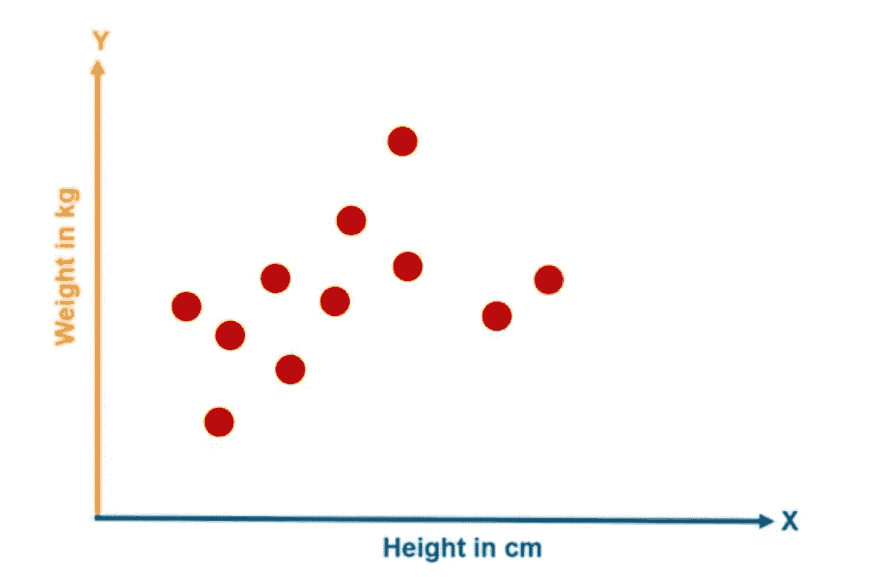
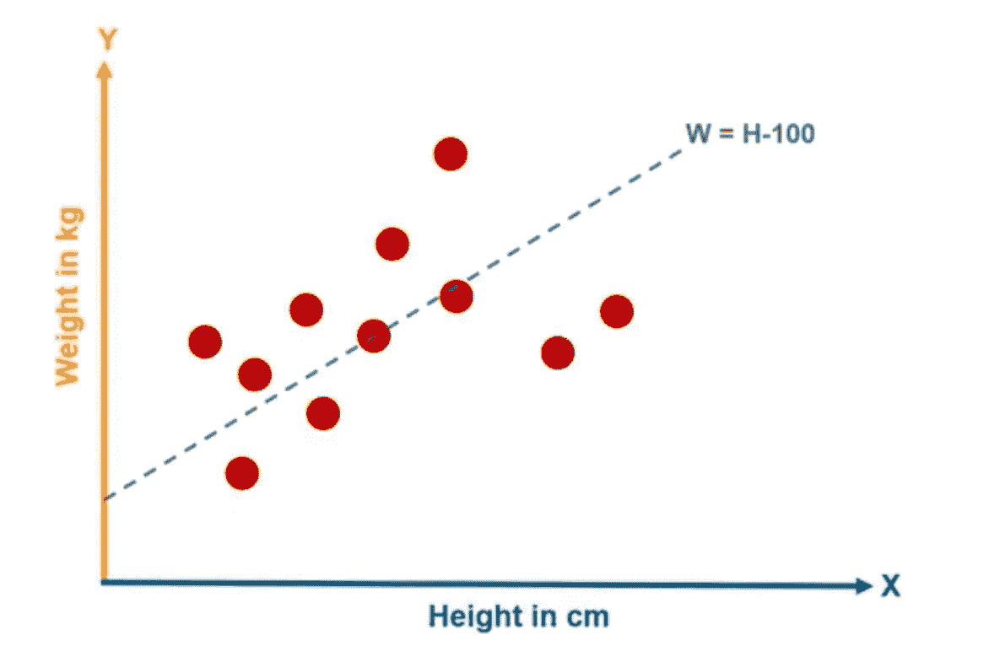
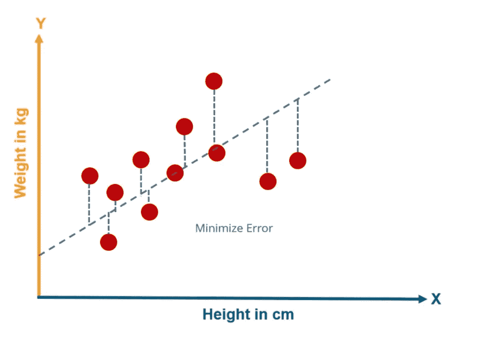
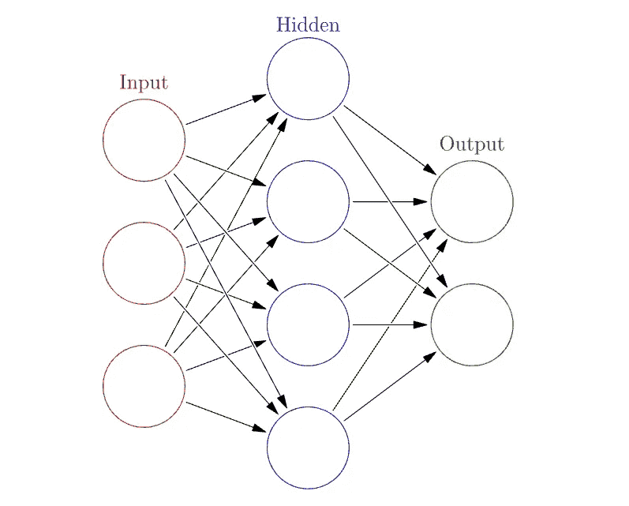
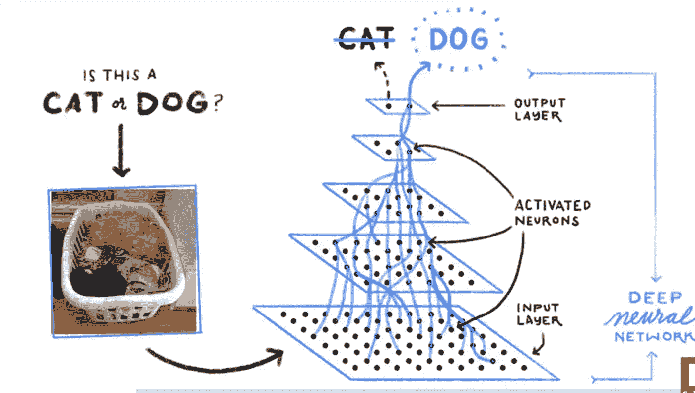
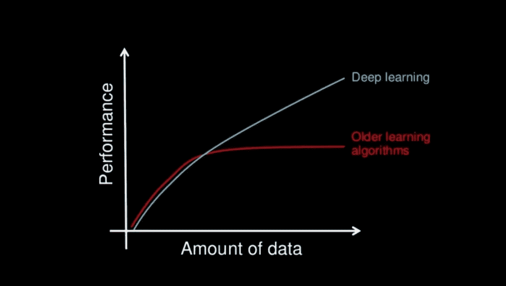
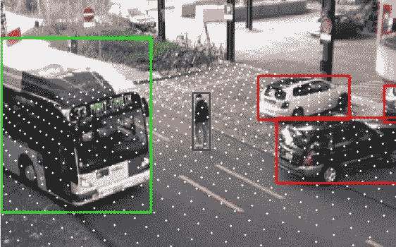

# 人工智能的表亲

> 原文：<https://towardsdatascience.com/cousins-of-artificial-intelligence-dda4edc27b55?source=collection_archive---------2----------------------->

## 人工智能、机器学习和深度学习是全球的热门话题，其应用部署在所有主要的业务领域。这些术语让很多人感到困惑，并且经常互换使用。如果你是其中之一，那么让我们试着理解人工智能和它的兄弟姐妹的关系。

人工智能是机器学习(ML)和深度学习(DL)的更广泛的保护伞。图表显示，ML 是 AI 的子集，DL 是 ML 的子集。

Cousins of AI

**人工智能**

*“通过计算机程序对人类心理功能建模的研究。”——*[*柯林斯字典*](https://www.collinsdictionary.com/dictionary/english/artificial-intelligence)

人工智能由人工和智能两个词组成。任何非自然的和人类创造的东西都是人造的。智力意味着理解、推理、计划等能力。因此，我们可以说，任何使机器能够模仿、发展或展示人类认知或行为的代码、技术或算法都是人工智能。

人工智能的概念很古老，但最近开始流行。**但是为什么呢？**

原因是之前我们只有非常少量的数据来做出准确的预测。但是今天，每分钟产生的数据量都在急剧增加，这有助于我们做出更准确的预测。除了巨大的数据量，我们还有更先进的算法、高端计算能力和存储的支持，可以处理如此巨大的数据量。例子包括特斯拉自动驾驶汽车，苹果的 Siri 等等。

**机器学习**

我们已经看到了什么是人工智能，但是是什么问题导致了机器学习的引入？

**几个原因是:**

在统计学领域，问题是“如何有效地训练大型复杂模型？”在计算机科学和人工智能领域，问题是“如何训练更健壮的人工智能系统？

因为这些问题，机器学习被引入。

**什么是机器学习？**

"机器学习是让计算机在没有明确编程的情况下行动的科学."——[*斯坦福大学*](https://www.coursera.org/learn/machine-learning/lecture/Ujm7v/what-is-machine-learning)

它是人工智能的一个子集，使用统计方法使机器能够随着经验而改进。它使计算机能够采取行动并做出数据驱动的决策来执行某项任务。这些程序或算法的设计方式使得它们可以在接触新数据时随着时间的推移而学习和改进。

**例如:**

假设我们想创建一个系统，根据身高告诉我们人的预期体重。首先，我们将收集数据。这就是数据的样子(下图)。图上的每个点代表一个数据点。

首先，我们将根据身高画一条简单的线来预测体重。

一条简单的线可以是 W=H-100

在哪里

w =以千克为单位的重量

h =以厘米为单位的高度

这条线可以帮助我们做预测。我们的主要目标是缩小估计值和实际值之间的距离。即误差。为了实现这一点，将绘制一条穿过所有点的直线。

我们的主要目标是最小化误差，使它们尽可能小。减少实际值和估计值之间的误差可以提高模型的性能，而且我们收集的数据点越多，我们的模型就越好。

因此，当我们输入一个人的身高的新数据时，它可以很容易地告诉我们这个人的体重。

**深度学习**

*“深度学习是机器学习的一个子领域，涉及被称为人工神经网络的大脑结构和功能所启发的算法”。——*[*机器学习掌握*](https://machinelearningmastery.com/what-is-deep-learning/)

这是一种特殊的机器学习，它受到我们称为神经元的脑细胞的功能的启发，这导致了人工神经网络(ANN)的概念。使用人工神经元或计算单元的层来模拟 ANN，以接收输入并应用激活函数和阈值。

在简单模型中，第一层是输入层，接着是隐藏层，最后是输出层。每层包含一个或多个神经元。

Layers in Artificial neural Network

**用简单的例子来理解概念层面的事情是如何发生的**

**你如何从其他形状中识别正方形？**

我们要做的第一件事是检查图形是否有四条线。如果是，我们进一步检查是否所有线路都已连接和关闭。如果是，我们最后检查是否所有的都是垂直的，所有的边都是相等的。

如果图形满足所有条件，我们就认为它是正方形。

正如我们在示例中看到的，它只是概念的嵌套层次。所以我们接受了一个复杂的识别正方形的任务，并把它分解成几个简单的任务。深度学习也做同样的事情，但规模更大。

例如，机器执行识别动物的任务。机器的任务是识别给定图像是猫还是狗。

Differentiating between dog & cat using Deep Learning algorithm

如果我们要求我们使用概念机器学习来解决这个问题，那么我们会定义一些特征，例如检查它是否有胡须，检查尾巴是直的还是弯曲的，以及许多其他特征。我们将定义所有特征，并让我们的系统识别哪些特征在对特定动物进行分类时更重要。现在，当涉及到深度学习时，它向前迈出了一步。与我们必须手动给出特征的机器学习相比，深度学习会自动找到哪些特征对分类最重要。

所以到目前为止，我们知道人工智能是一个更大的图景，机器学习和深度学习是它的子部分。

**机器学习(ML) vs 深度学习(DL)**

理解机器学习和深度学习之间的区别的最简单的方法是“DL 是 ML”。更具体地说，这是机器学习的下一次进化。

我们取几个重要参数，对比一下机器学习和深度学习。

1.  **数据依赖**

两者之间最重要的区别是随着数据大小的增加，性能会有所提高。从下图中我们可以看到，由于数据的大小很小，深度学习的表现并不好，但为什么呢？

这是因为深度学习算法需要大量数据才能完美理解。另一方面，机器学习在较小的数据集上工作得非常好。

**2。硬件依赖性**

深度学习算法高度依赖高端机器，而机器学习算法也可以在低端机器上工作。这是因为深度学习算法的要求包括 GPU，这是其工作不可或缺的一部分。GPU 是必需的，因为它们执行大量的矩阵乘法运算，这些运算只有在使用 GPU 时才能得到有效优化。

**3。特征工程**

它是将领域知识用于降低数据复杂性并使模式对学习算法更可见的过程。就时间和专业知识而言，这一过程既困难又昂贵。在机器学习的情况下，大多数特征需要由专家识别，然后根据域和数据类型进行手工编码。机器学习的性能取决于如何准确地识别和提取特征。但是在深度学习中，它试图从数据中学习高层次的特征，因此它领先于机器学习。

**4。问题解决方法**

当我们使用机器学习解决问题时，建议首先将问题分解成子部分，单独解决它们，然后将它们组合起来以获得最终结果。另一方面，在深度学习中，它端到端地解决问题。

举个例子，

任务是多目标检测，即目标是什么以及它出现在图像中的什么位置。

所以让我们看看如何使用机器学习和深度学习来解决这个问题。

在机器学习方法中，我们将问题分成两部分。物体检测和物体识别。

我们将使用像包围盒检测这样的算法作为例子来扫描整个图像并检测所有对象，然后使用对象识别算法来识别相关对象。当我们结合两种算法的结果时，我们将得到最终结果，即什么是对象以及它在图像中的位置。

在深度学习中，它从头到尾执行这个过程。我们将把一幅图像传递给一个算法，我们的算法将给出物体的位置和名称。

**5。执行时间**

深度学习算法需要大量的时间来训练。这是因为深度学习算法中有太多的参数，需要比平时更长的训练时间。而在机器学习中，与深度学习相比，训练时间相对较少。

现在，在测试数据时，执行时间完全相反。在测试过程中，深度学习算法的运行时间非常短，而 KNN 等机器学习算法的测试时间会随着数据量的增加而增加。

**6。可解释性**

这是人们在行业内使用之前想了很多的主要原因。假设我们用深度学习给出自动化的作文评分。它的表现非常出色，与人类一样，但有些问题它没有告诉我们为什么它会给出这样的分数，事实上，从数学上来说，我们可以找出当时深层神经网络的哪些节点被激活，但我们不知道神经元应该模拟什么，以及这些层集体在做什么。所以我们无法解释结果，但在机器学习算法中，如决策树，给了我们一个清晰的规则，为什么它选择了它选择的东西，所以很容易解释背后的推理。

我希望现在你已经对这三者有了清晰的认识，他们之间有什么样的关系，他们之间有什么不同。

感谢阅读！