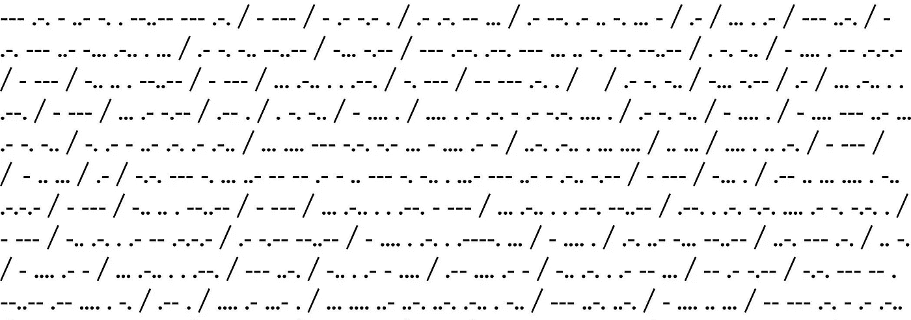
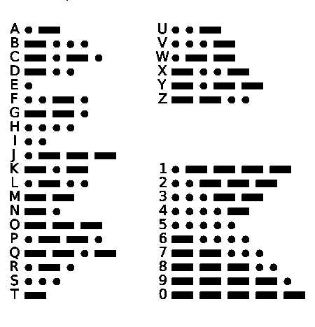
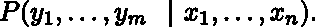
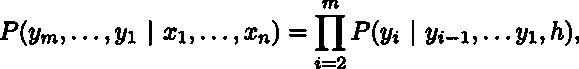
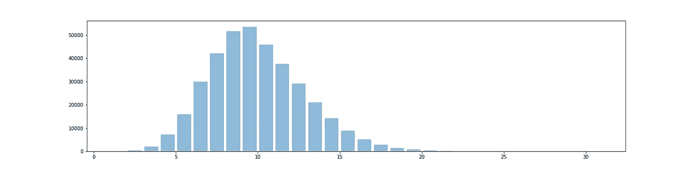
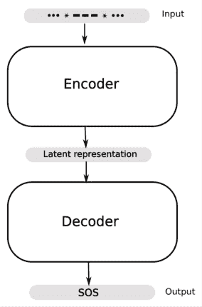
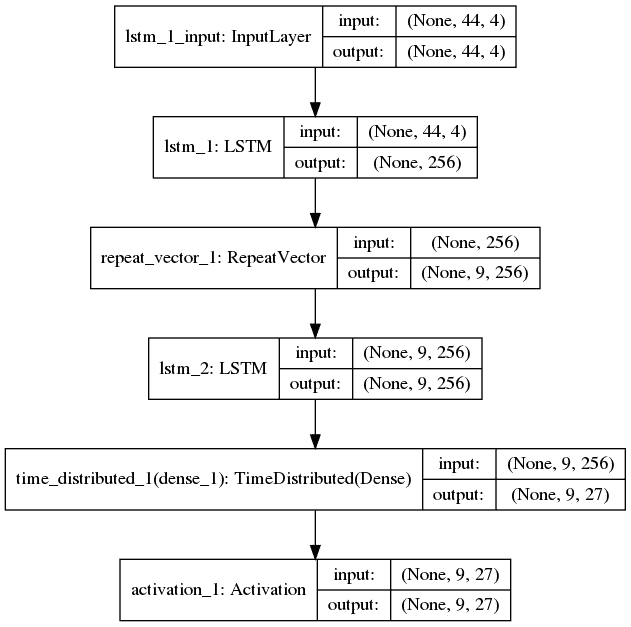
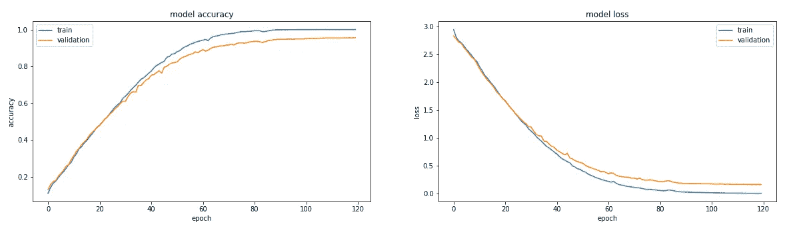
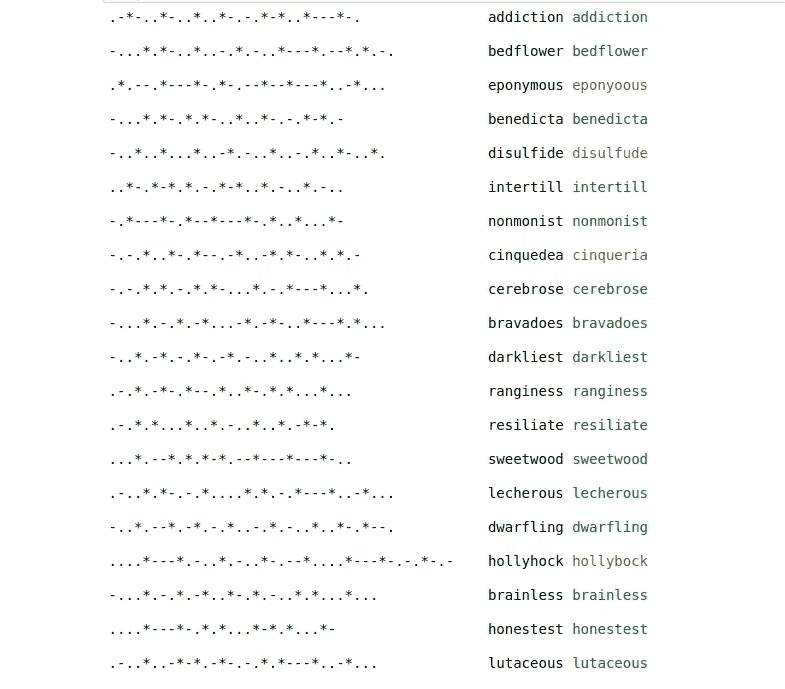
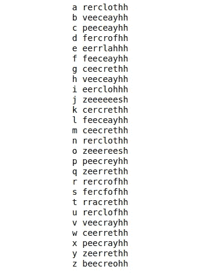

# 用 RNNs“破解”莫尔斯电码

> 原文：<https://towardsdatascience.com/cracking-morse-code-with-rnns-e5883355a6f3?source=collection_archive---------3----------------------->



剧透:莫尔斯电码其实不需要破解。它很有用，因为使用这种代码可以用最少的设备发送信息，我说它不需要*破解，因为这种代码是众所周知的，点和破折号的组合代表什么不是秘密。但是，理论上，它是一种替代密码——字母表中的每个字母(和每个数字)都用点和破折号来表示，如下图所示。*



International Morse code

让我们暂停怀疑，假设我们收到了莫尔斯电码的信息，但我们不知道如何阅读它们。还假设我们有一些代码及其相应单词的例子列表。现在，我们可能会猜测这是一个替代密码，然后最终找出每个字母的代码；从而解码消息。

或者——我们可以构造一个 ***编码器-解码器模型*** 来猜测(几乎)所有的单词！！作为受虐狂，我们当然会选择后者。话虽如此，让我们鞭策马，踏上与风车作战的征程。

**这里是手头的问题**；我们有几个编码序列及其可理解对应物的例子。使用这些例子，我们必须学习一些模式，并使用这些信息来预测新的编码标记(单词)可能是什么。与我们预测数字结果的常见回归问题不同，我们手头有一个序列到序列的学习问题，其中数据中有时间结构。这是递归神经网络(RNNs)可能有所帮助的一个即时提示(格言是 RNNs 用于语音和语言数据，CNN 用于图像数据，以及组合 RNNs 和 CNN 用于图像字幕)。粗略地说，这属于包含机器翻译问题的一类问题；这个模型的结构是这里的灵感来源。关于这个主题的更多信息，请参考[1]。我们在这里不会花时间在 RNNs 的理论上，但是对于这个主题的清晰简明的介绍，请参考[2]中的一系列文章。

对于那些想知道这个问题是否可以用不同的方式解决的人来说；是的，马尔可夫链蒙特卡罗可以得到类似的结果。在这种情况下，我们将遵循优秀论文[3]第一个例子中提到的程序。

## 大意

粗略地说，我们想从一个输入序列(x1，…x_n)中预测某个输出序列(y1，…，y_m)，这涉及到学习条件概率



这里的一个主要障碍是从可变大小的输入预测可变大小的输出。在元级别上，这可以通过组合两个 rnn 来克服，第一个 rnn 将可变大小的输入映射到固定长度的输出，另一个 rnn 接受固定长度的输入并返回可变长度的输出。固定长度的中间向量称为上下文向量，它封装了来自输入序列的信息，每次输入一个字符。产生上下文向量的机制使得 RNNs 可用于捕获时间结构，上下文向量或者是最终时间步长后 RNN 的隐藏状态，或者是它的某个函数。使用*链规则*计算上述条件概率



其中 *h* 是上下文向量。最后，可以使用 softmax 函数来计算上述等式右侧的条件概率，该函数将字符 y_{i-1}、…、y_1 的独热编码向量、第二 RNN 中的递归层的输出和上下文向量作为输入。这里使用的特定类型的 RNN 是 LSTM，其有效地克服了简单 rnn 的局限性，简单 rnn 遭受消失梯度问题，并且更好地捕捉长程相关性。

## 数据准备

我们将引入一个特殊字符(*)来表示每个字母的代码之间的空格。例如，SOS 的代码将表示为。。。* — — —*.。.'(而不是’。。。— — — .。.').我们这样做是为了确保对应于给定代码的单词是唯一的。接下来，我们将使用由[编辑的数据集(words_alpha)中的英语单词作为我们数据的单词，而不是产生随机的字母集合。为了理解这些数据，考虑下面给出的单词长度直方图。从直方图可以明显看出，长单词(长度大于 5)比短单词多得多。](https://github.com/dwyl/english-words/blob/master/words_alpha.txt)



根据包含长编码单词的数据训练的网络倾向于平均预测长单词。请记住，网络不会找出产生数据的“公式”，也就是说，它不会学习图 1 中的图表。

我们从构造一个函数开始准备数据，这个函数将把一个英语单词作为输入，并输出它的莫尔斯电码。

```
import random
import numpy as np
import matplotlib.pyplot as plt *# construct the Morse dictionary* alphabet = " ".join("abcdefghijklmnopqrstuvwxyz").split()values = ['.-', '-...', '-.-.', '-..', '.', '..-.', '--.', '....', '..', '.---', '-.-', '.-..', '--', '-.','---', '.--.', '--.-', 
.-.', '...', '-', '..-', '...-', '.--', '-..-', '-.--', '--..']morse_dict = dict(zip(alphabet, values))def morse_encode(word):
    return "*".join([dict_morse_encode[i]for i 
                             in " ".join(word).split()]
```

出于说明的目的，我们将从给定固定长度的单词中产生训练和验证数据。这里我们将这个长度固定为 9，因为长度为 9 的单词的数量足够大(参考上面的直方图)。请注意，这意味着从网络输出的字将是固定长度的，但输入的莫尔斯电码不会都是相同的长度。我们采取的另一个自由是，我们假设我们知道每个字母表由长度最多为 4 的字符串编码(我们不需要做出这个特定的假设，我们可以改为选择训练数据中最长的莫尔斯码的长度作为要跟随的 max_length_x 值)。因此，如果单词 if 的长度为 *n* ，那么对应于它的莫尔斯电码的长度将最多为 4n+(n-1)，其中 n-1 项对应于*s 的数量。我们在代码的左侧填充空格以使它们都具有相同的长度，这意味着我们的输入字符词汇表是{ '。'、“—”、“*”、“}，并且为了一般性，我们让输出的字符词汇表是所有字母和空白的特殊字符。回到关于网络平均猜测长词的评论，我们的意思是网络将倾向于猜测更少的空格，因为长词数量造成的不平衡。在下面的代码片段中，output_list 将包含英语单词，input_list 将包含填充的莫尔斯电码。

```
import randomword_len = 9
max_len_x = 4*word_len + (word_len-1)
max_len_y = len_worddef data_gen(n):

    with open('words_alpha.txt', 'r') as f:
        all_words = f.read().lower().split('\n')        
        words = [word for word in all_words if len(word)==n]

        *# Shuffle the list since the words are ordered*
        random.shuffle(words)

        g_out = lambda x: ' '*(max_len_y -len(x)) + x
        output_list = [g_out(word) for word in words]

        g_in = lambda x: morse_encode(x)+' '*(max_len_x
                                             - len(morse_encode(x)))
        input_list = [g_in(word) for word in words]

        return output_list, input_listoutput_list, input_list = data_gen(9)
```

现在，我们构建输入中字符的一个热编码向量，以使输入数据适合神经网络。为此，我们构建了一个类对象(类似于 Keras 文档中的例子),它将有助于把莫尔斯电码和英语单词编码和解码成数组。我们用适当的字符集将类分配给对象。

```
class CharTable(object): def __init__(self, chars):
        self.chars = sorted(set(chars))
        self.char_indices = dict((c, i) for i, c in
                                            enumerate(self.chars))
        self.indices_char = dict((i, c) for i, c in 
                                            enumerate(self.chars)) def encode(self, token, num_rows):
        x = np.zeros((num_rows, len(self.chars)))
        for i, c in enumerate(token):
            x[i, self.char_indices[c]] = 1
        return x def decode(self, x, calc_argmax=True):
        if calc_argmax:
            x = x.argmax(axis=-1)            
        return ''.join(self.indices_char[x] for x in x)*# we include the white space as a character in both cases below.*
chars_in = '*-. '
chars_out = 'abcdefghijklmnopqrstuvwxyz 'ctable_in = CharTable(chars_in)
ctable_out = CharTable(chars_out)
```

分割数据以从整个数据集 x，y 的四分之一中产生训练集 x_train，y_train，并且我们将保留剩余的四分之三作为验证集 x_val，y_val。请注意，理想情况下，我们应该将训练集的一部分作为验证集，其余部分作为测试集，但是考虑到我们的玩具设置，我们对模型构建比对参数调整更感兴趣。我们现在已经准备好了我们的训练和测试(验证)数据，可以继续修补网络了。

```
 x = np.zeros((len(input_list), max_len_x, len(chars_in)))
y = np.zeros((len(output_list), max_len_y, len(chars_out)))for i, token in enumerate(input_list):
    x[i] = ctable_in.encode(token, max_len_x)
for i, token in enumerate(output_list):
    y[i] = ctable_out.encode(token, max_len_y) m = len(x)// 4
(x_train, x_val) = x[:m], x[m:]
(y_train, y_val) = y[:m], y[m:]
```

构建神经网络最简单的方法是使用 Keras 模型和顺序 API。因为我们不需要 TensorFlow 的全部功能和灵活性，所以让我们坚持使用 Keras。

## 模型构造(编码器-解码器模型)

我们选择的模型拓扑将包含简单 RNN 的一个强大变体，称为长短期记忆(LSTM)网络。



第一个 LSTM 将作为编码器，接收可变长度的输入序列，一次一个字符，并将其转换为固定长度的内部潜在表示。另一个 LSTM 将作为解码器，将潜在表示作为输入，并将其输出传递到密集层，该层使用 softmax 函数一次一个字符地进行预测。

该模型的编码器和解码器组件可能具有多层 LSTMs，并且通常事先不清楚哪种拓扑工作得最好。对于机器翻译来说，深度网络通常工作得更好。根据经验，我们希望堆叠图层能够学习更高级别的时态表示，因此当数据具有某种层次结构时，我们会使用它。对我们来说，一层就够了。

该模型是使用 Sequential()构建的，每次添加一层。第一 LSTM 层将 3D 张量作为输入，并要求用户指定输入尺寸。这可以用代码中指定的 input_shape 简洁地完成，其中第一个组件表示时间步长的数量，第二个组件表示特征的数量。对我们来说，特征的数量是输入序列的词汇表中元素的数量，即 4，因为我们有“.”、“—”、“*”和空白字符“”。时间步长的数量是 max_len_x，因为我们一次馈送一个独热编码向量。我们还将指定层中存储单元(或块)的数量(这里由 latent_dim 参数表示，我们使用 256)，这是潜在表示的维度。注意，我们想要返回 LSTM 的最终隐藏状态作为潜在表示，这将具有来自所有时间步骤的信息，即完整的输入序列。如果我们使用 *return_sequences = true* 选项，我们将获得每个时间步长的隐藏状态输出，但它将只包含到该步为止的序列信息。

```
model = Sequential()
model.add(layers.LSTM(latent_dim, input_shape=(max_x_length, 
                                                  len(chars_in))))
```

这就结束了简单的编码器模型。接下来我们构建一个类似的层作为我们的解码器。但是，上述代码片段的输出将是一个 2D 数组。我们通过使用方便的 RepeatVector 层重复输出 max_len_y 次，将其转换为 3D 张量，并将其用作下一个 LSTM 层(解码器)的输入。现在，我们使用这个 LSTM 中的 *return_sequences=True* 选项来输出隐藏状态的序列，并且我们需要使用这个信息来进行预测。为此，我们使用时间分布密集层，它输出长度为 max_len_y 的向量，在该向量上，我们使用 softmax 激活函数来挑选最可能的字母。要快速了解时间分布层的用途，请参考这篇[博客文章](https://machinelearningmastery.com/timedistributed-layer-for-long-short-term-memory-networks-in-python/)。

```
model.add(layers.LSTM(latent_dim, return_sequences=True))
model.add(layers.TimeDistributed(layers.Dense(len(chars_out))))
model.add(layers.Activation('softmax'))
model.compile(loss='categorical_crossentropy', optimizer='adam',
                                           metrics=['accuracy'])
model.summary()
```

这里是网络和各种输入和输出的尺寸的快速总结。



我们将模型与数据进行拟合，在 x_train，y_train 集合上进行训练，并使用 x_val 和 y_val 来查看我们做得有多好。我们需要设置的最后一组参数是时期数和批量大小。批量大小是在梯度下降算法中通过网络的训练集部分的大小，在此之后对网络中的权重进行更新。通常批量大小被设置为你的计算机内存所能处理的最大值。一个历元是使用这些批次的训练数据的完整运行。这里，我们将批量大小设置为 1024，使用 120 个历元，从下图中可以看出，经过大约 100 个历元后，精度没有明显提高。一般来说，这是一个试验和错误的问题，看看哪些参数的工作。我们现在使用 fit()方法来拟合模型。

```
Epochs = 120
Batch_size = 1024hist = model.fit(x_train, y_train, batch_size=Batch_size, epochs=
                            Epochs, validation_data=(x_val, y_val))plt.figure(figsize=(20,5))
plt.subplot(121)
plt.plot(hist.history['acc'])
plt.plot(hist.history['val_acc'])
plt.title('model accuracy')
plt.ylabel('accuracy')
plt.xlabel('epoch')
plt.legend(['train', 'validation'], loc='upper left')plt.subplot(122)
plt.plot(hist.history['loss'])
plt.plot(hist.history['val_loss'])
plt.title('model loss')
plt.ylabel('loss')
plt.xlabel('epoch')
plt.legend(['train', 'validation'], loc='upper right')
plt.show()
```



最后，从上面的图表可以看出，我们可以在验证集上获得大约 93%的准确率，这还不错。当然，如果我们增加训练数据的规模，我们可以做得更好。以下是对随机选择的一组单词的一些预测。



Input codes on the left, the corresponding words in the middle and the predictions on the right. The word is green if predicted correctly and red if not.

如你所见，错误的预测也不算太糟糕。我们必须提醒自己，破解密码，也就是说，找出每个字母代表什么，并不能破解密码。事实上，我们可以输入字母表的代码，看看网络对单个字母的代码预测是什么，正如你在下面看到的，我们错了！



作为编码器-解码器模型的另一个例子，你可以尝试使用[凯撒密码](https://en.wikipedia.org/wiki/Caesar_cipher)或另一种代码，看看这种方法有多有效。

**参考文献:**

[1][http://papers . nips . cc/paper/5346-用神经网络进行序列对序列学习. pdf](http://papers.nips.cc/paper/5346-sequence-to-sequence-learning-with-neural-networks.pdf)

[2]http://colah.github.io/posts/2015-08-Understanding-LSTMs/

[3][http://www . AMS . org/journals/bull/2009-46-02/s 0273-0979-08-01238-X/s 0273-0979-08-01238-X . pdf](http://www.ams.org/journals/bull/2009-46-02/S0273-0979-08-01238-X/S0273-0979-08-01238-X.pdf)