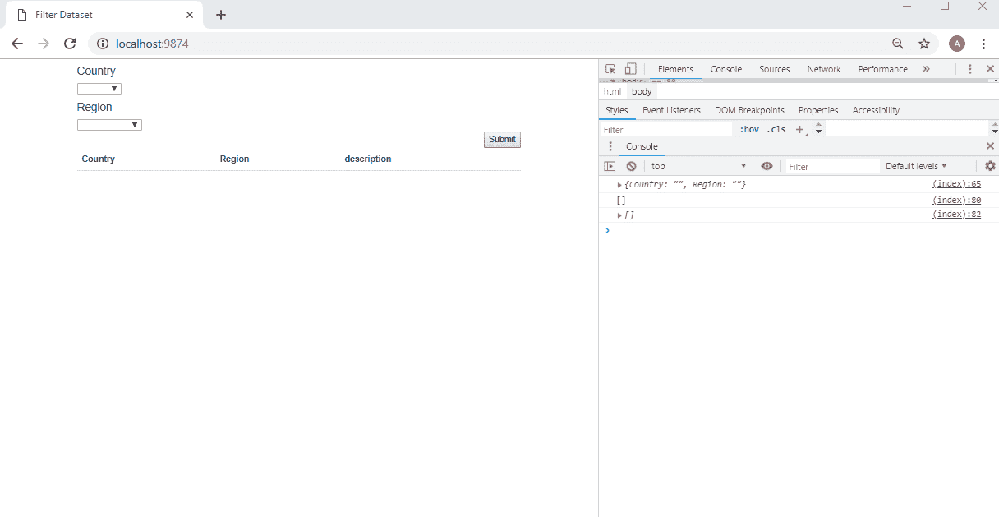
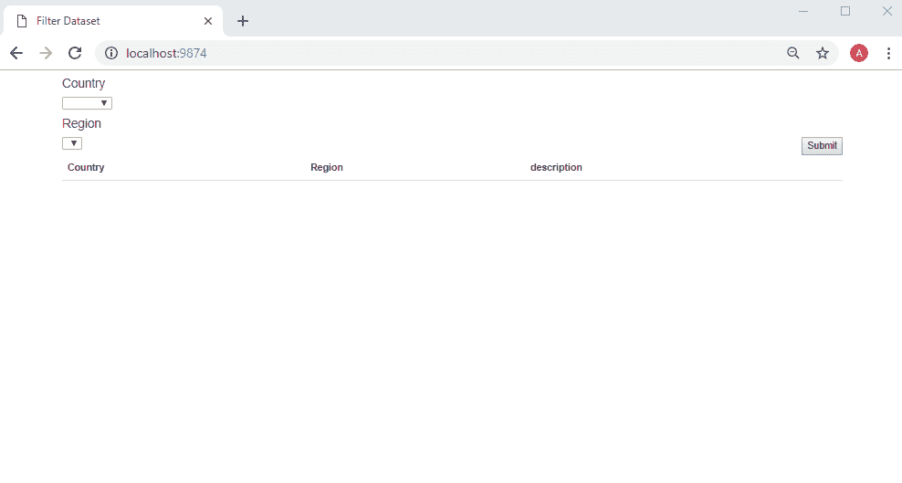
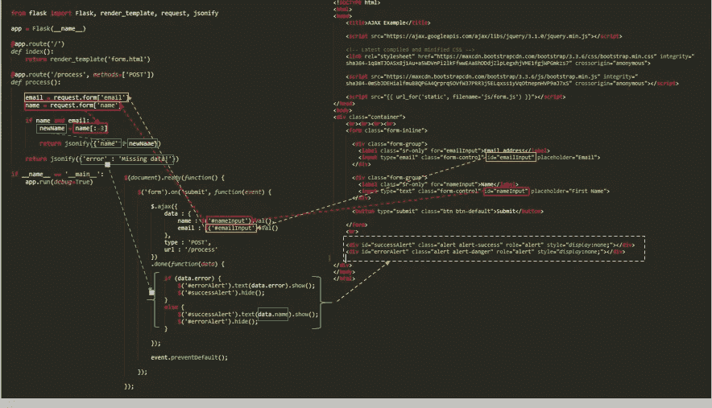

# 通过 Flask、ElasticSearch、javascript、D3js、异步请求(xml http 请求)和 Bootstrap 创建一个完整的搜索引擎

> 原文：<https://towardsdatascience.com/create-a-full-search-engine-via-flask-elasticsearch-javascript-d3js-and-bootstrap-275f9dc6efe1?source=collection_archive---------3----------------------->

一个**搜索引擎**是一个系统——显示一些**过滤器**——为了定制你的**搜索结果**,让你准确找到你想要的。当用户查询搜索引擎时，基于搜索引擎的算法返回相关结果。


过滤器变成一个列表(下拉列表)、一个表格……任何允许**扩大**或**缩小搜索**的元素，以便获得**相关结果**(你实际感兴趣的结果)。

谷歌是“斯巴达搜索”的王者，也是世界上使用最多的搜索引擎。谷歌提供了一个完全免费的文本搜索过滤器。用户将关键词或关键短语输入到搜索引擎中，并接收个人的和相关的结果。在这篇文章中，我们将通过谷歌。

当谈到葡萄酒评论时，让我们考虑一个来自[葡萄酒爱好者](http://www.winemag.com/?s=&drink_type=wine)的数据集。刮刀的代码可在处[找到。搜索引擎仍然无法品尝葡萄酒，但理论上，它可以根据侍酒师的描述检索出葡萄酒。](https://github.com/zackthoutt/wine-deep-learning)

*   ***国家*** :葡萄酒来自的国家
*   ***描述*** :品酒师描述葡萄酒的味道、气味、外观、感觉等的几句话。
*   ***名称*** :酿酒厂内酿造葡萄酒的葡萄所来自的葡萄园
*   *:葡萄酒爱好者给葡萄酒打分的分数，范围从 1 到 100(尽管他们说他们只给得分> =80 的葡萄酒发评论)*
*   ****价格*** :一瓶酒的成本*
*   ****省*** :葡萄酒所来自的省或州*
*   ****品种*** :用来酿酒的葡萄种类(即黑皮诺)*
*   ****酒厂*** :酿造葡萄酒的酒厂*

*为了揭开旅程的序幕，我们将重点介绍 ***三个特定国家*** 和 ***三个地区*** 的葡萄酒。*

# *第一步:如何过滤来自国家和地区的葡萄酒数据集？*

**

*如果您知道 ***【波尔多】*** 或 ***【香槟】*** 是 ***法国*** 内的地区，知道 ***伦巴第*** 和 ***托斯卡纳*** 是 ***意大利*** 的地区，最后知道 ***安达卢西亚*** 和**的地区，这种方法就很有效如果你不这样做，你就被困住了，什么也得不到。这是一个巨大的问题，因为你必须尝试所有的可能性，才能幸运地得到一些东西。如何处理这个问题？通过在过滤器中实现父/子逻辑。***

*说到 app 本身——有后端(app.py)和前端(index.html)。当您在下拉字段中选择一个元素时，一个 XMLHttpRequest 被发送到服务器，并返回结果(从服务器)。XMLHttpRequest 对象可用于从 web 服务器请求数据。*

*App.py*

*XMLHttpRequest 对象是开发人员的梦想，因为您可以:*

*   *更新网页而不重新加载页面*
*   *从服务器请求数据—在页面加载后*
*   *从服务器接收数据—在页面加载后*
*   *在后台向服务器发送数据*

***onreadystatechange** 属性指定每当 XMLHttpRequest 对象的状态改变时要执行的函数:*

*模板/索引. html*

# *第二步:我们如何在 JS 中通过父属性过滤子属性？*

*当一个给定的下拉列表依赖于另一个下拉列表时，拥有所有可能的选项并不令人愉快。如果你点击法国，然后是加泰罗尼亚，我们就被困住了，什么也得不到，因为加泰罗尼亚不在法国…太糟糕了。要么你尝试所有的可能性来得到某些东西，要么我们实现如下的父子属性:*

**

*父子属性:*

# *第三步:将数据加载到 ElasticSearch 中*

*将 ElasticSearch 数据库连接到 python。 **Elasticsearch** 是基于 Lucene 库的搜索引擎。它提供了一个分布式的、支持多租户的全文搜索引擎，带有 HTTP web 接口和无模式的 JSON 文档。Elasticsearch 已经迅速成为最受欢迎的搜索引擎，通常用于日志分析、全文搜索、安全智能、业务分析和运营智能用例。*

```
*from time import time
from elasticsearch import Elasticsearch
from elasticsearch.helpers import bulk
import pandas as pdimport requests
res = requests.get(‘[http://localhost:9200'](http://localhost:9200'))
print(res.content)#connect to our cluster
from elasticsearch import Elasticsearch
es = Elasticsearch([{‘host’: ‘localhost’, ‘port’: 9200}])*
```

*将一个 csv 文件转换成 json 格式放入 ElasticSearch。*

```
***def** index_data(data_path, index_name, doc_type):
   **import** json
   f = **open**(data_path)
   csvfile = pd.read_csv(f, iterator=True, encoding=”utf8") 
   r = requests.get(‘[http://localhost:9200'](http://localhost:9200'))
   **for** i,df **in** enumerate(csvfile): 
       records=df.where(pd.notnull(df), None).T.to_dict()
       list_records=[records[it] for it in records]
       **try** :
          **for** j, i **in** enumerate(list_records):
              es.index(index=index_name, doc_type=doc_type, id=j, body=i)
        **except** :
           print(‘error to index data’)*
```

# *额外收获:烧瓶词汇*

## *1.路由技术*

*用于直接访问所需页面，而无需从主页导航。 **route()** 装饰器用于**将 URL** 绑定到**函数**。*

```
*@**app**.**route**(‘/hello’)
**def** hello_world():
   **return** ‘hello world’*
```

*URL**‘/hello’**规则绑定到了 **hello_world()** 功能。因此，如果用户访问[**http://localhost:5000/hello**](http://localhost:5000/hello)URL，则 **hello_world()** 功能的输出将在浏览器中呈现。*

*应用程序对象的 **add_url_rule()** 功能也可用于绑定 url，功能如下:*

```
***def** hello_world():
   **return** ‘hello world’
**app**.**add_url_rule**(‘/’, ‘hello’, hello_world)*
```

## *2.HTTP 方法*

*Http 协议是万维网数据通信的基础。*

*模板/索引. html*

```
*<html>
   <body>
      <form action = "http://localhost:5000/login" method = "post">
         <p>Enter Name:</p>
         <p><input type = "text" name = **"nm"** /></p>
         <p><input type = "submit" value = "submit" /></p>
      </form>

   </body>
</html>*
```

*app.py*

```
*from flask import Flask, redirect, url_for, request
app = Flask(__name__)

@**app.route**('/success/<name>')
def success(name):
   return 'welcome %s' % name

@**app.route**('/login',methods = ['POST', 'GET'])
def login():
   if **request.method** == '***POST***':
      user = request.form['**nm**']
      return redirect(url_for('success',name = user))
   else:
      user = **request.args.get**('**nm**')
      return redirect(url_for('success',name = user))

if __name__ == '__main__':
   app.run(debug = True)*
```

## *3.模板*

*可以以 HTML 的**形式返回绑定到某个 URL** 的函数的输出。*

***hello()** 功能将渲染**【Hello World】**并附上 **< h1 >** 标签。*

```
*from flask import Flask
app = Flask(__name__)

@app.route('/')
def index():
   return '**<html><body><h1>**'Hello World'**</h1></body></html>**'

if __name__ == '__main__':
   app.run(debug = True)*
```

*从 Python 代码生成 **HTML 内容**非常麻烦，尤其是当需要放入变量数据和 Python 语言元素(如条件句或循环)时。这将需要频繁逃离 HTML。*

*这就是人们可以利用 Flask 所基于的 Jinja2 模板引擎的地方。可以通过 **render_template()** 函数来呈现 HTML 文件，而不是从函数中返回硬编码的 HTML。*

```
*from flask import Flask, render_template
app = Flask(__name__)

@app.route('/hello/<user>')
def hello_name(user):
   return render_template('hello.html', name = user)

if __name__ == '__main__':
   app.run(debug = True)*
```

***【Web 模板系统】**指设计一个动态插入变量数据的 HTML 脚本。网络模板系统由模板引擎、某种数据源和模板处理器组成。*

*砂箱采用**京 a2** 模板发动机。web 模板包含 HTML 语法，其中散布了变量和表达式(在本例中为 Python 表达式)的占位符，当呈现模板时，这些占位符将替换为值。*

*以下代码保存为模板文件夹中的**hello.html**。*

```
*<!doctype html>
<html>
   <body>

      <h1>Hello **{{ name }}**!</h1>

   </body>
</html>*
```

***jinga**模板引擎使用以下分隔符来转义 HTML。*

*   *{ %……% }用于语句*
*   *{{ … }}将表达式打印到模板输出*
*   *{ #……# }对于模板输出中未包含的注释*
*   *#……# #用于行语句*

***hello()** 函数的 URL 规则接受整数参数。传递给**hello.html**模板。在其中，比较接收到的数字(标记)的值(大于或小于 50)，并据此有条件地呈现 HTML。*

```
*from flask import Flask, render_template
app = Flask(__name__)[@app](http://twitter.com/app).route('/result')
def result():
   dict = {'phy':50,'che':60,'maths':70}
   return render_template('result.html', result = dict)if __name__ == '__main__':
   app.run(debug = True)<!doctype html>
<html>
   <body>

      <table border = 1>
         

            <tr>
               <th> {{ key }} </th>
               <td> {{ value }} </td>
            </tr>

         
      </table>

   </body>
</html>*
```

# *示例:Jquery、AJAX 和烧瓶*

**

# *[在建…待完成]*