# 使用 Python 创建预测房价的模型

> 原文：<https://towardsdatascience.com/create-a-model-to-predict-house-prices-using-python-d34fe8fad88f?source=collection_archive---------0----------------------->

你好，

上次我们看到了如何在泰坦尼克号数据集上进行逻辑回归，许多专业数据科学家认为这是进行数据科学项目的第一步。如果你没有，你可以在这里找到它，

 [## 如何开始自己的数据科学之旅！

### 你好，

medium.com](https://medium.com/towards-data-science/how-to-begin-your-own-data-science-journey-2223caad8cee) 

所以，我假设你知道 python 的基本库(如果不知道，那么浏览上面的教程)。我们将使用上次使用的相同库，并添加了 seaborn，这是另一个内置的 python 库，用于进行数据表示。

上一次，我们做了一个数据集，其中有泰坦尼克号乘客的数据，我们知道泰坦尼克号发生了什么，我们不需要浏览数据集。但是大多数时候，数据科学家得到的是他们不知道的数据。深入了解数据非常重要。

到目前为止还不错，今天我们要处理一个数据集，它包含了房子的位置、价格和其他方面的信息，如平方英尺等。当我们处理这类数据时，我们需要了解哪一列对我们来说是重要的，哪一列是不重要的。我们今天的主要目标是建立一个模型，它能根据其他变量给我们一个好的房价预测。我们将对这个数据集使用线性回归，看看它是否能给我们一个好的准确度。

什么是好的准确性？嗯，这取决于我们正在处理的数据类型，对于信用风险数据来说，80%的准确率可能不够好，但对于使用 NLP 的数据来说，这就很好了。因此，我们实际上不能定义“良好的准确性”，但任何高于 85%的都是好的。我们在这个数据集上的目标是达到 85%以上的准确率

让我们开始吧，数据和代码可以在我的 github 链接上找到

 [## Shreyas3108 (Shreyas raghavan)

### Shreyas3108 有 9 个可用的存储库。在 GitHub 上关注他们的代码。

github.com](https://github.com/shreyas3108) 

首先，我们导入我们的库和数据集，然后我们看到数据的头部以了解数据的外观，并使用 describe 函数来查看百分点和其他关键统计数据。

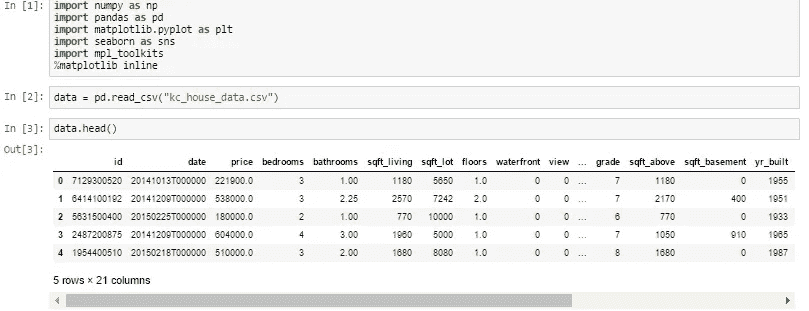

Starting , by importing libraries and reading dataset

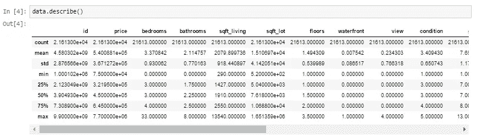

Knowing more about the dataset

从上面描述的函数中我们可以推断出什么？

1.  看看卧室列，数据集有一所房子，房子有 33 间卧室，看起来是一所大房子，随着我们的进展，了解更多会很有趣。
2.  最大平方英尺是 13，450，最小平方英尺是 290。我们可以看到数据是分布的。

同样，我们只看 describe 函数就能推断出这么多东西。

现在，我们将看到一些可视化，也将看到我们如何从可视化中推断出什么。

## **哪栋房子最常见(卧室方面)？**

让我们看看哪个是最常见的卧室号码。你可能想知道为什么它很重要？让我们从建筑商的角度来看这个问题，有时对于建筑商来说，重要的是要看哪种房子卖得最好，这使得建筑商能够以此为基础建造房子。在印度，一个好地段的建筑商选择建造超过 3 间卧室的房子，这吸引了更高的中产阶级和社会的上层阶级。

让我们看看这些数据的结果如何？

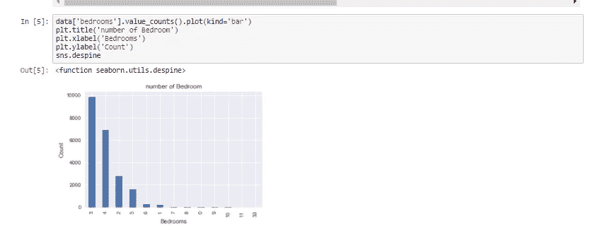

House bedrooms and count

正如我们从可视化中看到的，三居室的房子最常出售，其次是四居室。那么怎么有用呢？对于一个拥有这些数据的建筑商来说，他可以建造更多的三居室和四居室来吸引更多的买家。

所以现在我们知道三居室和四居室的销量最高。但是在哪个地方呢？

## 基于纬度和经度可视化房屋的位置。

所以根据数据集，我们在数据集上有每栋房子的纬度和经度。我们要去看看共同位置，看看房子是怎么摆放的。

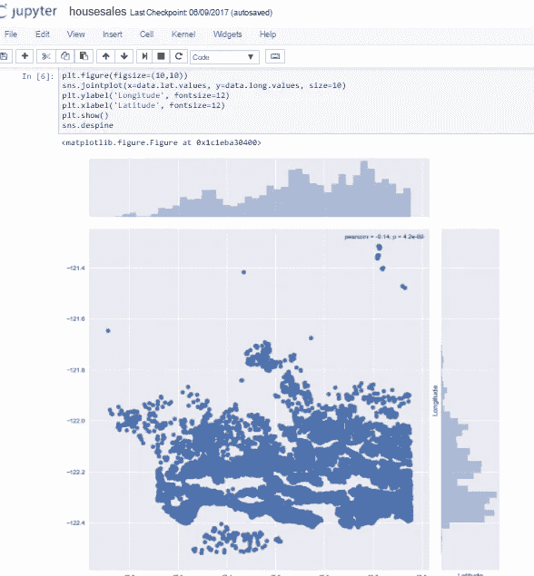

How houses are placed ?

我们使用 seaborn，我们得到他的美丽的可视化。Joinplot 函数有助于我们看到数据的集中和数据的放置，非常有用。让我们看看我们能从这个可视化中推断出什么。对于纬度在-47.7 和-48.8 之间有许多房子，这意味着它可能是一个理想的位置，不是吗？但是当我们谈到经度时，我们可以看到在-122.2 到-122.4 之间的浓度很高。也就是说大多数买家都去过这个地方。

## 影响房价的常见因素有哪些？

我们看到了共同的位置，现在我们将看到一些影响房价的共同因素，如果是这样的话？那是多少？

让我们从价格是否受到房屋居住面积的影响开始。

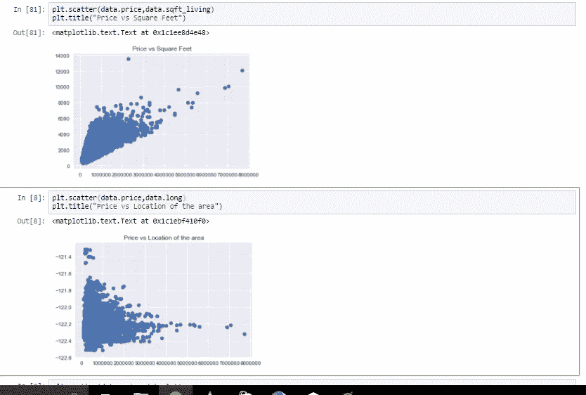

Price vs Square feet and Price vs Longitude

我们上面使用的图被称为散点图，散点图帮助我们看到我们的数据点是如何分散的，通常用于两个变量。从第一张图中我们可以看到，居住面积越大，价格越高。虽然数据都集中在某个特定的价格区域，但从图中我们可以看到，数据点似乎是在直线方向上。由于散点图，我们也可以看到一些不规则性，最高平方英尺的房子卖得很低，也许有另一个因素或可能数据一定是错误的。第二个数字告诉我们房子在经度上的位置，这给了我们一个非常有趣的观察结果，即-122.2 到-122.4 之间的房子售价更高。

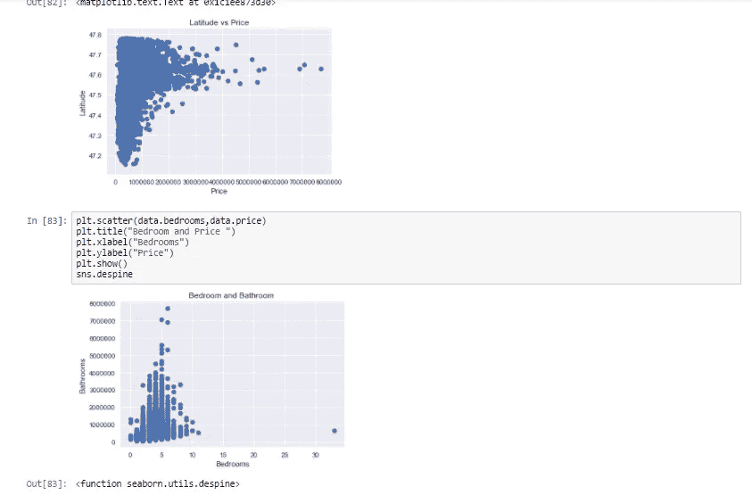

Similarly we compare other factors

我们可以看到更多影响价格的因素

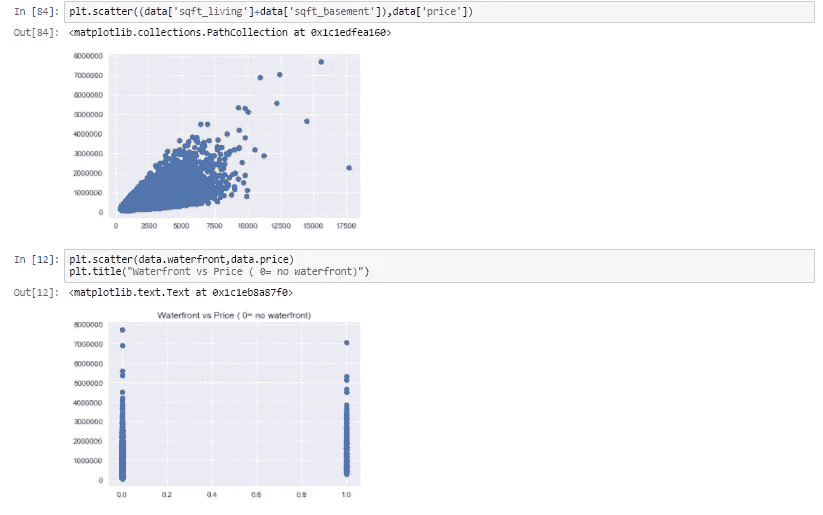

Total sqft including basement vs price and waterfront vs price

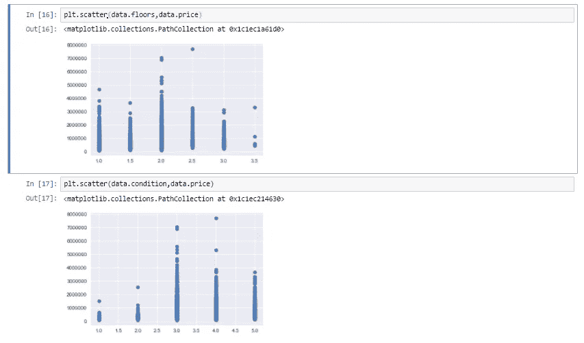

Floors vs Price and condition vs Price

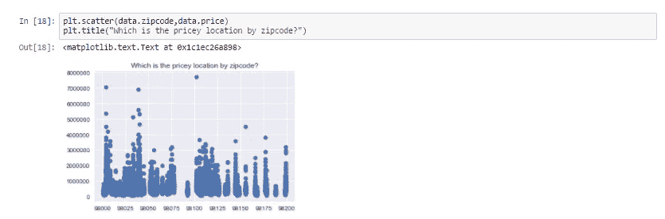

Which location by zipcode is pricey ?

从上面的描述中我们可以看出，许多因素都在影响着房子的价格，比如平方英尺增加了房子的价格，甚至位置也影响着房子的价格。

现在，我们已经熟悉了所有这些表示，并可以讲述我们自己的故事，让我们移动并创建一个模型，根据其他因素(如平方英尺、滨水区等)来预测房子的价格。我们将会看到什么是线性回归，我们是如何做的？

## 线性回归:-

简而言之，统计学中的一个模型，它帮助我们根据变量的过去关系来预测未来。所以当你看到你的散点图有线性排列的数据点时，你知道回归可以帮助你！

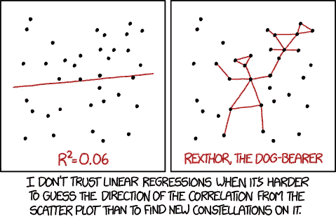

回归的工作原理是直线方程，y=mx+c，趋势线是通过数据点设定来预测结果的。

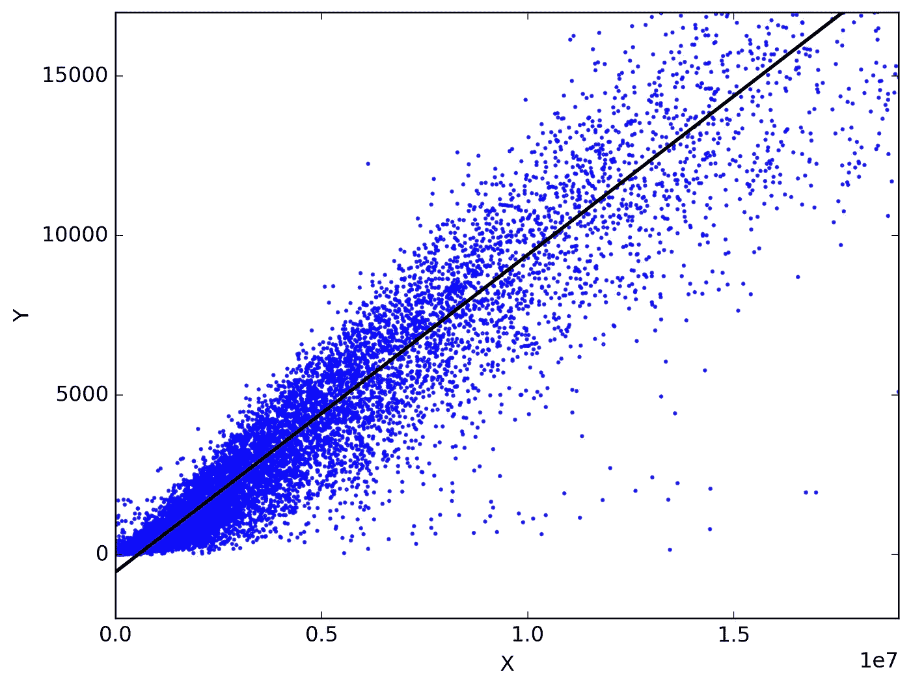

Fitting line on the basis of scatter

我们预测的变量称为标准变量，称为 y。我们预测所基于的变量称为预测变量，称为 x。当只有一个预测变量时，预测方法称为**简单回归。且如果存在多个预测变量，则进行多重回归。**

让我们看看代码，

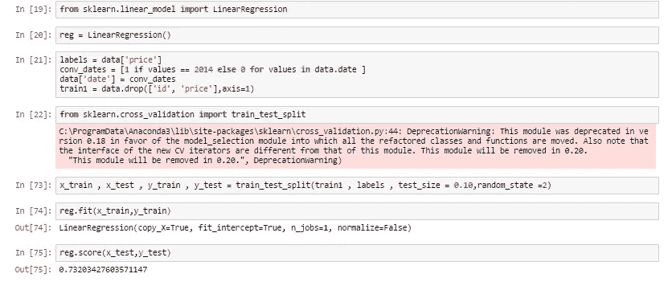

Linear regression on the data to predict prices

我们使用训练数据和测试数据，训练数据来训练我们的机器，测试数据来看看它是否已经很好地学习了数据。在任何事情之前，我希望每个人都记住机器是学生，培训数据是教学大纲，测试数据是考试。我们看到多少机器已经得分，如果它得分好，模型是成功的。

那我们做了什么？我们一步一步来。

1.  我们导入依赖项，对于线性回归，我们使用 sklearn(内置于 python 库中)并从中导入线性回归。
2.  然后，我们将线性回归初始化为变量 reg。
3.  现在我们知道价格是可以预测的，因此我们将标签(输出)设置为价格列，我们还将日期转换为 1 和 0，这样就不会对我们的数据产生太大影响。对于 2014 年后新建的房屋，我们使用 0。
4.  我们再次导入另一个依赖项，将数据分成训练和测试。
5.  我把我的训练数据作为 90%，10%的数据作为我的测试数据，用 random_state 把数据的拆分随机化。
6.  现在，我们有了训练数据、测试数据和标签，让我们将训练和测试数据拟合到线性回归模型中。
7.  将我们的数据拟合到模型后，我们可以检查数据的得分，即预测。在这种情况下，预测值为 **73%**

这个模型的精确度低于我们 85 的目标。那么，我们如何实现 85%的目标呢？

我们使用不同的方法，这对于像这样的弱预测模型是非常重要的。

这可能看起来有点高级，但是如果理解的话，这是一个非常好的工具，可以实现更好的预测。

为了建立预测模型，许多专家使用**梯度推进回归，**那么什么是梯度推进呢？这是一种用于回归和分类问题的机器学习技术，它以弱预测模型(通常是决策树)的集合的形式产生预测模型。

现在为了简单起见，请记住我们在学生时代是如何映射机器的，训练数据是教学大纲，测试数据是考试数据。让我们试着理解使用相同的梯度推进方法。那么，我们来分析一下为什么我们的学生(机器)没有达到 85%以上？可能有很多原因，但很少有这样的原因

1.  我们的学生在考试前忘记了一些题目，同样，机器读取的数据也会丢失。
2.  可能是一个不通过阅读学习，但需要视觉化的弱学习者。我们的机器可能是一个弱学习者，可能需要决策树。
3.  即使使用了更新的技术，我们的学生也可能记不住教学大纲，所以我们给学生时间去阅读和理解。机器也是如此。

因此，对于所有这些问题，有一个解决办法，梯度下降推进。

 [## 机器学习的梯度推进算法简介-机器学习…

### 梯度推进是构建预测模型的最强大的技术之一。在这篇文章中，你会发现…

machinelearningmastery.com](http://machinelearningmastery.com/gentle-introduction-gradient-boosting-algorithm-machine-learning/) 

此链接提供了对梯度推进算法的深入理解。

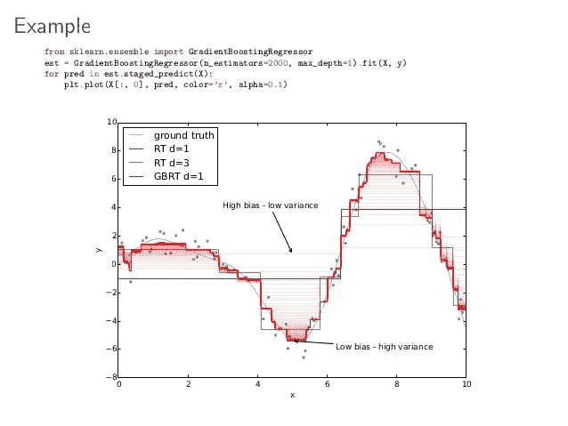

Gradient boosting graph for understanding

让我们看看我们是如何做到这一点的，然后我们可以深入了解正在发生的事情。

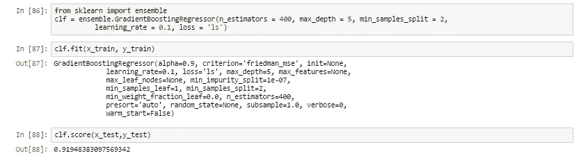

1.  我们首先从 sklearn 导入库(相信我，它是所有统计相关模型的最佳库)
2.  我们创建一个变量，在这里定义梯度推进回归变量并设置参数

n_estimator —要执行的升压阶段的数量。我们不应该把它定得太高，那会使我们的模型过拟合。

max _ depth 树节点的深度。

learning _ rate 学习数据的速率。

损失—要优化的损失函数。“ls”是指最小二乘回归

最小样本分割—学习数据时要分割的样本数量

3.然后，我们将训练数据拟合到梯度推进模型中，并检查准确性

4.我们得到了 **91.94%** 的准确率，这是惊人的！

我们可以看到，对于弱预测，梯度提升对相同的训练和测试数据起作用。

点击此链接了解更多关于梯度推进回归器的信息

 [## 3.2.4.3.6.sk learn . ensemble . gradientboostingregressor-sci kit-learn 0 . 18 . 1 文档

### class sk learn . ensemble . GradientBoostingRegressor(loss = ' ls '，learning_rate=0.1，n_estimators=100，子样本=1.0…

scikit-learn.org](http://scikit-learn.org/stable/modules/generated/sklearn.ensemble.GradientBoostingRegressor.html) 

我们得到了我们想要的！准确率高达 91.94%。将此技术应用于各种其他数据集并发布您的结果。尝试放置随机种子，检查它是否改变了数据的准确性！如果是的话，请告诉我。谢谢你阅读它！

希望你喜欢它！再见，以后会有更多的模型和内容！请分享推荐给你的朋友。

**更新:**这个的代码可以在 https://github.com/Shreyas3108/house-price-prediction[上找到](https://github.com/Shreyas3108/house-price-prediction)