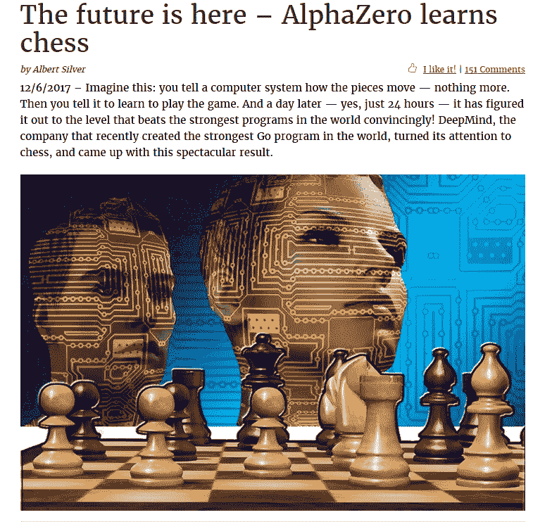
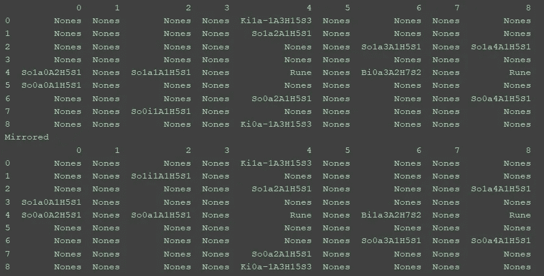
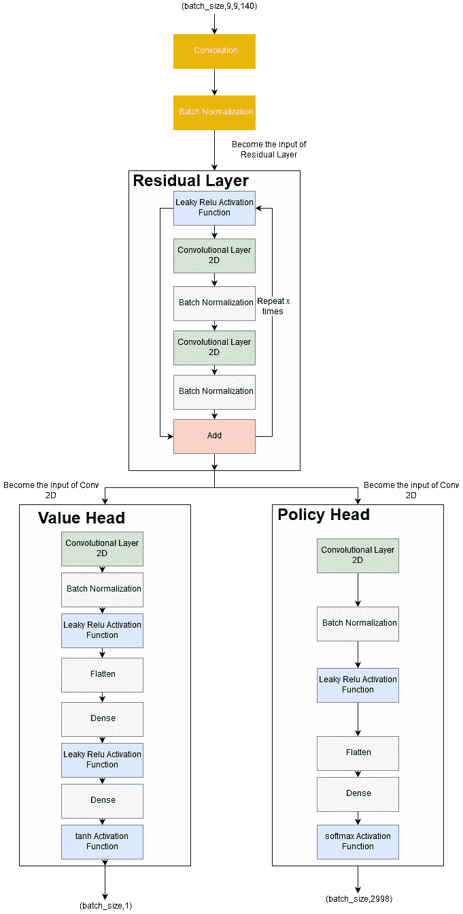
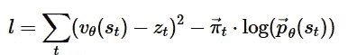
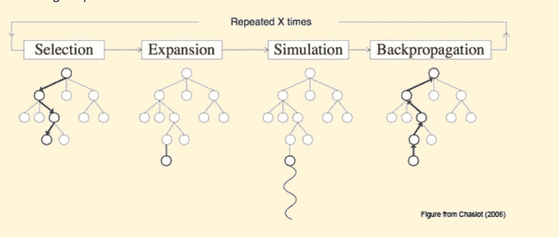
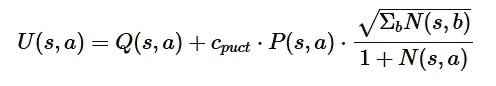
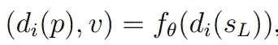
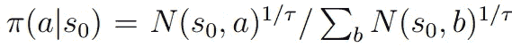
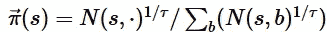
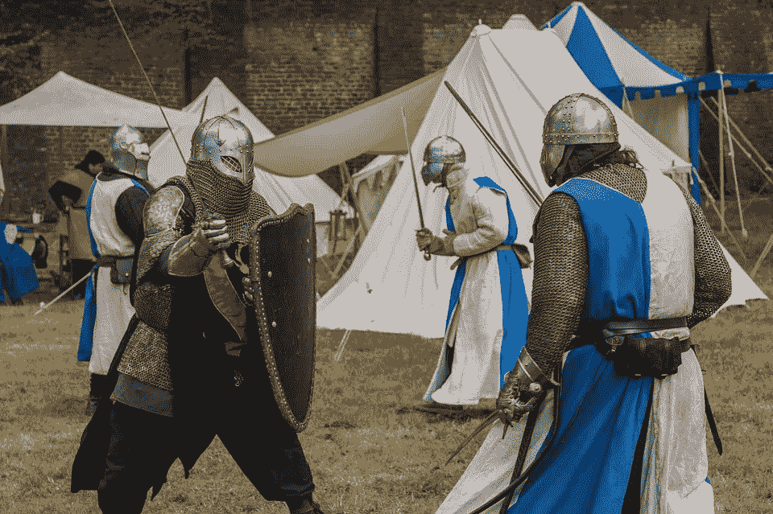

# 从零开始为你自己的棋盘游戏创造人工智能-alpha zero-第 3 部分

> 原文：<https://towardsdatascience.com/create-ai-for-your-own-board-game-from-scratch-alpha-zero-part-3-f22761372245?source=collection_archive---------9----------------------->

## 用 AlphaZero 算法实现 AI 到 EvoPawness(暂名)，一个来自我创意的棋盘游戏。


Photo by [Maarten van den Heuvel](https://unsplash.com/@mvdheuvel?utm_source=medium&utm_medium=referral) on [Unsplash](https://unsplash.com?utm_source=medium&utm_medium=referral)

大家好，欢迎来到**evopheness(暂名)**上制作 AI 的第三部分。在本文中，我们将实现 AlphaZero 算法到游戏中。这篇文章将告诉你一个关于 AlphaZero 和 AlphaZero 实现的简短总结，尽管是简化的。我们将一步一步来做。我们将使用第 1 部分中提到的一些术语，如结果函数、可能的动作和终端函数。

实验还没有完成。训练这款游戏的代理需要很长时间，尤其是单机。我已经训练特工一天了。可惜代理还是不够好。即便如此，它还是学会了一些策略，比如如果骑士能攻击国王，就用骑士连续攻击国王。

我停止训练代理让我的电脑休息。我怕我的笔记本电脑强行训练一天以上就坏了。我还限制了 AlphaZero 的*超参数*，以加快训练时间。很抱歉我做这个实验的资源有限😿。


Just a random cat. [Source : https://pixabay.com/en/cat-sad-cute-small-sweet-pet-3266673/](https://pixabay.com/en/cat-sad-cute-small-sweet-pet-3266673/)

即使实验没有完成，我也会试着写下我是如何在这个游戏上实现 AlphaZero 的。我希望它能给那些想学习强化学习算法 AlphaZero 并在游戏中实现它们的人一点启发。

我对游戏规则做了几处改动。这个游戏仍然是决定性的。

这篇文章的目标读者是对人工智能和设计游戏感兴趣的人。如果你不是其中之一，当然你还是可以看到这篇文章。我希望通过发表这篇文章来提高我的写作技巧，并且内容对你有益😄。

**振作起来，这将是一篇长文。它有 25 分钟的阅读时间！**

# 概述

1.  贮藏室ˌ仓库
2.  关于 AlphaZero 的简要描述
3.  改变规则
4.  步伐
5.  AlphaZero 的组件
6.  AlphaZero 的实施
7.  吸取的教训
8.  结论
9.  编后记

# 贮藏室ˌ仓库

如果你开始阅读这篇文章的游戏进展，这里是资源库:

[](https://github.com/haryoa/evo-pawness) [## 哈里欧/埃沃-波尼丝

### 自助项目 Evo Pawness(临时名称)。通过在…上创建一个帐户，为 haryoa/evo-pawness 的发展做出贡献

github.com](https://github.com/haryoa/evo-pawness) 

我已经向存储库添加了几处更改:

*   添加 AlphaZero 实现
*   重新格式化模块或文件夹结构
*   更改动作表示键。
*   更改游戏模型和控制器以匹配新规则

**注意**:现在，我建议你不要试图训练模型，直到我重构和清理代码。还有，代码仍然超级乱，我会尽快清理和重构。在下一个星期六，我会努力做到这一点。

**编辑(2018 年 3 月 12 日):**我已经清理了代码。现在我们有 Config.py 来编辑配置。关于如何启动程序，请参见`main.py -h`。详情等我明天编辑完`README.md`。

**编辑 2 (10/12/2018)** :我已经推送了更新的`README.md`

# 关于 AlphaZero 的简要描述



[Source : https://en.chessbase.com/post/the-future-is-here-alphazero-learns-chess](https://en.chessbase.com/post/the-future-is-here-alphazero-learns-chess)

AlphaZero 由 Deep Mind 创建，发表在以下论文中[来源 4]。它的特别之处在于，它可以在 24 小时的训练下击败国际象棋和松木的最佳 AI。它使这个算法成为当时 AI 游戏上最好的。要了解更多信息，你可以看看这篇关于这个算法有多强大的文章。

它也没有人类的专业知识作为输入(游戏规则除外)。它从零开始学习，成为最好的人工智能游戏程序，击败了当时棋盘游戏中最好的人工智能。

我还发现算法非常简单，但令人惊讶。该算法将利用当前知识探索有希望的可能路径。搜索到的路径将判断当前路径是否有利。其有利程度的分数被降低，并被用作是否应该再次探索这条道路的考虑因素。

在思考未来可能性的探索之后，采取探索最多的行动。这意味着，如果经常探索这条道路，这个行动可能是好的。

在游戏结束时，评估它选择的路径是否与游戏的结果相匹配。它告诉我们，在探索未来可能的道路时，知识是否误判了选择的道路。知识会根据比赛结果更新。

AlphaZero 要求博弈具有完全信息(博弈状态对双方都是完全已知的)和确定性。既然这个游戏两者都有，那么 AlphaZero 算法就可以用在这个游戏上。

在本文中，我们将简化本文中使用的架构。我们将基于我读过的文章使用一个简化的 AlphaZero 实现。在[大卫·福斯特](https://medium.com/u/2d3c4b088dc6?source=post_page-----f22761372245--------------------------------)【来源 2】使用的实现中，他使用了 4 个连接到策略头和值头的剩余层。我使用了他的架构并改变了一些超参数。我还在[Source 1]中看到了 AlphaZero 的实现，并修改了实现以适应这个游戏。我遵循了那篇文章中的蒙特卡罗树搜索实现，并将实现从使用递归改为结构化数据树。

这些文章中使用的实现与本文一致，只是跳过了一些部分。我跳过了几个步骤，比如`v resignation`。在这两篇文章中，它们没有实现堆叠状态。在本文中，我实现了堆叠状态，并使用 140 个平面作为模型的输入。在本文中，AlphaZero 的实现还没有通过使用虚拟丢失来实现多线程 MCTS。

# 改变规则

1.  符文将在 3 个不同的位置出现。有(在 y，x 轴上)(4，0)，(4，4)，和(4，8)。在(4，0)产生符文将会增加 2 点攻击点。在(4，4)产生的符文将提高 2 点生命值。在(4，8)处产生的符文将会增加 1 步点数。
2.  当符文产生时间(每 5 回合)不会产生符文时，棋子所占据的符文位置。
3.  步数、生命值和攻击点数是有限制的。步数 3，生命值 20，攻击点 8

# 步伐

本文将按照以下顺序实现 AlphaZero:

1.  定义模型输入的状态表示。我们使用堆叠状态。
2.  定义游戏的动作表现。
3.  决定哪一方将用于代表所有玩家的状态(黑色或白色),并定义如何更改该方。
4.  定义一些可用于增加模型输入的相同状态
5.  定义奖励函数
6.  实现用于输出策略评估的神经网络的体系结构
7.  实现蒙特卡罗树搜索
8.  添加 duel 函数来评估最佳模型。

# AlphaZero 的组件

在我们进入这一部分之前，我建议如果你没有读过第一部分，读一读。它将涵盖游戏规则。

## 表示状态

在本节中，我们将看到神经网络输入的表示状态。神经网络的输入是代表状态的**图像堆栈**。实现中使用了 28 个输入特性。这里我们就用 5 步历史**(注:**在 AlphaZero 的论文中，步历史的个数是 8。这里，本文将尝试不同的数字)。从我们使用的步骤历史数来看，这意味着有 140 个输入特征(28 X 5)。

历史将保存前一回合的状态表示。如果我们使用 5 步历史，假设状态在 T 时刻，我们将获得 T、T-1、T-2、T-3、T-4 状态，这些状态将被堆叠并成为神经网络的输入。

以下是输入特征:

4-10，13 号使用二进制特征，而其他使用频率特征。

因为，棋盘是 9×9，如果我们有`batch_size` 作为神经网络输入的总实例，我们就有`(batch_size, 9, 9, 140)`形状作为神经网络的输入。因此，我们有 4 维数据作为输入。

对于代码，可以在下面的源代码中看到`get_representation_stack()`函数:

[](https://github.com/haryoa/evo-pawness/blob/master/reinforcement_learning_train/util/stacked_state.py) [## 哈里欧/埃沃-波尼丝

### 自助项目 Evo Pawness(临时名称)。通过在…上创建一个帐户，为 haryoa/evo-pawness 的发展做出贡献

github.com](https://github.com/haryoa/evo-pawness/blob/master/reinforcement_learning_train/util/stacked_state.py) 

在源代码中，我们将使用包含我们在第 1 部分中定义的元素的`AIElements` 类。我们使用`deque` 作为我们的数据结构(像堆栈一样)。

在我们获得神经网络的输入表示之前，我们将把状态(我们在第 1 部分定义的状态表示)堆叠到一个具有期望的最大长度的`deque` 数据结构中(在本文中，我们将其设置为 5)。然后我们处理`deque` ，并将其转换为神经网络的输入表示。

## 动作表示

游戏中有 5 种动作可供选择。有激活、提升、移动、攻击和跳过。

**对于激活动作**，我们需要选择想要激活的棋子。我们需要棋子的坐标。因此，我们有 81 (9 x 9)个不同的独特激活动作。

**注意:**我们有一个不同于第 1 部分中所述的动作键表示，新的表示如下:

```
Action Key Representation for the activate action: a*y,x
y : pawn's axis-y
x : pawn's axis-x
example a*1,0
```

**对于升级动作**，我们需要选择想要升级的棋子，然后选择可能的选项来升级该棋子。我们需要棋子的坐标。我们有 9 x 9 种不同的独特行动来选择可能的棋子。有 4 种升级兵类型(女王、车、主教、骑士)，因此有 324 种(9 x 9 x 4)独特的升级方式。

```
Action key representation for the promote action : p*y,x*choice
y : pawn's axis-y
x : pawn's axis-x
choice : promote choice, K for Knight, R for Rook, B for Bishop, and Q for Queen
example p*3,3*Q
```

**对于攻击和移动动作，**在这个游戏中，我们有 7 种类型的兵。移动的方向已在第 1 部分中定义。在第一部分中，我们将攻击和移动作为单独的动作。在本文中，我们将把攻击动作和移动动作合二为一(它们没有重叠，所以我们可以合并)。我们可以看到士兵、车、主教和国王的移动方向是女王的子集。它在 N、NE、E、SE、W、SW、W 和 NW 方向上垂直、水平和对角移动。只有骑士的招式不同。它在指南针的各个方向上呈 L 形移动。总之，我们有两种类型的移动，女王和骑士。

我们采取行动有两个步骤:选择棋子和根据可能的行动选择棋子的合法移动。在这种情况下，我们有 81 (9 x 9)个不同的选择棋子的动作。然后为了选择合法的移动，我们有 8 种不同的骑士移动类型和 24 种(8 x 3)女王移动类型(注意:我们有 **3** 作为步点的限制，所以女王移动可以由 **24** 移动类型组成)。为攻击和移动动作选择合法移动，可以进行的唯一动作总数为 2592 (81 x 32)。

```
Action Key Representation for the activate action: m*y1,x1*y2,x2
y1 : selecting the pawn in axis-y
x1 : selecting the pawn in axis-x
y2 : direction of the move in axis-y
x2 : direction of the move in axis-xExample m*0,1*2,1 (means that it will move from (0,1) to (2,2)
```

如果玩家不能做任何事情，跳过。

```
The action key representation for skip is skip
```

唯一动作的总数是 2998 (9 x 9 x 37 + 1)

动作表示用于编码概率分布，该概率分布用于随后进行蒙特卡罗树搜索(MCTS)时选择动作。稍后，在该状态下不可能做的动作被屏蔽，并且将概率设置为 0，并且重新归一化可能动作的概率分布。

有关如何生成所有可能的动作的实现，请参见存储库。我使用`scikit-learn`库中提供的`LabelEncoder` 和`OneHotEncoder` 将动作编码到一个热编码器中。

一个热编码器类别(见`fit()`):

[](https://github.com/haryoa/evo-pawness/blob/master/reinforcement_learning_train/util/action_encoder.py) [## 哈里欧/埃沃-波尼丝

### 自助项目 Evo Pawness(临时名称)。通过在…上创建一个帐户，为 haryoa/evo-pawness 的发展做出贡献

github.com](https://github.com/haryoa/evo-pawness/blob/master/reinforcement_learning_train/util/action_encoder.py) 

生成所有独特的动作(见`action_spaces()` 功能):

[](https://github.com/haryoa/evo-pawness/blob/master/reinforcement_learning_train/util/alphazero_util.py) [## 哈里欧/埃沃-波尼丝

### 自助项目 Evo Pawness(临时名称)。通过在…上创建一个帐户，为 haryoa/evo-pawness 的发展做出贡献

github.com](https://github.com/haryoa/evo-pawness/blob/master/reinforcement_learning_train/util/alphazero_util.py) 

## 决定哪一方将用于代表所有玩家的状态(黑色或白色),并定义如何更改该方。

在 AlphaZero 的论文中，我们需要将棋盘的视角定位到当前玩家。我们必须决定哪一方对双方都有利。我选择**白色**作为双方玩家的视角或观点(POV)。所以如果当前回合是黑人玩家，我们会让黑人玩家视角变成白人玩家视角。如果当前回合是白牌玩家，我们不会改变玩家视角。

我们如何做到这一点？

如果这是一盘棋，那就好办了。只需颠倒棋子的颜色。在这场比赛中，我们不能这样做。国王被固定在那个位置，不能移动。所以，颠倒棋子会使状态无效。那么如何才能做到呢？

我们需要镜像或反映每个棋子的位置。之后，反转所有棋子的颜色。

下面是伪代码:

```
def mirror(self, pawn):
    pawn.y = pawn.y - 4 # 4 is the center position of the board
    pawn.y *= -1 # after we move the center to 0, we mirror it pawn.y += 4 # Then we move the center point to 4
    pawn.color = inverse(pawn.color)
```

我们对所有的兵都这样做(包括国王)。我们已经反映了棋子的位置。



Example of the original state and the mirrored one.

当我们通过改变棋子的位置来改变棋盘的视角时，我们也需要**改变动作**。如果动作是移动或攻击，我们需要镜像动作的坐标和方向。这类似于改变棋子的位置，我们将通过操纵 y 轴镜像坐标来改变动作的坐标。对于方向，我们只需要将 y 轴乘以-1。

例如:

```
{} = * means multiplication in this bracket
original = a*2,3
mirror = a*{(2-4)*-1+4},3 = a*6,3original = m*1,0*1,0
mirror = m*{(1-4)*-1+4,0}*{1*-1},0 = m*7,0*-1,0
```

这就是我们改变玩家视角的方式。

有关实现，请参见源代码中定义的所有函数:

[](https://github.com/haryoa/evo-pawness/blob/master/util/state_modifier_util.py) [## 哈里欧/埃沃-波尼丝

### 自助项目 Evo Pawness(临时名称)。通过在…上创建一个帐户，为 haryoa/evo-pawness 的发展做出贡献

github.com](https://github.com/haryoa/evo-pawness/blob/master/util/state_modifier_util.py) 

它本质上和伪代码一样，但是是用面向对象的方式。我们将改变所有棋子的属性。动作的镜像也在源代码中定义。

## 定义一些可用于增加神经网络输入的相同状态

我们应该定义一些相同的状态，用于神经网络的输入，如果游戏有它的话。随后，它可用于增加神经网络的输入。此外，在本文中，相同的状态将被用于评估 MCTS 的叶节点中的状态，其中它将被均匀地随机选择。相同的状态通常是原始状态的二面角反射或旋转。我认为，这个组件的目的是使培训更快，并确保包括应该有相同情况或评估的状态。

不幸的是，这个游戏没有相同的状态。所以我们不能在这个游戏中使用这个组件。

## 定义奖励函数

我们将使用奖励函数来告诉代理人最终的结果是赢还是输。由于我们使用蒙特卡罗树搜索，我们将在终端状态调用奖励函数。然后就会变成我们要优化的神经网络的输出。

奖励函数是我们在第 2 部分定义的效用函数。我们将把该值归一化到{-1，1}的范围内。下面是高级伪代码实现:

```
def reward_function(state, player):
   if state.win(player):
       return 1
   else
       return -1
```

由于只有在状态处于终态时才会调用奖励，所以这叫稀疏奖励。神经网络将被训练以评估和预测当状态不是终点时的奖励。

具体实现，可以看`State.sparse_eval()`函数。第 1 部分定义了如何调用终端状态。

[](https://github.com/haryoa/evo-pawness/blob/master/model/state.py) [## 哈里欧/埃沃-波尼丝

### 自助项目 Evo Pawness(临时名称)。通过在…上创建一个帐户，为 haryoa/evo-pawness 的发展做出贡献

github.com](https://github.com/haryoa/evo-pawness/blob/master/model/state.py) 

## 神经网络体系结构

在本节中，我们将创建 AlphaZero 中使用的神经网络的架构。在本文中，他们使用了 20 个剩余块，后跟策略头和值头。他们使用它是因为它是当时计算机视觉任务中最先进的深度学习架构。当然，我们不会用那个。尤其是对我这样一个预算很低、资源很少的人来说😢。

相反，我们将使用简化的架构。我们使用[Source 2]中定义的架构，但做了一些修改。这是它的架构:



Implementation of our neural network. x = 4, we use 4 residual layers.

因此，我们将有 4 个剩余块，2 个 CNN，后跟一个策略头和值头。

超参数也简化了。根据我的 GPU 减少了每一层的输出单位。我觉得那篇文章用的超参数就够了。因此，我们将遵循那篇文章中使用的超参数，只做一点点改变(比如稍微增加或减少输出单位)。

神经网络的输入是我们上面定义的状态表示。

神经网络有两个输出，标量特征 **v** 和移动概率矢量 **p** 。神经网络的输出范围对于 **v** 为{-1，1}，对于 **p** 为{0，1}。这就是为什么我们将 **tanh** 用于 v 的激活功能，将 **softmax** 用于 **p** 的激活功能。

神经网络将最小化以下目标函数:



Loss/Objective function excluding the regularization

其中`vθ(st)` 是数值头的输出，一个标量，它评估当前状态的情况，而 `pθ(st)`，策略头的输出，是来自状态`st`的预测策略。

`vθ(st)`会被训练得和`zt`一样接近，这是一个玩家相对于所选视点(POV)的视角，游戏的最终结局。在我们的例子中，视点是白色玩家。`zt` 根据游戏结果，值可以是-1、0 或 1。`vθ(st)`将被训练计算当前状态的评价。

πt 是来自状态 st 的策略的估计。我们还需要训练神经网络的参数，以使 `pθ(st)`与`πt`足够接近。`pθ(st)`将是一个概率分布的向量，它告诉我们值越高，行动越好，被选中的机会越高。它会被训练得和`πt`一样近。如何获得`πt`将在下一节中定义。当然，它还需要与所选视点的视角相同。

优化程序正在以定义的学习率使用 Adam 优化程序。

因此，总的来说，我们将尽量减少对当前状态的评估和当前状态的政策的预测误差。设`batch_size` 是我们的神经网络的总输入实例，状态表示的输入形状是`(batch_size, 9,9,140)`。有两个输出，策略头和值头。策略头有`(batch_size, 2998)`(唯一动作的总和)，值头有`(batch_size, 1)`形状。

之后，在蒙特卡洛树搜索模拟中使用神经网络模型来评估和预测状态的策略(策略评估)。该模型将被优化以最小化每集结尾的损失。

有关实现，请参见下文(类别`PawnNetZero`):

[](https://github.com/haryoa/evo-pawness/blob/master/reinforcement_learning_train/alpha_zero/deep_net_architecture.py) [## 哈里欧/埃沃-波尼丝

### 自助项目 Evo Pawness(临时名称)。通过在…上创建一个帐户，为 haryoa/evo-pawness 的发展做出贡献

github.com](https://github.com/haryoa/evo-pawness/blob/master/reinforcement_learning_train/alpha_zero/deep_net_architecture.py) 

## 蒙特卡罗树搜索



Source : mcts.ai

在我们深入蒙特卡洛树搜索之前，我建议在这里阅读关于 MCTS 的简要描述。

我们将使用蒙特卡罗树搜索来提高策略估计质量(策略改进)。这将是预测给定状态下代理的动作的组件。MCTS 用于模拟游戏，这是一种自学式游戏(代理扮演两个轮流游戏的玩家)。对于每一集(一个完整的游戏)的每一步，MCTS 被模拟直到给定的模拟次数。它也是一种搜索算法，像我们以前使用的 minimax，但 MCTS 不会扩展所有可能的操作，而是使用引导式“启发式”来确定要扩展的节点。

MCTS 中的树将由代表板配置的节点组成。存在于每个节点之间的有向边表示状态的有效动作。边不同于极大极小树搜索，不仅要保存动作名称，边还有几个参数，每次模拟都会更新。

该边将包含我们将更新的几个参数:

1.  `**Q(s,a)**`:对状态`s`采取行动`a`的期望报酬或平均报酬，它将在**备份**步骤中更新。这将是由神经网络产生的所有预测的`vθ(st)`的评估或奖励的平均值，或者是叶节点(其是节点`s`的后代)中终端状态的实际奖励(-1，0，1)。
2.  `**N(s,a)**`:状态`**s**`下模拟动作`**a**`的次数
3.  `**P(s,a)**`:在状态`s`中采取行动`a`的估计概率，这是由神经网络的模型产生的策略。

而节点将包含几个参数:

1.  `**N(s)**`:模拟进入该状态的次数(`s`)。它等于状态`s`中每一个可能动作`a`的`N(s,a)`之和。

在每一集的开始， **MCTS** 用**单个根节点初始化。根节点在初始化时也作为叶节点。从这个根开始， **MCTS** 将扩展该树，直到达到模拟的极限数量。**


初始化树后，在 AlphaZero 中进行 MCTS 有 4 个步骤:

1.  挑选
2.  展开并评估
3.  支持
4.  玩

步骤 1–3 根据模拟次数进行迭代，然后执行步骤 4。

## 挑选

MCTS 中的模拟将在根节点(`s0`)开始，并且如果模拟在时间步长 l 遇到叶节点`sL` 则结束。在这些时间步长的每一个中，对于在扩展和评估步骤中已经扩展的每个节点，根据每个节点的边中的参数选择动作。这里，我们将选择状态`s`中的动作 a，其具有最高的`U(s,a)`，使用 PUCT 算法的变体的置信上限。



Upper Confidence Bound

其中，cpuct 是确定勘探级别的超参数。`N(s,b)`之和等于`N(s)`。

如果`s`是`s0`(根节点)，`P(s,a)`变为 `P (s, a) = (1 — e)*pa + e*ηa`

其中`η`是使用狄利克雷噪声和所选参数的概率分布，`e`是 0.25。这将使探索尝试根状态中的所有移动。

这个步骤将一直进行，直到找到叶节点。如果找到了叶节点，则调用展开和评估步骤。

## 展开并评估

如果当前节点是叶节点，将执行此操作。我们将使用我们在上面定义的表示来评估状态`sL`,作为神经网络的输入。它将输出策略和当前状态的评估值。



输入会以均匀概率分布随机变换成任意相同的状态(可以选择不变的那个)。因为我们在这个博弈里没有，状态不会转换，神经网络的输入永远不变。所以在**evopheness(临时名)**的实现中，函数 `di` 的输出将返回`**sL**` 而不转换形式。

输出是策略`**p**`和状态`sL`的值`**v**`，如前一节所述。如果`p`是转换状态的动作，那么这个动作应该转换回原始状态的方法。

在`**p**` **、**中，无效动作概率将被屏蔽，有效动作将被归一化，这样向量将和为一。

然后，用包含该状态下所有可能动作的边来扩展叶节点。每个边和叶节点参数被初始化为:

```
N(sL,a) = 0, Q(sL,a) = 0, N(s) = 0, P = p, P(sL,a) = pa
Where **a** is a possible action in the state sL.
```

## 支持

在我们展开叶节点(`sL`)后，该参数将被反向传递到所有父节点，直到根节点，这是通过每一步`t ≤ L`完成的。这些参数将更新如下:

```
Q(st,at) = (Q(st,at)* N(st,at) + v)/ (N(st,at) + 1)
N(st,at) = N(st,at) + 1
N(st) = N(st) + 1
```

如果`st` 的玩家与`sL`不同，请注意`v = v * -1`。比如:`st’` s 转黑，`sL’` s 转白。由于这是一个零和游戏，对面玩家(`v`)的评价将是当前玩家的负面。

执行备份步骤后，如果尚未达到最大模拟次数，则从根节点再次执行**选择**步骤。

这些步骤将被重复，直到达到模拟的最大数量。如果已经达到，执行以下步骤:

## 玩

搜索结束时，应根据模拟时更新的参数选择根位置 **s0** 中的动作`**a**`。动作概率给定根状态(`πa|s`)的选择与模拟时计算的访问次数`N(s,a)`的指数成比例。



我们将用下面的公式计算所有动作的策略:



其中`τ`是用于控制探测程度的温度。当游戏中的回合或步数低于 30 时，`τ`设置为`1`，否则无穷小。

MCTS 的高级伪代码实现如下:

实现可在此处找到:

[](https://github.com/haryoa/evo-pawness/blob/master/reinforcement_learning_train/alpha_zero/mcts.py) [## 哈里欧/埃沃-波尼丝

### 自助项目 Evo Pawness(临时名称)。通过在…上创建一个帐户，为 haryoa/evo-pawness 的发展做出贡献

github.com](https://github.com/haryoa/evo-pawness/blob/master/reinforcement_learning_train/alpha_zero/mcts.py) 

请注意，存储库中的实现会有所不同，但目标是相同的。在存储库中，我在'【T6]'函数中包含了选择、扩展和评估步骤。

## 竞技场



Source : [https://pixabay.com/en/knight-sword-fighting-middle-ages-2551859/](https://pixabay.com/en/knight-sword-fighting-middle-ages-2551859/)

为了保持模型的质量，我们必须确保所使用的模型是最好的。为此，AlphaZero 将比较当前最佳模型和当前模型的质量。做起来相当容易。我们需要两个互相争斗的特工。

这些模型通过选择的 max 模拟和`max_step` 限制来互相坑`**n**` 回合，以防止游戏无限循环而使终端状态不可达。这将返回决定最佳模型的分数。`**n**`可以由任意数字填充。

如果当前模型以选定的优势胜出(论文中为 55%)，则最佳模型将被当前模型取代。最好的模型用于下一集。

如果最佳模型获胜，则最佳模型仍将用于下一集。

我们将启动两个 MCTS，一个使用最佳模型神经网络，另一个使用当前神经网络。播放器的颜色可以自己决定(比如:白色是最好的型号，黑色是当前型号)。

这是伪代码

实现可以在这里找到(`fight_agent()`函数):

[](https://github.com/haryoa/evo-pawness/blob/master/reinforcement_learning_train/alpha_zero/train_module.py) [## 哈里欧/埃沃-波尼丝

### 自助项目 Evo Pawness(临时名称)。通过在…上创建一个帐户，为 haryoa/evo-pawness 的发展做出贡献

github.com](https://github.com/haryoa/evo-pawness/blob/master/reinforcement_learning_train/alpha_zero/train_module.py) 

就是这样。我们已经为 AlphaZero 定义了所有的组件。现在，我们将连接所有已定义的组件，并执行 AlphaZero 算法。

# AlphaZero 的实施

在我们定义了将用于 MCTS 的所有组件之后，让我们来总结一下。

基于我们定义的组件实现 AlphaZero 的步骤如下:

1.  生成所有独特的行动，可以用于每个球员。
2.  创建神经网络模型，该模型将用于根据生成的独特行动的输入在 MCTS 中进行评估。模型中的策略头将通过唯一动作的总数来调整其输出形状。
3.  创建结构数据`deque` ，该数据将用于保存关于每次自我游戏结果的信息，并将用于神经网络的输入。必须定义`deque` 的最大长度。
4.  对于每一集，我们创造新的 MCTS 实例，通过自我表演来训练我们的特工。我们将在下面看到这个步骤的更多细节。
5.  自弹结束后，根据`deque`中自弹产生的数据训练神经网络模型。`deque` 中的实例总数受限于定义的`deque`的最大长度。
6.  在我们训练模型之后，我们将检查当前模型是否比当前最佳模型更好。如果是真的，那么把最好的模型换成当前模型。最佳模型将用于下一集的评估。

## 每集模拟

当该步骤正在进行自我表演时，我们将进行如下步骤:

首先，我们需要初始化游戏状态和 MCTS。然后，执行以下操作:

首先，我们将参数填入 MCTS ( `self_play()`)，然后我们得到根上的动作概率(`play()`)。我们用动作、状态和玩家信息填充`deque` 。在状态到达终端或最大步骤后，我们最终将奖励信息添加到`deque`中。

在我们在`deque`上填充奖励之后，我们将把`deque` 的内容附加到全局`deque` 上，这将用于训练神经网络。

self_play 函数是一个 MCTS 模拟器，其工作方式如下:

就是这样，所以 MCTS 的每一次模拟都会模拟到找到叶节点为止。如果已经找到，那么进行扩展和评估。如果没有，进行选择。

就这样，我们已经定义了如何为游戏创建 AlphaZero 实现。

对于实现，您可以在存储库中的 train_module.py 上看到`fit_train()` 和。

[](https://github.com/haryoa/evo-pawness/blob/master/reinforcement_learning_train/alpha_zero/train_module.py) [## 哈里欧/埃沃-波尼丝

### 自助项目 Evo Pawness(临时名称)。通过在…上创建一个帐户，为 haryoa/evo-pawness 的发展做出贡献

github.com](https://github.com/haryoa/evo-pawness/blob/master/reinforcement_learning_train/alpha_zero/train_module.py) 

要运行训练，从一开始就使用`main_from_start.py`进行训练。而`main_from_continue.py`要从检查站训练。目前，我建议在我重构和清理代码之前，不要尝试训练模型。我计划下周六做这件事。

下面是`main_from_start.py`的代码

[](https://github.com/haryoa/evo-pawness/blob/master/main_from_start.py) [## 哈里欧/埃沃-波尼丝

### 自助项目 Evo Pawness(临时名称)。通过在…上创建一个帐户，为 haryoa/evo-pawness 的发展做出贡献

github.com](https://github.com/haryoa/evo-pawness/blob/master/main_from_start.py) 

# 吸取的教训

在实现 AlphaZero 的过程中，我学到了一些经验。

1.  我已经运行了代码来训练模型。我明白了，一开始，很难获得一集的输赢。它通常以平局结束(达到最大步数)。我的结论是，我设置的最大模拟是不够的。我需要更高的 MCTS 最大模拟。我也尝试过另一种方式来解决。我试图通过让代理总是攻击敌人来破解 MCTS 的模拟。如果你不清楚 MCTS 中的`greed` 变量是什么，对于我设置的 1/8 最大集和选择的最小步长，模拟将总是使攻击动作和促进动作在置信上限上比其他动作有更大的 Q。当点蚀两个模型时，此功能将被禁用。我需要找到一个更好的方法来解决这个问题。
2.  我需要实现模拟 MCTS 多线程。单线程仍然可以使用，但是非常慢。因此，在下一部分，我将尝试实现多线程 MCTS。
3.  我还没有调整神经网络和 MCTS 的超参数。所以，我还是不知道该用多少层残留。目前，我使用 4 层残留层。我没有调，因为训练很慢😢。
4.  一定要通读这篇论文。我已经修改了几次代码，因为我跳过了论文中的某些部分。

# 结论

在本文中，我们已经构建了将用于实现 AlphaZero 的所有组件。我们还实现了 AlphaZero 算法。这篇文章还没有告诉 AlphaZero 的结果，因为训练还没有完成。

本文仍然使用单个 GPU 来训练模型。它还使用单线程来运行 MCTS 的模拟。所以，训练会很慢。

# 编后记


Exhausted Source : [https://pixabay.com/en/cat-cat-face-sleep-exhausted-1551783/](https://pixabay.com/en/cat-cat-face-sleep-exhausted-1551783/)

哇，看看我的 25 分钟阅读时间文章😆。最后，文章完成并发表。感谢我读过的几篇文章，让我可以实验 AlphaZero 算法，理解算法。

由于培训尚未完成，我计划创建下一部分，将重点放在改进和实施 AlphaZero 的结果。不幸的是，由于我的资源有限，我担心这个项目会被搁置，直到我得到一台新的电脑来试验它。嗯，你看，我失业了(有几个原因),所以我这里的钱有限😢。

我会试着修复混乱的代码，让它在下周更容易执行。目前，当程序运行时，代码非常混乱，而且非常冗长。

我欢迎任何可以提高我自己和这篇文章的反馈。我正在学习写作和强化学习。我真的需要一个反馈来变得更好。请确保以适当的方式给出反馈😄。

哦，我答应在最后部分告诉你项目结构和 GUI 的细节。抱歉，我忘记写了😅。如果我有时间，我会把它写在我的下一篇文章上。

对于我接下来的几个项目，我将专注于 NLP 或计算机视觉任务。我将写一些关于在这些任务中使用 GAN 的内容。我想学习 GAN 并实现它，因为它是目前深度学习的热门话题。

> 如果你想从我这里得到另一篇这样的文章，请鼓掌这篇文章**👏 👏。这将提升我写下一篇文章的精神。我保证会做出更好的关于 AI 的文章。**

在我的下一篇文章中再见！


Source : [https://cdn.pixabay.com/photo/2017/07/10/16/07/thank-you-2490552_1280.png](https://cdn.pixabay.com/photo/2017/07/10/16/07/thank-you-2490552_1280.png)

# 系列文章

第 1 部分:[从零开始为你自己的棋盘游戏创造人工智能——准备——第 1 部分](/create-your-own-board-game-with-powerful-ai-from-scratch-part-1-5dcb028002b8)

第 2 部分:[为你自己的棋盘游戏从头开始创造人工智能——Minimax——第 2 部分](https://medium.com/@haryoaw/create-ai-for-your-own-board-game-from-scratch-minimax-part-2-517e1c1e3362)

第 3 部分:为你自己的棋盘游戏从头开始创建人工智能

# 来源和致谢

[](https://web.stanford.edu/~surag/posts/alphazero.html) [## [来源 1]简单阿尔法零

web.stanford.edu](https://web.stanford.edu/~surag/posts/alphazero.html) [](https://medium.com/applied-data-science/how-to-build-your-own-alphazero-ai-using-python-and-keras-7f664945c188) [## 【来源 2】如何使用 Python 和 Keras 构建自己的 AlphaZero AI

medium.com](https://medium.com/applied-data-science/how-to-build-your-own-alphazero-ai-using-python-and-keras-7f664945c188) 

【来源 2】作者[大卫·福斯特](https://medium.com/u/2d3c4b088dc6?source=post_page-----f22761372245--------------------------------)

【资料来源 3】西尔弗、大卫等《在没有人类知识的情况下掌握围棋游戏》。*性质* 550.7676 (2017): 354。

[资料来源 4] Silver，David，等人《用一般强化学习算法通过自我游戏掌握国际象棋和日本象棋》 *arXiv 预印本 arXiv:1712.01815* (2017)。

感谢 [Thomas Simonini](https://medium.com/u/5178b198735a?source=post_page-----f22761372245--------------------------------) 建议我继续将 Deep Q 网络应用于基于政策的学习。