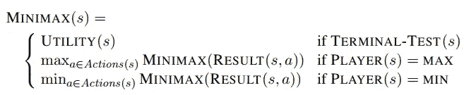
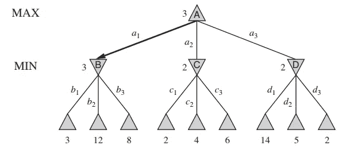
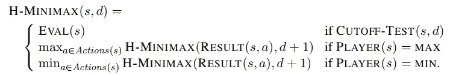
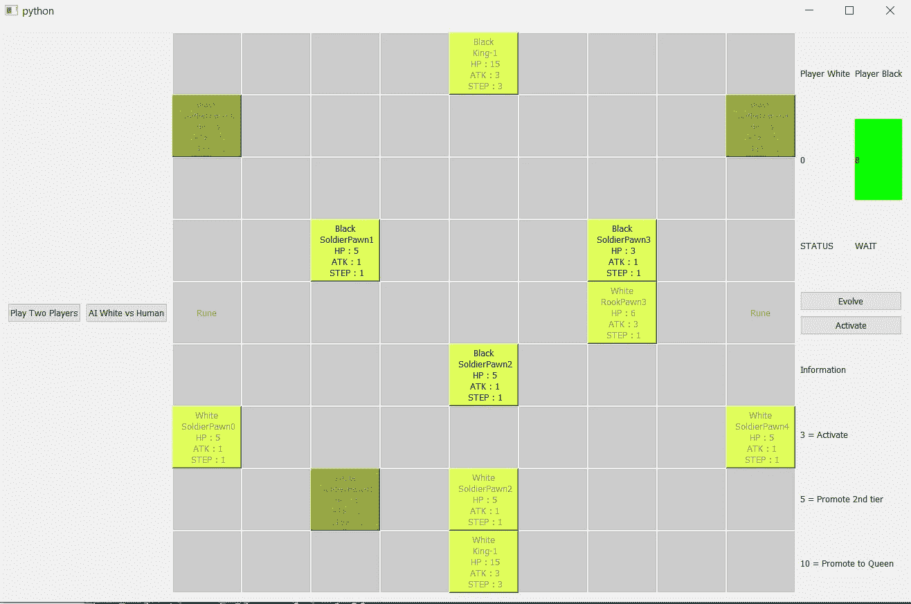
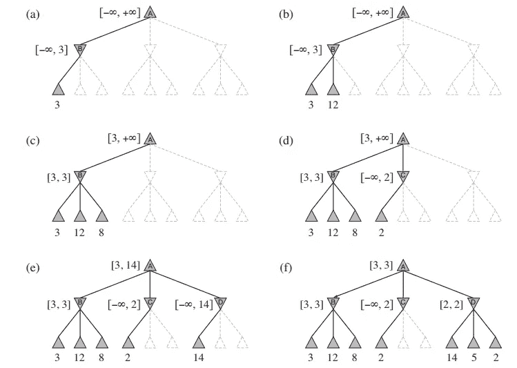
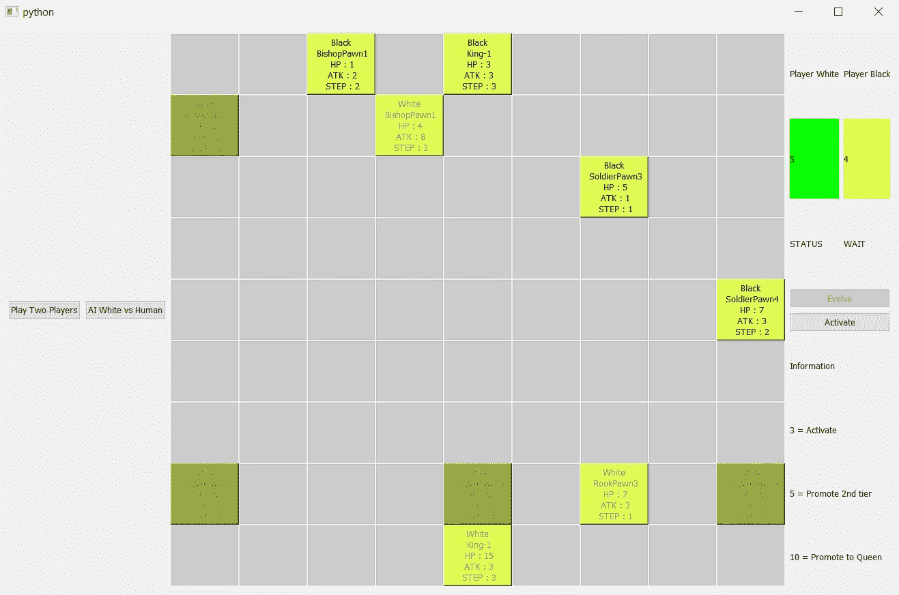

# 从头开始为你自己的棋盘游戏创造人工智能——Minimax——第 2 部分

> 原文：<https://towardsdatascience.com/create-ai-for-your-own-board-game-from-scratch-minimax-part-2-517e1c1e3362?source=collection_archive---------2----------------------->

## 用 Minimax 算法实现 AI 到 EvoPawness(暂名)，一个来自我的想法的棋盘游戏。


“chess pieces on board” by [Felix Mittermeier](https://unsplash.com/@felixmittermeier?utm_source=medium&utm_medium=referral) on [Unsplash](https://unsplash.com?utm_source=medium&utm_medium=referral)

嗨，生活怎么样？欢迎来到制作**evopheness(暂名)**桌游项目系列文章的第二部分。在这里，我们将实现如何将人工智能添加到游戏中。在本文中，我们将重点介绍一些经典算法的实现。是极小极大和阿尔法贝塔修剪极小极大。我们将回顾我们在上一部分所做的，以及我在关于棋盘游戏(GitHub)的代码库中所做的。


[Image 0] Source : [https://pixabay.com/en/drop-of-water-water-liquid-1004250/](https://pixabay.com/en/drop-of-water-water-liquid-1004250/)

在我们深入讨论如何实现它之前，我要告诉你，这一系列文章将一步一步地讲述如何创建棋盘游戏。因此，我将尽可能详细地描述我是如何设计和编写游戏、GUI 和 AI 的。我想分享一下我的经验。所以，我会一步一步来，告诉你我创造人工智能的成功和失败的尝试。

我们还没有介绍 GUI。稍后，我将撰写关于如何制作和设计 GUI 的文章。现在，我们将跳过 GUI，先做 AI 部分。

这篇文章的目标读者是对人工智能和设计游戏感兴趣的人。如果你不是其中之一，当然你还是可以看到这篇文章。我希望通过发表这篇文章来提高我的写作技巧，并且内容对你有益😄。

# 概述

1.  贮藏室ˌ仓库
2.  前一部分概述
3.  评估和效用函数工程
4.  极大极小算法及其实现
5.  A-B 剪枝极大极小算法及其实现
6.  结论
7.  编后记

# 贮藏室ˌ仓库

这里是仓库

[](https://github.com/haryoa/evo-pawness) [## 哈里欧/埃沃-波尼丝

### 在 GitHub 上创建一个帐户，为 haryoa/evo-pawness 的发展做出贡献。

github.com](https://github.com/haryoa/evo-pawness) 

我已经对存储库做了一些修改

*   平衡游戏。我和朋友玩过几次，以前的游戏规则真的很不平衡。
*   用 PyQt5 库实现图形用户界面
*   为了这篇文章，改变规则使游戏确定。下一部分会有所改变。
*   添加极大极小值、AB 修剪极大极小值和随机代理
*   重新格式化文件夹的结构

如果您想在图形用户界面(GUI)版本中播放它，请在您的命令行界面(CLI)中使用`pip install PyQt5`命令安装 PyQt5。

# 前一部分概述

在前一部分中，我们已经定义了 AI 算法要使用的一些组件。我们已经陈述了游戏的规则、状态表示、结果函数、动作、结果函数和最终测试。我们也实施了这些措施。

在本文中，让我们利用之前实现的功能来制作一个代理，它可以通过看到对手可能的动作来选择动作。

# 评估和效用函数工程

让我们回顾一下，**效用函数**为玩家定义了游戏在终端状态下的最终数值。数值公式是我们定义的。**评估函数**为玩家定义了来自给定状态的期望效用数值的估计。这个函数在游戏还没有结束的时候被调用。接收状态和玩家的输入，并输出一个表示玩家状态的结果和合意性的数值分数。负的分数意味着玩家处于劣势地位。

没有任何规则来定义评价函数和效用函数。因此，我们需要考虑如何制定它。该函数应该**区分**玩家是否处于优势地位。

这部分真的很重要，因为这个功能将定义我们代理人的**聪明度**。

这是我想出的公式:

## 效用函数

在效用函数中，我们将把效用定义为你想要的高度，并且应该高于我们将在此之后定义的评估函数。

我们在前面已经说过，我们的终态有两个条件:

1.  当一个国王死了
2.  当玩家的所有兵都死时

在这里，如果到达终端状态，它将返回-120(负表示不利)，否则返回 120。

## 评价函数

在评估函数中，我们将通过考虑兵的 hp、atk、步数和死亡状态来制定它。每个属性的权重为:

1.  HP 的重量= 0.3
2.  ATK 的重量= 0.1
3.  台阶重量= 0.1
4.  死者棋子的重量= 10
5.  国王生命值的重量= 1

我们给死者的棋子 10 的权重，因为在这个游戏中失去一个棋子是非常糟糕的。因此，我们希望通过给它一个高权重，人工智能将避免其棋子死亡。金在这里真的是一个重要的棋子。所以，我们会给它一个更高的分数。

我们将在调用类`State`中的评估函数的`AIElements.evaluation_function()`函数中定义效用和评估函数。

# 极大极小算法及其实现

最小最大值是一个决策规则，它模拟玩家的决策，以找到玩家的最优移动。它假设对手也会选择最优策略。迷你剧里有两个演员。是**最大化器**和**最小化器**。**最大化器**将尽可能搜索最高分，而**最小化器**将尽可能搜索最低分。每个玩家将看到对手的最佳移动，并为他/她得到最好的移动。通常，搜索用**树**结构数据表示。



[Image 0.5]

这个例子说明了极大极小算法



[Image 1] Source: AI: A Modern Approach Book

看图 1，Max 会输出 B，C，D 动作。首先，最小化者会看到导致 B 的可能行动，得到最低分 `min(3,12,8) = 3`。然后对 C 和 d 也这样做。之后，最大化器将选择最高分。也就是`max(3,2,2) = 3`。

在我们的棋盘游戏中，算法不会扩展状态/节点，直到终止状态。它将有内存问题或需要很长时间来处理。我们应该通过定义限制应该扩展的节点的`max_depth`来为我们的搜索算法定义一个**截止点**。它将调用计算条件的**启发式**的评估函数。



[Image 1.5]

让我们将它实现到我们的**evopheness(临时名称)**:

我们将为 Minimax 算法定义一个类，它接收`max_depth` 和`player_color`作为它的输入。`player_color` 是指出这里谁是最大化者的参数。

让我们看看 Minimax 类:

如你所见，Minimax 代理将使用递归搜索进行深度优先搜索。它将输出分数(`best_value`)和最佳动作动作键名。如果轮到最大化者，它将得到最大的分数，如果轮到最小化者，它将得到最小的分数。它将递归搜索，直到达到终端状态或最大深度。

我们打乱列表，让代理随机选择得分相同的动作。

如果你想知道`action_target`的型号，那就是`str` 型。记住我们的游戏动作是一个`dict` 类型，它保存了动作信息和动作键名。例如:

```
‘p1a2’: 
{‘action’: ‘activate’,
 ‘pawn_atk’: 1,
 ‘pawn_hp’: 5,
 ‘pawn_index’: 2,
 ‘pawn_step’: 1,
 ‘pawn_x’: 4,
 ‘pawn_y’: 1,
 ‘player_index’: 1},
```

## 测试代理

我们将使用深度= 4 的`MinimaxAgent`

转到 controller/game_controller.py 中的第 52 行，将其改为

```
self.ai_agent = MinimaxAgent(max_depth=4, player_color=0)
```



[Image 2] I exit the game because I cannot stand waiting the AI’s move

用你的命令行界面运行游戏

```
python main_gui.py
```

人工智能会优先到达符文。然后，激活它的棋子。然后先攻击我们的兵。如果可能的话，人工智能会把它的兵进化成更高级的类型。当然也有一些瑕疵，比如让我们的士兵攻击他们的国王。也许有更好的评价函数可以让 AI 保护国王。

如果你尝试过人工智能，你会发现选择动作所消耗的时间非常长。让我们看看:

从上面我们可以看到，随着游戏的进行，expanded_node 也在增加，因为可能的动作数量。随着扩展节点的增加，算法的时间往往会增加。我们可以看到 24 号弯的时间是 21 秒。谁想等那么久？

这是该算法的弱点，因为它将搜索所有可能的状态，直到期望的截止或终止状态。幸运的是，我们可以有效地切割扩展的节点。我们将使用一种叫做**修剪**的技术来计算正确的极大极小决策，而不需要查看每个节点**。**这叫做**阿尔法-贝塔修剪。**

# 阿尔法贝塔剪枝

阿尔法贝塔剪枝是一种极大极小算法的优化技术。这将删除一些不应该扩展的节点，因为已经找到了更好的移动。当应用于极大极小算法时，它将返回与极大极小算法相同的动作，但速度更快。它被称为阿尔法贝塔修剪，因为它需要两个新的参数称为阿尔法和贝塔。

Alpha:最大化者在当前状态或最大化者回合之前可以保证的最佳值

Beta:最小化者在当前状态或最小化者回合之前可以保证的最佳值

总的原则是:给定一个状态 **s** 在树的某处。如果玩家可以选择在找到 ***s*** 之前做出动作 ***m*** ，那么 ***s*** 将永远不会到达。

让我们以图片 1 为例:



[Image 3] AB Pruning Source: AI: A Modern Approach Book

记住搜索算法使用的是 DFS(深度优先搜索)！

让我们一步一步来:

1.  将 Alpha 初始化为-inf，将 Beta 初始化为 inf。如果阿尔法在最大化回合，它将被更新；如果它在最小化回合，它将被更新。它们将被传递给状态/节点的子节点。
2.  展开一个(初始状态)可能的动作。它会产生 B，C，D 状态。从第一个索引(B)开始
3.  轮到**迷你 B** 了。展开 B 可能的行动，进入孩子并检查其分数。尽可能少地更新测试版。我们会发现 Beta = 3 = min(3，12，8，inf)。α仍然是-inf。
4.  假设深度为 2，将最小分数(也就是 3)返回给 A，现在回到 **Maximizer turn A** ，更新 Alpha = 3 = max(-inf，3)。然后我们转到 C 状态/节点，第二个子节点:
5.  现在转到状态 C，**最小化回合 C** 带有传递的阿尔法参数 3。在 C 中，我们发现 C 找到的第一个孩子的分数是 2。更新β= 2 = min(INF，2)。现在，让我们想想。**最大化器**会选择这个动作吗？最大化者已经找到了更好的移动，得分为 3。当然不是，如果是最优代理的话。所以，不要在 c 中检查另一个可能的动作，这是修剪过程。返回最好的分数(是 2)。如果**β≤α**那么就把它修剪掉。
6.  **Maximizer Turn A** :计算 max(alpha，2) = alpha。检查最后一个孩子 c。
7.  **极小化回合 C** :计算 min(inf，14)，将 beta 更新为 14，检查 beta 是否≤ alpha (14 ≤ 3)且未修剪。计算下一个孩子。β≤α(5≤3)且不修剪。最后，检查β≤α(2≤3)是否应该修剪。因为在这个节点之后没有任何子节点。没有可以修剪的节点。如果首先找到返回 2 的子节点，就可以删除它。在这之后，返回 2 到 a。
8.  **Maximizer 转 A，计算 max(alpha，2) = alpha。**然后就搞定了。返回 3 作为在树中找到的最佳分数。

将其实现到**evopowness(临时名称)中。**

这是用于 Minimax Alpha Beta 修剪的类:

(注:`self.node_expanded`用于调试目的)

我们添加 alpha 和 beta 作为参数，默认为`-inf` 和`inf`。然后我们添加这些行:

**用于最大化器**

```
alpha = max(alpha, best_value)                                       
if beta <= alpha:                                           
break
```

和

**针对最小化器**

```
beta = min(beta, best_value)                                       
if beta <= alpha:                                           
break
```

就这些，我们来测试一下😃！

## 测试代理

我们将玩深度= 4 的`MinimaxABAgent`

转到 controller/game_controller.py 中的第 52 行，将其改为

```
self.ai_agent = MinimaxABAgent(max_depth=4, player_color=0)
```



[Image 4] : I lost to the AI 😢

其行为与 minimax 相同，但速度更快。让我们看看运行时间，直到 24 转。

我们可以看到，在不使用剪枝技术的情况下，花费的时间更快。直到最后，我发现搜索最佳动作的最差运行时间是 17s，有 2218 个扩展节点(66 转)。它的速度更快，因为修剪删除不必要的节点。

继续挑战人工智能。人工智能非常具有挑战性。有时它会在开始时瞄准国王。我输给人工智能一次是因为对国王的突然袭击，我没有准备好保护国王😢。

尽管如此，它是可以赢的。人工智能不为国王辩护。我认为它需要更多的深度来了解它。它将花费更长的运行时间。嗯，没有人会想测试他/她的耐心，玩一个需要太长时间的人工智能(你想等一分钟或更长时间才能轮到它？).


[Image 5] Source : [https://pixabay.com/en/robot-future-modern-technology-1658023/](https://pixabay.com/en/robot-future-modern-technology-1658023/)

Minimax 也不考虑除了在所选深度中发现的状态之外的状态。极大极小只关心在其中找到的状态。不可能从开始就搜索所有节点到终端状态，因为这会导致内存错误。计算量大(O(action^depth))这是极小极大的弱点，即使使用剪枝技术进行了改进。

我们需要一些考虑状态而不是选择深度的技术，也可以让 AI 更快地选择动作。我们将在下一部分看到它😄。

# 结论

我们已经创建了 Minimax 算法使用的效用和评估函数。虽然性能不错，但是极大极小算法就是这么慢。为了弥补这个缺陷，我们对算法进行了修剪。这叫做阿尔法贝塔剪枝。动作的模式是相同的，并且不使用修剪会更快。即便如此，极大极小阿尔法贝塔剪枝也有它的缺陷。它只能考虑和观察 **n** 向前移动，即 **n** 需要变小。如果 n 很大，那么选择一个动作在计算上将是昂贵的。我们需要一些算法，考虑到进一步的转折，需要更快。

# 编后记

感谢您阅读我关于人工智能的第三篇文章。我需要一些建设性的反馈，以提高我的写作水平和人工智能知识。请手下留情😆！

我只是想把我的知识分享给读者。分享知识很好，因为它可以帮助有需要的人。我正在学习这个领域，想分享我所学到的东西。如果有人告诉我这篇文章有什么问题，那就太好了。

很抱歉在图形用户界面上的糟糕用户体验(UX)😞。它在代码中也有混乱和不够的文档。我希望我有时间修理它。也许有人能帮我修好它？

下一部分(第 3 部分)将进入强化学习。我们将逐一探讨各种强化学习。在此之前，我将创建一篇关于我如何设计 GUI 的文章，并展示这个项目中的类的结构。这将是 1.5 部分。希望我能在这个星期天发表文章。

我们将在强化学习中进行实验。恐怕要花很多时间来试验它。我想，两周是我能发表文章的最小间隔。有人想和我一起做实验吗？给我精神去写下一部分✌️.

> 如果你想从我这里得到另一篇这样的文章，**请拍下这篇文章👏 👏**。这将鼓舞我写下一篇文章。我保证会写出更好的文章。

下一篇文章再见！


“flat lay photography of coffee latte in teacup on table” by [Hanny Naibaho](https://unsplash.com/@hannynaibaho?utm_source=medium&utm_medium=referral) on [Unsplash](https://unsplash.com?utm_source=medium&utm_medium=referral)

# 系列文章

第 1 部分:[从头开始为你自己的棋盘游戏创造人工智能——准备——第 1 部分](/create-your-own-board-game-with-powerful-ai-from-scratch-part-1-5dcb028002b8)

第 2 部分:从零开始为你自己的棋盘游戏创造 AI——Minimax——第 2 部分

第 3 部分:[从头开始为你自己的棋盘游戏创造 AI——alpha zero——第 3 部分](/create-ai-for-your-own-board-game-from-scratch-alpha-zero-part-3-f22761372245)

# **来源**

拉塞尔，斯图尔特 j，和彼得诺维格。*人工智能:现代方法*。普伦蒂斯霍尔出版社，2010 年。

[](https://www.geeksforgeeks.org/minimax-algorithm-in-game-theory-set-1-introduction/) [## 博弈论中的极大极小算法|第一集(简介)- GeeksforGeeks

### 极客的计算机科学门户。它包含写得很好，很好的思想和很好的解释计算机科学和…

www.geeksforgeeks.org](https://www.geeksforgeeks.org/minimax-algorithm-in-game-theory-set-1-introduction/)