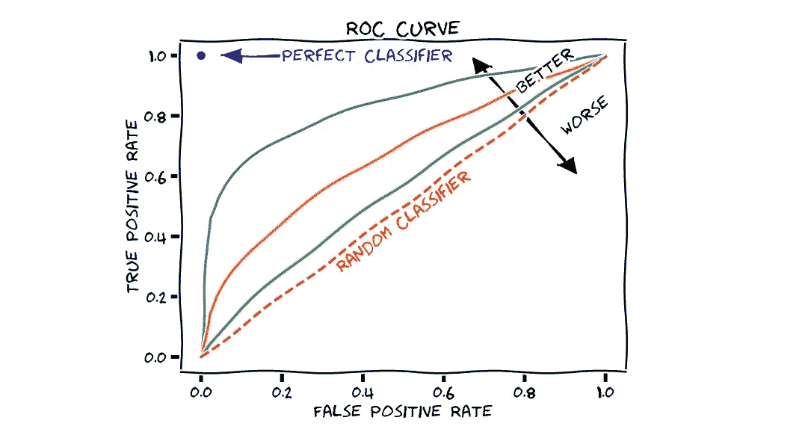
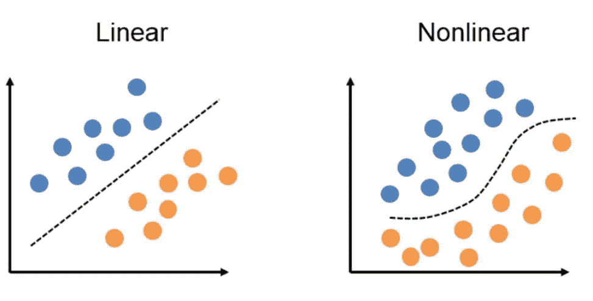
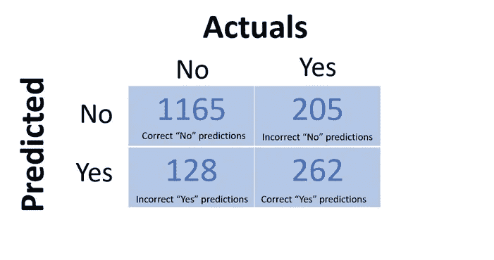
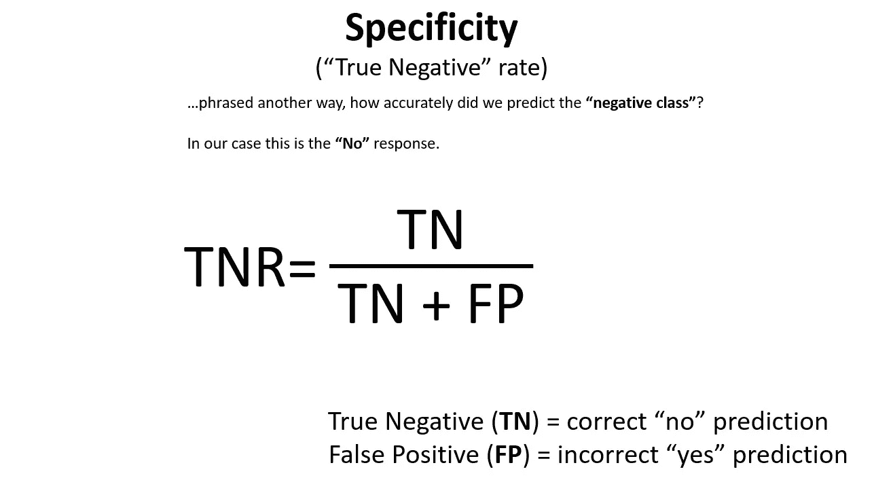
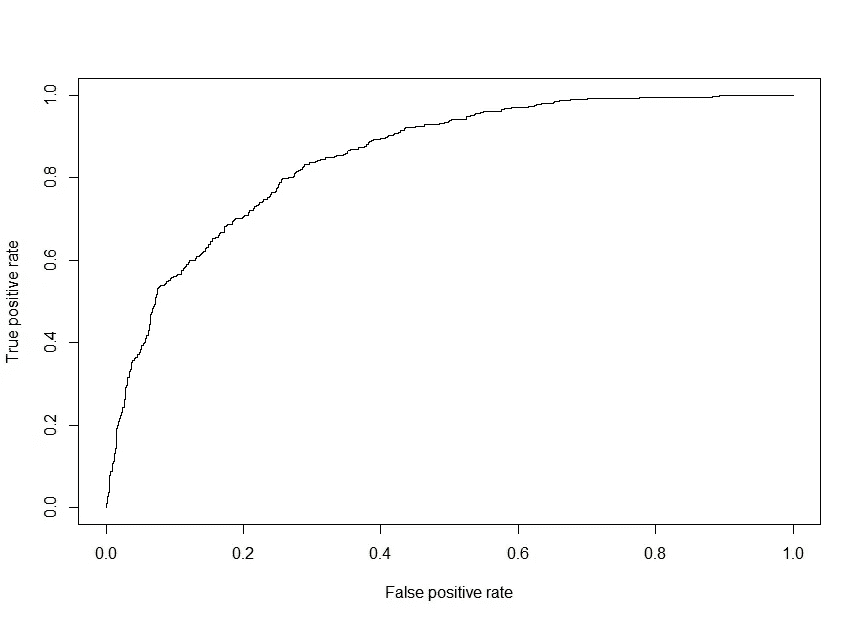
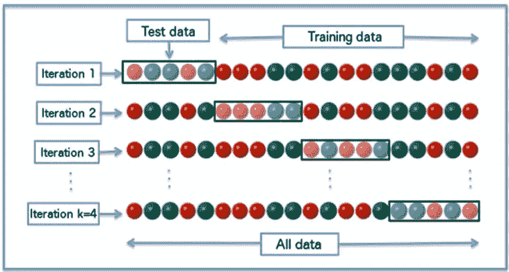
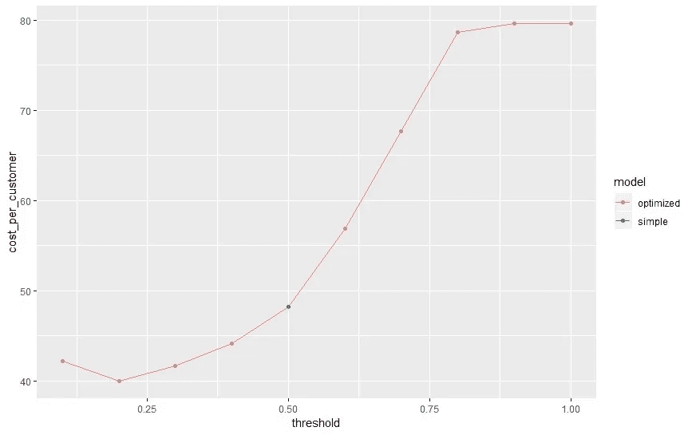

# 创建具有业务影响的更好的数据科学项目:使用 R

> 原文：<https://towardsdatascience.com/create-better-data-science-projects-with-business-impact-churn-prediction-with-r-f609c23a6287?source=collection_archive---------9----------------------->


找份工作并不容易，你需要让自己与众不同。

仅仅展示你知道如何使用像 **scikit-learn** 或 **ggplot2** 这样的工具是不够的，这是已知的。

所以问题是，你能做什么？

我最喜欢的策略之一是**展示商业影响**。

我所说的**“业务影响”是什么意思**

在一天结束时，你将直接或间接地从事与业务相关的工作。

那可能是**降低成本**、**增加收入**、**改善客户体验**等等。

在这篇文章中，我将一步一步地向你展示如何建立一个[客户流失预测模型](https://www.dataoptimal.com/churn-prediction-with-r/)来显示**重大的商业影响**。

这里有一个简单的概述:

*   工作经历
*   逻辑回归
*   准备数据
*   拟合模型
*   做预测
*   业务影响

# 工作经历

在任何现实世界的数据科学项目开始时，你都需要问一系列问题。

这里有几个好的开始:

*   你想解决什么问题？
*   你的潜在解决方案是什么？
*   你将如何评价你的模型？

继续前面的**客户流失**想法，让我们假设你在电信行业工作。

有一天，你的老板找到你，问你，“我们如何利用现有的数据来改善业务？”


让我们来看一下如何详细回答每个问题，以提出解决老板问题的战略方法。

# 你想解决什么问题？

在查看了现有数据后，您发现获得新客户的成本大约是留住现有客户的五倍。

现在，更集中的问题变成了，**“我们如何提高客户保持率以降低成本？”**

# 你的潜在解决方案是什么？

由于我们可以访问现有的客户数据，我们可以尝试建立一个机器学习模型来预测客户流失。

为了避免过于抽象而无法向管理层解释的事情变得过于复杂，我们将使用[逻辑回归模型](https://en.wikipedia.org/wiki/Logistic_regression)。

# 你将如何评价你的模型？

我们将使用一系列机器学习**评估指标** ( [ROC](https://en.wikipedia.org/wiki/Receiver_operating_characteristic) ，AUC，灵敏度，特异性)以及**业务导向指标**(成本节约)。



# 逻辑回归

既然我们已经熟悉了业务背景，并且已经确定了问题的范围，那么让我们来看看我们潜在的解决方案。

我们可以尝试使用许多机器学习模型。都有利弊。

为了使事情简单，让我们只坚持逻辑回归。

逻辑回归是一个线性分类器。由于我们试图预测“流失”或“没有流失”，分类模型正是我们所需要的。



这是一个很棒的模型，因为它比许多其他模型更容易解释，比如随机森林。我所说的“解释”是指我们可以更容易地看到特征和输出之间的关系。

逻辑回归的缺点是它有一个偏向线性拟合的[偏差](https://stats.stackexchange.com/questions/13643/bias-an-intuitive-definition)。如果决策边界不是线性的，它的性能可能不如随机森林这样的模型。

基本上，我们是在用灵活性来换取可解释性。在实现机器学习模型时，这始终是一个需要考虑的问题。

# 准备数据

下一步是准备数据。

此工作流程因项目而异，但对于我们的示例，我将使用以下工作流程:

1.  导入数据
2.  快速看一眼
3.  清理数据
4.  拆分数据

我在工作流程中省略了一个完整的探索阶段。在以后的文章中，我会详细介绍这一点，因为我认为这与建模阶段同等重要，甚至更重要。

# 1)导入数据

让我们首先导入[数据](https://github.com/dataoptimal/posts/tree/master/business%20impact%20project)。你可以到我们的 github 页面去拿一份。

我们将利用 [Tidyverse](https://www.tidyverse.org/) 库。这是使用 r 的数据科学家的必备库，请务必查看他们的文档。

```
library(tidyverse)

# setting the working directory
path_loc <- "C:/Users/Jonathan/Desktop/post"
setwd(path_loc)

# reading in the data
df <- read_csv("Telco Data.csv")
```

我喜欢在开始时设置工作目录的路径。确保将您的`path_loc`变量修改到您的代码和数据集所在的工作目录。

由于这是一个 csv 文件，我使用了`read_csv`函数将数据读入数据帧`df`。

# 2)快速浏览一下

导入数据后，您可能想快速浏览一下。我认为“快速浏览”就是这样，而不是探索数据。

我喜欢从查看特性列的维度和名称开始。

```
# dimensions of the data
dim_desc(df)

# names of the data
names(df)> # dimensions of the data
> dim_desc(df)
[1] "[7,043 x 21]"
> 
> # names of the data
> names(df)
 [1] "customerID"       "gender"           "SeniorCitizen"    "Partner"          "Dependents"       "tenure"          
 [7] "PhoneService"     "MultipleLines"    "InternetService"  "OnlineSecurity"   "OnlineBackup"     "DeviceProtection"
[13] "TechSupport"      "StreamingTV"      "StreamingMovies"  "Contract"         "PaperlessBilling" "PaymentMethod"
```

我们可以看到有 21 个特征和 7，043 行。有各种各样的功能，如`TotalCharges` 和`tenure` 。我们将要尝试和预测的输出是“流失”。

另一个很棒的功能是`glimpse`。这使我们能够更详细地快速查看我们的功能。

```
# taking a look at the data
glimpse(df)> glimpse(df)
Observations: 7,043
Variables: 21
$ customerID        "7590-VHVEG", "5575-GNVDE", "3668-QPYBK", "7795-CFOCW", "9237-HQITU", "9305-CDSKC", "1452-K...
$ gender            "Female", "Male", "Male", "Male", "Female", "Female", "Male", "Female", "Female", "Male", "...
$ SeniorCitizen     0, 0, 0, 0, 0, 0, 0, 0, 0, 0, 0, 0, 0, 0, 0, 0, 0, 0, 0, 0, 1, 0, 0, 0, 0, 0, 0, 0, 0, 0, 1...
$ Partner           "Yes", "No", "No", "No", "No", "No", "No", "No", "Yes", "No", "Yes", "No", "Yes", "No", "No...
$ Dependents        "No", "No", "No", "No", "No", "No", "Yes", "No", "No", "Yes", "Yes", "No", "No", "No", "No"...
$ tenure            1, 34, 2, 45, 2, 8, 22, 10, 28, 62, 13, 16, 58, 49, 25, 69, 52, 71, 10, 21, 1, 12, 1, 58, 4...
$ PhoneService      "No", "Yes", "Yes", "No", "Yes", "Yes", "Yes", "No", "Yes", "Yes", "Yes", "Yes", "Yes", "Ye...
$ MultipleLines     "No phone service", "No", "No", "No phone service", "No", "Yes", "Yes", "No phone service",...
$ InternetService   "DSL", "DSL", "DSL", "DSL", "Fiber optic", "Fiber optic", "Fiber optic", "DSL", "Fiber opti...
$ OnlineSecurity    "No", "Yes", "Yes", "Yes", "No", "No", "No", "Yes", "No", "Yes", "Yes", "No internet servic...
$ OnlineBackup      "Yes", "No", "Yes", "No", "No", "No", "Yes", "No", "No", "Yes", "No", "No internet service"...
$ DeviceProtection  "No", "Yes", "No", "Yes", "No", "Yes", "No", "No", "Yes", "No", "No", "No internet service"...
$ TechSupport       "No", "No", "No", "Yes", "No", "No", "No", "No", "Yes", "No", "No", "No internet service", ...
$ StreamingTV       "No", "No", "No", "No", "No", "Yes", "Yes", "No", "Yes", "No", "No", "No internet service",...
$ StreamingMovies   "No", "No", "No", "No", "No", "Yes", "No", "No", "Yes", "No", "No", "No internet service", ...
$ Contract          "Month-to-month", "One year", "Month-to-month", "One year", "Month-to-month", "Month-to-mon...
$ PaperlessBilling  "Yes", "No", "Yes", "No", "Yes", "Yes", "Yes", "No", "Yes", "No", "Yes", "No", "No", "Yes",...
$ PaymentMethod     "Electronic check", "Mailed check", "Mailed check", "Bank transfer (automatic)", "Electroni...
$ MonthlyCharges    29.85, 56.95, 53.85, 42.30, 70.70, 99.65, 89.10, 29.75, 104.80, 56.15, 49.95, 18.95, 100.35...
$ TotalCharges      29.85, 1889.50, 108.15, 1840.75, 151.65, 820.50, 1949.40, 301.90, 3046.05, 3487.95, 587.45,...
$ Churn             "No", "No", "Yes", "No", "Yes", "Yes", "No", "No", "Yes", "No", "No", "No", "No", "Yes", "N...
```

# 3)清理数据

在开始使用逻辑回归模型之前，我们需要做一些小的清理。

让我们从将字符变量突变为因子开始。

```
# changing character variables to factors
df <- df %>% mutate_if(is.character, as.factor)
```

在这段代码中，我们使用 [dplyr](https://dplyr.tidyverse.org/) 的`mutate_if`函数将字符变量转换为因子类型。

`%>%`被称为管道操作员。它来自马格里特图书馆，也是 Tidyverse 的一部分。

这个操作符的基本思想是使你的代码更具可读性。你可以在这里了解更多关于管道运营商[的信息。](https://r4ds.had.co.nz/pipes.html)

让我们也将`SeniorCitizen`变量从一个整数改为一个因子。

```
# changing SeniorCitizen variable to factor
df$SeniorCitizen <- as.factor(df$SeniorCitizen)
```

接下来，我们将检查丢失的值。我们可以使用来自 [purrr](https://purrr.tidyverse.org/) 库中的`map`函数来完成这项工作。如果你还没有猜到，这个库也是 Tidyverse 的一部分。

```
# looking for missing values
df %>% map(~ sum(is.na(.)))> df %>% map(~ sum(is.na(.)))
$`customerID`
[1] 0

$gender
[1] 0

$SeniorCitizen
[1] 0

$Partner
[1] 0

$Dependents
[1] 0

$tenure
[1] 0

$PhoneService
[1] 0

$MultipleLines
[1] 0

$InternetService
[1] 0

$OnlineSecurity
[1] 0

$OnlineBackup
[1] 0

$DeviceProtection
[1] 0

$TechSupport
[1] 0

$StreamingTV
[1] 0

$StreamingMovies
[1] 0

$Contract
[1] 0

$PaperlessBilling
[1] 0

$PaymentMethod
[1] 0

$MonthlyCharges
[1] 0

$TotalCharges
[1] 11

$Churn
[1] 0
```

我们可以看到`TotalCharges`有 11 个缺失值。为了替换这些丢失的值，我们只需要用中间值做一个简单的替换。

```
# imputing with the median
df <- df %>% 
  mutate(TotalCharges = replace(TotalCharges,
                                is.na(TotalCharges),
                                median(TotalCharges, na.rm = T)))
```

对于替换缺失值的更严格的技术方法，请查看来源。

我们要做的最后一件事是移除`CustomerID`特性。这是每个客户的唯一标识符，所以它可能不会给我们的模型添加任何有用的信息。

```
# removing customerID; doesn't add any value to the model
df <- df %>% select(-customerID)
```

如果你想测试这个，你可以一直保持这个特性，看看结果如何比较。

# 4)拆分数据

为了确保我们没有过度拟合我们的模型，我们将把数据分成训练集和测试集。这被称为[交叉验证](https://en.wikipedia.org/wiki/Cross-validation_(statistics))。

我们将在训练集上训练模型，然后在测试集上测试它的性能。我们将随机选择 75%的数据作为我们的训练集，25%作为我们的测试集。我鼓励你尝试不同的分割，看看你的结果如何比较(也许你的训练/测试集是 80%/20%和 60%/40%)。

为了创建分割，我们将使用[插入符号](http://topepo.github.io/caret/index.html)包。让我们从导入 Caret 并设置种子开始，这样我们的结果是可重复的。

```
library(caret)

# selecting random seed to reproduce results
set.seed(5)
```

接下来，我们将使用`createDataPartition`函数选择 75%的数据用于训练集。这将随机选择 75%的行。

```
# sampling 75% of the rows
inTrain <- createDataPartition(y = df$Churn, p=0.75, list=FALSE)
```

最后，我们将使用上面的行样本创建我们的训练和测试数据帧。

```
# train/test split; 75%/25%
train <- df[inTrain,]
test <- df[-inTrain,]
```

还有其他方法，如 k 倍交叉验证，所以一定要仔细阅读这些方法。

有关如何在 Caret 中实现 k-fold 交叉验证的信息，请在 R 控制台中键入`help(“createFolds”)`。

# 拟合模型

既然我们已经将数据分成了训练集和测试集，现在是时候拟合模型了。

为了实现逻辑回归模型，我们将使用[广义线性模型](https://www.statmethods.net/advstats/glm.html) (GLM)函数`glm`。

有不同类型的 [GLMs](https://en.wikipedia.org/wiki/Generalized_linear_model) ，其中包括逻辑回归。为了指定我们想要执行二元逻辑回归，我们将使用参数`family=binomial`。

下面是拟合逻辑回归模型的完整代码:

```
# fitting the model
fit <- glm(Churn~., data=train, family=binomial)
```

在下一节中，我们将进行预测并评估我们的模型。

# 做预测

现在我们已经拟合了我们的模型，是时候看看它的表现了。

为此，我们将使用`test`数据集进行预测。我们将传递上一节中的`fit`模型。为了预测概率，我们将指定`type=”response”`。

```
# making predictions
churn.probs <- predict(fit, test, type="response")
head(churn.probs)> head(churn.probs)
         1          2          3          4          5          6 
0.32756804 0.77302887 0.56592677 0.20112771 0.05152568 0.15085976
```

由于我们预测的`Churn` 变量是“是”或“否”，所以我们希望将这些概率转换成二元响应。

我不确定 R 是如何编码响应的，但是我可以使用`contrasts`函数快速检查这一点。

```
# Looking at the response encoding
contrasts(df$Churn)> contrasts(df$Churn)
    Yes
No    0
Yes   1
```

查看结果，我们可以看到`Yes`正在使用`1`进行编码。

现在我们知道了响应编码，我们可以将预测结果转换成`Yes`和`No`响应。

我们将响应阈值设置为`0.5`，因此如果预测概率高于`0.5`，我们将把这个响应转换为`Yes`。

最后一步是将角色反应转换成[因素类型](https://stats.idre.ucla.edu/r/modules/factor-variables/)。这是为了使逻辑回归模型的编码是正确的。

```
# converting probabilities to "Yes" and "No" 
glm.pred = rep("No", length(churn.probs))
glm.pred[churn.probs > 0.5] = "Yes"
glm.pred <- as.factor(glm.pred)
```

稍后我们将进一步了解阈值，所以不要担心我们为什么将它设置为`0.5`。现在，我们将在这个例子中使用这个值。

进行预测的一个重要部分是评估和验证模型。

让我们详细看看一些评估指标，并以一种更严格的模型验证方法结束， [k 倍交叉验证](https://machinelearningmastery.com/k-fold-cross-validation/)。

# 评估模型

在我们做出预测之后，是时候评估我们的模型了。

快速做到这一点的一个很好的工具是使用 Caret 中的`confusionMatrix`函数。

我们将输入我们的`glm.pred`预测数组，以及来自`test$Churn`的实际结果。

最后，我们将使用`positive=”Yes”`将正类指定为“Yes”。

```
# creating a confusion matrix
confusionMatrix(glm.pred, test$Churn, positive = "Yes")> confusionMatrix(glm.pred, test$Churn, positive = "Yes")
Confusion Matrix and Statistics

          Reference
Prediction   No  Yes
       No  1165  205
       Yes  128  262

               Accuracy : 0.8108          
                 95% CI : (0.7917, 0.8288)
    No Information Rate : 0.7347          
    P-Value [Acc > NIR] : 4.239e-14       

                  Kappa : 0.4877          
 Mcnemar's Test P-Value : 3.117e-05       

            Sensitivity : 0.5610          
            Specificity : 0.9010          
         Pos Pred Value : 0.6718          
         Neg Pred Value : 0.8504          
             Prevalence : 0.2653          
         Detection Rate : 0.1489          
   Detection Prevalence : 0.2216          
      Balanced Accuracy : 0.7310          

       'Positive' Class : Yes
```

这个函数产生一个[混淆矩阵](https://www.dataschool.io/simple-guide-to-confusion-matrix-terminology/)，以及其他感兴趣的统计数据。

混淆矩阵显示了每个类别中有多少正确和不正确的预测。

下面快速浏览一下我们模型中的混淆矩阵:



我们可以看到，该模型正确预测了 1165 次“否”，而在实际回答为“是”的情况下，错误预测了 205 次“否”。

同样，当实际答案是“是”的时候，该模型正确地预测了“是”262 次。与此同时，它错误地预测了“是”，而实际的回答是“否”128 次。

我们的总体准确率是 81%。一个简单的基线模型是预测多数类，在我们的例子中是“否”。

如果我们只是预测多数类，我们的准确率将是 73%。测试集中有 1760 个观察值，1293 个是“否”。如果你用 1293 除以 1760，你就可以得到 73%的准确率。

其他一些有用的指标是 [**灵敏度**和**特异性**](https://en.wikipedia.org/wiki/Sensitivity_and_specificity) 。由于我们的类别略有不平衡(约 73%=“否”，约 27%=“是”)，这些指标可能更有用。

**灵敏度**表示**“真阳性”**率。这是对我们预测正类的准确程度的度量，在我们的例子中是“是”。

`confusionMatrix`函数直接报告这个，但是如果你想自己计算，用“真阳性”除以“真阳性”和“假阴性”之和。这里有一个形象化的例子来说明这一点:


另一个有用的指标是**特异性**，它表示**“真阴性”**率。这是对我们预测负类的准确度的一种衡量。这里有一个解释特异性的图像:



另一个有用的指标是受试者工作特征曲线下的面积，也称为 AUC。

ROC 最初在第二次世界大战期间用于分析雷达信号，它是一张**真阳性率与**假阳性率的曲线图。

回到我们最初的模型，我声明我将使用 0.5 作为做出“是”(或积极)预测的阈值。不过，我并没有很好的理由选择 0.5。

ROC 是一个很好的工具，因为它绘制了阈值变化时 TPR 与 FPR 的关系。我们可以使用 [ROCR](https://cran.r-project.org/web/packages/ROCR/ROCR.pdf) 库绘制 ROC 曲线。以下是完整的 R 代码:

```
library(ROCR)
# need to create prediction object from ROCR
pr <- prediction(churn.probs, test$Churn)

# plotting ROC curve
prf <- performance(pr, measure = "tpr", x.measure = "fpr")
plot(prf)
```



如前所述，另一个有用的指标是 ROC 曲线下的面积，称为 [AUC](https://developers.google.com/machine-learning/crash-course/classification/roc-and-auc) 。

AUC 可以取 0 到 1 之间的任何值，1 为最佳值。这是一种将 ROC 归结为一个数字来评估模型的简便方法。下面是评估我们模型的 R 代码:

```
# AUC value
auc <- performance(pr, measure = "auc")
auc <- auc@y.values[[1]]
auc> auc
[1] 0.8481338
```

我们的模型的 AUC 为 0.85，相当不错。如果我们只是随机猜测，我们的 ROC 将是一条 45 度线。这相当于 AUC 为 0.5。

我们胜过随机猜测，所以我们知道我们的模型至少增加了一些价值！

# k 倍交叉验证

既然我们已经训练、测试和评估了我们的模型，让我们更严格地评估模型。

我们将数据集分为训练数据集和测试数据集，这是一种防止过度拟合的好方法。

一个更好的方法是使用 [K 倍交叉验证](http://statweb.stanford.edu/~tibs/sta306bfiles/cvwrong.pdf)。



在这种模型验证技术中，我们通过指定一定数量的“折叠”将数据随机划分为测试集和训练集。在上面的例子中，折叠的数量是 k=4。

在我们对每个折叠运行模型后，我们对每个折叠的评估指标进行平均。因此，如果我们使用 ROC 运行模型四次，我们将对四个 ROC 值进行平均。这是尝试和防止过度拟合模型的好方法。

常用的折叠数是 10，所以我们将在数据中使用 10。我们还将重复这个过程 3 次，只是为了给我们的方法增加一点技术上的严谨性。以下是完整的 R 代码:

```
# setting a seed for reproduceability
set.seed(10)

# changing the positive class to "Yes"
df$Churn <- as.character(df$Churn)
df$Churn[df$Churn == "No"] <- "Y"
df$Churn[df$Churn == "Yes"] <- "N"
df$Churn[df$Churn == "Y"] <- "Yes"
df$Churn[df$Churn == "N"] <- "No"

# train control
fitControl <- trainControl(## 10-fold CV
  method = "repeatedcv",
  number = 10,
  ## repeated 3 times
  repeats = 3,
  classProbs = TRUE,
  summaryFunction = twoClassSummary)

# logistic regression model
logreg <- train(Churn ~., df,
                method = "glm",
                family = "binomial",
                trControl = fitControl,
                metric = "ROC")
logreg> logreg
Generalized Linear Model 

7043 samples
  19 predictor
   2 classes: 'No', 'Yes' 

No pre-processing
Resampling: Cross-Validated (10 fold, repeated 3 times) 
Summary of sample sizes: 6338, 6339, 6338, 6339, 6339, 6339, ... 
Resampling results:

  ROC        Sens       Spec   
  0.8455546  0.5500297  0.89602
```

我们从使用`trainControl`功能设置 k 倍 CV 开始。所有的输入都非常简单。正如我之前提到的，我们使用 10 次折叠，重复 3 次。

接下来我们训练我们的模型。正如我们前面所做的，我们使用“glm”方法中的“[二项式](https://cran.r-project.org/web/packages/rstanarm/vignettes/binomial.html)”族。为了评估我们的模型，我们将使用“ROC”。该模型实际上是报告 AUC，但我们在`train`函数中指定的方式是用`metric=”ROC”`。

您还会注意到，我在`trainControl`函数的代码前将正类更改为“Yes”。我这样做是为了将敏感性和特异性与我们以前的结果进行比较。这只是函数中的一个小问题，所以不要纠结于此。

结果与我们以前得到的相似。

和之前一样，我们的 **AUC 是 0.85** 。这在输出中报告为 ROC，但实际上是 AUC。

**真阳性率**(敏感性)为 **0.55** ，而**真阴性率**(特异性)为 **0.90** 。

# 业务影响

到目前为止，我们已经使用了 **k 倍交叉验证**和**逻辑回归**来预测客户流失。

我们已经查看了有用的评估指标，如 **AUC** 、**灵敏度**和**特异性**。

这很好，但现在怎么办？

如果我们去见首席执行官并单独展示这些结果，他或她会说**“那又怎么样？”**

我们开发该模型的实际目标是展示**业务影响**。在我们的案例中，这将是**成本节约**。

让我一步一步地介绍一下我们如何节约成本。

首先，让我们对各种成本做一些假设。

我们假设**电信行业的客户获取成本**约为**300 美元**。如果我们预测某个客户不会流失，但实际上他们会流失(假阴性，FN)，那么我们就必须出去花 300 美元为该客户找一个替代品。

现在让我们假设获得一个新客户比留住一个现有客户要贵 5 倍。如果我们预测某个客户会流失，我们需要花费**60 美元来留住那个客户**。

有时我们会正确地预测客户会流失(真阳性，TP)，有时我们会错误地预测客户会流失(假阳性，FP)。在这两种情况下，我们将花费 60 美元来留住客户。

最后，在这种情况下，我们正确地预测客户不会流失(真阴性，TN)。在这种情况下，我们不会花钱。这些是快乐的顾客，我们正确地将他们定义为快乐的顾客。

这里是成本的快速汇总:

*   **FN** (预测客户不会流失，但他们确实流失了): **$300**
*   **TP** (预测客户会流失，而实际上他们会流失): **$60**
*   **FP** (预测客户会流失，而实际上他们不会): **$60**
*   **TN** (预测客户不会流失，而实际上他们不会): **$0**

如果我们将每种预测类型(FN、TP、FP 和 TN)的数量乘以与每种类型相关联的成本，并将它们相加，那么我们可以计算出与我们的模型相关联的总成本。这个等式是这样的:

成本= FN($ 300)+TP($ 60)+FP($ 60)+TN($ 0)

作为一个例子，让我们假设我们对每一个做出如下数量的预测:

*   FN = 10
*   TP = 5
*   FP = 5
*   TN = 5

那么我们的总成本将是 3600 美元。

10 *(300 美元)+5 *(60 美元)+5 *(60 美元)+5 *(0 美元)= **$3600**

现在让我们将这个成本评估应用到我们的模型中。

我们将从拟合模型开始，并以概率的形式进行预测。

```
# fitting the logistic regression model
fit <- glm(Churn~., data=train, family=binomial)

# making predictions
churn.probs <- predict(fit, test, type="response")
```

接下来，让我们创建一个阈值向量和一个成本向量。

```
# threshold vector
thresh <- seq(0.1,1.0, length = 10)

#cost vector
cost = rep(0,length(thresh))
```

阈值向量将保存每个模型的阈值。之前，我们只是使用 0.5 作为阈值，但让我们看看阈值在 0 和 1 之间的增量为 0.1(例如，0.1、0.2、0.3…0.9、1.0)。

成本向量将是长度为 10 的向量，以零开始。我们将在循环函数时填充它，并在循环过程中评估每个阈值。为了评估成本，我们将使用刚刚讨论过的相同成本等式。

现在，我们将创建一个 for 循环，使用各种阈值进行预测，并评估每个阈值的成本。

```
# cost as a function of threshold
for (i in 1:length(thresh)){

  glm.pred = rep("No", length(churn.probs))
  glm.pred[churn.probs > thresh[i]] = "Yes"
  glm.pred <- as.factor(glm.pred)
  x <- confusionMatrix(glm.pred, test$Churn, positive = "Yes")
  TN <- x$table[1]/1760
  FP <- x$table[2]/1760
  FN <- x$table[3]/1760
  TP <- x$table[4]/1760
  cost[i] = FN*300 + TP*60 + FP*60 + TN*0
}
```

我没有使用 TN、FP、FN 和 TP 的每个结果的总数，而是使用了一个百分比。这就是为什么我用混淆矩阵取出每个值，然后除以 1760。

在我们的测试集中有 1760 个观察值，这就是这个数字的来源。通过这样做，我正在计算每位顾客的成本。

现在让我们假设我们的公司正在使用我们称之为**“简单模型”**，它只是默认为 0.5 的**阈值。我们可以继续下去，拟合模型，进行预测，并计算成本。我们将这个模型称为`cost_simple`。**

```
# simple model - assume threshold is 0.5
glm.pred = rep("No", length(churn.probs))
glm.pred[churn.probs > 0.5] = "Yes"
glm.pred <- as.factor(glm.pred)

x <- confusionMatrix(glm.pred, test$Churn, positive = "Yes")
TN <- x$table[1]/1760
FP <- x$table[2]/1760
FN <- x$table[3]/1760
TP <- x$table[4]/1760
cost_simple = FN*300 + TP*60 + FP*60 + TN*0
```

最后，我们可以把所有的结果放在一个数据框中，并把它们画出来。

```
# putting results in a dataframe for plotting
dat <- data.frame(
  model = c(rep("optimized",10),"simple"),
  cost_per_customer = c(cost,cost_simple),
  threshold = c(thresh,0.5)
)

# plotting
ggplot(dat, aes(x = threshold, y = cost_per_customer, group = model, colour = model)) +
  geom_line() +
  geom_point()
```



查看结果，我们可以看到，在阈值为 **0.2** 时，每位客户的**最低成本约为**40.00 美元**。**

我公司目前正在实施的**【简单】模式**每个客户的成本约为**48.00 美元，门槛为 **0.50** 。**

**如果我们假设我们有大约 **500，000** 的客户群，从简单模型到优化模型的转换产生了 400 万美元的**成本节约。****

```
# cost savings of optimized model (threshold = 0.2) compared to baseline model (threshold = 0.5)
savings_per_customer = cost_simple - min(cost)

total_savings = 500000*savings_per_customer

total_savings> total_savings
[1] 4107955
```

**根据企业的规模，这种类型的成本节约可能会产生重大的业务影响。**

# **结论**

**在这篇文章中，我们开发了一个机器学习模型来预测[客户流失](https://www.dataoptimal.com/churn-prediction-with-r/)。**

**具体来说，我们完成了以下每个步骤:**

*   **工作经历**
*   **逻辑回归**
*   **准备数据**
*   **拟合模型**
*   **做预测**
*   **业务影响**

**最后，我们针对客户流失问题开发了一个**优化的逻辑回归模型**。**

**假设公司使用的逻辑回归模型的默认阈值为 0.5 ，我们能够确定最优阈值实际上是 0.2 。**

**这将每位客户的成本从**48.00 美元**降至**40.00 美元**。由于客户群约为 **50 万**，这将产生每年 400 万美元的**成本节约。这是一个重大的业务影响！****

**尽管这是一个纯粹假设的例子，但它与您在现实世界中遇到的情况非常相似。**

**能够有效地识别问题并展示真实的**业务影响**将使你在就业市场上从其他数据科学家中脱颖而出。**

**能够实现机器学习模型并对其进行评估是一回事。如果你能做到所有这些，并像我们在这篇文章中所做的那样，以商业影响的形式展示结果，那么你就能顺利找到工作了！**