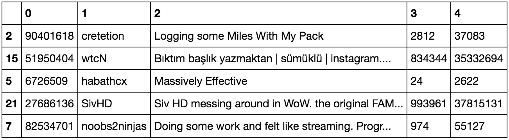
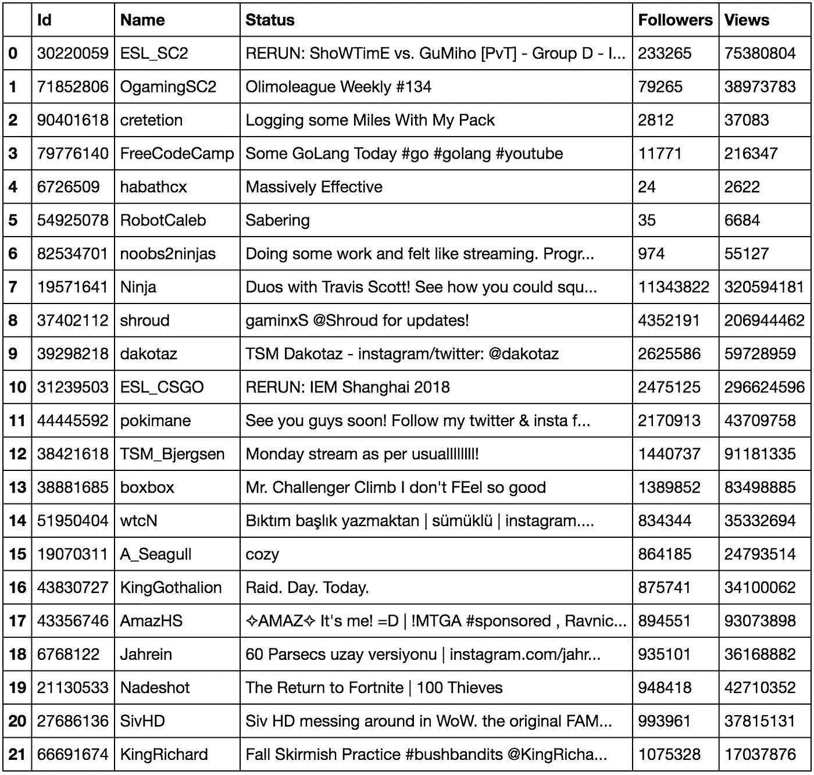

# 通过 Python 使用 API 创建数据集

> 原文：<https://towardsdatascience.com/creating-a-dataset-using-an-api-with-python-dcc1607616d?source=collection_archive---------0----------------------->

“person using laptop” by [rawpixel](https://unsplash.com/@rawpixel?utm_source=medium&utm_medium=referral) on [Unsplash](https://unsplash.com?utm_source=medium&utm_medium=referral)

每当我们开始一个机器学习项目时，我们首先需要的是一个数据集。虽然您可以在网上找到许多包含各种信息的数据集，但有时您希望自己提取数据并开始自己的调查。这时，网站提供的 API 就可以派上用场了。

> 应用程序接口(API)是允许两个软件程序相互通信的代码。API 为开发人员定义了编写从操作系统(OS)或其他应用程序请求服务的程序的正确方式。— [技术目标](https://searchmicroservices.techtarget.com/definition/application-program-interface-API)

API 实际上是一个非常简单的工具，允许任何人从给定的网站访问信息。您可能需要使用某些头，但是有些 API 只需要 URL。在这篇特别的文章中，我将使用由[自由代码营 Twitch API 直通](http://wind-bow.glitch.me/)提供的 Twitch API。这个 API 路由不需要任何客户端 id 来运行，因此访问 Twitch 数据非常简单。整个项目在 [Create-dataset-using-API 存储库](https://github.com/kb22/Create-dataset-using-API)中作为一个笔记本提供。

# 导入库

作为访问 API 内容和将数据放入. CSV 文件的一部分，我们必须导入一些 Python 库。

1.  **请求**库通过使用`get()`方法帮助我们从 API 获取内容。`json()`方法将 API 响应转换为 JSON 格式，以便于处理。
2.  需要 json 库，这样我们就可以使用从 API 获得的 JSON 内容。在这种情况下，我们为每个频道的信息(如名称、id、视图和其他信息)获取一个字典。
3.  **pandas** 库帮助创建一个数据帧，我们可以用正确的格式导出一个. CSV 文件，带有适当的标题和索引。

# 了解 API

我们首先需要了解从 API 中可以访问哪些信息。为此，我们使用 channel *Free Code Camp* 的例子来进行 API 调用，并检查我们获得的信息。

This prints the response of the API

为了访问 API 响应，我们使用函数调用`requests.get(url).json()`,它不仅从 API 获得对`url`的响应，还获得它的 JSON 格式。然后，我们使用`dump()`方法将数据转储到`content`中，这样我们就可以在一个更直观的视图中查看它。代码的输出如下所示:

Response for API

如果我们仔细观察输出，可以看到我们收到了大量信息。我们得到的 id，链接到各种其他部分，追随者，姓名，语言，状态，网址，意见和更多。现在，我们可以遍历一个频道列表，获取每个频道的信息，并将其编译成一个数据集。我将使用列表中的一些属性，包括 *_id* 、*显示 _ 名称*、*状态*、*关注者*和*视图*。

# 创建数据集

现在，我们已经知道了 API 响应的内容，让我们从一起编译数据和创建数据集开始。对于这个博客，我们将考虑我在网上收集的频道列表。

我们将首先从定义数组中的通道列表开始。然后，对于每个通道，我们将使用 API 获取其信息，并使用`append()`方法将每个通道的信息存储在另一个数组`channels_list`中，直到我们将所有信息收集到一个地方。请求响应是 JSON 格式的，所以要访问任何键值对，我们只需在`JSONContent`变量后面的方括号中写下键值名。现在，我们使用 pandas 库，使用 pandas 库中提供的方法`DataFrame()`将这个数组转换成 pandas 数据帧。dataframe 是一种类似于表格的表格形式的数据表示，其中数据以行和列的形式表示。该数据帧允许使用各种方法快速处理数据。

Create dataframe using Pandas

pandas `sample()`方法显示随机选择的数据帧行。在这个方法中，我们传递我们希望显示的行数。这里，让我们显示 5 行。

dataset.sample(5)

仔细观察，我们发现数据集有两个小问题。让我们逐一解决它们。

1.  **标题:**目前，标题是数字，并不反映每列所代表的数据。对于这个数据集来说，这似乎不太重要，因为它只有几列。然而，当您要探索具有数百个列的数据集时，这一步将变得非常重要。这里，我们使用 pandas 提供的`columns()`方法定义列。在这种情况下，我们明确定义了标题，但在某些情况下，您可以直接将关键字作为标题。
2.  **无/空/空白值:**某些行将会有缺失值。在这种情况下，我们有两种选择。我们可以删除任何值为空的整行，也可以在空白处输入一些精心选择的值。这里，`status`列在某些情况下会有`None`。我们将通过使用方法`dropna(axis = 0, how = 'any', inplace = True)`删除这些行，该方法删除数据集中包含空值的行。然后，我们使用方法`RangeIndex(len(dataset.index))`将数字的索引从 0 更改为数据集的长度。

Add column headings and update index

# 导出数据集

我们的数据集现在准备好了，可以导出到外部文件。我们使用`to_csv()`方法。我们定义两个参数。第一个参数指的是文件的名称。第二个参数是一个布尔值，表示导出文件中的第一列是否有索引。我们现在有了一个包含我们创建的数据集的. CSV 文件。

Dataset.csv

在本文中，我们讨论了一种使用 Twitch API 和 Python 创建我们自己的数据集的方法。您可以遵循类似的方法通过任何其他 API 访问信息。使用 [GitHub API](https://developer.github.com/v3/) 试试看。

请随意分享你的想法，如果你有任何问题，请打电话给我。