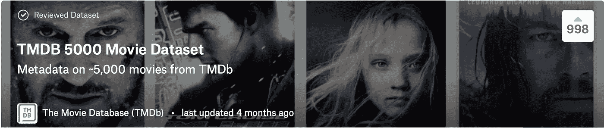
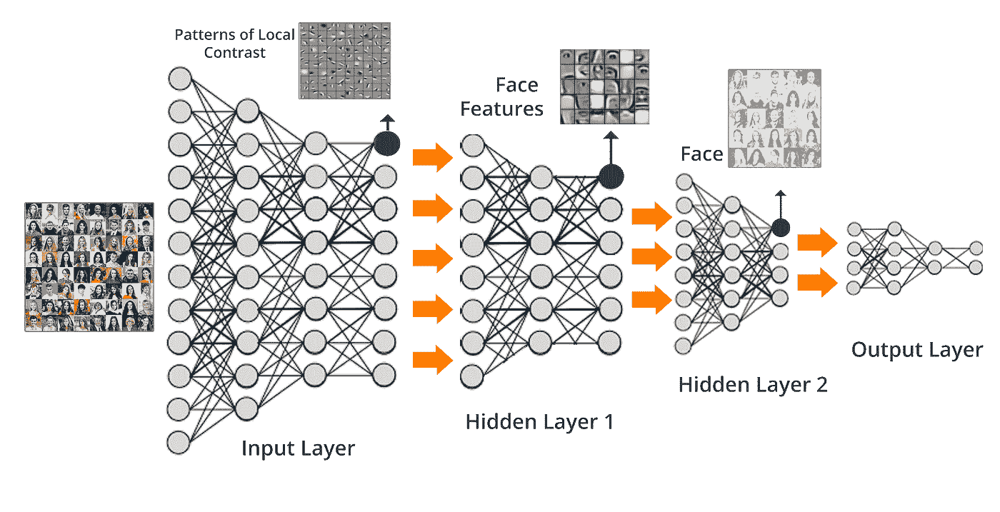
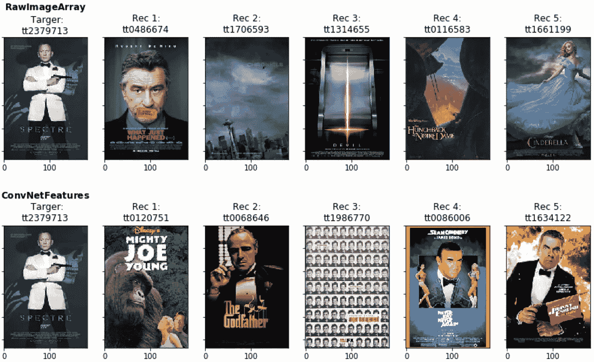
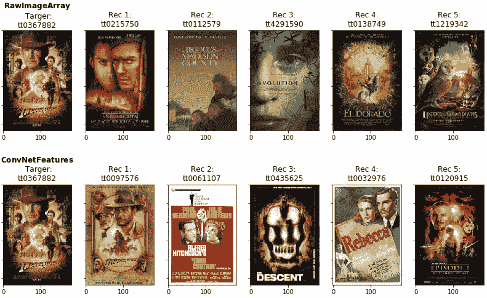
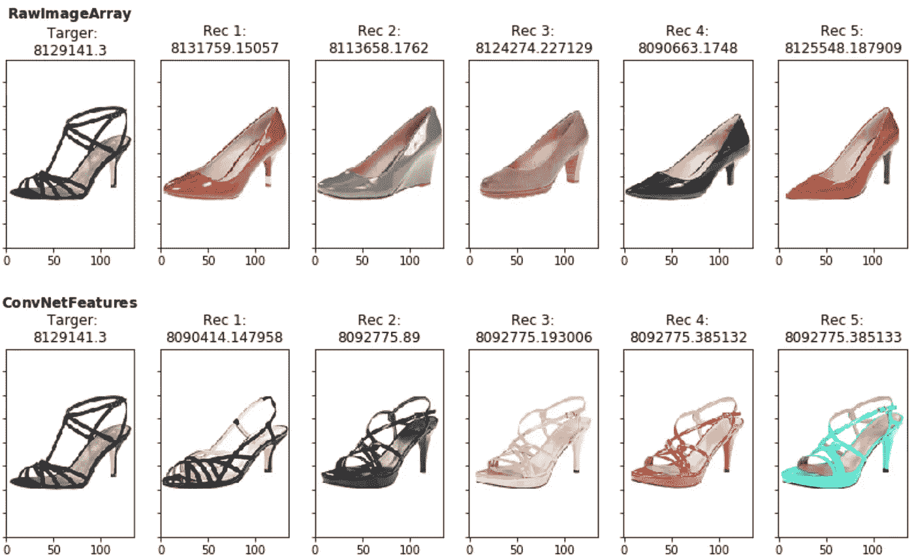
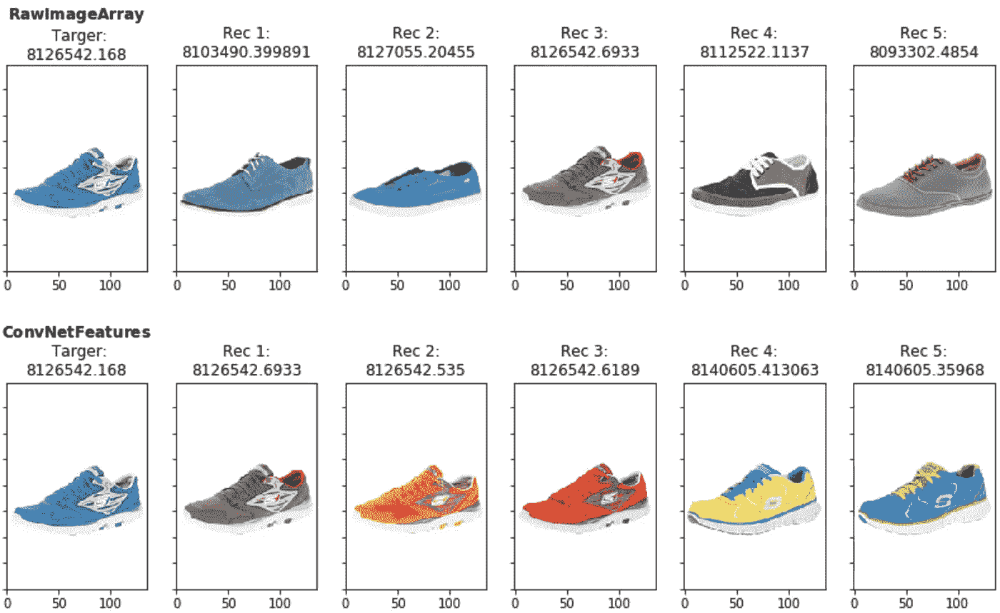

# 使用卷积神经网络创建电影推荐器

> 原文：<https://towardsdatascience.com/creating-a-movie-recommender-using-convolutional-neural-networks-be93e66464a7?source=collection_archive---------7----------------------->

在网飞上看完你最喜欢的电视剧或 YouTube 上的视频后，你必须做出一个重要的决定，接下来我该看什么？很多时候你都是从自己喜欢的视频点播平台的推荐系统得到一些帮助。这些平台花费大量的时间和精力(参见:[网飞推荐系统:算法、商业价值和创新](https://dl.acm.org/citation.cfm?id=2843948) & [用于 YouTube 推荐的深度神经网络](https://static.googleusercontent.com/media/research.google.com/de//pubs/archive/45530.pdf))让你的用户体验尽可能愉快，增加你在平台上的总观看时间。但是即使有这些帮助，你如何选择呢？我通常会选择最吸引我的视频缩略图/海报。考虑到这一点，我构建了一个电影推荐器，它只接受电影缩略图/海报作为输入。让我们看看那是什么样子。

## **主旨**

主要思想是创建电影海报图像数据集，并从在 [ImageNet](http://image-net.org/) 上训练的预训练[卷积神经网络](http://cs231n.github.io/convolutional-networks/) (ConvNet)中提取特征。我将使用提取的特征来推荐给定目标电影海报的 5 个最相似的电影海报。为了验证这种方法，我将使用鞋子图像数据集做同样的事情。

## **第一步:网络抓取电影海报**

首先我需要一些电影海报，我决定使用 Kaggle 上的 [TMDB 5000 电影数据集](https://www.kaggle.com/tmdb/tmdb-movie-metadata/data)。有了数据集中提供的信息，我使用 web scraping 通过 Python 库 [BeautifulSoup](https://www.crummy.com/software/BeautifulSoup/bs4/doc/) 从 IMDB 下载海报图像。我将海报 id 添加到每张图片的名称中，并将所有 4911 张成功下载的图片存储在一个文件夹中。



*Image from:* [https://www.kaggle.com/tmdb/tmdb-movie-metadata/data](https://www.kaggle.com/tmdb/tmdb-movie-metadata/data)

这就是完整的 [WebScraping.ipynb](https://github.com/kkmlcode/webscraping/blob/master/WebScraping.ipynb) 笔记本。

## 第二步:推荐人

我对基于海报图像的视觉方面寻找类似的电影海报感兴趣，因此我将使用 ConvNets。就视觉识别而言，ConvNets 目前是首选型号。对于我的推荐者，我不会从零开始训练一个 ConvNet。但是在 ImageNet 上使用预先训练好的模型。从而节省时间并具有开箱即用的最新模型。这就叫[“迁移学习”](http://cs231n.github.io/transfer-learning/)。推荐者我会用 Inception-v3 模型。选择这种型号的原因之一是与 VGG16 或 VGG19 型号相比，输出阵列相对较小。使得处理内存中的所有内容变得更加容易。我感兴趣的是模型学习的特征，而不是类别概率。识别形状、图案等的预学习层。希望能提出有意义的建议。出于这个原因，我删除了输出层，并将 ConvNet 的其余部分作为电影海报的特征提取器。请参见此处的示例，了解每个图层或节点基于面部图像数据集可以了解的内容。



*Image from:* [*https://cdn.edureka.co/blog/wp-content/uploads/2017/05/Deep-Neural-Network-What-is-Deep-Learning-Edureka.png*](https://cdn.edureka.co/blog/wp-content/uploads/2017/05/Deep-Neural-Network-What-is-Deep-Learning-Edureka.png)

对于推荐器的实现，我使用带有 TensorFlow 的 [Keras](https://keras.io/) 作为后端。对于数据集中的每个图像，我保存模型最后一个隐藏层的展平输出数组。有了这个新的特征数组，我可以根据数组之间的欧氏距离来计算目标图像/海报的 x 个最近邻。为了将结果与基线进行比较，我还将使用给定目标海报的原始展平图像数组显示 x 个最近邻。我不会分享我所有的代码，但会在这个博客中分享一些代码片段。

*选择模型特征图层:*

```
from keras.models import Model
from keras.applications.inception_v3 import InceptionV3
from keras.models import Modelselectedlayer = "..."
base_modelv3 = InceptionV3(weights='imagenet', include_top=False)
model= Model(inputs=base_modelv3.input,  outputs=base_modelv3.get_layer(selectedlayer).output)
```

*从图像中提取特征:*

```
from os import listdir
from keras.preprocessing.image import load_img
from keras.preprocessing.image import img_to_arraydef preprocess_input(x):
    x /= 255.
    x -= 0.5
    x *= 2.
    return xdef load_photos_predict(directory):
 images = []
 for name in listdir(directory):
  # load an image from file
  filename = directory + '/' + name
  image = load_img(filename, target_size=(299, 299))
  # convert the image pixels to a numpy array
  image = img_to_array(image)
  # reshape data for the model
  image = np.expand_dims(image, axis=0)
  # prepare the image for the  model
  image = preprocess_input(image)
  # get image id
  image_id = name.split('.')[0]
  feature = model.predict(image).ravel()
  images.append((image_id, image, feature))
 return images
```

*查找最近邻居:*

```
from sklearn.neighbors import NearestNeighbors
import pandas as pd
import numpynn_num = 6
X = list(results[“modelfeatures”])nbrs = NearestNeighbors(n_neighbors=nn_num, algorithm=’ball_tree’, metric=”euclidean”, n_jobs = -1).fit(X)
```

## **第三步:结果**

让我们来看看基于詹姆斯·邦德电影《幽灵》的推荐。我将展示基于原始展平图像阵列的 5 个推荐，以及基于 Inception-v3 模型的提取特征阵列的 5 个推荐。



Recommender based on raw image array vs ConvNet features for James Bond — Specter

尽管我没有定义明确的评估标准，也没有利用 A/B 测试来确定哪种推荐方法是最好的，但直觉上，模型结果似乎稍好一些。该模型甚至推荐了一部额外的邦德电影《永不说永不》作为它的第四个推荐。让我们再看一部电影，印第安纳琼斯和水晶头骨王国。



Recommender based on raw image array vs ConvNet features for Indiana Jones and the Kingdom of the Crystal Skull

该模型推荐印第安纳琼斯和最后的十字军东征作为其第一推荐，这看起来很好。其他的就不太合适了，但是 ConvNet 特性的表现似乎又比只使用原始图像数组作为输入要好。

*显示结果功能:*

```
import matplotlib.pyplot as pltdef udfsimular(indices, table):
 neighbours = []
 for i in range(len(indices)): 
 t = indices[i]
 idv = table[(table.index == t)].iloc[0][‘ID’]
 neighbours.append(idv)
 return neighboursdef udfidfpathh(ids,directory):
 paths = []
 for i in range(len(ids)): 
 t = ids[i]
 filename = wdir + directory + t + “.jpg”
 paths.append(filename)
 return pathsdef show5recommendations(name, table, NearestN,  idnr, directory, columnfeature):
    key = table[(table.ID == idnr)].iloc[0][columnfeature]
    distances, indices = NearestN.kneighbors(key)
    listindices = pd.DataFrame(indices).values.tolist()
    listindices2 = listindices[0]
    ids = udfsimular(listindices2, table)
    paths2 = udfidfpathh(ids,directory)
    fig, ((ax1, ax2, ax3, ax4, ax5, ax6)) = plt.subplots(nrows=1, ncols=6, sharex=True, sharey=True, figsize=(14,3))
    # Doing each of these manually (ugh)
    ax1.imshow(mpimg.imread(paths2[0]))
    ax1.set_title(r"$\bf{" + str(name) + "}$"+"\n Targer:\n"+ ids[0])
    ax1.set_yticklabels([])
    ax2.imshow(mpimg.imread(paths2[1]))
    ax2.set_title("Rec 1:\n"+ ids[1])
    ax3.imshow(mpimg.imread(paths2[2]))
    ax3.set_title("Rec 2:\n"+ ids[2])
    ax4.imshow(mpimg.imread(paths2[3]))
    ax4.set_title("Rec 3:\n"+ ids[3])
    ax5.imshow(mpimg.imread(paths2[4]))
    ax5.set_title("Rec 4:\n"+ ids[4])
    ax6.imshow(mpimg.imread(paths2[5]))
    ax6.set_title("Rec 5:\n"+ ids[5])
```

## **步骤 4:使用鞋子图像验证推荐器**

既然我们已经看到了它对电影海报的效果，让我们使用一个不同的数据集。像亚马逊、Zalando 和其他网上商店这样的网站使用类似的技术向你推荐产品。例如，你要找的商品缺货，他们想向你推荐类似的产品。所以让我们用鞋的图像。我使用的数据集是从 Zappos50K 的[收集的目录图像的](http://www.zappos.com/) [UT Zappos50K](http://vision.cs.utexas.edu/projects/finegrained/utzap50k/) 。我用了 1882 张鞋子图片。

因此，让我们在这个数据集上重复同样的方法，看看“黑色开口高跟鞋”的结果是什么:



Recommender based on raw image array vs ConvNet features for a black open high heel shoe

基于提取的特征，模型显然学会了区分鞋子的不同图案。而正常阵列的建议显然不知道什么是开鞋。运动鞋怎么样:



Recommender based on raw image array vs ConvNet features for a sneaker shoe

再次推荐。

**那么，为什么这些结果比电影海报的结果要好呢？**

Inception-v3 模型在 ImageNet 上进行训练，以区分 1000 个类预测。模型被训练的图像每个图像有一个对象/类。它接受训练的 1000 个班级中有一个甚至被称为“[跑鞋](http://imagenet.stanford.edu/synset?wnid=n04120489)”。预测每个图像的一个对象是模型被训练的目的，也应该是模型做得最好的。而电影海报在对象、文本等的数量上要复杂得多。因此，使用在不同图像数据集上训练的模型可以为电影海报产生更好的结果。

## **最后备注**

正如我们所看到的，仅使用电影海报结合预先训练的 ConvNets 来创建电影推荐器确实会产生一些不错的推荐。结果略好于仅使用原始图像阵列。对于鞋子，这种方法已经显示了一些非常好的建议。看到 ConvNets 的纯视觉识别功能已经可以做什么是很有趣的。根据推荐器创建的预期目的或行业，这似乎是一个很好的附加功能，可以添加到用于开发最先进的推荐系统的功能集中。