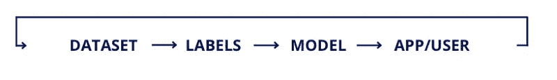
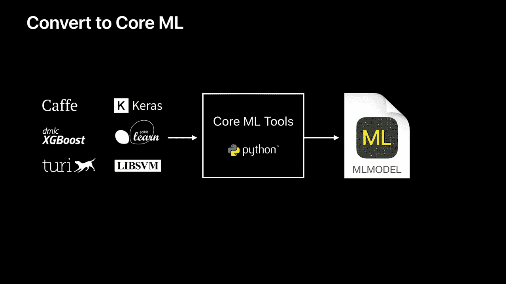
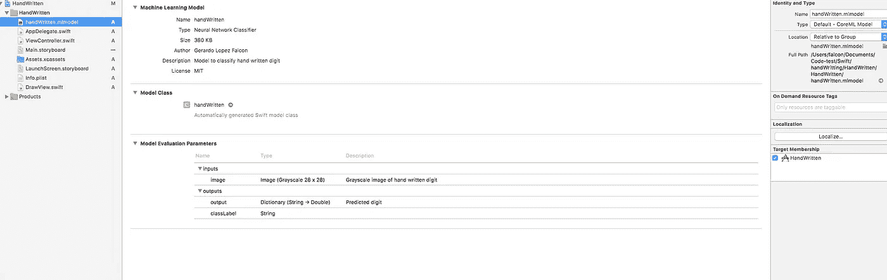
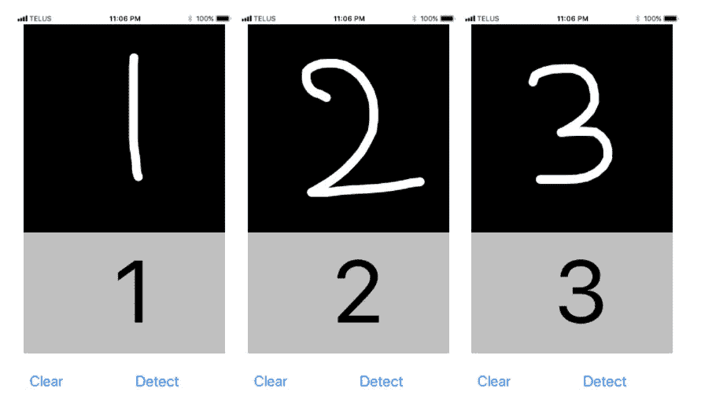
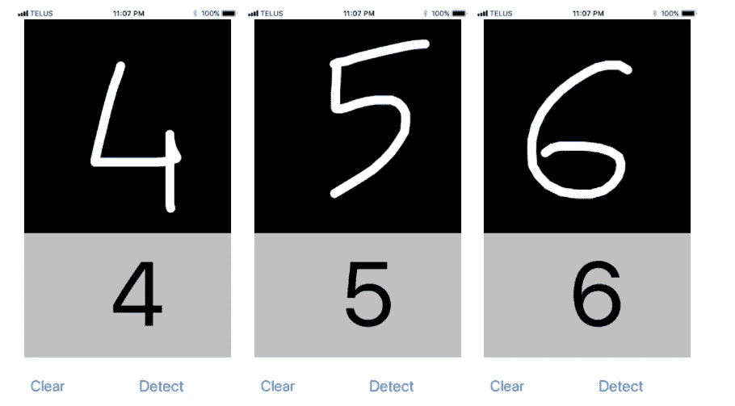

# 从头开始用 Core ML 创建一个 IOS 应用程序！

> 原文：<https://towardsdatascience.com/creating-an-ios-app-with-core-ml-from-scratch-b9e13e8af9cb?source=collection_archive---------1----------------------->

> 这个世界**需要选择和决断***——Re 创作者动漫。*

在机器学习中，一切都始于模型，即进行预测或识别的系统。教计算机学习涉及一种机器学习算法，该算法具有要学习的训练数据。训练产生的输出通常被称为机器学习模型。有不同类型的机器学习模型解决相同的问题(例如物体识别)，但使用不同的算法。[神经网络](https://en.wikipedia.org/wiki/Artificial_neural_network)、[树集成](https://en.wikipedia.org/wiki/Ensemble_learning)、[支持向量机](https://en.wikipedia.org/wiki/Support_vector_machine)就是这些机器学习算法中的一些。

# 机器学习就像一个迭代过程

首先，我们用公共模型进行实验，但是为了带来独特的市场价值和优势，我们希望我们的模型胜过其他模型。我们正在寻找的叫做 **ML 反馈回路**。Google 对 ML 特性的处理遵循以下模式:

*   获取初始化数据(一次)
*   — — — — —
*   标签数据
*   火车模型
*   试验模型
*   在生产中运行模型
*   获取新数据(并重复)

现在，对于一个移动应用程序，这个过程看起来像:



在上图中，移动应用程序似乎使用了 ML 创建的模型，但它是如何工作的呢？是的，这就是核心 ML 发挥作用的地方。

# CoreML 怎么用？

核心 ML 是苹果公司的新机器学习框架。它为苹果设备带来了机器学习模型，并使开发人员能够轻松利用 ML。我们可以使用苹果或 c 准备的十几个模型[转换来自流行的 ML 框架的开源模型](https://medium.com/towards-data-science/introduction-to-core-ml-conversion-tool-d1466bf10018)，如 [Keras](https://keras.io/) 、 [Caffe](http://caffe.berkeleyvision.org/) 或 [scikit-learn](http://scikit-learn.org/stable/) 。

使用 CoreML 创建 IOS 应用程序的工作流程如下:



1-你需要使用一些 ML 框架创建一个数据模型，比如 Caffe，turi，Keras 等等。

2-为了安装名为 Core ML Tools 的 Python 框架，它将数据模型转换为 Core ML 格式。转换的结果是一个扩展名为 ***mlmodel*** 的文件。

3-就是这样，你用核心 ML 工具创建的模型，在你的移动应用程序中使用它。

# 软件要求

为了训练模型，我们需要一个 ML 框架。最流行的是谷歌开发的 [Tensorflow](https://www.tensorflow.org/) 。它拥有来自社区、教程和大量开发者关注的最好支持。然而，当你更深入一点时，你可能会在 G [ithub issue page](https://github.com/tensorflow/tensorflow/issues) 或处理一些数学问题或未记录代码的堆栈溢出中结束。与 web 应用程序或移动开发相比，ML 仍然是一个小婴儿，作为开发人员，你需要依赖它。安排一些额外的时间迷失在神秘的 ML 中。从像 [Keras](https://keras.io/) 这样的高级库开始也更容易。你可以在文章末尾查看一些培训教程的链接。


Tensorflow and Keras are the most common ML libraries

# 五金器具

很多人说我们需要一个 GPU 来训练一个模型。对于需要高精度或一些网络架构调整的项目来说，这是事实。如果我们需要 10 个类别的图像分类器，那么我们可以利用迁移学习，在标准 CPU 上在 10 分钟内微调我们的模型。然而，对于真正的生产应用程序，我们通常需要 GPU 的性能。我们已经尝试了几家云提供商，亚马逊 AWS g 2.2x 大型实例是一个不错的选择

# 开始吧！！

至此，您已经知道了使用机器学习创建 IOS 应用程序所需的必备工具，让我们开始吧！

## 管道设置:

要使用核心 ML 工具，第一步是在 Mac 上安装 Python。首先，[下载 Anaconda](https://www.continuum.io/downloads) (选择 Python 2.7 版本)。Anaconda 是一种在 Mac 上运行 Python 的超级简单的方法，不会引起任何问题。一旦安装了 Anaconda，就进入终端并键入以下内容:

```
conda install python=2.7.13conda update python
```

下一步是创建一个虚拟环境。在虚拟环境中，你可以用不同版本的 Python 或者其中的包来编写程序。要创建新的虚拟环境，请键入以下代码行。

```
conda create --name handwriting
```

当终端提示您时，

```
proceed ([y]/n)?
```

键入“y”表示是。恭喜你。现在，您有了一个名为手写的虚拟环境！

要激活该环境，请使用:`source activate handwriting`

最后，键入以下命令来安装核心 ML 工具和 Kera 的依赖项:

```
conda install pandas matplotlib jupyter notebook scipy opencvpip install -U scikit-learn==0.15
pip install -U coremltools
pip install tensorflow==1.1
pip install keras==2.0.6
pip install h5py
```

## 设计和培训网络

在这篇文章中，正如你注意到的，我将使用 Kera，就像我们例子中的 ML 框架一样。

好了，你应该创建一个名为`train.py`的 python 文件。在`train.py`内插入以下代码:

*   首先让我们导入一些必要的库，并确保 TensorFlow 中的 keras 后端:

```
**import** numpy as np**import** keras**from** keras.datasets **import** mnist**from** keras.models **import** Sequential**from** keras.layers **import** Dense, Dropout, Flatten**from** keras.layers.convolutional **import** Conv2D, MaxPooling2D**from** keras.utils **import** np_utils# (Making sure) Set backend as tensorflow**from** keras **import** backend as KK.set_image_dim_ordering('tf')
```

*   现在让我们为训练和测试准备数据集。

```
# Define some variablesnum_rows **=** 28num_cols **=** 28num_channels **=** 1num_classes **=** 10# Import data(X_train, y_train), (X_test, y_test) **=** mnist.load_data()X_train **=** X_train.reshape(X_train.shape[0], num_rows, num_cols, num_channels).astype(np.float32) **/** 255X_test **=** X_test.reshape(X_test.shape[0], num_rows, num_cols, num_channels).astype(np.float32) **/** 255y_train **=** np_utils.to_categorical(y_train)y_test **=** np_utils.to_categorical(y_test)
```

*   设计培训模型。

```
# Modelmodel **=** Sequential()model.add(Conv2D(32, (5, 5), input_shape**=**(28, 28, 1), activation**=**'relu'))model.add(MaxPooling2D(pool_size**=**(2, 2)))model.add(Dropout(0.5))model.add(Conv2D(64, (3, 3), activation**=**'relu'))model.add(MaxPooling2D(pool_size**=**(2, 2)))model.add(Dropout(0.2))model.add(Conv2D(128, (1, 1), activation**=**'relu'))model.add(MaxPooling2D(pool_size**=**(2, 2)))model.add(Dropout(0.2))model.add(Flatten())model.add(Dense(128, activation**=**'relu'))model.add(Dense(num_classes, activation**=**'softmax'))model.compile(loss**=**'categorical_crossentropy', optimizer**=**'adam', metrics**=**['accuracy'])
```

*   训练模型。

```
# Trainingmodel.fit(X_train, y_train, validation_data**=**(X_test, y_test), epochs**=**10, batch_size**=**200, verbose**=**2)
```

*   通过移除缺失层为推理准备模型。

```
# Prepare model for inference**for** k **in** model.layers:**if** type(k) **is** keras.layers.Dropout:model.layers.remove(k)
```

*   最后保存模型。

```
model.save('handWritten.h5')
```

然后，转到您之前打开的终端，键入以下内容:

```
python train.py
```

它将创建一个名为 ***手写的数据模型。***

## Keras 到 CoreML

要将您的模型从 Keras 转换到 CoreML，我们需要做一些额外的步骤。我们的深度学习模型期望 28×28 归一化灰度图像，并给出类别预测的概率作为输出。此外，让我们添加更多的信息到我们的模型，如许可证，作者等。让我们创建一个名为`convert.py`的文件，并插入以下代码:

```
import coremltoolsoutput_labels = ['0', '1', '2', '3', '4', '5', '6', '7', '8', '9']scale = 1/255.coreml_model = coremltools.converters.keras.convert('./handWritten.h5',input_names='image',image_input_names='image',output_names='output',class_labels= output_labels,image_scale=scale)coreml_model.author = 'Gerardo Lopez Falcon'coreml_model.license = 'MIT'coreml_model.short_description = 'Model to classify hand written digit'coreml_model.input_description['image'] = 'Grayscale image of hand written digit'coreml_model.output_description['output'] = 'Predicted digit' coreml_model.save('handWritten.mlmodel')
```

回到终端，键入以下内容:`python convert.py`。它为我们创建了一个名为 handled . ml model 的文件(现在，我们可以在 IOS 应用程序中使用这个文件)。

## 将模型集成到 Xcode 中

现在我们到了最后一步，将刚刚转换的模型集成到 Xcode 项目中。打开 [starter 项目](https://github.com/gelopfalcon/handWritting)，根据您目前所学，我要求您将核心 ML 模型集成到应用程序中。

第一步是将`handWritten.mlmodel` 拖放到我们的 Xcode 项目中。确保选中了目标成员资格框。



现在，转到下面实例化 IBOutlet 的 ViewController，并从手写类型创建一个对象:

```
let model = handWritten()
```

之后，进入`let pixelBuffer = .....`插件下方的 tappedDetect 功能:

```
let output = try? model.prediction(image: pixelBuffer!)
```

我们刚刚定义了常数预测等于模型预测的数据。

仅此而已！构建并运行应用程序。这些是应用程序在 iPhone 7 上测试的结果。



# 结论

既然您已经知道了如何转换数据模型，那么您可能想知道在哪里可以找到数据模型。一个简单的谷歌搜索会给你大量的结果。您可以找到几乎任何类别的数据模型，例如不同类型的汽车、植物、动物，甚至还有一个模型可以告诉您最像哪个名人。这里有几个地方可以让你开始！

*   [咖啡馆模型动物园](https://github.com/BVLC/caffe/wiki/Model-Zoo)
*   [UCI 机器学习知识库](https://archive.ics.uci.edu/ml/datasets.html)
*   [深度学习数据集](http://deeplearning.net/datasets/)

如果您找不到支持您需求的模型，您可能想知道是否可以创建自己的数据模型。这是可以做到的，但很难做到。如果你觉得自己已经准备好迎接挑战，我建议你从 Scikit-Learn 或 TensorFlow 的主页开始。

谢谢分享，如果你能把这篇文章分享给其他人，我会很感激的。我希望你的掌声:D