# 用 MCMC 创建动画

> 原文：<https://towardsdatascience.com/creating-animations-with-mcmc-4458ab2b6cc3?source=collection_archive---------7----------------------->

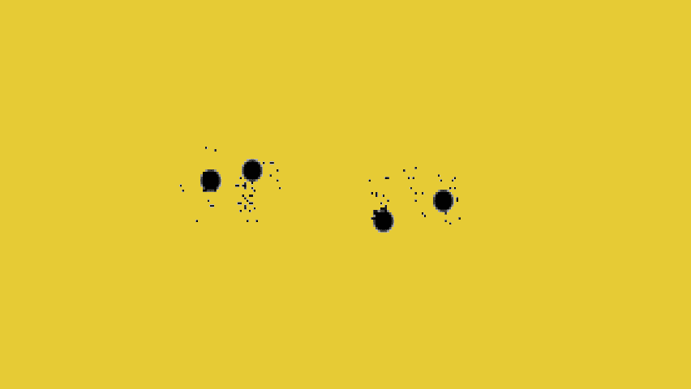

马尔可夫链蒙特卡罗(MCMC)是贝叶斯统计中一种广泛流行的技术。它用于后验分布抽样，因为分析形式通常是不可跟踪的。然而，在本帖中，我们将使用它从静态图像/徽标中生成动画。顺便说一句，这可能是对 MCMC 和拒绝采样的介绍。这个想法是基于一个伟大的开源包 [imcmc](https://github.com/ColCarroll/imcmc) ，它是建立在 [PyMC3](https://github.com/pymc-devs/pymc3) 之上的。

# 预赛

虽然 MCMC 适用于任何维度，但我们将集中讨论 2D 分布。为什么？好吧，看看下面的图表。

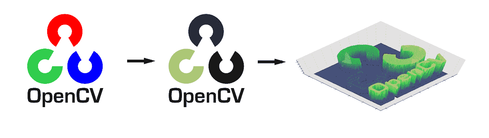

我们从一个 RGB 图像(最好是一个简单的标志)开始，将其转换为灰度，并根据强度为每个像素分配一个概率。在我们的例子中，像素越暗，概率越高。这导致了**离散 2D 分布**。

一旦我们有了这个分布，我们就可以从中抽取样本(像素)。一般来说，我们寻找以下两个属性:

1.  样本确实来自目标分布
2.  样品的连续及其可视化在美学上是令人愉悦的

虽然第二个属性总是在旁观者的眼中，但第一个属性可以通过使用适当的采样算法来实现。具体来说，让我们仔细看看 3 种非常适合当前问题的采样算法:拒绝、Gibbs 和 Metropolis-Hastings 采样。

# 拒绝抽样

第一种方法属于 IID ( **独立**同分布)抽样方法。这实质上意味着当前样本对下一个样本没有影响。该算法假设我们能够从所谓的建议分布中进行采样。可以使用许多不同的建议分布，但最常见的是均匀(有限支持)和正态(无限支持)分布。

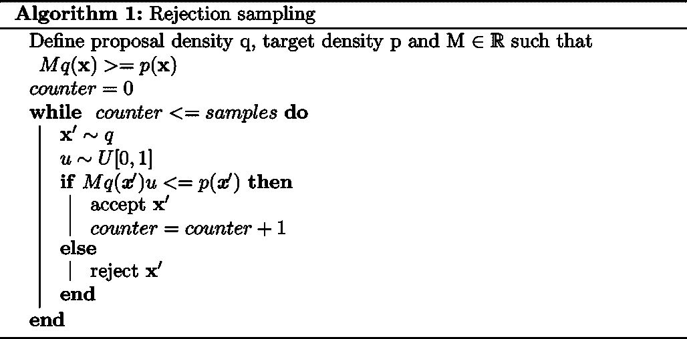

为了最大限度地降低拒绝样本的可能性，我们必须选择与我们的目标尽可能相似的建议分布。此外，我们希望比例常数 M 尽可能低。见下图(1D)方案。

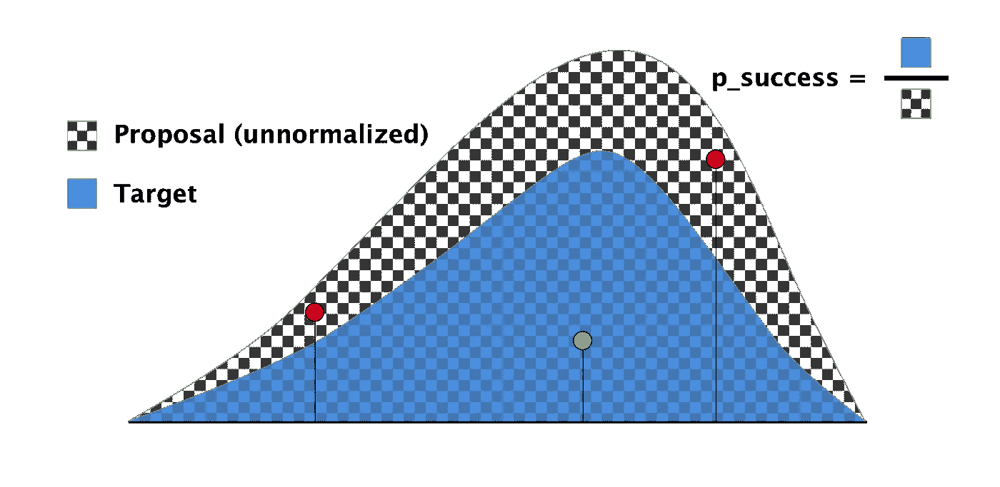

在我们的设置中，我们可以采用 2D 均匀分布作为建议。

在较低的维度中，拒绝采样表现得非常好。然而，随着维数的增加，它遭受了臭名昭著的**维数灾难**。幸运的是，2D 没有被诅咒，因此拒绝采样是一个很好的选择。

# 吉布斯采样

吉布斯采样属于第二类采样器，它们通过构建马尔可夫链来生成样本。因此，这些样本**不是独立的**。事实上，在链达到稳定分布之前，它们甚至不是同分布的。因此，通常的做法是丢弃前 x 个样本，以确保链“忘记”初始化(老化)。

算法本身假设我们能够沿着目标的每个维度从条件分布中抽取样本。每当我们从这些单变量分布中取样时，我们都以剩余成分的最新值为条件。

# 大都会-黑斯廷斯抽样

与 Gibbs 类似，Metropolis-Hastings 采样也创建了马尔可夫链。但是，它更一般(Gibbs 是特例)，更灵活。

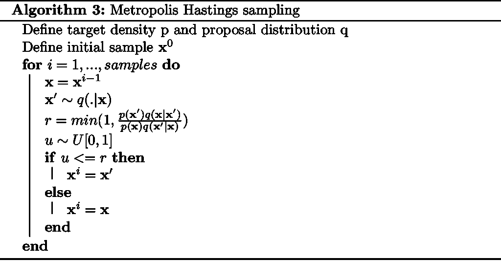

给定当前样本，建议分布为我们提供了一个新样本的建议。然后，我们通过检查它比当前样本的可能性大(小)多少来评估其合格性，并考虑建议分布对该样本的可能偏差。综合所有因素，我们计算接受新样本的概率，然后让随机性做出决定。

不言而喻，建议分配的作用是至关重要的，并将影响性能和收敛性。一个更常见的选择是使用当前状态中心的法线。

# 动画片

最后来看一些结果。对于每个徽标，运行 Rejection 和 Metropolis-Hastings(使用 PyMC3)并创建可视化(gif)。最重要的超参数:

*   老化样品:500 个
*   样品:10000 个

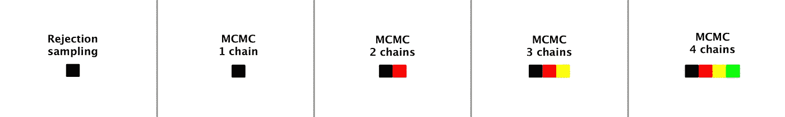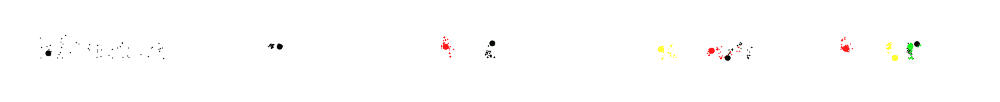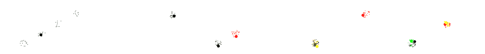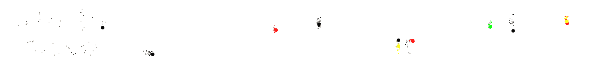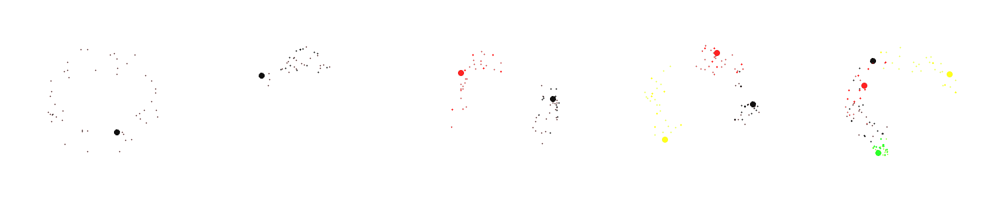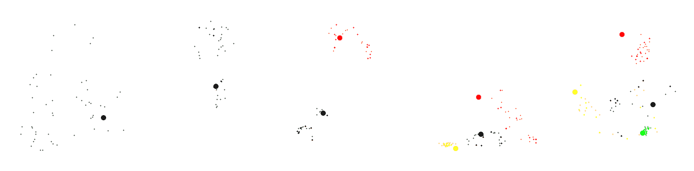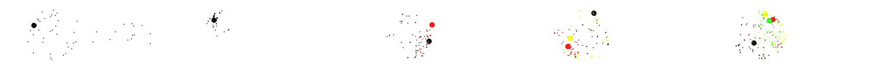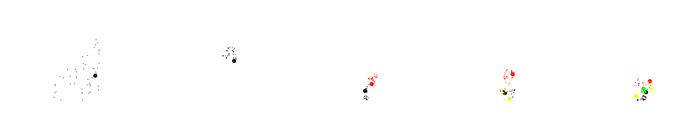

对于多模态分布，Metropolis-Hastings 可能会陷入某些区域。这是一个非常常见的问题，可以通过改变方案或增加/加长样品链来解决。自然，我们也可以冒险到野外使用一些其他的采样器。

如果你想更深入地挖掘并查看源代码，请查看本 [**笔记本**](https://github.com/jankrepl/creating-animations-with-MCMC/blob/master/main.ipynb) 。

# 参考

1.imcmc:[https://github.com/ColCarroll/imcmc](https://github.com/ColCarroll/imcmc](https://github.com/ColCarroll/imcmc)))
2。pymc 3:[https://github.com/pymc-devs/pymc3](https://github.com/pymc-devs/pymc3](https://github.com/pymc-devs/pymc3)))3。凯文·p·墨菲。2012.机器学习:概率观点。麻省理工学院出版社。

*原载于 2018 年 7 月 11 日*[*jank repl . github . io*](https://jankrepl.github.io/creating-animations-with-MCMC/)*。*