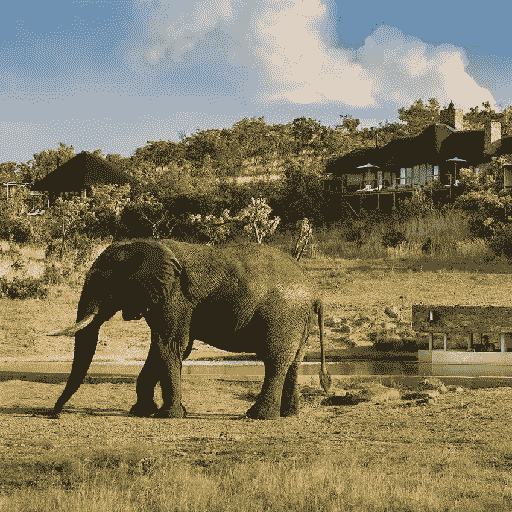
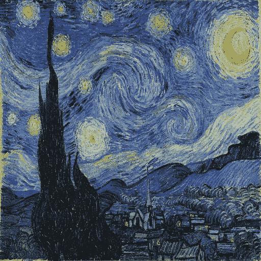
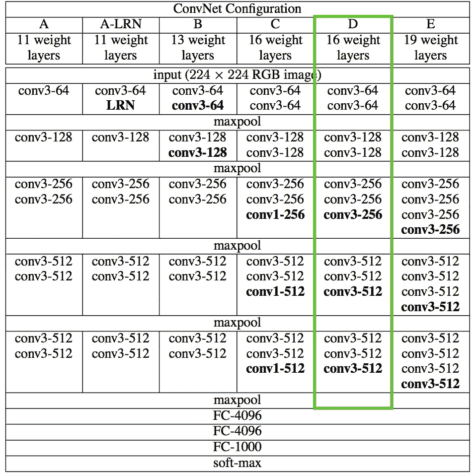
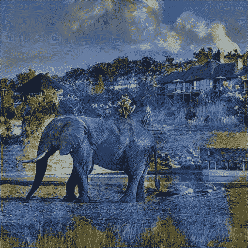

# 用 Conv 神经网络创作艺术

> 原文：<https://towardsdatascience.com/creating-art-with-conv-neural-nets-3ea5ebd7ef?source=collection_archive---------1----------------------->

在这篇文章中，我正在使用卷积神经网络来制作一些精美的艺术品！

迄今为止，艺术一直是最好留给创意者的想象作品。艺术家有一种独特的方式来表达自己和他们生活的时代，通过独特的镜头，具体到他们看待周围世界的方式。无论是达芬奇和他令人惊叹的作品，还是梵高和他扭曲的世界观，艺术总是激励着一代又一代的人。

技术总是激励艺术家去突破界限，探索已经完成的事情之外的可能性。第一部电影摄影机不是作为辅助艺术的技术而发明的，而仅仅是捕捉现实的工具。显然，艺术家们对它的看法不同，它催生了整个电影和动画产业。对于我们创造的每一项主要技术来说都是如此，艺术家们总能找到创造性地使用这一新颖工具的方法。

随着机器学习的最新进展，我们可以在几分钟内创作出令人难以置信的艺术作品，而这在大约一个世纪前可能需要专业艺术家数年才能完成。机器学习创造了一种可能性，即在让媒体与艺术家合作的同时，以至少 100 倍的速度制作艺术作品的原型。这里的美妙之处在于，这一新的技术进步浪潮将通过升级手边的工具来增强艺术的创作和观赏方式。

# 介绍

在这里，我将使用 python 来获取任何图像，并将其转换为我选择的任何艺术家的风格。谷歌在 2015 年发布了一款名为“深度梦想”的类似产品，互联网对它产生了强烈的热情。他们本质上训练了一个卷积神经网络，该网络对图像进行分类，然后使用一种优化技术来增强输入图像中的模式，而不是基于网络所学的自身权重。此后不久,“Deepart”网站出现了，它允许用户点击鼠标将任何图像转换成他们选择的绘画风格！

# 那么这是如何工作的呢？

为了理解这个被称为样式转换过程的“魔法”是如何工作的，我们将使用 TensorFlow 后端在 Keras 中编写我们自己的脚本。我将使用一个基础图像(我最喜欢的动物的照片)和一个风格参考图像。我的剧本将使用文森特·梵高的《星夜》作为参考，并将其应用于基础图像。这里，我们首先导入必要的依赖项:

```
**from** **__future__** **import** print_function

**import** **time**
**from** **PIL** **import** Image
**import** **numpy** **as** **np**

**from** **keras** **import** backend
**from** **keras.models** **import** Model
**from** **keras.applications.vgg16** **import** VGG16

**from** **scipy.optimize** **import** fmin_l_bfgs_b
**from** **scipy.misc** **import** imsave
```

所以我们将这些图像输入神经网络，首先将它们转换成所有神经网络的实际格式，张量。Keras backend Tensorflow 中的变量函数相当于 tf.variable。它的参数将是转换为数组的图像，然后我们对样式图像做同样的事情。然后，我们创建一个组合图像，通过使用占位符将它初始化为给定的宽度和高度，可以在以后存储我们的最终结果。

以下是内容图片:

```
height = 512
width = 512

content_image_path = 'images/elephant.jpg'
content_image = Image.open(content_image_path)
content_image = content_image.resize((height, width))
content_image
```



Content Image (Elephants are cool)

在这里，我加载了样式图像:

```
style_image_path = '/Users/vivek/Desktop/VanGogh.jpg'
style_image = Image.open (style_image_path)
style_image = style_image.resize((height, width))
style_image
```



Style Image (gotta pull out the classic)

接下来，我们转换这两个图像，使它们具有适合数字处理的形式。我们添加了另一个维度(除了高度、宽度和正常的 3 个维度之外),这样我们以后可以将两个图像的表示连接成一个公共的数据结构:

```
content_array = np.asarray(content_image, dtype='float32')
content_array = np.expand_dims(content_array, axis=0)
print(content_array.shape)

style_array = np.asarray(style_image, dtype='float32')
style_array = np.expand_dims(style_array, axis=0)
print(style_array.shape)
```

我们将继续使用 VGG 网络。Keras 已经很好地包装了这个模型，以便我们在前进的过程中可以轻松使用。VGG16 是一个 16 层卷积网，由牛津大学的视觉几何小组创建，在 2014 年赢得了 ImageNet 竞赛。这里的想法是，对于成千上万不同图像的图像分类，预先训练的 CNN 已经知道如何在容器图像中编码信息。我已经了解了每一层的特征，这些特征可以检测某些一般化的特征。这些是我们将用来执行风格转移的功能。我们不需要这个网络顶部的卷积块，因为它的全连接层和 softmax 函数通过挤压维度特征图和输出概率来帮助分类图像。我们不仅仅是对转移进行分类。这本质上是一种优化，我们有一些损失函数来衡量我们将试图最小化的误差值。在这种情况下，我们的损失函数可以分解为两部分:

1)内容损失我们将总损失初始化为零，并将这些中的每一个加到其上。首先是内容损失。图像总是有一个内容组件和一个样式组件。我们知道 CNN 学习的特征是按照越来越抽象的成分的顺序排列的。由于更高层的特征更抽象，比如检测人脸，我们可以把它们和内容联系起来。当我们通过网络运行我们的输出图像和我们的参考图像时，我们从我们选择的隐藏层获得两者的一组特征表示。然后我们测量它们之间的欧几里德距离来计算我们的损失。

2)风格损失这也是我们的网络的隐藏层输出的函数，但是稍微复杂一些。我们仍然通过网络传递两幅图像来观察它们的激活，但是我们没有直接比较原始激活的内容，而是增加了一个额外的步骤来测量激活之间的相关性。对于网络中给定层的两个活化图像，我们采用所谓的格拉姆矩阵。这将测量哪些功能倾向于一起激活。这基本上代表了不同特征在图像的不同部分同时出现的概率。一旦有了这些，我们就可以将这种风格损失定义为参考图像和输出图像之间的 gram 矩阵之间的欧几里德距离，并将总风格损失计算为我们选择的每一层的风格损失的加权和。

既然我们有了损失，我们需要定义输出图像相对于损失的梯度，然后使用这些梯度迭代地最小化损失。

我们现在需要对输入数据进行处理，以匹配在 [Simonyan 和 Zisserman (2015)](https://arxiv.org/abs/1409.1556) 介绍 VGG 网络模型的论文中所做的工作。

为此，我们需要执行两个转换:

1.  从每个像素中减去平均 RGB 值(之前在 [ImageNet 训练集](http://image-net.org/)上计算的，并且很容易从谷歌搜索中获得)。
2.  将多维数组的排序从 *RGB* 翻转到 *BGR* (文中使用的排序)。

```
content_array[:,:,:,0] -= 103.99
content_array[:, :, :, 1] -= 116.779
content_array[:, :, :, 2] -= 123.68
content_array = content_array[:, :, :, ::-1]

style_array[:, :, :, 0] -= 103.939
style_array[:, :, :, 1] -= 116.779
style_array[:, :, :, 2] -= 123.68
style_array = style_array[:, :, :, ::-1]
```

现在我们准备使用这些数组来定义 Keras 后端(TensorFlow 图)中的变量。我们还引入了一个占位符变量来存储*组合*图像，它保留了内容图像的内容，同时合并了样式图像的样式。

```
content_image = backend.variable(content_array)
style_image = backend.variable(style_array)
combination_image = backend.placeholder((1, height, width, 3))
```

现在，我们将所有这些图像数据连接成一个张量，用于处理 Kera 的 VGG16 模型。

```
input_tensor = backend.concatenate([content_image,
                                    style_image,
                                    combination_image], axis = 0)
```

如前所述，由于我们对分类问题不感兴趣，我们不需要完全连接的层或最终的 softmax 分类器。我们只需要下表中用绿色标记的模型部分。



对我们来说，访问这个截断的模型是微不足道的，因为 Keras 附带了一组预训练的模型，包括我们感兴趣的 VGG16 模型。注意，通过在下面的代码中设置`include_top=False`，我们不包括任何完全连接的层。

```
**import** **h5py**
model = VGG16(input_tensor=input_tensor, weights='imagenet',
              include_top=**False**)
```

从上表可以清楚地看出，我们正在使用的模型有很多层。Keras 对这些层有自己的名字。让我们把这些名字列一个表，这样我们以后可以很容易地引用各个层。

```
layers = dict([(layer.name, layer.output) **for** layer **in** model.layers])
layers
```

我们现在选择重量，可以这样做:

```
content_weight = 0.025
style_weight = 5.0
total_variation_weight = 1.0
```

我们现在将使用由我们的模型的特定层提供的特征空间来定义这三个损失函数。我们首先将总损耗初始化为 0，然后分阶段增加。

```
loss = backend.variable(0.)
```

现在内容丢失:

```
**def** content_loss(content, combination):
    **return** backend.sum(backend.square(combination - content))

layer_features = layers['block2_conv2']
content_image_features = layer_features[0, :, :, :]
combination_features = layer_features[2, :, :, :]

loss += content_weight * content_loss(content_image_features,
                                      combination_features)
```

和风格损失:

```
**def** gram_matrix(x):
    features = backend.batch_flatten(backend.permute_dimensions(x, (2, 0, 1)))
    gram = backend.dot(features, backend.transpose(features))
    **return** gram**def** style_loss(style, combination):
    S = gram_matrix(style)
    C = gram_matrix(combination)
    channels = 3
    size = height * width
    **return** backend.sum(backend.square(S - C)) / (4\. * (channels ** 2) * (size ** 2))

feature_layers = ['block1_conv2', 'block2_conv2',
                  'block3_conv3', 'block4_conv3',
                  'block5_conv3']
**for** layer_name **in** feature_layers:
    layer_features = layers[layer_name]
    style_features = layer_features[1, :, :, :]
    combination_features = layer_features[2, :, :, :]
    sl = style_loss(style_features, combination_features)
    loss += (style_weight / len(feature_layers)) * sl
```

最后是总变异损失:

```
**def** total_variation_loss(x):
    a = backend.square(x[:, :height-1, :width-1, :] - x[:, 1:, :width-1, :])
    b = backend.square(x[:, :height-1, :width-1, :] - x[:, :height-1, 1:, :])
    **return** backend.sum(backend.pow(a + b, 1.25))

loss += total_variation_weight * total_variation_loss(combination_image)
```

现在，我们继续定义解决优化问题所需的梯度:

```
grads = backend.gradients(loss, combination_image)
```

然后，我们引入一个赋值器类，它在一次运算中计算损失和梯度，同时通过两个独立的函数 loss 和 grads 检索它们。这样做是因为 scipy.optimize 需要单独的损失和梯度函数，但是单独计算它们是低效的。

```
outputs = [loss]
outputs += grads
f_outputs = backend.function([combination_image], outputs)

**def** eval_loss_and_grads(x):
    x = x.reshape((1, height, width, 3))
    outs = f_outputs([x])
    loss_value = outs[0]
    grad_values = outs[1].flatten().astype('float64')
    **return** loss_value, grad_values

**class** **Evaluator**(object):

    **def** __init__(self):
        self.loss_value = **None**
        self.grads_values = **None**

    **def** loss(self, x):
        **assert** self.loss_value **is** **None**
        loss_value, grad_values = eval_loss_and_grads(x)
        self.loss_value = loss_value
        self.grad_values = grad_values
        **return** self.loss_value

    **def** grads(self, x):
        **assert** self.loss_value **is** **not** **None**
        grad_values = np.copy(self.grad_values)
        self.loss_value = **None**
        self.grad_values = **None**
        **return** grad_values

evaluator = Evaluator()
```

现在我们终于准备好解决我们的优化问题。这个组合图像从(有效)像素的随机集合开始，我们使用 L-BFGS 算法(一种比标准梯度下降收敛快得多的拟牛顿算法)对其进行迭代改进。我们在 8 次迭代后停止，因为输出对我来说看起来很好，损失停止显著减少。

```
x = np.random.uniform(0, 255, (1, height, width, 3)) - 128.

iterations = 8

**for** i **in** range(iterations):
    print('Start of iteration', i)
    start_time = time.time()
    x, min_val, info = fmin_l_bfgs_b(evaluator.loss, x.flatten(),
                                     fprime=evaluator.grads, maxfun=20)
    print('Current loss value:', min_val)
    end_time = time.time()
    print('Iteration **%d** completed in **%d**s' % (i, end_time - start_time))
```

如果你像我一样在笔记本电脑上工作，那就去吃顿大餐吧，因为这需要一段时间。这是上一次迭代的输出！

```
x = x.reshape((height, width, 3))
x = x[:, :, ::-1]
x[:, :, 0] += 103.939
x[:, :, 1] += 116.779
x[:, :, 2] += 123.68
x = np.clip(x, 0, 255).astype('uint8')

Image.fromarray(x)
```



Merger!

整洁！我们可以通过改变两幅图像、它们的大小、我们的损失函数的权重等等来继续玩这个游戏。重要的是要记住，我的 MacBook air 仅运行了 8 次迭代就花了大约 4 个小时。这是一个非常 CPU 密集型的过程，因此在扩展时，这是一个相对昂贵的问题。

感谢阅读！