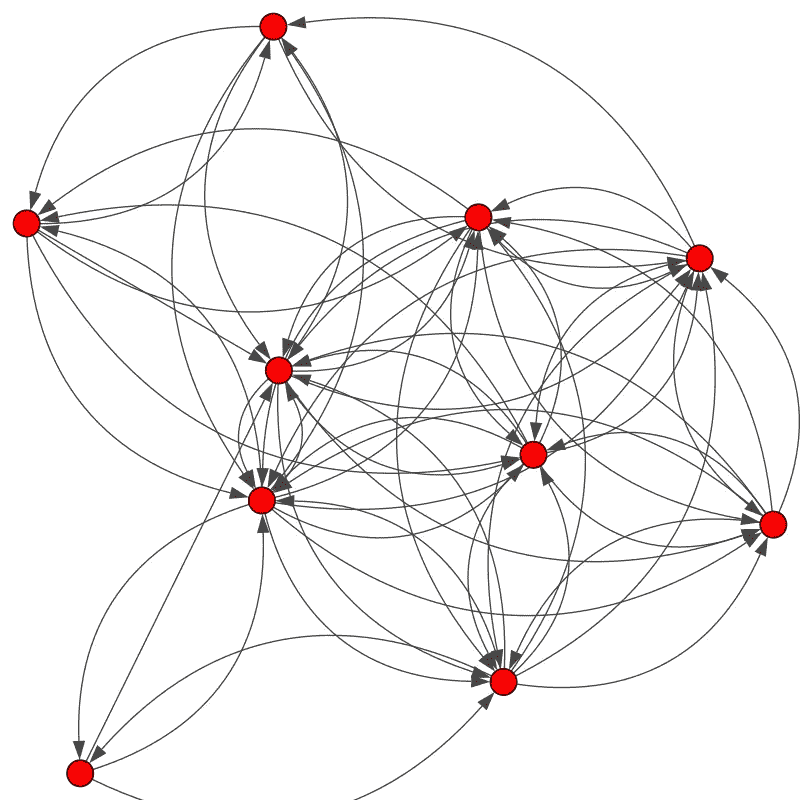
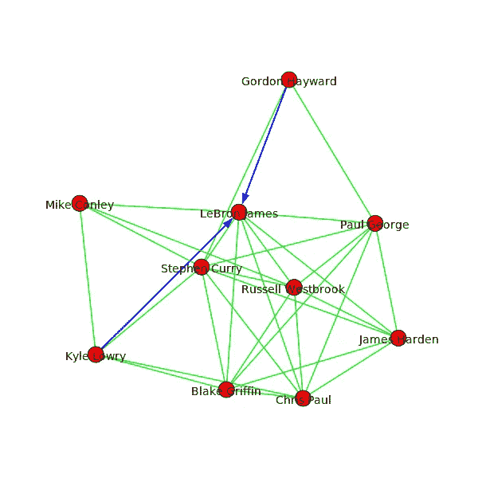
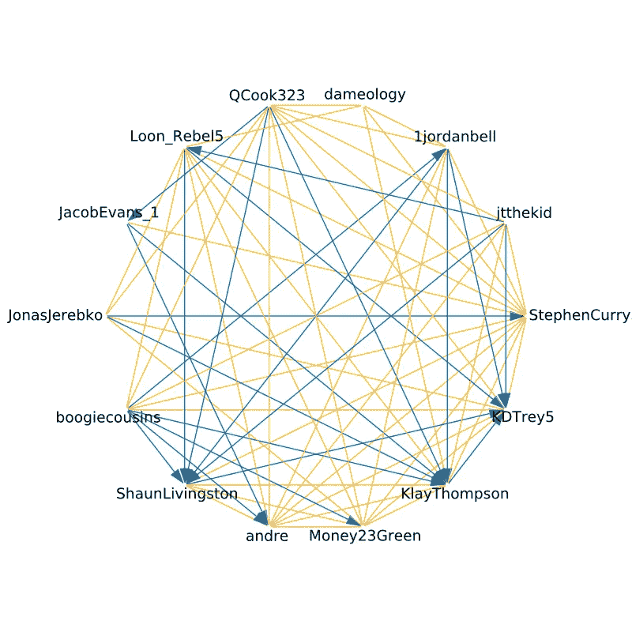

# 用 Python 创建漂亮的 Twitter 图表

> 原文：<https://towardsdatascience.com/creating-beautiful-twitter-graphs-with-python-c9b73bd6f887?source=collection_archive---------11----------------------->

想学两个有用的 Python 包？想在一张痛苦而可悲的图表中想象出所有没有在 Twitter 上关注你的人吗？请继续阅读。


Follows between players on all 30 NBA teams

编程意义上的图是顶点和边的集合，而不是条形图或散点图——但是你已经知道了。图表是强大的工具，有可能直观地交流复杂的关系。此外，他们可以很漂亮。为什么不看看我们能从推特上推断出什么关系呢？

# 数据收集

Twitter 已经有一个 Python API，python-twitter，所以我们不必自己发出 HTTP 请求和解析响应。为了使用它，我们必须通过 Twitter 创建一些应用程序凭证。我发现这是一个相当轻松的过程，所以我会简单地让你参考 [python-twitter 的优秀指南](https://python-twitter.readthedocs.io/en/latest/getting_started.html)来了解如何做到这一点。你只需要一个 Twitter 账户，不需要任何特权。

有了凭证，我们就可以创建 Twitter API 的一个实例并开始工作。

Add your tokens to get an api instance

我是一名 NBA 球迷，所以在这次演示中，我将在 Twitter 上绘制球员之间的联系。这是一个有趣的数据集，因为联盟有一个非常活跃的社交媒体存在，每个球员都很容易获得属性，如合同大小，球队和位置。你可以对任何你感兴趣的 Twitter 用户遵循同样的步骤，无论是名厨、音乐艺术家还是#QAnon 海报。

NBA 有 30 支球队，每支球队大约有 15 名球员。我并不热衷于手动查找 450 个 Twitter 句柄来将它们输入 API，尤其是如果我可以通过编程来完成的话。Basketball-reference.com 来救我了。下面我找到了 2018-19 赛季所有签约球员的表格。

[](https://www.basketball-reference.com/contracts/players.html#player-contracts::none) [## 2018-19 赛季 NBA 球员合同| Basketball-Reference.com

### 当前 NBA 球员合同概要

www.basketball-reference.com](https://www.basketball-reference.com/contracts/players.html#player-contracts::none) 

有了这个玩家名字的列表，我使用 API 来搜索相应的 Twitter-id，并将每个玩家的所有属性捆绑在一个顶点列表中，称为 ***V.*** 如果你已经有了一个屏幕名称或 Twitter-id 的列表，这可能是多余的，但如果你没有，下面是代码:

毕竟， **V** 将是一个列表列表，我将其作为一个. csv 文件转储，其中包含| TWITTER ID |用户名|昵称|团队列。

```
nba_verts.csv42562446,Stephen Curry,StephenCurry30, GSW
53853197,Chris Paul,CP3, HOU
23083404,LeBron James,KingJames, LAL
...
```

我知道我在寻找知名度高的运动员，所以我只在搜索中包括经过验证的用户，并假设搜索的第一个结果是正确的——事实证明并不总是如此。最后，我迭代了 **V** ，并使用 **GetFriendIDs()** API 调用来查找每个 Twitter-id 的*好友*。朋友是用户正在关注的人。如果朋友处于 **V** 状态，这是我用字典检查过的一个条件，我将这个边输出给另一个。csv 文件。

```
nba_edges.csv42562446,53643297
42562446,59297233
42562446,28066436
42562446,46704247
42562446,34430522
...
```

图是顶点和边的集合，现在我们两者都有了；我们准备好尽我们的职责了。

# 用 *igraph* 可视化

此时，你可以简单地将你的顶点和边列表加载到你最喜欢的图形绘制软件中(我的是 [cytoscape](https://cytoscape.org/) )。但那一点都不好玩。让我们看看在严格遵守 Python 的情况下我们能做些什么。

Python-igraph 是我选择的包。它有相当多的依赖项，安装起来可能不像它的 **R** 实现那样流畅，但是一旦你掌握了它的语法，它会得到很好的维护并且非常强大。我发现用 Python 2.7 安装是最容易的，在一个 [Jupyter](http://jupyter.org/install) 笔记本中使用也是最容易的。

让我们用我们的边和顶点做一个图。出于演示的目的，我将只包括前 10 名收入最高的球员。

```
from igraph import *#this info read in from our .csv files
E          = [("42562446","53643297"), ("42562446","59297233"),...]
V          = ["42562446", "53853197", "23083404",...]
user_names = ["Stephen Curry", "Chris Paul", "LeBron James",...]
scrn_names = ["StephenCurry30", "CP3", "KingJames",...]g = Graph(directed=True)
g.add_vertices(V)
g.add_edges(E)
plot(g)
```

那**剧情()**会产生这种美:



The graph, no styling

我的天啊。到底发生了什么事？什么顶点是什么 Twitter 用户？还有为什么这么多毛？

别担心，我们将应用一些样式来解决所有这些问题。

首先，让我们添加一些标签。然后，我们可以通过移除弯曲的边缘来拉直毛团，并添加一个边距来保护标签不会漂移到边界框之外。我们将把我们的样式决定保存在一个名为 **style** 的字典中，这样我们可以在以后重用它。

```
#add vertex attributes
g.vs["screen_name"] = scrn_names
g.vs["user_name"] = user_namesstyle = {}
style["edge_curved"] = False
style["margin"] = 100
style["vertex_label"] = g.vs["user_name"]
plot(g, **style)
```

我们使用**。vs** 图的成员，用于将属性与顶点相关联，每个顶点的属性值按照添加顶点的顺序进行映射。因为我们的**用户名**和 **scrn_name** 数组是与 **V、**并行的，所以这是一个非常简单的过程。


The graph with some more sane styling

这看起来还不错，但是我的 viz 目标之一是有效地交流什么是追随，什么是追随和追随回来。使用 *igraph* 很容易迭代边缘，检测这些情况，并相应地改变边缘样式。

```
for e in g.es:
    src, targ = e.tuple
    if g.are_connected(targ, src):
        e["color"] = "green"           #follow + followback
        e["arrow_size"] = 0                       
    else:
        e["color"] = "blue"            #follow
        e["arrow_size"] = 1
plot(g, **style)
```



Green for a mutual follow, blue for an unreturned follow

好了，伙计们，勒布朗已经离开了猛龙队的凯尔·洛瑞和凯尔特人队的戈登·海沃德。加油勒布朗！

在这里，您可以设置顶点的样式，使它们不会与标签发生太多冲突，调整标签与顶点的距离，尝试不同的布局(图表的结构)，等等。我建议把你的情节保存为。svg 文件，这样你就可以用像 [Inkscape](https://inkscape.org/) 这样的编辑器准确地排列你的标签或顶点。

本文开头显示的 30 支 NBA 球队的图形使用了圆形图形布局，颜色来自每支球队的官方调色板( *igraph* 支持十六进制代码着色)。这是我最喜欢的球队金州勇士队的特写:



Dubs on Twitter

这不仅赏心悦目，而且也让我们对玩家之间的关系有了一些了解。库里和格林看起来整体联系最紧密，跟在后面也很大方。汤普森、杜兰特和利文斯顿稍微有点冷漠，有更多未回归的追随者。德马库斯·考辛斯，一个新来的球员，已经努力跟随他的新队友了(…或者已经跟随他们了)。

你可以更进一步，利用 *igraph* 内置的大量图形算法来回答如下问题:

*   NBA 哪个球员最中锋？
*   谁有最好的跟随者-跟随者差异？
*   NBA 存在哪些派系？
*   哪个团队的(边缘)密度最高，哪个团队的密度最低？

我会在 GitHub 上偶尔重构和更新我的代码，但我所展示的要点已经在那里了，还有完整的 NBA 图表。

我焦急地等待着你从 Twitter 上创建的漂亮的图表！如果你能和我分享，我会很高兴的。

[](https://github.com/kublasean/nba-twitter-analysis) [## kublasean/NBA-Twitter-分析

### 在 Twitter-kublasean/NBA-Twitter-analysis 上制作球员-球员关系图

github.com](https://github.com/kublasean/nba-twitter-analysis)