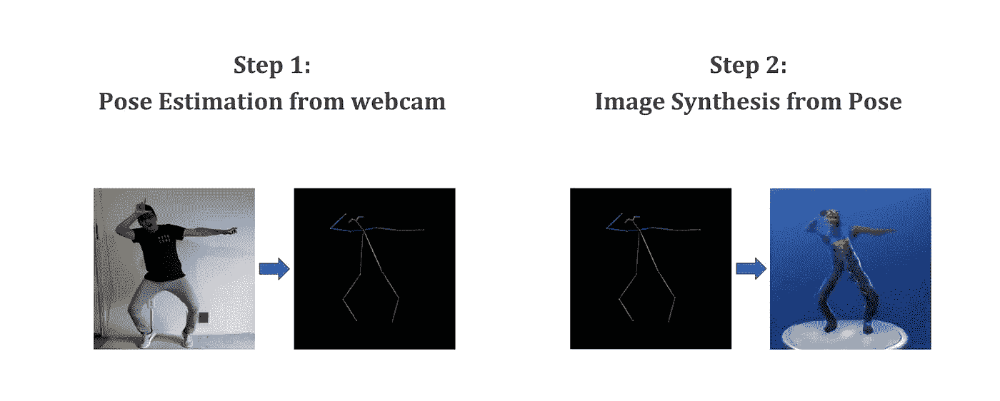
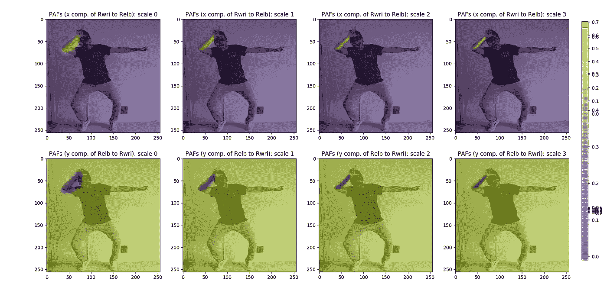
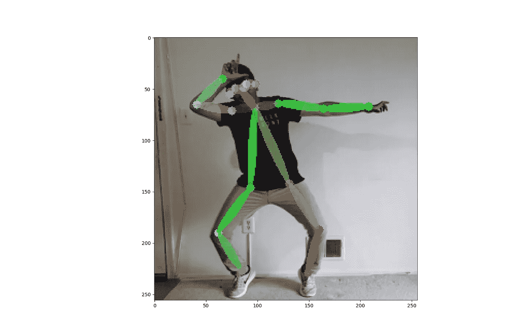
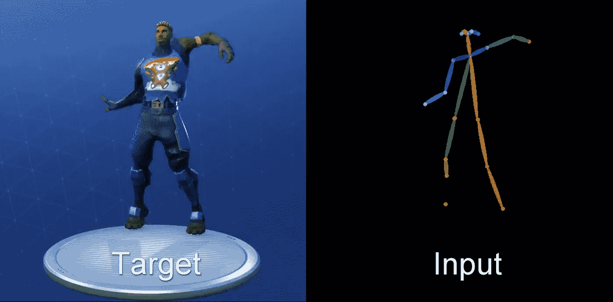
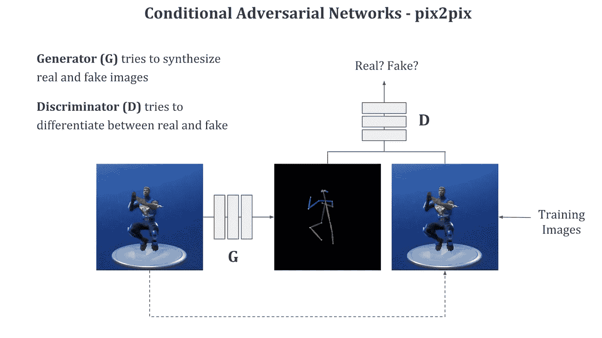
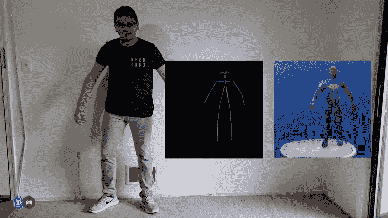

# 利用网络摄像头和深度学习创建定制的堡垒之夜舞蹈

> 原文：<https://towardsdatascience.com/creating-custom-fortnite-dances-with-webcam-and-deep-learning-9b1a236c1b59?source=collection_archive---------9----------------------->

## 使用姿势估计和条件敌对网络创建和可视化新堡垒之夜舞蹈。

Recreating a Fortnite character’s dance moves using poses from my webcam video.

如果你知道游戏[堡垒之夜](https://www.epicgames.com/fortnite/en-US/home)，你可能也知道围绕着游戏中的庆祝/表情/舞蹈的狂热。游戏玩家已经花费了数百万美元通过应用内购买来购买舞蹈动作，这使得一些简单而愚蠢的事情成为游戏开发者的一大收入来源。这让我想到，如果开发者允许用户在游戏中创作这些舞蹈并收取额外费用，他们可能会赚更多的钱。对于用户来说，如果我们可以在网络摄像头上记录自己，并在游戏中创造自己的庆祝舞蹈，那将会非常酷。

目前这样做需要一个类似微软 Kinect 的设备，它有专用的硬件来感知我们的身体运动。然而，并不是每个人都想为此购买单独的设备。我认为随着深度学习的进步，很快就有可能只用一个很好的旧网络摄像头来实现类似的功能。让我们看看如何在深度学习算法的帮助下，在未来实现这样的事情。

# 从网络摄像头到堡垒之夜

为了验证这一点，我在这个项目中使用了两种深度学习技术。首先，我们将使用姿势估计算法从我们的网络摄像头记录中提取简笔画表示(姿势)。对于一个游戏开发人员来说，这种姿势表示足以使游戏中的角色产生动画效果，但是因为我不是开发人员，所以我只能简单地想象使用这种姿势创建的堡垒之夜舞是什么样子。为此，我使用了名为 pix2pix 的条件对抗网络来生成给定姿势的角色。

Pipeline to go from webcam to Fortnite involves two steps: (1) getting pose from webcam image, followed by (2) synthesizing Fortnite character in that particular pose.

## 从网络摄像头进行姿态估计

为了估计输入图像姿态，我已经使用了来自论文 [***的算法，实时多人 2D 姿态估计使用部分亲和场***](http://The image shown here is the output of a net trained to detect the right arm of the body shown as the highlighted area in this heatmap.) **由*曹等人【CVPR 17】***。该算法使用多个尺度的卷积神经网络来识别身体的不同部分，如左臂、右臂、躯干等。这些检测到的部分代表单个节点。

This image shows the detection results of a Convolutional Neural Net trained to detect the right arm of a human body. The detection is shown by the hot region of this heatmap at multiple scales.

一旦检测到所有这样的身体部分，它就使用贪婪的解析算法来连接附近的节点，以形成一个连通图，给我们一个简笔画，这是姿势的表示。它实时运行，也可以与图像中出现的多人一起工作。

## 从姿态合成图像

一旦我们得到了这个姿势，我们想把它转换成堡垒之夜的角色。为此，我们将使用相同的姿态估计算法来生成我们的训练数据。我们用这个获得带标签的训练数据，其中姿势图是我们的输入，堡垒之夜角色是我们的目标标签。

Training data contains collection of paired images of the pose (input) and the targeted dance move (output).

然后，训练一个 [pix2pix 网络](https://arxiv.org/abs/1611.07004)将输入转换为输出。它使用一个生成的对抗网络来产生目标图像，条件是输入图像而不是随机噪声，因此我们可以实际生成堡垒之夜角色的图像，这些图像遵循作为输入给定的姿势。

在训练期间，输入图像和目标图像都可用于发生器和鉴别器网络。pix2pix 中的生成器网络显式地产生真实和虚假图像，以便鉴别器可以更快地学会区分这两者。

# 结果

发生器和鉴频器损耗收敛后，网络产生相当不错的结果。通过将堡垒之夜角色的每个身体部位与简笔画相关联，它已经学会很好地跟随输入姿势。不幸的是，产生的图像非常模糊，没有高层次的细节。如果你知道我可以如何改善 pix2pix 网络的结果，请在下面的评论区告诉我。

更多这样的结果可以在我的 [YouTube 频道](https://www.youtube.com/c/DeepGamingAI)和下面嵌入的视频中找到。如果你喜欢它，请随意[订阅](http://www.youtube.com/subscription_center?add_user=DeepGamingAI)到我的频道来关注我更多的作品。

用于姿态估计的代码可以在这里找到[，用于图像合成的代码可以在这里](https://github.com/anatolix/keras_Realtime_Multi-Person_Pose_Estimation)[找到](https://github.com/junyanz/pytorch-CycleGAN-and-pix2pix)。

感谢您的阅读！如果你喜欢这篇文章，请在[媒体](https://medium.com/@chintan.t93)、 [GitHub](https://github.com/ChintanTrivedi) 上关注我，或者订阅我的 [YouTube 频道](http://youtube.com/c/DeepGamingAI)。