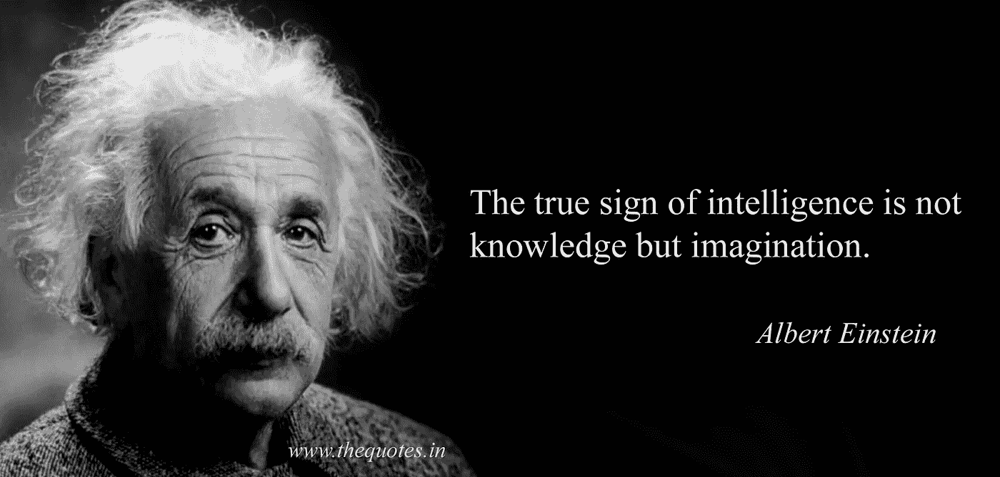
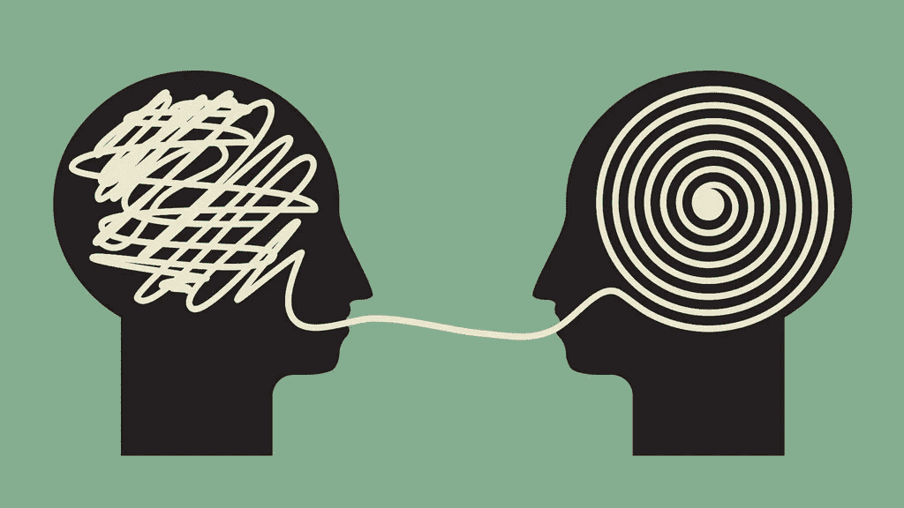
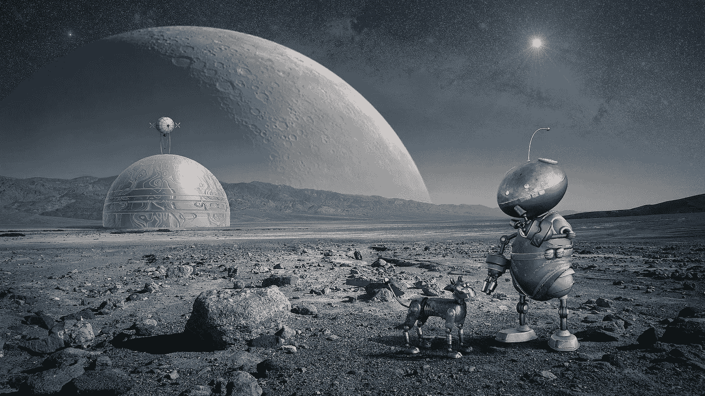

# 用数据科学创造智能

> 原文：<https://towardsdatascience.com/creating-intelligence-with-data-science-2fb9f697fc79?source=collection_archive---------9----------------------->

## 在这篇文章中，我将展示数据科学如何让我们通过人工智能创造智能。

# 什么是智能？

这个问题不容易回答。不久前我还在努力定义它是什么，但我在莱克斯·弗里德曼的课程中找到了一个我喜欢的简单短语。

所以让我们把智能定义为:

> 完成**复杂**目标的能力。

但是什么是复杂的呢？我们如何定义复杂的事物？如果你在互联网上查找，你会发现几个不同的定义，但我认为“主要的”一个接近我认为智力的定义是什么。

如果我们认为复杂的事物是由许多部分以难以理解的方式相互联系在一起的事物，那么我们可以说复杂的事物是事物或部分的混合，它们共同形成一个更大的事物，而这些部分的联系方式是不容易理解的。

例如，一辆汽车是一个复杂的东西，它有许多部件以一种不容易理解的方式协同工作。

但是！如果我们看一看，个别部分并不难理解。我并不是说它们很容易构建或者很容易看到它们到底在做什么，而是说更容易掌握它们在做什么。

所以我们现在可以说智能是:

> 通过理解构成主要目标的部分来完成困难目标的能力。

这些目标将在我们希望的背景下定义，但现在我们希望专注于人工智能(AI)领域。因此，当人工智能想要使用机器和计算来建立智能，试图模仿我们人类看、听、学习等方式时，这些目标将是**看、学习、** **听、移动、理解等。**

# 什么是理解？

我们将从 Lex 的课上学到的另一个重要概念是理解。到目前为止，我们已经多次使用这个词，所以让我们来定义它:

> 理解是将**复杂的**信息转化为**简单的**、**有用的**信息的能力。

我们需要这个，看到车的零件的时候就谈过了。当我们理解时，我们正在解码形成这个复杂事物的各个部分，并将我们一开始获得的原始数据转化为有用的、简单易懂的东西。

我们通过**建模**来做到这一点。这是理解“现实”，我们周围的世界，但创造一个更高层次的原型来描述我们所看到的，听到的和感觉到的东西的过程，但这是一个代表性的东西，而不是“实际”或“真实”的东西。

那么我们人类是如何创造智慧的呢？通过模拟我们周围的世界，了解它的组成部分，将我们得到的原始数据转化为有用和简单的信息，然后看看这些部分如何形成更复杂的东西，最终实现目标，“困难”的目标。

# 我们还要多久才能变得聪明？

这花了大约 380 万年的时间。我们希望这能在未来五年内实现:

即使我们用人工智能完成复杂的目标不会花那么长时间，也不会像我们想象的那么快。我们是一个正在成熟的领域，每天都在进步。但是 AI along 并不能解决所有的问题。

# 用 AI 创造智能我们需要什么？

我认为创造智慧的秘诀在高层次上并不难。这就是我提议我们需要做的事情:

## 大数据+ AI +数据科学=人工通用智能

我所说的人工通用智能(AGI)是这场革命的主要目标。AGI 是通用系统，其智能堪比人类思维(或者可能超越人类)。

我们需要大数据作为到达 AGI 的催化剂，因为有了更多的数据，加上分析数据的新方法，加上更好的软件和硬件，我们可以创建更好的模型和更好的理解。我们需要 AI 的当前状态，非常接近深度学习、深度强化学习及其周围环境(更多关于深度学习[这里](/a-weird-introduction-to-deep-learning-7828803693b0))，然后我们需要数据科学作为这场革命背后的控制器和科学。

# 什么是数据科学？

这个定义可能会引起一些人的争议，但我认为这非常接近领导者(理论上和业务上)现在所说的。所以，

> 数据科学是通过**数学**、**编程**和**科学方法**来解决业务/组织问题，其中涉及通过分析数据**和**生成预测模型**来创建**假设**、**实验**和**测试**。它负责**将**这些**问题转化为适定问题**，这些适定问题也能以**创造性的**方式对初始假设做出回应。还必须包括对所获结果的有效沟通，以及解决方案如何为企业/组织增加价值。**

有了这个定义，我们可以定义谁是数据科学家:

> 数据科学家是一个人(或者系统？)负责**分析业务/组织问题**并给出**结构化解决方案**首先由**将**该**问题**转化为**有效且完整的问题**，然后使用**编程**和**计算工具**开发**代码**使**准备**、**清理**和**分析**数据

**我在这里说的是，数据科学与业务密切相关，但它最终是一门科学，或者正在成为一门科学，或者可能不是。我认为数据科学是一门科学是非常有用的，因为如果是这样的话，数据科学中的每个项目至少应该:**

****-可复制
-可伪造
-协作
-创造性
-符合法规****

**你可以在亨利·庞加莱的著作《科学与方法》中了解更多为什么这很重要，请点击此处:**

** [## 科学与方法:庞加莱，亨利，1854-1912:免费下载

### 14 35

archive.org](https://archive.org/details/sciencemethod00poinuoft)** 

**本文的主要观点(未来可能会有更多相关内容)是向您展示这些是真正严肃的研究和开发领域，我们需要所有这些领域都进入 AGI，而数据科学对这一结局至关重要。**

**你可能会想，我们为什么需要 AGI？或者说为什么我们首先需要 AI？**

**我认为我们可以让世界变得更好，改善我们的生活，改善我们工作、思考和解决问题的方式，如果我们现在就调动我们所有的资源，让这些知识领域为更大的利益而共同努力，我们就可以对世界和我们的生活产生巨大的积极影响。**

## **我们需要更多感兴趣的人，更多的课程，更多的专业，更多的热情。我们需要你:)**

**如果您有任何问题，请在 LinkedIn 上添加我，我们将在那里聊天:**

** [## Favio Vázquez -数据科学家/工具经理 MX - BBVA 数据&分析| LinkedIn

### 查看 Favio Vázquez 在世界上最大的职业社区 LinkedIn 上的个人资料。Favio 有 13 个工作列在他们的…

www.linkedin.com](https://www.linkedin.com/in/faviovazquez)**