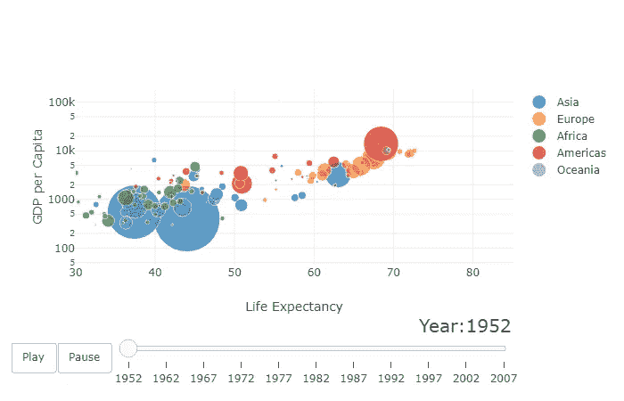
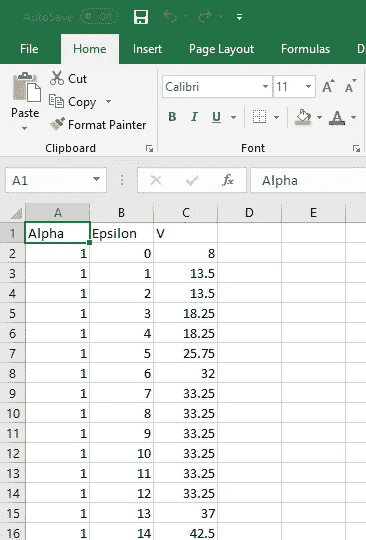
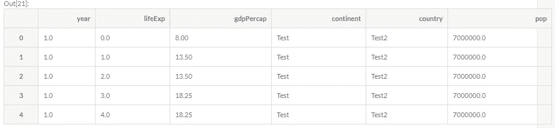

# 使用 Plot.ly 创建参数优化的交互式动画

> 原文：<https://towardsdatascience.com/creating-interactive-animation-for-parameter-optimisation-using-plot-ly-8136b2997db?source=collection_archive---------6----------------------->


# 介绍

这篇文章演示了如何在一个变化的参数上创建一个交互式的动画结果图。

为此，我们复制了此处示例中提供的显示一段时间内各国人均 GDP 的示例，如下所示([https://plot.ly/python/animations/](https://plot.ly/python/animations/))。

实现这一点的先决条件是 Python 和 plot . ly(【https://plot.ly/python/getting-started/】T2)

这绝不是最干净或最漂亮的方法，我只是简单地将我的数据放入示例中，除了更改一些轴标签之外，没有对示例中的代码进行任何重大更改。我已经创建了可视化的想法，参数优化，它并不总是为了出版，而是分析的探索阶段，所以必须尽可能快速和容易地创建。

如果你想在你的报告中使用视觉效果，我建议稍微编辑一下格式，但在其他方面，创建方法也可以类似地使用。

如有疑问，欢迎在下方随意评论。

# Gapminder 示例

我们将再次应用以下技术来创建交互式图表。首先，我们需要观察正在使用的数据。在此示例中，使用以下内容创建了散点图:

*   x 轴上的预期寿命
*   y 轴上的人均 GDP
*   国家的大小与人口有关
*   按洲着色
*   跨年度跟踪(动画和滑块)



Plot.ly Gapminder AnimationExample

# 应用我们的数据

为此，我将我的结果导出到一个特定格式的数据表中。如下所示，有三列，Alpha、Epsilon 和 V。Alpha 是我正在更改的参数，Epsilon 是模型运行的第 n 次，V 是我的输出。

因此，当我的参数在 1 和 0 之间减小时，我的表由每次运行的输出构成。下图显示了前几行。



现在，我们将把已有的数据“混合”到 plot.ly 示例中。因为我们的数据有些简单，所以我们首先否定示例中使用的一些特征。理论上，你可以整理代码来删除它们，但是这需要更多的时间，而且这种方法更简单。

因此，我们在数据中添加了两列，每行都有一个虚拟值‘Test1’和‘Test2’。然后，我们添加第三列来对应所使用的人口特征。如前所述，该值对应于点的大小，我选择了一个提供适当大小的点的值，但如果需要，您可以编辑它。

然后，我重命名所有的列，使其完全符合示例中的命名约定。

在[21]中:

```
ourData['continent'] = 'Test'
ourData['country'] = 'Test2'
ourData['pop'] = 7000000.0ourData.columns = ['year', 'lifeExp', 'gdpPercap', 'continent', 'country', 'pop']ourData.head()
```



下一步有点棘手，在示例中，他们使用以下代码手动输入每年的数据:

```
years = ['1952', '1962', '1967', '1972', '1977', '1982', '1987', '1992', '1997', '2002', '2007']
```

因此，我不必每次都手动输入，只需找到每个唯一的 Alpha 值，按降序进行舍入和排序，然后生成一个唯一 Alpha 值的数组。然后，我将变量名改为‘Years ’,以与后面的代码相对应。

在[24]中:

```
alpha = list(set(ourData['year']))
alpha = np.round(alpha,1)
alpha = np.sort(alpha)[::-1]
years = np.round([(alpha) for alpha in alpha],1)
years
```

Out[24]:

```
array([ 1\. ,  0.9,  0.8,  0.7,  0.6,  0.5,  0.4,  0.3,  0.2,  0.1])
```

最后，我们将我们的数据重命名为与示例代码相对应的数据，并运行整个过程，以生成我们的参数优化动画和交互图。

在布局部分，我添加了一个主标题，并重新措辞了一些轴标签，以符合我的要求，但在其他方面没有改变。

在[27]中:

```
dataset = ourDatacontinents = []
for continent in dataset['continent']:
    if continent not in continents:
        continents.append(continent)
# make figure
figure = {
    'data': [],
    'layout': {},
    'frames': []
}# fill in most of layout
figure['layout']['title'] = "Parameter Optimisation using Interactive Animation <br> PhilipOsborneData.com"
figure['layout']['xaxis'] = {'range': [1, 100], 'title': 'Epsilon'}
figure['layout']['yaxis'] = {'range': [1,50],'title': 'Sum of V', 'type': 'linear'}
figure['layout']['hovermode'] = 'closest'
figure['layout']['sliders'] = {
    'args': [
        'transition', {
            'duration': 400,
            'easing': 'cubic-in-out'
        }
    ],
    'initialValue': '1952',
    'plotlycommand': 'animate',
    'values': years,
    'visible': True
}
figure['layout']['updatemenus'] = [
    {
        'buttons': [
            {
                'args': [None, {'frame': {'duration': 500, 'redraw': False},
                         'fromcurrent': True, 'transition': {'duration': 300, 'easing': 'quadratic-in-out'}}],
                'label': 'Play',
                'method': 'animate'
            },
            {
                'args': [[None], {'frame': {'duration': 0, 'redraw': False}, 'mode': 'immediate',
                'transition': {'duration': 0}}],
                'label': 'Pause',
                'method': 'animate'
            }
        ],
        'direction': 'left',
        'pad': {'r': 10, 't': 87},
        'showactive': False,
        'type': 'buttons',
        'x': 0.1,
        'xanchor': 'right',
        'y': 0,
        'yanchor': 'top'
    }
]sliders_dict = {
    'active': 0,
    'yanchor': 'top',
    'xanchor': 'left',
    'currentvalue': {
        'font': {'size': 20},
        'prefix': 'Alpha: ',
        'visible': True,
        'xanchor': 'right'
    },
    'transition': {'duration': 300, 'easing': 'cubic-in-out'},
    'pad': {'b': 10, 't': 50},
    'len': 0.9,
    'x': 0.1,
    'y': 0,
    'steps': []
}# make data
year = 1.0
for continent in continents:
    dataset_by_year = dataset[np.round(dataset['year'],1) == np.round(year,1)]
    dataset_by_year_and_cont = dataset_by_year[dataset_by_year['continent'] == continent] data_dict = {
        'x': list(dataset_by_year_and_cont['lifeExp']),
        'y': list(dataset_by_year_and_cont['gdpPercap']),
        'mode': 'markers',
        'text': list(dataset_by_year_and_cont['country']),
        'marker': {
            'sizemode': 'area',
            'sizeref': 200000,
            'size': list(dataset_by_year_and_cont['pop'])
        },
        'name': continent
    }
    figure['data'].append(data_dict)# make frames
for year in years:
    frame = {'data': [], 'name': str(year)}
    for continent in continents:
        dataset_by_year = dataset[np.round(dataset['year'],1) == np.round(year,1)]
        dataset_by_year_and_cont = dataset_by_year[dataset_by_year['continent'] == continent] data_dict = {
            'x': list(dataset_by_year_and_cont['lifeExp']),
            'y': list(dataset_by_year_and_cont['gdpPercap']),
            'mode': 'markers',
            'text': list(dataset_by_year_and_cont['country']),
            'marker': {
                'sizemode': 'area',
                'sizeref': 200000,
                'size': list(dataset_by_year_and_cont['pop'])
            },
            'name': continent
        }
        frame['data'].append(data_dict) figure['frames'].append(frame)
    slider_step = {'args': [
        [year],
        {'frame': {'duration': 300, 'redraw': False},
         'mode': 'immediate',
       'transition': {'duration': 300}}
     ],
     'label': year,
     'method': 'animate'}
    sliders_dict['steps'].append(slider_step) figure['layout']['sliders'] = [sliders_dict]iplot(figure)
```

输出显示在本文开头的动画中。

谢谢

哲学（philosophy 的缩写）