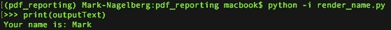
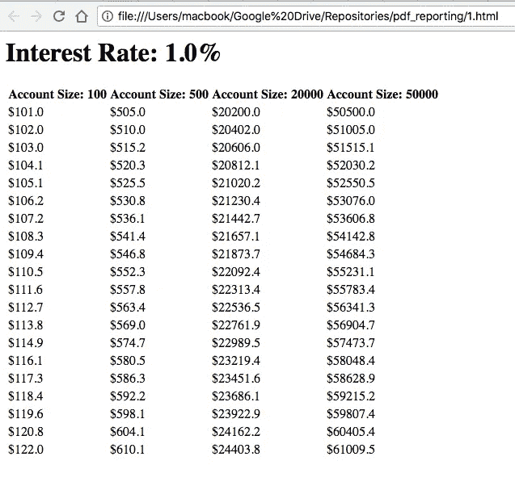
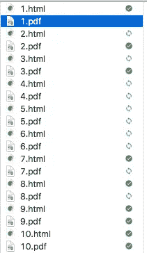
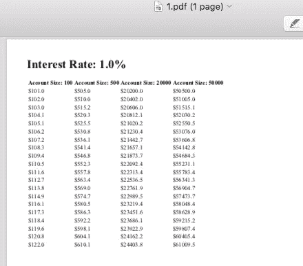

# 使用 Python、Pdfkit 和 Jinja2 模板创建 PDF 报告

> 原文：<https://towardsdatascience.com/creating-pdf-reports-with-python-pdfkit-and-jinja2-templates-64a89158fa2d?source=collection_archive---------3----------------------->


作为一名数据科学家，有时您可能需要创建 PDF 格式的分析报告。如今，这似乎有点“老派”，但在以下几种情况下，你可能会考虑这样做:

*   **你需要制作易于打印的报告**。人们通常想要他们正在运行的特定报告的“硬拷贝”,而不想在交互式仪表板中再现他们所做的一切。
*   **您需要匹配现有的报告格式**:如果您要更换传统的报告系统，首先尝试匹配现有的报告方法通常是个不错的主意。这意味着如果遗留系统使用 PDF 报告，那么您应该强烈考虑在替换系统中创建该功能。这对于获得对旧系统感到满意的人的认同通常很重要。

我最近需要在工作任务中做 PDF 报告。我想到的特定解决方案使用了两个主要工具:Jinja2 和 Pdfkit。

我们将使用以下命令安装所需的软件包:

```
pip install pdfkit 
pip install Jinja2
```

请注意，您还需要安装一个名为 [wkhtmltopdf](https://wkhtmltopdf.org/) 的工具，pdfkit 才能工作。

# Jinja2 模板入门

Jinja2 是一个很好的熟悉的工具，特别是如果你用 Python 做 web 开发的话。简而言之，它允许您通过编程填充分配给文本文件模板的占位符值来自动生成文本文档。这是一个非常灵活的工具，广泛用于 Python web 应用程序中为用户生成 HTML。你可以把它想象成超级高能的字符串替换。

我们将使用 Jinja2 来生成报告的 HTML 文件，我们将使用其他工具将这些文件转换成 pdf。请记住，Jinja2 可以方便地用于其他报告应用程序，比如发送自动电子邮件或创建其他文本文件格式的报告。

使用 Jinja2 有两个主要部分:

*   创建包含占位符值的文本文件 Jinja2 模板。在这些模板中，您可以使用各种 Jinja2 语法特性，这些特性允许您调整文件的外观以及它加载占位符数据的方式。
*   编写 python 代码，将占位符值分配给 Jinja2 模板，并根据这些值呈现新的文本字符串。

让我们创建一个简单的模板作为示例。这个模板只是一个文本文件，它打印出一个名字的值。你所要做的就是创建一个文本文件(姑且称之为 name.txt)。然后在这个文件中，简单地添加一行:

```
Your name is: {{ name }}
```

在这里，“name”是我们将传递到模板中的 python 变量的名称，它保存了我们希望包含在模板中的字符串占位符。

现在我们已经创建了模板，我们需要编写 python 代码，用您需要的内容填充模板中的占位符值。您可以使用渲染函数来完成此操作。比方说，我们想要创建一个模板版本，其名称为“Mark”。然后编写以下代码:

现在，outputText 保存一个模板字符串，其中{{ name }}现在等于“Mark”。您可以通过在命令行上编写以下内容来确认这一点:



template.render()的参数是模板中包含的占位符变量，以及您要将它们赋给什么:

```
template.render(placeholder_variable_in_template1=value_you_want_it_assigned1, placeholder_variable_in_template2=value_you_want_it_assigned2, ..., placeholder_variable_in_templateN=value_you_want_it_assignedN)
```

使用 Jinja2 模板，您可以做更多的事情。例如，我们在这里只展示了如何呈现一个简单的变量，但是 Jinja2 允许更复杂的表达式，比如 For 循环、if-else 语句和模板继承。关于 Jinja2 模板的另一个有用的事实是，您可以传入任意 python 对象，如列表、字典或 pandas 数据框，并且您可以直接在模板中使用这些对象。查看 Jinja2 [模板设计器文档](http://jinja.pocoo.org/docs/2.10/templates/)以获得完整的特性列表。我也强烈推荐《T2》这本书:用 Python 开发 Web 应用，这本书包含了关于 Jinja2 模板(这是 [Flask web 开发框架](http://flask.pocoo.org/)的内置模板引擎)的优秀指南。

# 创建 PDF 报告

假设您想要打印显示银行账户增长的 pdf 表格。每个表格都显示了 100 美元、500 美元、20，000 美元和 50，000 美元的年增长率。每个单独的 pdf 报告使用不同的利率来计算增长率。我们需要 10 份不同的报告，每份报告分别打印利率为 1%、2%、3%、10%的表格。

让我们首先定义我们需要的熊猫数据框架。

data_frames 包含 10 个字典，每个字典都包含数据帧和用于产生该数据帧的利率。

接下来，我们创建模板文件。我们将为上述 10 个数据框中的每一个生成一个报告，并通过将每个数据框连同所使用的利率一起传递给模板来生成它们。

创建这个模板后，我们编写下面的代码来为我们的报告生成 10 个 HTML 文件。

我们的 HTML 报告现在看起来像这样:



最后一步，我们需要将这些 HTML 文件转换成 pdf。为此，我们使用 pdfkit。您所要做的就是遍历 HTML 文件，然后使用 pdfkit 中的一行代码将每个文件转换成 pdf。

所有这些代码组合起来将弹出以下 PDF 版本的 HTML 文件:



然后你可以点击 1.pdf，看到我们得到了我们想要的结果。



我们已经给出了一个非常简单的例子，说明如何使用 python 以自动化的方式创建报告。通过更多的工作，您可以开发更加复杂的报表，只受 HTML 的限制。

*原载于 2018 年 9 月 16 日*[*【www.marknagelberg.com】*](http://www.marknagelberg.com/creating-pdf-reports-with-python-pdfkit-and-jinja2-templates/)*。要访问我共享的 Anki deck 和 Roam Research notes 知识库，以及关于间隔重复和提高学习效率的技巧和想法的定期更新，* [*加入“下载马克的大脑”。*](http://downloadmarksbrain.marknagelberg.com/auth)