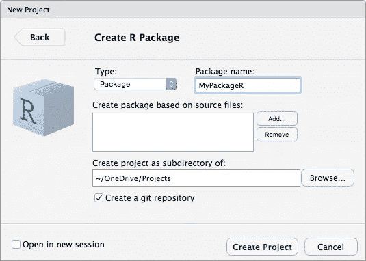
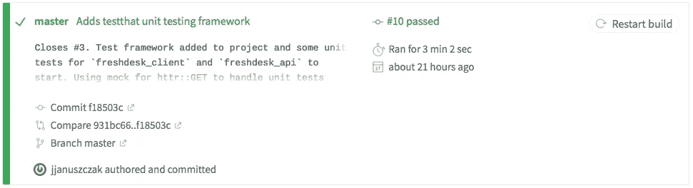
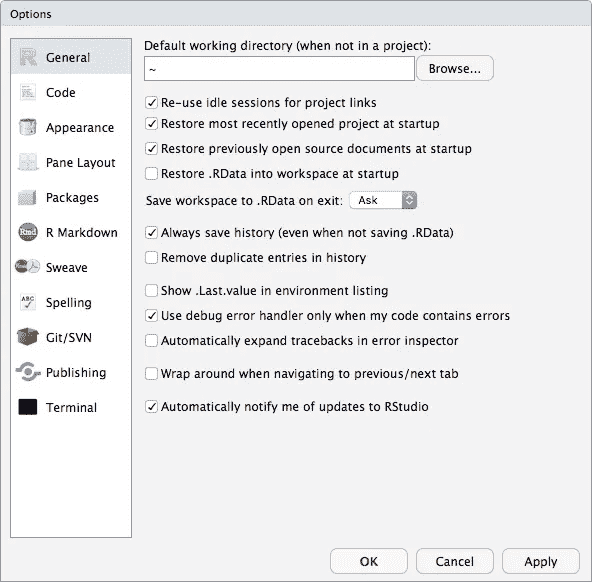

# 创建 R 包:你需要知道什么

> 原文：<https://towardsdatascience.com/creating-r-packages-what-you-need-to-know-2a20233b328a?source=collection_archive---------6----------------------->

创作 R 包的主要经验和印象。本文还包含了一些链接，指向您需要阅读的书籍和文章，以便开始您自己的 R 包。


[Pixabay.com](https://pixabay.com/photos/work-typing-computer-notebook-731198/)

我和 R 的旅程是从 2012 年左右开始的。我在我们的共享服务中心组建了一个团队来提供分析服务。这是一个小团队，在很多方面我们都在开拓新的领域。我们的数据科学家采用 R 有几个原因，包括价格、软件包支持的范围和社区的规模。事实上，我们的团队帮助建立了[菲律宾用户组](https://www.meetup.com/R-Users-Group-Philippines/)，自 2013 年第一次会议以来，该用户组已经有了很大的发展。

我们最终应用 R 做了很多很酷的事情，比如时间序列预测(对于共享服务组织中的劳动力优化非常有用)、线索生成和预测建模。我们原型化地将 R 模型公开为 web 服务，供各种客户端使用。总的来说，我们考虑了 R 如何适应生产工作流程和服务。我们还**做了很多**数据“基础设施”工作:数据摄取、数据&元数据建模、数据仓库、数据质量以及其他被称为*数据工程*的事情。正如[其他人注意到的](https://www.forbes.com/sites/gilpress/2016/03/23/data-preparation-most-time-consuming-least-enjoyable-data-science-task-survey-says/#7f52bfe16f63)，这种东西真的超过了分析价值链中 80%的工作。对我个人来说，我实际上把大部分时间花在了管理任务上:招聘和发展团队，销售团队服务，与公司领导层和我的同事一起制定战略，以展示分析的价值，并在组织中发展能力。然而，我总是试图接近设计和实现的细节，包括我们用 r 做的事情。

我们在 R 中所做的大部分工作都是针对我们公司和内部使用的应用程序的。我们写了很多 R 代码:主要是供我们的数据科学家交互使用的脚本，或者由其他脚本/程序调用的脚本。我知道我们可能会从开发 R 包中受益，以更好地形式化、管理和促进重用，即使是内部使用。然而，在我们开始探索这个选项之前，我已经转移到了另一个角色。

嗯，迟做总比不做好。几周前，我决定最终构建我的第一个 R 包。这是一个关于我为什么、做什么以及如何做这件事的故事。简而言之，我学到了很多，我想趁记忆犹新的时候，分享一下我一路上的发现。我也形成了一些早期的印象，也将分享其中的一些想法。

# **动机**

我的动机有两个:在 R 社区层面上就代码重用进行合作，并在这个过程中自学。Airbnb 工程和数据科学团队( [AirbnbEng](https://medium.com/u/ebe93072cafd?source=post_page-----2a20233b328a--------------------------------) )解释了他们为什么要构建 R 包:

> 我们构建包来开发针对常见问题的协作解决方案，标准化我们工作的视觉呈现，并避免重新发明轮子。

来源:[在 Airbnb 使用 R 包和教育来扩展数据科学](https://medium.com/airbnb-engineering/using-r-packages-and-education-to-scale-data-science-at-airbnb-906faa58e12d)

说得好。就我而言，我一直在探索客户支持和案例管理工具。在这一领域，一个备受关注的网络应用(或软件即服务——SaaS——工具)是 [Freshdesk](https://freshdesk.com) 。将数据从流行的网络应用程序中取出，放入 R 中进行分析，这无疑是一个“常见问题”。当我搜索 R 包来从 Freshdesk 提取数据时，我没有立即找到任何包。这似乎是一个开发 R 包的好机会，我可以与社区中的其他人分享。

不是所有的 R 包都需要与应用程序编程接口(API)交互，但我的需要，因为这是 Freshdesk 让第三方程序访问自己的方式。以下是一些让我思考如何继续我的项目的文章和博客帖子。如果您计划创建一个以任何方式包装 API 的 R 包，这些都是很好的入门读物:

*   [快速编写并部署一个 R API 客户端](https://medium.com/@alexandraj777/quickly-write-and-deploy-an-r-api-client-41fa07e6d60)
*   [【如何】在 10 分钟内构建一个 API 包装器包](https://colinfay.me/build-api-wrapper-package-r/)
*   [API 包的最佳实践](https://cran.r-project.org/web/packages/httr/vignettes/api-packages.html)

# 我学到了什么

我们通过实践学得最好。我确实从自己的 R 包中学到了很多。其中一些是大画面的东西，而我认为一些是较小的，微妙的细节。后者往往是最引人注目的:魔鬼，成功和失败的区别，不可避免地在于细节。

以下是我写第一个包时最突出的部分。有些经验教训很笼统，有些则更微妙、更具体。他们都留下了深刻的印象。

## 阅读哈德利·韦翰的 R 包

我不认为我可以夸大每一个有抱负的软件包开发者阅读这本书的重要性。哈德利是 R 社区公认的专家之一。我认为他的书 [R Packages](http://r-pkgs.had.co.nz) 是*在软件包开发方面的*权威:


R Packages by Hadley Wickham: the authority on creating R packages

我无法告诉你我陷入了多少次，只是意识到我试图做的事情在这本书里有所涉及。尽管我从头到尾读了一遍，但在整个开发过程中，我还是不断地回头去看它。如果你想开发一个 R 包，没有借口不读这本书:它是[免费的](http://r-pkgs.had.co.nz)！读这本书。然后再读一遍。

## 阅读 API 文档

如果你正在构建一个依赖于 API 的包(像我一样)，从头到尾阅读应用的 API 文档。如果你不熟悉基于 web 的 API，请先阅读 Zapier 的[API 介绍](https://zapier.com/learn/apis/)(它也是免费的！).

所有 web 应用程序通常都会在某个地方提供对其 API 的引用。Freshdesk 提供了一个 [API 引用](https://developers.freshdesk.com/api/)。 [Github](https://developer.github.com/v3/) 、 [Airbnb](https://www.airbnb.com/partner) 、 [Salesforce](https://developer.salesforce.com/page/Salesforce_APIs) 、 [twitter](https://developer.twitter.com/en/docs) 也是如此。基本上都是。如果您的 R 包要与它们交互，熟悉这些文档是有好处的。

## 依靠你的工具

很久以前，在我从事 Windows 编程的日子里，我学到了这一课:您的集成开发环境(IDE)将提供许多功能来改进您的工作流、检查您的代码质量，并为您节省大量时间。特别是对于 R 和包开发，您的 IDE 是 RStudio。使用它。

将帮助你开发 R 包的 R 包是 devtools。安装这个包，并按照 Wickham 的 [R 包](http://r-pkgs.had.co.nz)中的描述使用它。但是你已经知道了，因为你已经像我建议的那样阅读了 [R 包](http://r-pkgs.had.co.nz)！

最后，您必须使用版本控制。早在 2000 年，Joel Spolsky(Stack Overflow 和 Fog Creek 软件的联合创始人)定义了 *Joel Test* 来衡量开发团队的成熟度。Joel 测试的第一个问题是:*你使用源代码控制吗？今天，这意味着 Git。如果你的项目像我一样是公共的，就用 Github(否则就用某种现代版本控制系统)。有很多关于使用 Git 和 Github 的好资源——我不会在这里重复这些内容。您真正需要做的是[创建一个 Github 帐户](https://github.com/join)，[安装 git](https://git-scm.com/book/en/v2/Getting-Started-Installing-Git) ，并在 RStudio 中选择**文件|新项目…|新目录| R 包**，并确保您点击了**创建 git 库**复选框。*



Creating a new git repository when creating a new package in R

您可能已经猜到了，在 Wickham 的 [R 包](http://r-pkgs.had.co.nz/git.html)中介绍了如何将 git 和 Github 与 RStudio 一起使用。

## 使用持续集成

猜猜乔尔测验的第二个问题是什么:你能一步到位吗？今天，这将被称为*持续集成*。在构建您的包时使用持续集成。具体用[特拉维斯 CI](https://travis-ci.org) 。

如果你在 Github 上公开主持你的项目，Travis CI 是免费的。开箱即用，Travis CI 会在您每次将更改推送到 Github 时自动构建并检查您的包。我无法告诉你每次对 Github 进行修改时自动执行构建有多令人满意。它迫使你在推进到 GitHub 之前检查你的构建，并花时间调查和清理可能引起警告的小东西。



Travis CI automatically builds and checks your package

Travis CI 的基本设置包含在 [R 包](http://r-pkgs.had.co.nz)中。你也可以看看[茱莉亚·西尔格](https://medium.com/u/37e7cd45ea49?source=post_page-----2a20233b328a--------------------------------)的优秀作品[的《Travis-CI 入门指南》。](https://juliasilge.com/blog/beginners-guide-to-travis/)

## 学习如何处理日期和时间

不可避免地，你需要处理 r 中的日期和时间，学习如何处理日期和时间以及*日期运算*。R 中的日期和时间让我想起了我必须在中学习相同内容的时候。净年前。日期和时间处理起来很麻烦，会引起问题，而且经常被简单地篡改。追根究底。这里有一个[好资源](https://www.stat.berkeley.edu/~s133/dates.html)可以开始使用。不要敷衍了事，读一读吧！ [Kan Nishida](https://medium.com/u/1bfa80768afa?source=post_page-----2a20233b328a--------------------------------) 最近在他的 [5 个在 R](https://blog.exploratory.io/5-most-practically-useful-operations-when-working-with-date-and-time-in-r-9f9eb8a17465) 中处理日期和时间时最实用的操作中涉及了相同的领域，我也推荐你看一下。

## 创建文档而不共享私有数据

当您依靠 RStudio 这样的工具时，可以使用 Rmarkdown 动态地创建文档，如项目的自述文件和简介。事实上，你应该避免编辑简单的降价。md 文件)。

当您使用 API 时，您不希望在文档中明确地进行身份验证，因为您会泄露像 API 密钥这样的私有信息。为了解决这个问题，[将您的凭证存储在本地 R 环境变量中](https://daattali.gitbooks.io/stat545-ubc-github-io/bit003_api-key-env-var.html)。通过这种方式，您可以使用 Rmarkdown 从环境变量中获取 API 键，而无需在源 Rmarkdown 文档*中显示实际的键，并且如果您喜欢*，也无需在呈现的普通 markdown 文件中显示从环境变量中检索键的代码:

```
```{r credentials, echo=FALSE}
my_domain <- Sys.getenv("FRESHDESK_DOMAIN")
my_api_key <- Sys.getenv("FRESHDESK_API_KEY")
```
```

然后，您可以在最终呈现的内容中显示代码和输出:

```
```{r example, warning=FALSE}
library(freshdeskr)# create a client
fc <- freshdesk_client(my_domain, my_api_key)# gets tickets 
ticket_data <- tickets(fc)
...
```

## 使用测试框架

当我开始开发这个包时，在每一次`devtools::load_all()`，检查，或者安装和重启之后(你会在 [R 包](http://r-pkgs.had.co.nz)中了解到所有这些)，我会发现自己运行同样的代码来测试包中的功能。您希望将这种代码放入单元测试中，这样您就可以从一个命令中运行它，并将其作为持续集成过程的一部分。这样，每当您将新的更新推送到 Github 上的项目存储库时，您的测试就会自动运行。

Devtools 通过为您的项目设置 **testthat** 包使这变得容易，所以依靠您的工具并使用它吧！我遇到的一个问题是，我正在包装一个 web 应用程序的 API。我不想在测试中暴露我的 API 键(因为这些代码在 Github 上是公开的)。我不能像生成文档那样使用环境变量，因为当测试在持续集成服务器上运行时，这是行不通的。对于这种情况，你需要使用*模拟*。测试和使用测试包包含在 Wickham 的 [R 包](http://r-pkgs.had.co.nz/tests.html)中，使用模拟包**不包含在**中。Mango Solutions 有一篇很好的文章:[使用模拟函数在没有互联网的情况下进行测试](https://www.mango-solutions.com/blog/testing-without-the-internet-using-mock-functions)向您展示了如何做到这一点。

在我的例子中，我需要模拟出在我的包的函数中发出的 http GET 请求。需要做一些设置工作，但是当您检查您的项目时，看到所有的单元测试自动运行是令人满意的！所以自动化你的测试。自动化一切。

## 名称冲突

当我开始从事我的项目时，我在包之外创建了一些函数，在将它们包含到包中之前，我可以先试用一下。当我在我的包中创建相同的函数时，我以名称冲突结束，因为全局环境在搜索路径中位于我的包之前(使用`search()`查看名称的搜索路径)。重启 RStudio 并没有解决问题。我最终关闭了 RStudio，并手动删除了项目的`.Rdata`文件以清除名称。

我现在明白了，还有其他更好的方法，例如:从控制台使用`rm()`或者取消选中 Restore。在重新启动 RStudio 之前，在 RStudio 菜单中的**工具|全局选项…** 下的启动选项中进入工作区。



Uncheck Restore .RData into workspace at startup to remove variables from Global Environment

大图:花些时间理解 R 中的[环境的概念。](http://adv-r.had.co.nz/Environments.html)

# 其他印象

整个练习给人留下了很多其他的印象。有三个很突出。一个是有点技术性的:依赖注入的处理。另外两个更一般:使用 Github 和如果有多个合作者，如何支持敏捷方法。

## 依赖注入

我在技术和设计方面遇到的一个问题是处理[依赖注入](https://en.wikipedia.org/wiki/Dependency_injection)。我的代码没有涉及太多的细节，而是将 API 返回的一些字段从代码转换成人类更可读的内容。例如，如果支持票据的状态为“打开”，则 Freshdesk API 会返回“2”。在检索票证数据的函数中，我想将 2 转换为“Open”。

我创建了一些查找表来处理这个问题。我不喜欢在函数中使用它们来将代码转换成可读的标签。它本质上等同于硬编码值。理想情况下，我会将这些查找表保存在包内部。但是，如果不能从外部访问它们，就不能将它们作为参数传递给任何导出的函数(并实现依赖注入)。最后，我向软件包的用户公开了这些查找表。另一方面，用户可能会修改这些表，并导致使用它们的函数出错。积极的一面是，用户可以更新表，例如，如果 Freshdesk 在 API 中更新了这些代码。阴阳……

## 开源代码库

这个项目的一个有趣和积极的副作用是我更多地了解了 Github。我以前用过 git，在 Github 上也有一些令牌回购(这是存储库的酷说法)。然而，在 Github 上托管我的包迫使我更好地理解这个工具。我学到了如何编写更好的提交消息，在编写我的包的过程中，我改编了一些[指南](https://gist.github.com/robertpainsi/b632364184e70900af4ab688decf6f53)。我还学会了真正利用 Github 作为问题跟踪器。您可以在提交中使用关键字来自动更新和/或关闭问题。自动化很好。我还意识到，Github 问题可以用来捕捉一切:不仅仅是 bug，还有想法、增强、重构机会等等。接下来也很好…

## 支持敏捷工作流程

如果你捕获了 Github 的所有问题，那么它基本上就成了你的*产品积压*。你甚至可以在 Github 中设置看板风格的板子。如果你采用某些惯例，那么 Github 可以支持敏捷方法。[Github 问题的敏捷项目管理工作流程](https://zube.io/blog/agile-project-management-workflow-for-github-issues/)很好地描述了如何实现这一点，我打算继续下去。我甚至已经开始将我的问题写成[用户故事](https://www.mountaingoatsoftware.com/agile/user-stories)，例如:*作为一个用户，我希望能够有选择地检查到 Freshdesk 的连接，以便在我使用任何方法检索数据*之前，我知道域和认证是有效的。

## 后续步骤

现在还为时尚早，我将继续开发仍处于初级阶段的 freshdeskr 包。我邀请任何人通过报告问题、发布功能请求、更新文档、提交请求或补丁以及其他活动来做出贡献。

**你从创建 R 包中学到了什么？你会推荐什么书、文章或其他资源？**

*可以在 GitHub* *上克隆或者分叉* [*freshdeskr 包。你可以在推特上找到我*](https://github.com/jjanuszczak/freshdeskr)[*@ johnjanuszczak*](https://twitter.com/johnjanuszczak)*。*