# 用有限的移动时间和文件大小创建(几乎)完美的连接四个机器人

> 原文：<https://towardsdatascience.com/creating-the-perfect-connect-four-ai-bot-c165115557b0?source=collection_archive---------0----------------------->

## 在位操作上，alpha-beta 剪枝和硬编码初始游戏状态，为 connect four 打造一个非常强大的 AI 代理。

在根特大学一年级工程师学习 Python 编程的“信息学”课程背景下，我们建立了一个[人工智能机器人竞赛平台](https://santorini.ilabt.imec.be/)。目标是通过实现以下功能来创建一个玩游戏 [connect-four](https://en.wikipedia.org/wiki/Connect_Four) 的机器人:

```
def generate_move(board, player, saved_state):
    """Contains all code required to generate a move,
    given a current game state (board & player) Args: board (2D np.array):   game board (element is 0, 1 or 2)
        player (int):          your plabyer number (float)
        saved_state (object):  returned value from previous call Returns: action (int):                   number in [0, 6]
        saved_state (optional, object): will be returned next time
                                        the function is called """
     return 0
```

向平台提交代码后，自动挑战排行榜上排名比你高的所有玩家。游戏是在你的机器人和对手之间模拟的。每场游戏由五轮组成，如果出现平局，首先连接四个代币的玩家将获得 5 分，首先连接最长链(很可能是 3 个代币)的玩家将获得 1 分。这确保了总有一个赢家。第一轮的首发球员是随机选择的，之后球员们轮流首发。你的等级不断增加，直到你输了(天梯游戏)。

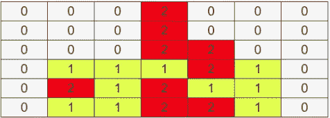

A simulation of a game between bots. Player 1 is definitely on the winning hand.

我和我的同事[耶鲁安·范德胡夫特](http://users.ugent.be/~jvdrhoof/)决定，根据下面的[博客文章](http://blog.gamesolver.org/)，尽可能多地模仿完美的解算者([，如果他能开始](http://connect4.gamesolver.org/?pos=)，他就赢得了比赛，这将是一个有趣的练习。我们的代码必须遵守的一些重要要求(这导致我们的解算器不是完全最优的)是:
*最大文件大小为 1 MB
* generate_move 不能运行超过 1s
*仅使用标准库和 NumPy

# 用位串表示游戏板

> 先介绍一种高效的存储游戏板的数据结构: **bitstrings** 。我将总结最重要的操作(例如检查四个令牌是否连接，以及在移动后更新棋盘)。关于位串(或位板)和所有可能的操作的详细解释，请查看这个[自述文件](https://github.com/denkspuren/BitboardC4/blob/master/BitboardDesign.md)(尽管做的有点不同)。

我们可以用两个位串的形式唯一地表示每个可能的游戏状态(或游戏板配置)，这可以很容易地转换成整数:
*一个位串表示一个玩家的标记的位置(**位置** )
*一个位串表示两个玩家的位置(**掩码** )
对手的位置位串可以通过在**掩码**和**位置**之间应用异或运算符来计算。当然，为两个玩家的令牌存储两个位串也是一种可行的方法(然后我们可以通过对两个位串应用 or 运算符来计算掩码)。

位串由 49 位组成，其中包括一个 7 位的标记行(全为 0 )(稍后将解释其用途)。这些位的排序如下:


The ordering of the bits to in the bitstring (0 is the least significant, or right-most, bit). Notice how bits 6, 13, 20, 27, 34, 41 and 48 form a sentinal row, which is always filled with 0's.

例如，检查以下游戏板配置:

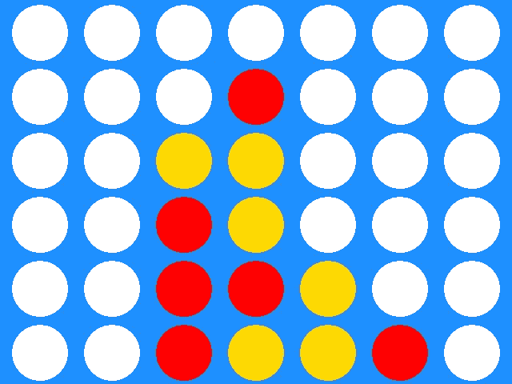

An example of a possible game state / board configuration

现在让我们用黄色玩家的**位置**位串形成位串:

```
**position**
0000000
0000000
0000000
0011000    = b'0000000000000000000110001101000100000000000000000'
0001000
0000100
0001100    = 832700416**mask**
0000000
0000000
0001000
0011000    = b'0000000000000100000110011111000111100000000000000'
0011000
0011100
0011110    = 35230302208**(opponent position)** 0000000           0000000         0000000  
0000000           0000000         0000000
0000000           0001000         0001000
0011000    XOR    0011000    =    0000000 
0001000           0011000         0010000
0000100           0011100         0011000
0001100           0011110         0010010
```

由于 board 输入参数是 numpy 数组中的 numpy 数组，我们首先需要将这个 board 转换成相应的位图。下面是实现这一点的(相当直接的)代码:

```
**def get_position_mask_bitmap(board, player):**
    position, mask = '', ''
    # Start with right-most column
    for j in range(6, -1, -1):
        # Add 0-bits to sentinel 
        mask += '0'
        position += '0'
        # Start with bottom row
        for i in range(0, 6):
            mask += ['0', '1'][board[i, j] != 0]
            position += ['0', '1'][board[i, j] == player]
    return int(position, 2), int(mask, 2)
```

我们现在可以使用**位置**位串来检查四个令牌是否连接，使用下面的[位操作](https://en.wikipedia.org/wiki/Bitwise_operation):

```
**def connected_four(position):**
    # Horizontal check
    m = position & (position >> 7)
    if m & (m >> 14):
        return True # Diagonal \
    m = position & (position >> 6)
    if m & (m >> 12):
        return True # Diagonal /
    m = position & (position >> 8)
    if m & (m >> 16):
        return True # Vertical
    m = position & (position >> 1)
    if m & (m >> 2):
        return True # Nothing found
    return False
```

现在，让我们分解检查四个令牌是否水平连接的部分:

```
1\. m = position & (position >> 7)
2\. if m & (m >> 14):
       return True
```

第一步(1。)将我们的位串 7 的位置向右移动，并采用 and 掩码，这归结为将我们的位板中的每个位向左移动(我们减少位串中的索引，其中索引 0 对应于最右边或最不重要的位)。让我们以下面的 bitboard 为例(简化版，在真实游戏中不会出现):

```
0000000
0000000
0011110
0000000
0000000
0000000
0000000=       b'0000000001000000100000010000001000000000000000000'
>> 7:   b'0000000000000000100000010000001000000100000000000'0000000
0000000
0111100
0000000
0000000
0000000
0000000&:      b'0000000000000000000000010000001000000100000000000'0000000
0000000
0011100
0000000
0000000
0000000
0000000
```

我们可以按如下方式查看新的位板:如果在其左侧有一个令牌，并且如果它是相同的，则位等于 1(或者换句话说:*位等于 1 表示我们可以从该位置*向左水平连接两个令牌)。现在进行下一个操作(2。)，我们将结果向右移动 14 位，并再次应用 and 掩码。

```
0000000
0000000
0011100
0000000
0000000
0000000
0000000=       b'0000000000000000100000010000001000000000000000000'
>> 14:  b'0000000000000000000000000000001000000100000000000'
          -------------------------------------------------
&    :  b'0000000000000000000000000000001000000000000000000'> 0? :  True  # four connected tokens found
```

通过将我们得到的位串向右移动 14 个位置，我们正在检查我们是否可以将两个水平连续的记号与棋盘上它左边两个水平连续的记号匹配。这些步骤组合起来相当于检查四个令牌是否水平连接。其他方向(对角线和垂直方向)的操作是相同的，我们只是将位图移动了或多或少的位置(1 表示垂直方向，8 表示西南方向的对角线(/)，6 表示东南方向的对角线(\))。

标记行(7 个额外的位)的原因是为了区分网格的顶行和底行。没有它，这种方法会产生假阳性，下面是两个**位置**位串，一个在 6x7 网格上，另一个在 7x7 网格上。我们检查是否可以找到四个垂直连续的记号(在这种情况下，这是假的)

```
vertical check on 6x7 grid
--------------------------
0010000
0010000
0010000
0000000
0000000
0001000=       b'000000000000000000000001111000000000000000'
>> 1:   b'000000000000000000000000111100000000000000'
&   :   b'000000000000000000000000111000000000000000'
>> 2:   b'000000000000000000000000001110000000000000'
&   :   b'000000000000000000000000001000000000000000'
> 0?:   True (WRONG)vertical check on 7x7 grid
--------------------------
0000000
0010000
0010000
0010000
0000000
0000000
0001000=       b'0000000000000000000000000001011100000000000000000'
>> 1:   b'0000000000000000000000000000101110000000000000000'
&   :   b'0000000000000000000000000000001100000000000000000'
>> 2:   b'0000000000000000000000000000000011000000000000000'
&   :   b'0000000000000000000000000000000000000000000000000'
> 0?:   False (CORRECT)
```

现在让我们更好地看看移动操作，我们根据玩家的移动来改变位图:

```
**def make_move(position, mask, col):**
    new_position = position ^ mask
    new_mask = mask | (mask + (1 << (col*7)))
    return new_position, new_mask
```

我们做的第一件事是在**位置**和**掩码**位串之间应用异或掩码，以获得对手的位置位串(因为在走完这步棋后将轮到他)。然后，我们更新我们的**掩码**位串，方法是在当前掩码和添加的掩码之间应用一个 OR 掩码，并在相应的列中添加一个位(我们希望丢弃我们的令牌)。让我们看一个例子:

```
**position**
0000000
0000000
0000000
0011000
0001000
0000100
0001100**mask**
0000000
0000000
0001000
0011000
0011000
0011100
0011110# Drop a token in the fourth column 
--> make_move(position, mask, 4)new_position = position ^ mask
**new_position**
0000000           0000000         0000000  
0000000           0000000         0000000
0000000           0001000         0001000
0011000    XOR    0011000    =    0000000 
0001000           0011000         0010000
0000100           0011100         0011000
0001100           0011110         00100101 << (col*7)
0000000
0000000
0000000
0000000     =   268435456
0000000
0000000
0000100mask + (1 << (col*7)) = 35230302208 + 268435456 = 35498737664
0000000
0000000
0001000
0011000
0011**1**00
0011000
0011010mask | (mask + (1 << (col*7)))
0000000
0000000
0001000
0011000
0011**1**00
0011100
0011110
```

# 博弈树、极大极小和阿尔法-贝塔剪枝

> 在阅读前一部分时，你可能会想:“为什么要给代码增加这么多的复杂性？”。我们之所以过度优化四合一游戏的基本操作，是因为我现在要介绍的概念:**游戏树**。

对于每一个有离散行动空间(或每一步有有限数量的可能行动)的博弈，我们可以构建一个博弈树，其中每个节点代表一个可能的博弈状态。在*偶数深度*的内部节点代表初始游戏状态(根)或由对手的移动导致的游戏状态。奇数层的内部节点代表我们移动时的游戏状态。如果一个状态是*游戏结束*(四个代币连接或棋盘已满)，则为叶节点。每个叶节点被授予一定的分数，不再进一步展开。下面是一个连接四个游戏的游戏子树的例子。

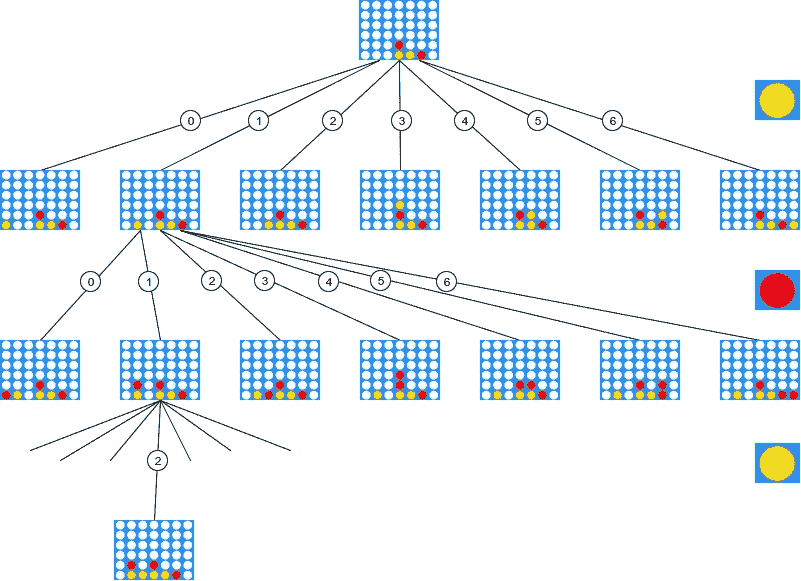

An example of a path to a game-ending state in a game subtree

总共有 [4531985219092 个可能的叶节点](https://tromp.github.io/c4/c4.html)，因此树中的节点总数要大得多。即使使用优化的位板操作，遍历整个游戏树在计算上也是不可行的。我们将需要技术来有效地在这棵树中找到一条获胜的路径。

现在，虽然上图中游戏树的路径 1–1–2 导致游戏结束状态，黄色玩家获胜(这是一条获胜路径)，但它基于红色是一个愚蠢的机器人并搞砸了他的移动(他没有阻止你)的假设。

> 因为我们不知道我们要对抗的机器人有多“好”,我们不得不假设最坏的情况:如果我们的对手是最好的机器人，因此每次都采取最好的行动，那该怎么办？如果我们能找到对抗这样一个最坏情况的 bot 的获胜路径，那么我们绝对可以走这条路，并且确信我们赢得了比赛(真正的 bot 只能做得更差，让比赛更早结束)。对于连接四个游戏，这样的路径存在，如果你是开始玩家。这就是 **minimax** 算法发挥作用的地方。

在我们将这个算法应用于博弈树之前，我们需要为树中的每个节点定义一个得分函数。我们将采用与这篇文章所基于的[博客文章](http://blog.gamesolver.org/solving-connect-four/02-test-protocol/)相同的评分函数。一个游戏棋盘配置的分数等于:
* 0 如果游戏以和棋结束
* 22 -如果**我们**能赢游戏所用的石头数
* -(22 -石头数)如果**我们**会输。
在下图中，如果我们假设我们是黄色玩家，我们可以给游戏棋盘分配-18 的分数，因为红色玩家可以用他的第四颗石头获胜。

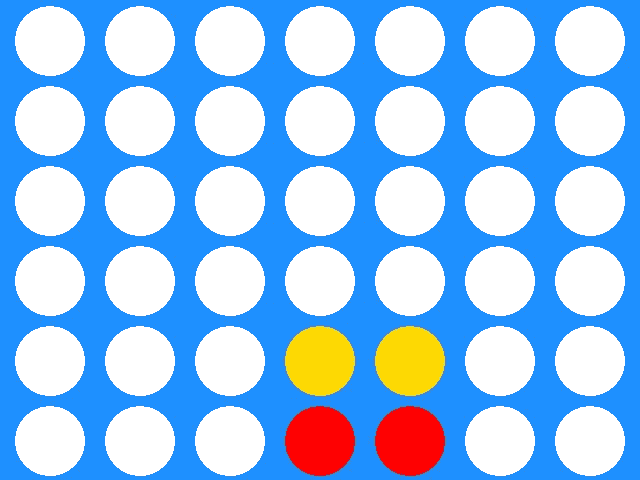

This game board is assigned a score of -18 since the opponent can finish with 4 stones

实际上，当游戏还没有结束时，很难分配分数。这就是为什么我们探索我们的树，直到我们到达一个叶节点，计算分数并将这个分数向上传播回根。现在，当我们向上传播这些值时，游戏树中的内部节点将接收多个值(每个子节点一个值)。问题是我们应该给内部节点分配什么值。现在我们可以给出内部节点的值的定义:
*如果内部节点在奇数深度上，我们取子节点的**最小值**值它们的值(作为对手，我们希望最终的分数尽可能为负，因为我们想赢)
*如果内部节点在偶数深度上，我们取子节点的**最大值**值它们的值(我们希望我们的分数尽可能为正)

这里有一个例子，直接取自维基百科:

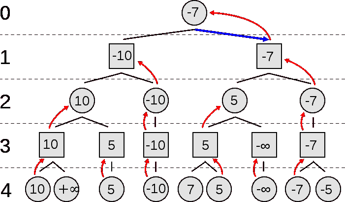

The optimal score we can achieve is -7, by taking the action that corresponds to the edge that goes to the right child of the root.

> 所以现在我们有办法在博弈树中找到最优路径。这种方法的问题是，特别是在游戏开始时，遍历整个树需要很长时间。我们只有一秒钟时间行动！因此，我们引入了一种技术，允许我们修剪游戏树的(大)部分，这样我们就不需要搜索整个游戏树。这个算法叫做**阿尔法-贝塔剪枝**。

我将总结最重要的概念。Pieter Abbeel 教授的一步一步的视频可以在这里找到。我们定义以下变量:
* **alpha** :最大化器(us)在通往根的路径上的当前最佳得分
* **beta** :最小化器(对手)在通往根的路径上的当前最佳得分

我们所做的是每当我们看到来自我们孩子的新值时更新我们的 alpha 和 beta 值(取决于我们是在偶数还是奇数深度上)。我们将这些α和β传递给我们的其他孩子，现在当我们发现一个值高于我们当前的β，或者低于我们当前的α时，我们可以丢弃整个子树(因为我们确信最优路径不会经过它)。让我们看看另一个例子，同样取自[维基百科](https://en.wikipedia.org/wiki/Alpha%E2%80%93beta_pruning):

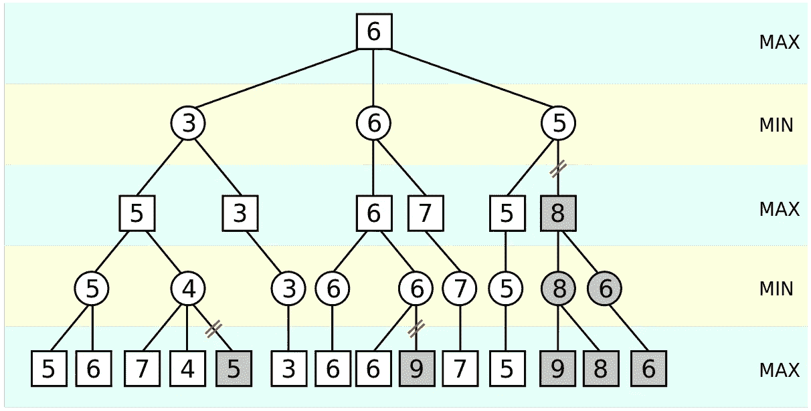

*   我们首先遍历游戏树的深度，从左到右。我们遇到的第一片叶子是最左边的叶子(值为 5)。叶子将这个值传播给它的父节点，在父节点中β值被更新并变成 5。它还检查第二个最左边的叶子(其值为 6)，但这不会更新任何值(因为如果从最小化的角度来看，6 并不比 5 好)。
*   在这个节点中找到的最佳值(还是 5)被传播到它的父节点，在那里 alpha 值被更新。现在，我们在这个父节点的右边的子节点，首先用值 7 检查它的左边的子节点，并更新 beta 值(我们现在有 alpha=5 和 beta=7)。我们检查下面的孩子:值为 4，这是最小化的更好的值，所以我们现在有β= 4 和α= 5。
*   既然现在β≤α，我们可以剪除所有剩余的子代。这是因为我们现在在那个内部节点中总会有一个≤ 4 的值(我们是极小化器，只在遇到比当前值小的值时更新我们的值)，但是父节点只会在值≥ 5 时更新值(因为我们在那个节点中是极大化器)。因此，无论遍历所有节点后的值是多少，它都不会被最大化节点选择，因为它必须大于 5 才能被选择。
*   对于所有剩余的节点，此过程将继续…

这个算法的一个很好的 python 实现，作者是 AI 最著名的参考书之一的作者，可以在这里找到[。](https://github.com/aimacode/aima-python/blob/master/games.py)

在接下来的部分中，将讨论对 alpha-beta 算法的进一步优化，其中大多数是专门为 connect-four 游戏定制的。为了评估每种优化的性能增益，我们将设置一个基线。我们将把成功率表示为已经完成的步数或步数的函数。如果在一秒钟内找到解决方案，则执行成功。这是我们的基线图。

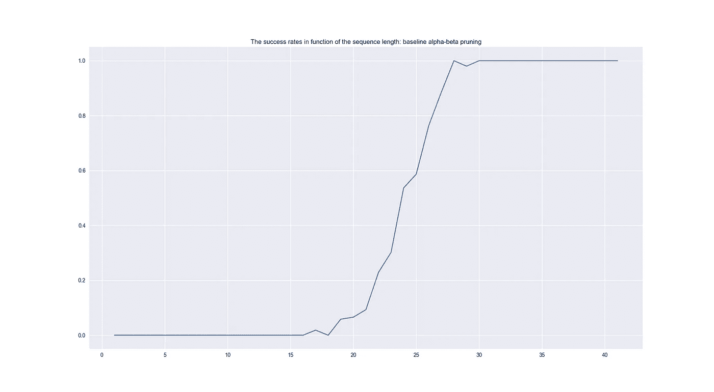

The success rates in function of the sequence length. The longer the sequence, the smaller the moves till a game-ending state and thus how bigger the probability on a success. We can see that our algorithm can find the optimal moves once 27 moves have already been made (which means we would have to find an intermediate solution for the first 26 moves).

# 其他优化

在接下来的内容中，将列出最重要的已实现优化，并给出相应的成功率图，与基线进行比较。

**1。使用缓存(转置表& Python LRU 缓存)** 我们可以把**位置**和**掩码**位图加在一起形成一个唯一键。这个密钥可以存储在具有相应上限或下限的字典中。现在，在我们开始迭代所有的子节点之前，我们已经可以通过首先从缓存中获取相应的边界来初始化我们的当前值。另一个非常简单的优化是给每个 helper-function 添加[LRU _ cache decorator](https://docs.python.org/3/library/functools.html)。

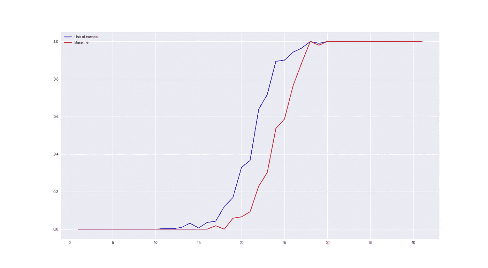

We can see quite an improvement of our success rates compared to the baseline. Unfortunately, we plateau at around the same x-value as our baseline, which means we still need an intermediate solution for our (approximately) first 26 moves.

**2。获胜状态的早期确定** 最初，当连接了四个代币或者移动了 42 步时，到达结束状态(叶节点)。我们已经可以提前确定游戏是否会结束(也就是说，如果有三个连接的令牌，用户可以在连接中引入第四个令牌)。这是一个非常有效的检查，并使我们的树更浅。

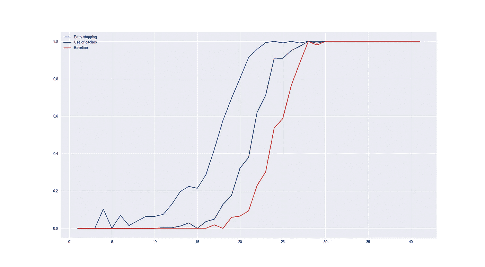

We see a significant improvement by making our trees more shallow… Moreover, we plateau at a lower x-value (around 23), which means we will only need an intermediate solution for the first 22 moves.

**3。寻找任何获胜路径，而不是移动次数最少的获胜路径** 不是寻找最大值或最小值，我们可以只遵循第一个严格正或负(分别)值的路径。这些路径不是最佳路径(我们不会以最少的移动次数获胜，也不会以最大的移动次数失败)，但我们对常规的胜利非常满意(它不一定是最佳路径)。

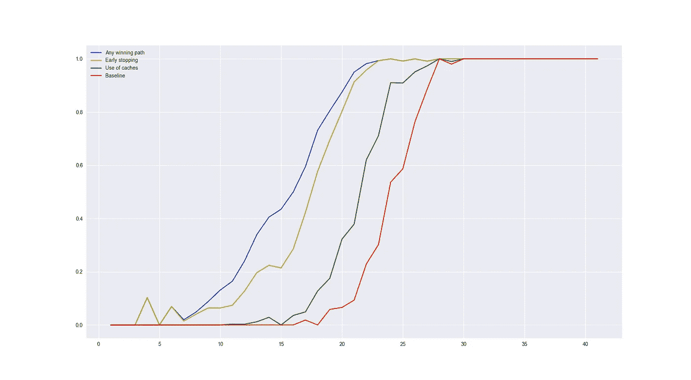

An increase in the success rates, but we do not plateau on a lower x-value.

**4。其他优化** 尝试了许多其他优化:多处理(没有成功，可能是由于 Python 中的开销)，基于试探法对叶子遍历的顺序进行排序(仅在博弈树的较低深度有效)，过早修剪子树，这将导致博弈失败(小收益)等。以下是我们最终解决方案的成功率:

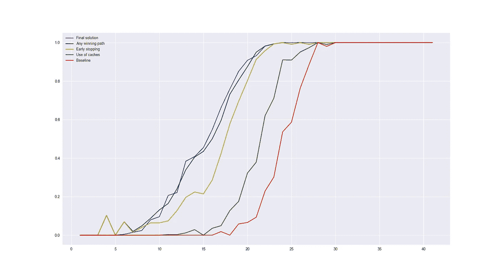

The final listed improvements did not result in significant gains. Our solver can solve every sequence as soon as the length is higher or equal than 23\. This means we need to find a solution to bridge the first 22 moves, where our solver often takes longer than 1 second.

# 存储前 22 个最佳移动

现在仍然有很多可能的优化，但在 1 秒钟内找到每个可能的游戏配置的最佳移动似乎是一项几乎不可能的工作，特别是在 Python 这样的语言中。但是由于游戏是确定性的，对于每个给定的游戏配置，只有有限数量的最优移动。举例来说，[玩家开始游戏](http://connect4.gamesolver.org/?pos=)的最佳行动总是在中间一栏丢一个代币。

> 因此，我们决定以硬编码的方式存储较短序列的所有最优移动(或已经进行了少量移动的游戏状态)。同样，这被证明是具有挑战性的，因为文件大小只能是 1 兆字节。

对于每个可能的序列(一个序列的例子可能是 3330，这意味着已经进行了 4 次移动:中间一列中有 3 个标记，最左边一列中有 1 个标记)，我们存储了它的最佳移动([，对于这个序列](http://connect4.gamesolver.org/?pos=4441)将是 4)。一个简单的字典，其中不同的序列表示键和最佳移动，相应的值在文件大小方面非常快地爆炸。这是因为存储了大量冗余信息。一种非常有效的压缩是不使用字典，而是使用 7 个集合。将属于最佳移动的所有序列(字典中的相同值)存储在同一集合中(我们的序列 3330 将与其他序列如 2220 一起存储在同一集合中)。然后查询所有集合找到某个序列，找到匹配的就输出对应的招式。七个集合中的一个也可以被丢弃用于进一步压缩(如果我们不能在所有 6 个集合中找到匹配，那么最终集合必须包含该序列)。

当我们还想存储更长的序列时，这些包含序列的集合仍然倾向于变大，所以我们决定寻找一种更有效的方法来存储序列。我们试图找到一个函数`f`，使得`f(x) = y`中的`x`是序列(由数字 1-7 组成，前面用 0 填充，这样所有的序列都有相同的长度)，而`y`是相应的最优移动。这是一个典型的机器学习设置，我们试图构建一个模型，在给定输入向量的情况下，准确预测某个值或类。此外，我们有很多数据(我们的求解器可以被视为一个甲骨文，你只需给它序列，并等待相应的最优解)。我们试图拟合一个神经网络，但我们不能达到 0 的误差(这意味着对于某些序列，给出了一个次优解)。然后，我们尝试了一个决策树，以其过度拟合能力而闻名(特别是如果您没有指定最大深度或事后修剪树)。事实上，数据的误差可以达到 0(事实上，只要我们没有两个标签冲突的相同输入向量，决策树归纳技术总是可以发现完全符合训练数据的假设)。因此，我们找到了一个函数，它可以输出特定长度的给定序列的最优移动。通过广度优先遍历决策树并存储节点信息，可以非常有效地反序列化该决策树。下面是一个决策树的例子(长度不超过 2 的序列)。**不幸的是，我们没有得到在 dockerized 容器中工作的决策树解决方案，并且不得不求助于 6 个集合来存储我们的序列。**

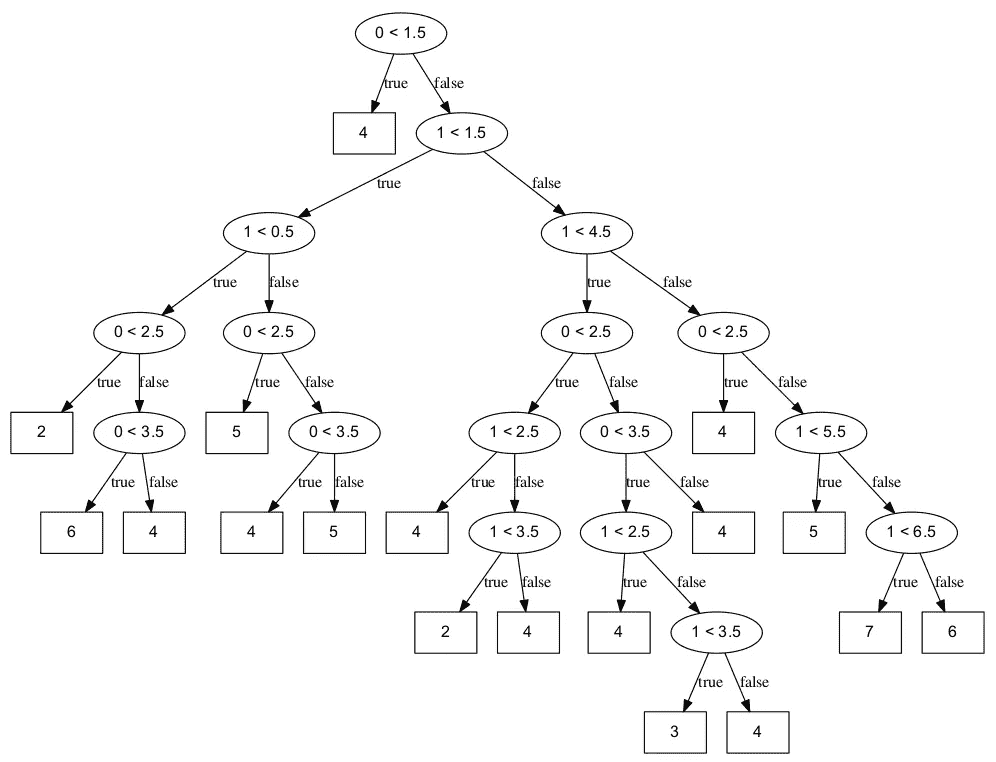

A decision tree for sequences of maximum length 2\. The root node can be interpreted as follows: if the board is empty or the first move of the opponent was in the left-most column (empty sequence or ‘1’), then place a token in the middle. As expected, we see a lot of leaf nodes with 4 (since moving a token in the middle column is often the most optimal move in the beginning of the game). The root node and its two children can be serialized as: ‘0<2 4 1<2’, which is very space-efficient.

由于连接 4 游戏是对称的，我们从来没有存储过大于所有 4 的序列。因此，如果我们要存储长度不超过 4 的序列，我们将只存储小于 4444 的序列。如果我们曾经遇到过比这个更大的序列，我们可以通过对序列中的每个`k`应用`8 — k`来镜像它。此外，假设每个状态都有一个最优解，那么可以将移动集合分成两个不同的集合:一个用于奇数移动，一个用于偶数移动。使用这种方法可以显著减少状态表示。例如，考虑以下移动顺序:

```
1\. 3
2\. 3
1\. 3
2\. 3
1\. 3
2\. 0
1\. 2
2\. 1
```

一种可能的表示是 33333021。然而，我们知道我们的机器人会在每个可能的状态下采取最优解。因此，只提取对手的移动就足够了。如果机器人分别是第一个或第二个玩家，这将导致 3301 或 3332 的状态表示。使用这些状态表示导致树中的路径更短，从而导致更压缩的动作查找表。

# 结束语

耶鲁安和我在比赛中得到了很多乐趣，这对我们双方来说都是一次很好的锻炼。我们希望一次提交就足以获得第一名，但是我们在使我们的代码在 dockerized containers 服务器端工作时遇到了一些麻烦。

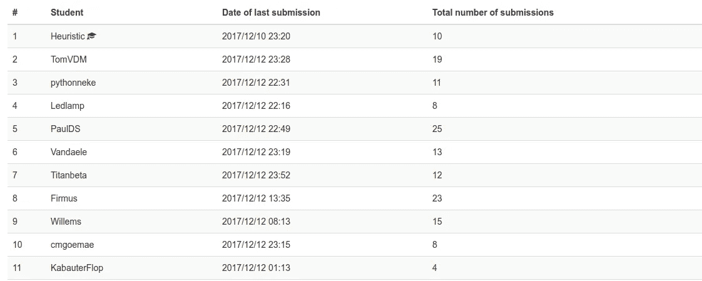

我要感谢所有参赛的学生，并祝贺 TomVDM、pythonneke 和 Ledlamp 获得前三名。此外，一年级工程学生提交的材料的多样性和复杂性给我留下了深刻的印象。提交的内容从阿尔法-贝塔剪枝(尽管没有我们的搜索深入)，非常聪明的启发式方法，甚至神经网络。

> 如果这篇博文中有任何不清楚的地方，如果你知道任何可能的改进，或者如果你想对一些书面部分进行更多的澄清，请留下评论。此外，我愿意应要求与他人分享(研究级)python 代码。

明年另一场 AI 比赛再见；)、
张卫&耶鲁安