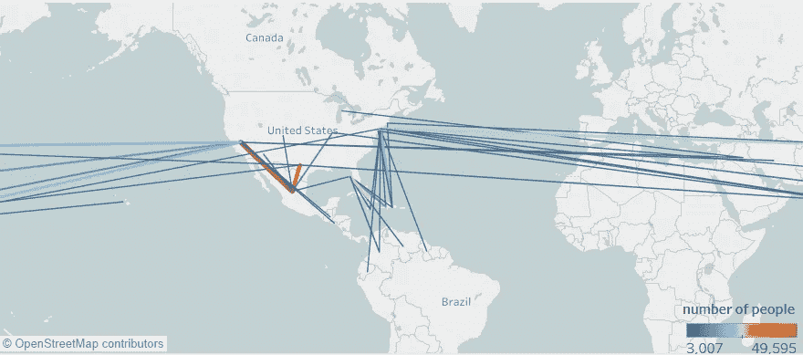
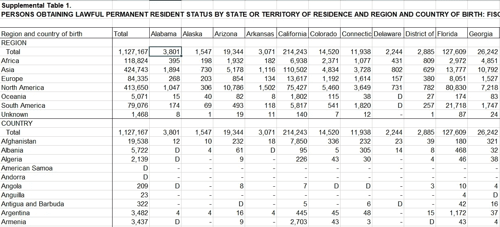
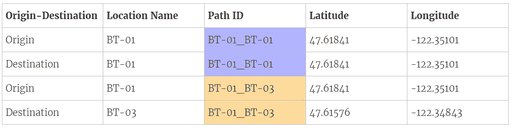
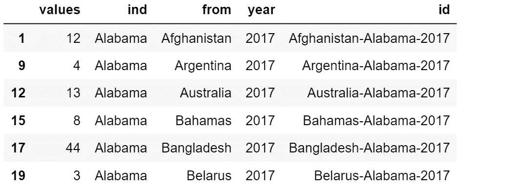
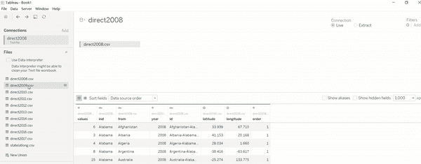
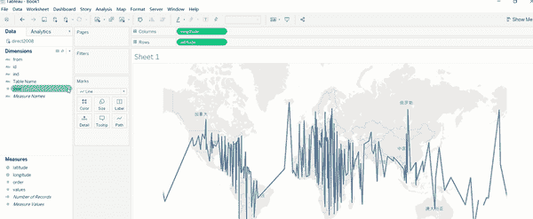
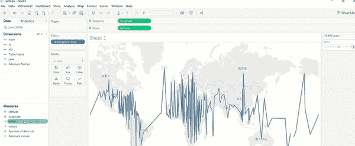
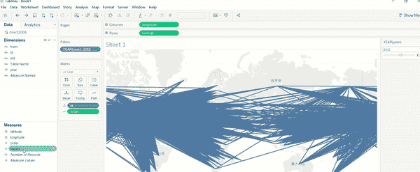
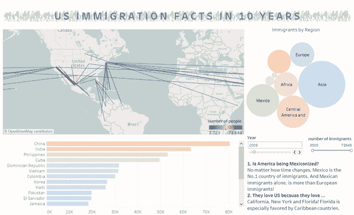

# 用 R 创建美国移民路径图

> 原文：<https://towardsdatascience.com/creating-us-immigration-path-map-in-tableau-with-r-dd781c465840?source=collection_archive---------21----------------------->



在 Tableau 看过目的地地图吗？它通常用于显示航班、公交地图、交通等的轨迹。有大量的视频和文章教你如何从包含你需要的所有信息的数据集中创建目的地地图，例如，[这个视频](https://www.youtube.com/watch?v=ckQNNhCfUW4)使用延迟的航班数据，其中每一行、起点和目的地都已经提供。如果你的数据集不是这样的标准飞行数据集呢？在这里，我将用来自[国土安全部](https://www.dhs.gov/immigration-statistics/yearbook/2017)(附件中的第一个补充表格)的移民数据向您展示一个例子。数据看起来像这样:



最左边一栏是移民的祖国，标题是他们要去的州。根据 Tableau 教程，如果我们要生成目的地图，数据应该遵循如下模式:



from [Tableau Online help](https://onlinehelp.tableau.com/current/pro/desktop/en-us/maps_howto_origin_destination.htm)

最后三列是必需的。路径 ID 用于识别始发地和目的地的位置(经度和纬度)数据。

# 数据准备

因为我们要说明 10 年后的路径，并且有 10 个 excel 文件，所以最好先创建一个数据处理函数，并将其应用于所有文件。我们首先从读取和清理数据开始。

# 1.数据读取

```
year = 2017
path = paste(as.character(year), ".xlsx", sep="")
df = read_excel(path, na = c("D", "-"), skip = 3)
df = df[-c(1:11). -2]
df = df[ , !(names(df) %in% c("U.S. Armed Services Posts", "U.S. Territories1","Guam", "Unknown"))]
df = head(df,-5)
colnames(df)[1] = 'country'
```

我去掉了电子表格中一些不必要的数据和注释，以及一些实际上没有陈述的列(例如，武装部队)。此外，一些单元格为“D”，即为了限制披露而保留的数据。我把他们当娜。

# 2.数据清理

表格只记录了移民的出生国。但是，有些国名只存在于历史中。如果我们不考虑它们，最终的地图将不会反映真实的路径。此外，一些国家名称与我们稍后将使用的地理信息不一致。

```
df$country = gsub('Czechoslovakia \\(former\\)|Czechoslovakia, former', 'Czechia', df$country)
df$country = gsub('Netherlands Antilles \\(former\\)', 'Curacao', df$country) 
df$country = gsub("China, People's Republic", 'China', df$country) 
df$country = gsub('Serbia and Montenegro \\(former\\)|Serbia and Montenegro', 'Serbia', df$country)
```

注意正则表达式。记住在 r 中用两个反斜杠对括号进行转义。

# 3.数据转换

```
stk = stack(df, select= -country)
stk$from = rep(df$country,(ncol(df)-1))
stk$year = rep(year,(ncol(df)-1))
stk$id = paste(stk$from,stk$ind,stk$year,sep="-")
stk = na.omit(stk)
```

接下来，我们将堆叠数据(考虑转置每一行)，并为每个转置的行添加 country 列。现在，始发地国家和目的地国家在同一行。然后添加年份信息和路径 ID。现在数据看起来像这样:



# 4.添加位置数据

最后，我们将连接国家和州的经度和纬度表。我们可以在 Google developer 网站上找到这样的数据，使用 R 中的 XML 包，我们可以很容易地将它作为一个数据帧。当然，你也可以将数据复制到 Excel 并存储为 csv 格式，然后从 r 中读取。

```
library(RCurl)
library(XML)
ccode = readHTMLTable(getURL("[https://developers.google.com/public-data/docs/canonical/countries_csv](https://developers.google.com/public-data/docs/canonical/countries_csv)"), stringsAsFactors = FALSE)[[1]][ ,-1]
scode = readHTMLTable(getURL("[https://developers.google.com/public-data/docs/canonical/states_csv](https://developers.google.com/public-data/docs/canonical/states_csv)"),stringsAsFactors = FALSE)[[1]][ ,-1]
ccode[1:2] = sapply(ccode[1:2], as.numeric)
scode[1:2] = sapply(scode[1:2], as.numeric)
```

然后找出堆叠数据中的国家和位置数据中的国家之间的差异，并更改位置数据框中的名称。例如，美国人把缅甸称为缅甸。最后，我们将数据分别与国家位置和州位置连接起来，并绑定两个数据框的行。因此，在最终的数据帧中，每个路径 ID 对应于两个记录，一个包含源信息，一个包含目的地信息。

您可以将这些步骤打包成一个函数，这样您就可以根据需要调用多年的数据。完整的代码在我的 [GitHub](https://github.com/shirleykeat/immigration-map/blob/master/R%20code) 上。

# Tableau 中的映射

现在您已经准备好了数据，是时候展示您的 Tableau 技能了！事实上，这再简单不过了。

1.  加载不同年份的数据并合并它们(不要合并)。



2.将经度和纬度拖到列和行中。

3.选择标记类型作为线条。


4.将年设置为日期，然后设置为过滤器。



5.将订单拖到“路径”上，并将路径标识拖到标记卡下的“细节”上。



6.定制您的地图！

您可以将值(每条路径上的人数)拖动到颜色上，以便更直观地了解哪些路径的人数更多。把它作为一个过滤器，把那些只有很少几个人的路径排除在外。我将阈值设置为 2000。这样，你的地图就不会看起来这么拥挤了！



查看我在 [Tableau Public](https://public.tableau.com/profile/meng.li1673#!/vizhome/Revisedstory/Newstory?publish=yes) 上的最终作品，了解美国移民是如何随着时间变化的。这张地图是我的数据可视化课程最终项目的一部分。您也可以通过单击其他图表进行过滤，找到某个大陆或国家的移民趋势。



谢谢你的阅读和快乐的活动！