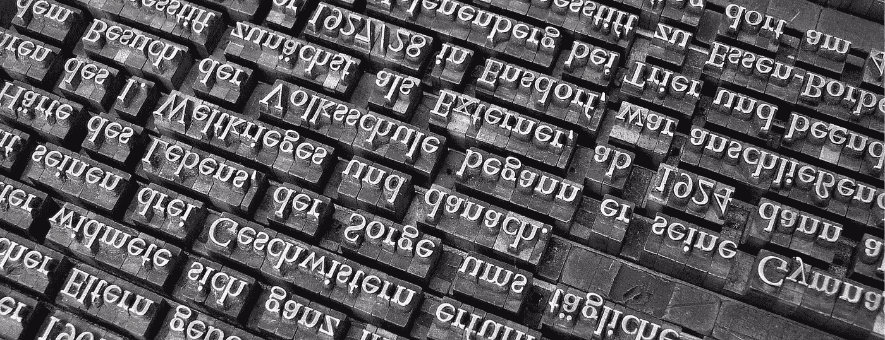
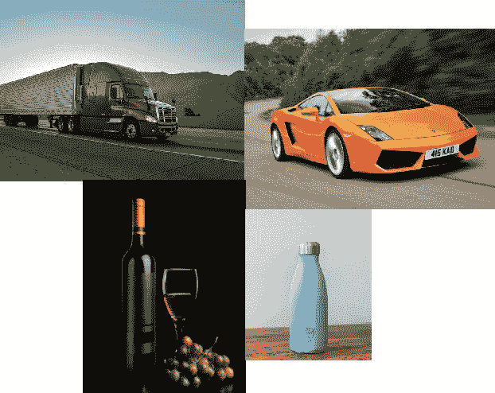
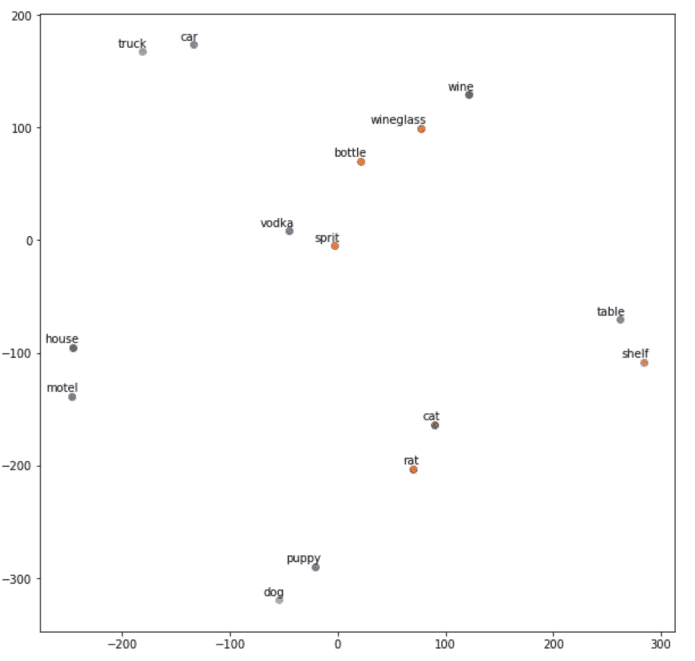

# 使用深度神经网络图像分类器的单词嵌入

> 原文：<https://towardsdatascience.com/creating-words-embedding-using-deep-neural-network-image-classifier-ae2594d3862d?source=collection_archive---------6----------------------->



众所周知，单词嵌入在许多 NLP 任务中非常强大。大多数当前的实现使用所谓的“分布假设”,即在相似的上下文中单词具有相似的含义。人类不仅可以通过可能使用的上下文来判断两个单词是否相似，还可以通过观察或想象这个单词可能代表的物体来判断。很多时候，相似的物体与具有相似含义的单词相关，如“汽车”和“卡车”，“房子”和“建筑物”，“狗”和“猫”。

在这篇文章中，我想探索这个想法，并尝试创建单词嵌入，这将保留单词的语义，我将通过使用一个在图像上训练的神经网络来完成。

我想使用 pertained `ResNet`模型创建单词嵌入，这是一个非常流行的图像分类器，它是在“ImageNet”数据集上训练的。然后，我想使用新的嵌入来构建一个翻译系统。西班牙语中的 Car 看起来与英语中的 Car 非常相似(甚至完全相同)。我想用这个把任何语言的单词翻译成英语。

你可以在这里找到所有的代码

如 ImageNet 网站所述“ImageNet 是一个根据 [WordNet](http://wordnet.princeton.edu/) 层级(目前只有名词)组织的图像数据库”。它在包含超过 1400 万张图像和 1000 个类别的 ImageNet 数据集上进行训练。我将使用模型最后一个内层的预测值创建单词向量，并假设如果单词对应的图像相似，则单词具有相似的含义。

我们来看一个小例子。我们有四个词:卡车、酒、汽车和瓶子。



作为人类，我们可以分辨出“卡车”和“汽车”比“卡车”和“瓶子”更相似，或者“酒”和“瓶子”比“酒”和“汽车”更相似。事实上，这些单词的图像看起来很相似。那些物体在现实生活中看起来很相似。

在这里，我将只为名词创建嵌入，因为它们的图像可能比“to”、“and”、“the”等词的图像更好地描述了实际的单词。

首先，我们需要找到一个大的名词列表。为此，我们将使用 NLTK:

```
nouns = set()
for synset in list(wordnet.all_synsets('n')):

    n = synset.name().split('.')[0]

    if len(n) > 2 and n.isalpha():
        nouns.add(n)
```

经过一些清理，我们有大约 39，000 个名词。实际上，并不是所有的都是名词，但我们还是坚持用它们。

接下来，我们希望为我们拥有的每个单词获取一个图像。我们将使用谷歌图片搜索。有一个很棒的叫做`[google_images_download](https://github.com/hardikvasa/google-images-download)` 的 python 库可以帮助我们。我们希望重新缩放图像，以便所有的图像都具有相同的大小。然后，我们将使用`ResNet`来创建单词向量。我将使用网络的最后一层，就在最后的`softmax`之前:

```
resnet = ResNet50(weights='imagenet', 
                  include_top=False, 
                  pooling='avg')embeddings = KeyedVectors(2048)for word in nouns:
  response = google_images_download.googleimagesdownload()
  path = response.download({'keywords': word, 'limit': 1})[word][0]
  img = cv2.imread(path)
  img = scipy.misc.imresize(img, 224.0 / img.shape[0])
  img = img.reshape((1,) + img.shape) embeddings[word] = resnet.predict(img)[0]
```

让我们看看我们的嵌入:



看起来不错。我们可以看到“car”和“truck”比“car”和“dog”更相似

```
embeddings.similarity('car', 'truck') # = 0.419
embeddings.similarity('car', 'dog') # = 0.270
```

这并不奇怪，这只是'汽车'、'卡车'、'狗'形象的相似而已！我们使用`ResNet`模型的内层来获得这些图像的一般表示，这样我们更容易比较它们。

我们的嵌入可能保留了单词之间的语义相似性，但它错过了其他嵌入所具有的非常有趣的部分。在我们的嵌入中，我们不能做类似于`queen — king = woman — man`的事情，因为我们的嵌入只捕获两个单词/对象之间的相似性，但它不能捕获单词之间更复杂的关系。我们在这里没有使用英语，我们只是看图像之间的相似性。

现在我想用我的新嵌入构建一个简单的翻译系统。这非常简单，给定任何语言中的任何单词，我们将使用 Google images 搜索来找到相应的图像，然后我们将使用`ResNet`来预测最终的图层值，最后，找到与这些预测值最相似的英语单词:

```
def translate(word):
  response = google_images_download.googleimagesdownload()
  path = response.download({'keywords': word, 'limit': 1})[word][0]
  img = cv2.imread(path)
  img = scipy.misc.imresize(img, 224.0 / img.shape[0])
  img = img.reshape((1,) + img.shape) vector = resnet.predict(img)[0] return embedding.most_similar([vector])[0]
```

让我们看一些例子:

```
>>> translate("מכונית") # 'car' in Hebrew
Output: clio # Brand of car (Renault Clio)
>>> translate("ristorante") # 'restaurant' in Italian
Output: 'grubstake' # A restaurant in San Fransisco
>> Translate("еда") # 'meal' in Russian
Output: thanksgiving
```

正如你所看到的，它一点也不完美，但它确实输出了一些有趣的翻译。

这种“嵌入”实际上是在图像的`ResNet`表示之上的简单的“K 最近邻”模型。这并不是真正的翻译单词，但一个好处是，我们能够比较(或分类)成千上万种类型的单词/图像/类别，而最初的`ResNet`模型只训练了 1000 个类别。

**最终注释**

这是一个有趣的实验(至少对我来说)，但正如你可能想象的那样，它并不那么有用，也不实用。下载约 39K 的照片需要很多时间，并且不能保证下载的图像是我们想要或需要的。受益于适当嵌入的最常见的任务之一是文本分类。我试图用这种嵌入方式解决“20 个新闻组”的分类问题，但没有成功。如果你对它感兴趣，你可以在这里找到代码，这是一个相当凌乱的笔记本。它显示了 3 个实验，随机可训练嵌入，手套不可训练嵌入，和我的视觉嵌入。尽情享受吧！