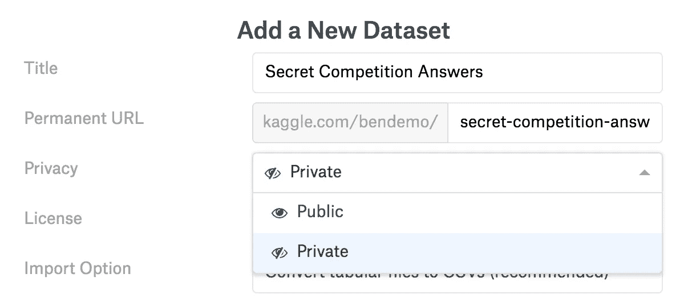
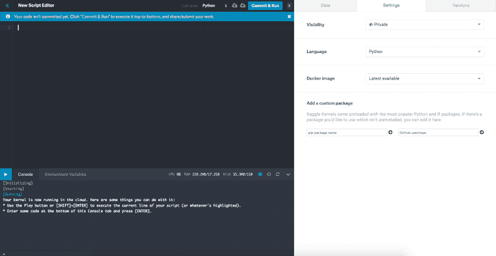
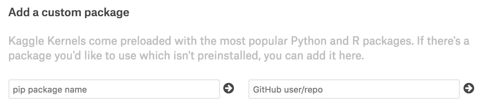
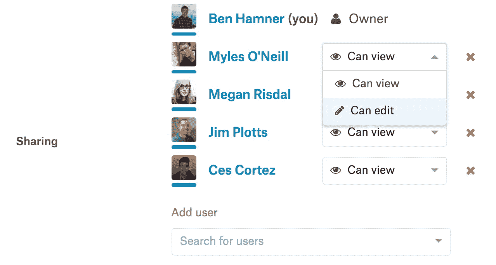

# 在 Kaggle 上创建你的人工智能项目

> 原文：<https://towardsdatascience.com/creating-your-ai-projects-on-kaggle-ff49f679f611?source=collection_archive---------8----------------------->

我们正在将 Kaggle 打造成为一个平台，在这里你可以合作创建你所有的人工智能项目。在过去的这个季度，我们通过推出许多新功能和扩展计算资源，增加了您可以在我们的平台上构建的工作的广度和范围。

现在，您可以加载正在使用的私有数据集，在我们基于云的数据科学环境中对其进行复杂的分析，并以可复制的方式与合作者共享项目。

# 将私有数据集上传到 Kaggle

我们首先将 Kaggle 内核和数据集作为公共产品推出，其中所有创建和共享的东西都必须是公共的。去年 6 月，我们让您能够创建私有 Kaggle 内核。这改变了你们中有多少人使用 Kaggle: 94.4%的内核是私有的。

然而，这个故事并不完整:您只能在公共数据上运行内核。这阻止了你将 Kaggle 用于你自己的私人项目。

在过去的这个季度，我们推出了私有数据集。这让您可以将私有数据集上传到 Kaggle，并在内核中运行 Python 或 R 代码。您可以上传无限数量的私有数据集，最高限额为 20GB。所有新数据集默认为私有。您可以通过点击[www.kaggle.com/datasets](https://www.kaggle.com/datasets)上的“新建数据集”或内核编辑器的“数据”选项卡上的“上传数据集”来创建数据集。

一旦你创建了私有数据集，你可以通过 Kaggle API 发布新的版本来保持它的更新，我们在一月份发布了这个 API，并在三月份进行了扩展。这个 API 使您能够从命令行下载数据和提交竞赛资料。

# Kaggle 内核的全新编辑体验

既然已经创建了私有数据集，就可以将其加载到 Kaggle 内核中。

Kaggle 内核使您只需点击一个按钮，就可以在云中创建交互式 Python/R 编码会话。这些编码会话在 Docker 容器中运行，Docker 容器提供了版本化的计算环境，并包含了许多 Python 和 R analytics 生态系统。

我们有两种截然不同的内核运行模式:**交互**和**批处理**。交互式会话使您能够在实时会话中编写 Python 或 R 代码，因此您可以运行选定的代码并立即看到输出。一旦你完成了一个会话，你可以点击“ **Commit & Run** ”来保存代码版本，并在一个干净的环境中自顶向下运行一个批处理版本。您可以关闭您的笔记本电脑并离开——这个批处理运行将在云中完成。

当您回来时，您将拥有您创建的所有批处理运行的完整版本历史。如果您在会话结束时没有“提交并运行”，您的最新编辑将被保存为工作草稿，您将在下次编辑内核时看到。

我们一直在交互式模式下启用笔记本电脑，并在本季度推出了对脚本的交互式支持。

除了交互式脚本，我们还更新并统一了 Kaggle 内核的脚本和笔记本编辑器。这使您可以访问控制台，显示当前会话中的变量，并使您能够在交互式会话中查看当前的计算使用情况。它还为许多令人兴奋的未来扩展奠定了基础。

# 在 Kaggle 内核中创建更复杂的项目

在过去的一个季度中，我们专注于扩展您可以在 Kaggle 内核中完成的工作。让你能够处理私人数据是其中的一部分。

我们**将 Kaggle 内核中的计算限制**从一小时扩展到六小时。这增加了您可以运行的模型和可以分析的数据集的大小和复杂性。这些扩展的计算限制适用于交互式会话和批处理会话。

我们增加了在你的内核中**安装定制包**的能力。你可以在内核编辑器的“设置”标签中完成这项工作。在 Python 中，对 PyPI 或 GitHub 上的包运行“pip install”命令。在 R 中，对 github 上的包运行“devtools::install_github”命令。这扩展了我们的基本容器，以包含添加的包。随后的内核分叉/编辑在这个定制容器中运行，使您和其他人更容易复制和构建您的结果。

此外，我们专注于提高 Kaggle 内核的健壮性。我们在幕后所做的改变将使内核运行更加可靠和流畅。如果您在这里遇到任何问题，请[让我们知道](https://www.kaggle.com/product-feedback)。

# 与协作者共享您的项目

一旦你上传了一个数据集或者编写了一个内核来启动一个新项目，你就可以与合作者分享你的工作。这将使他们能够看到、评论和构建您的项目。

您可以将协作者添加为查看者或编辑者。

数据集上的查看者可以在数据上查看、下载和写入内核。编辑者还可以创建新的数据集版本。

内核上的查看者可以看到内核并将其分叉。如果他们可以访问所有底层数据集，他们还可以复制和扩展它。内核上的编辑器可以直接编辑内核，创建一个新版本。

当你创建一个内核作为竞赛团队的一部分时，默认情况下，它与你团队的其他成员共享。我们听说，由于不同的计算环境，许多竞赛团队在协作方面遇到了困难，我们希望这能让您在竞赛中更容易地合作。

# 其他更新

我还想介绍几个产品更新。

我们推出了 [Kaggle Learn](https://www.kaggle.com/learn/overview) 作为一种快速、结构化的方式，让您获得更多关于分析、机器学习和数据可视化的实践经验。它包括一系列快速教程和跨越六个轨道的练习，您可以完全在您的浏览器中完成。

我们完成了[第二届内核竞赛](https://www.kaggle.com/c/mercari-price-suggestion-challenge)，所有参赛作品都需要通过内核提交。2，384 支队伍参加了比赛，这让我们大吃一惊。感谢所有对这种新的比赛形式的[深思熟虑的反馈](https://www.kaggle.com/c/mercari-price-suggestion-challenge/discussion/45129)。我们了解到限制计算功能是对模型复杂性极其有效的正则化。我们还了解了纯内核格式的一些挫折，包括可变的计算性能。总的来说，第二届内核竞赛非常成功，我们的目标是在未来对这种竞赛形式进行更多的迭代，同时根据您的反馈进行改进。

我们推出了对 [BigQuery 公共数据集](https://www.kaggle.com/datasets?filetype=bigQuery)的集成，使您能够从内核中查询更大、更复杂的数据集，如 [GitHub Repos](https://www.kaggle.com/github/github-repos) 和[比特币区块链](https://www.kaggle.com/bigquery/bitcoin-blockchain)。

你们中的许多人告诉我们，你们希望对以前发布的内容有更多的控制权，并且能够删除它们。我们听到了。你现在可以删除你在 Kaggle 上写的数据集、内核、主题和评论。这些留下了一个[【删除】外壳](https://www.kaggle.com/deleted-dataset/949)，这样相关的内核或注释仍然有一些上下文。

我们在 Kaggle 上发布了一个不同主题的[概述页面](https://www.kaggle.com/tags)，让你可以更容易地按主题浏览数据集、比赛和内核。

# 谢谢

我非常感谢 Kaggle 的团队，他们努力工作以获得这些更新，并继续建立世界上最好的数据科学项目合作场所。

最重要的是，我要感谢你，感谢你成为 Kaggle 社区的一员。我们的平台不能没有你。我们不断惊讶于你为竞赛构建的创造性解决方案，你通过内核分享的见解，以及你如何帮助彼此成长为更好的数据科学家和工程师。

您对我们有什么反馈吗？我们很乐意倾听—请在我们的 [*产品反馈论坛*](https://www.kaggle.com/product-feedback) *分享您的想法。*