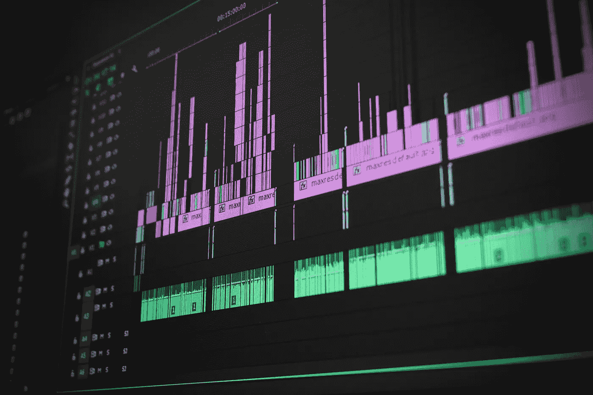

# 音乐中的创造性人工智能:Sync 和其他迷人用例的天才创新

> 原文：<https://towardsdatascience.com/creative-artificial-intelligence-in-music-genius-innovation-for-sync-and-other-fascinating-use-d36e34732525?source=collection_archive---------6----------------------->

现在我们已经过了人工智能创作的第一首歌曲，你认为使用人工智能是优化电影，电视和游戏行业音乐生成的合乎逻辑的下一步吗？

> “我一直着迷于这样一个概念，即我们可以自动或智能地做人类认为只有他们才能做的事情。我们总是把创造力视为人类最后的堡垒。你能按一个按钮写一首交响乐吗？”— —英国科技初创公司 AI Music 的首席执行官 Siavash Mahdavi 正在探索人工智能和音乐之间的潜在交集。

许多人工智能公司现在都在深入研究这项技术在音乐行业的各种应用，并已经取得了令人瞩目的成就。电影、电视、视频和游戏行业日益紧张的预算促使人们寻找在不牺牲音乐质量的情况下降低成本的方法。现在，各种各样的人工智能公司正在努力开发技术，这些技术可以成为在这些媒体中使用的实际轨道生成背后的创造性力量。

这个领域正在迅速扩张，越来越多的公司竞相将自己的软件提升到一个新的水平，包括英国的 Jukedeck 和 AI Music，旧金山的 Humtap，柏林的 Melodrive 和 Groov。AI 在加州山景城。甚至谷歌也有一个名为 Magenta 的人工智能音乐研究项目正在进行中，索尼的计算机科学实验室(CSL)也在进行一个名为 Flow Machines 的类似项目。

对专业音乐家的影响。

所有这些公司和研究人员都试图回答同一个复杂且有时有争议的问题:机器能否使用神经网络等人工智能技术来分析现有的人造音乐，并随后学习如何创作自己的作品？虽然这本身肯定是一个非常复杂的问题，但它也提出了一个额外的问题，即这项技术对专业音乐家有什么影响，他们中的许多人通过创作或授权音乐用于电视节目、电影和视频游戏来获得全部或部分收入。事实上，一些音乐人甚至[提议限制](https://artistrightswatch.com/2017/08/08/the-21st-century-marketing-restriction-no-licensing-for-ai/)将他们以前的录音和作品用于人工智能和机器学习目的。与此同时，其他艺术家也意识到艾的创造力，将这种创造力融入到他们的作品中。

**有价值且无威胁的用途**

尽管人工智能在音乐中的上述应用存在一系列问题和担忧，但其他有价值和无威胁的应用已经在很好地工作。

其中一个应用是根据心情创建播放列表。虽然 Gracenote 的音乐数据专家多年来一直按照这种标准对音乐进行分类，但员工并没有真正听过公司数据库中 1 亿首歌曲中的每一首。相反，Gracenote 使用机器学习和人工智能来教计算机如何检测音乐中的情绪，从而让机器准确地将曲目分类为梦幻、悲伤、闷热或其他感觉。

另一个有趣的当前集成来自谷歌研究员道格拉斯·埃克，他发起了该公司的 Magenta 项目。研究团队正在研究的一个概念涉及通过分析数百个音符，教会神经网络如何学习乐器的音乐特征。该机器随后创建识别该特定仪器的数学表示。这使得能够简单地在屏幕上移动按钮来组合乐器，以便创建全新的虚拟乐器，例如 62%的小号和 38%的萨克斯管，或者任何其他声音的组合。

**不要把 AI 当成敌人，而是合作者。**

音乐产业正处于彻底改变歌曲创作方式的风口浪尖上，歌曲的创作方式有着广泛的用途。从电影和电视背景音乐到视频游戏，甚至可能是流行歌曲，人工智能都处于这个机器驱动的音乐创作新时代的前沿。充分利用其潜力的关键是不要把人工智能当作敌人——而是当作合作者。让它与艺术家的作品相得益彰。即使它自动化了一些任务，人类仍将在创造过程中掌舵。至少在可预见的未来。

*由* [*谢尔盖布多夫*](https://www.linkedin.com/in/sbludov/)*【SVP】媒体&娱乐* [*数据艺术*](https://www.dataart.com/industry/media-and-entertainment?utm_source=towardsdatascience.com&utm_medium=referral&utm_campaign=m-regular&utm_content=da-sbludov-creativeai)

[*发现更多谢尔盖·布鲁多夫的故事*](https://www.linkedin.com/in/sbludov/detail/recent-activity/posts/)