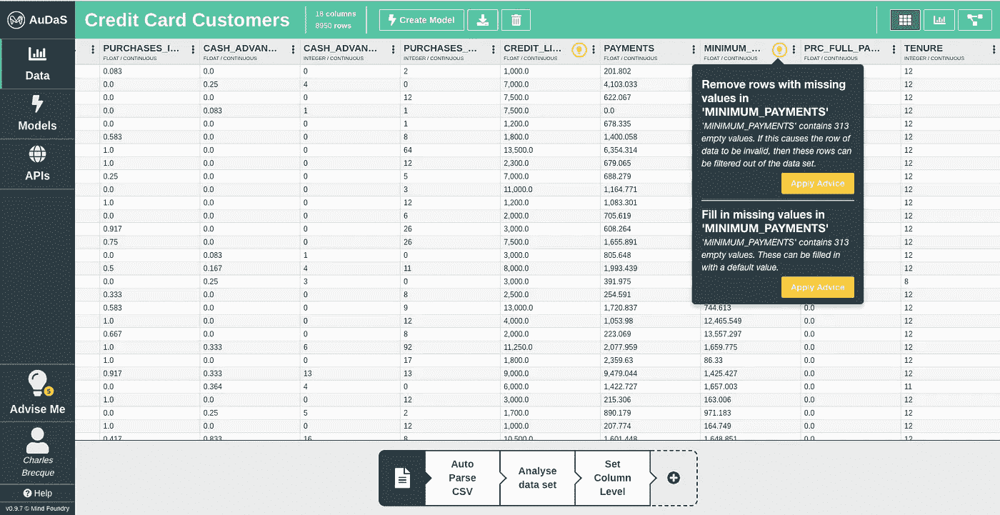
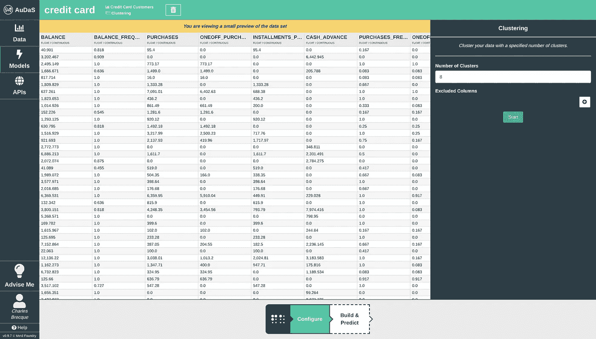
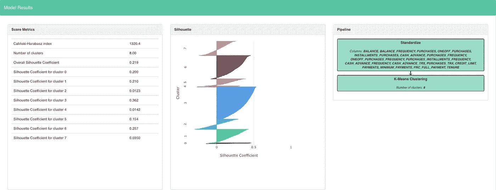
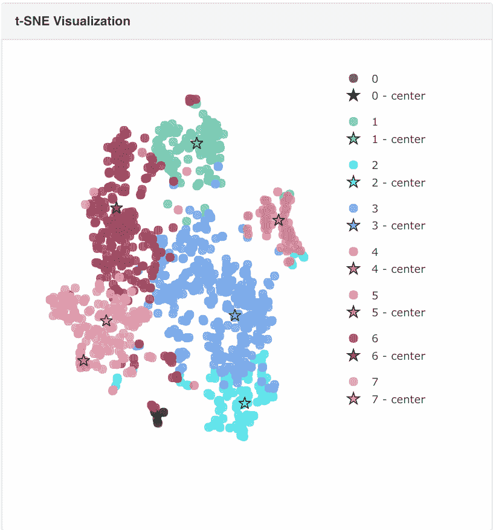
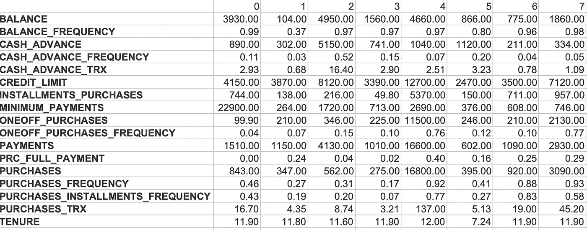
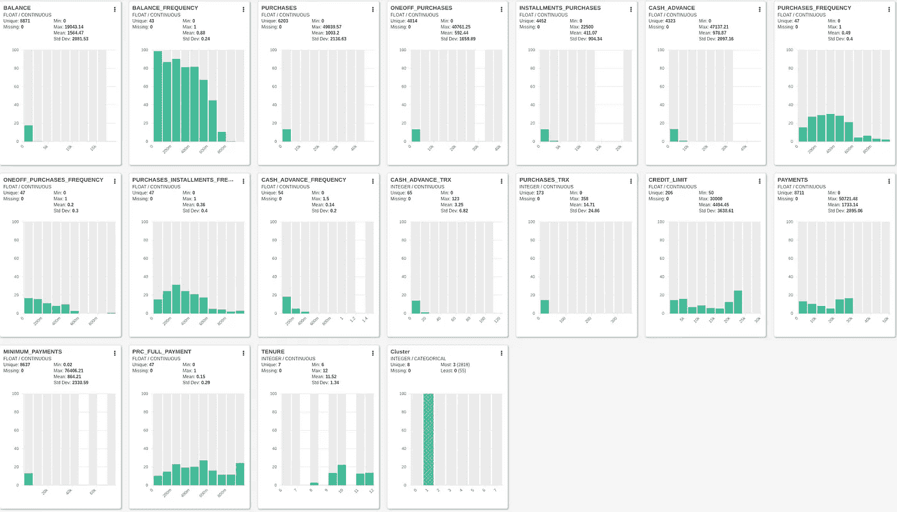
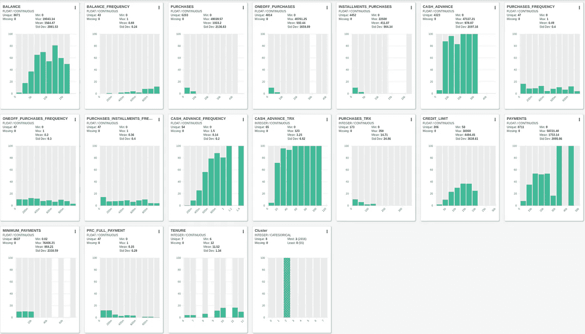
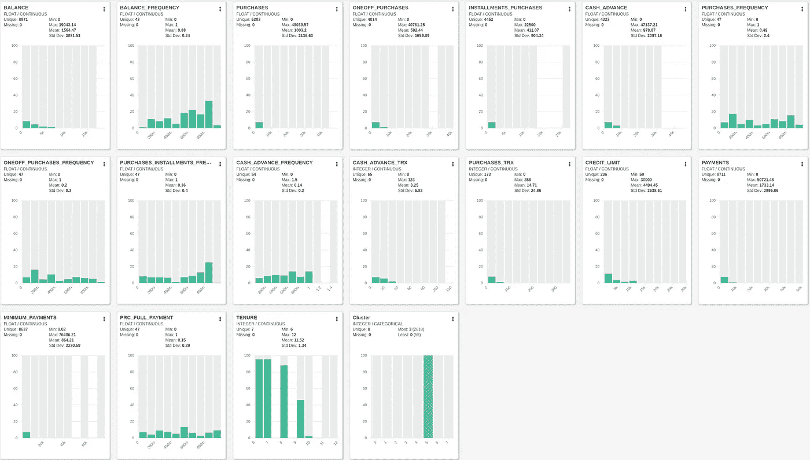

# 信用卡聚类

> 原文：<https://towardsdatascience.com/credit-card-clustering-6a92657ac99?source=collection_archive---------9----------------------->

## 使用 AuDaS 实现自动化集群

营销人员面临的首要挑战是了解他们的销售对象。当你知道你的买家的角色时，你可以定制你的目标和产品，以提高他们的满意度，从而增加你的收入。当你已经有了一批客户和足够的数据，对他们进行细分会非常有用。在本文中，我们将了解如何使用聚类对一些信用卡客户进行细分。用于此分析的数据取自 [Kaggle](https://www.kaggle.com/ainslie/credit-card-data-clustering-analysis/data) ，我们将使用 [AuDaS](https://mindfoundry.ai/audas) 来自动识别集群。

# 数据

每个客户的信用卡数据有 17 个属性，包括余额(客户所欠的信用)、预付现金(当客户使用信用卡提取现金时)、客户的信用额度、最低还款额、全额还款额的百分比和期限。

数据相当干净，但是有一些丢失的值被 AuDaS 自动拾取。

在应用了 AuDaS 建议的数据准备建议后，我们能够查看信用卡客户的直方图视图。

Histogram view of the data in AuDaS

# 使聚集

现在我们已经准备好了数据，我们将使用 AuDaS 构建一个聚类模型。我们需要指定集群的数量，在我们的例子中，我们将从 8 开始。

在应用了一个 [K-Means 聚类](https://en.wikipedia.org/wiki/K-means_clustering)管道后，AuDaS 会生成分数指标和它所识别的聚类的信息。

[轮廓](https://en.wikipedia.org/wiki/Silhouette_(clustering))图给了我们一个很好的指示，说明我们的集群是如何定义的。介于-1 和 1 之间的轮廓系数表示一个聚类中的每个点与相邻聚类中的点有多接近。接近 1 的值距离其他聚类最远，而负的点与其他点重叠。在理想情况下，我们期望一个聚类中的所有点的轮廓系数接近 1。在我们的例子中，除了集群 2 和集群 7 之外，大多数集群看起来都定义得相当好。

然后，我们可以使用 [t-SNE 可视化](https://en.wikipedia.org/wiki/T-distributed_stochastic_neighbor_embedding)功能来验证我们的集群的独特性。如我们所见，聚类 2 和聚类 7 有许多与其他聚类重叠的点。为了提高我们集群的独特性，我们可能会决定从我们的客户那里收集一些额外的信息。

# 客户细分

AuDaS 提供了质心坐标，可用于解释每个集群的主要特征。

然后我们可以展开表格:

Cluster Centers

AuDaS 将自动创建一个新的数据集，其中附加了您可以导出的每个客户的聚类，通过访问直方图视图，我们可以了解聚类在整个数据集中的分布情况。我们现在将仔细观察一些由 AuDaS 发现的最有趣的星团。

## 群组 1

该细分市场的特点是，客户余额(104)和预付现金(302)最低，全额付款比例相当高(24%)。这些客户被称为交易者，因为他们支付的利息很少。

## 群组 2

这一细分市场的特点是客户余额和现金垫款高，购买频率和全额付款比例最低，这表明他们是信用卡提供商最有利可图的细分市场之一。这些通常被称为[左轮手枪](https://www.creditcards.com/glossary/term-revolver.php)的人可能用他们的信用卡贷款。

## 第 4 组

这部分客户的特点是信用额度最高，全额付款比例最高(39%)。这些是主要客户，信用卡提供商可以通过进一步提高他们的信用额度来吸引他们增加消费习惯。

## 第 5 组

这个细分市场包括相当新的客户(低任期)，他们有低余额和现金垫款。信用卡提供商可能会通过提供现金返还、促销、免费乘坐优步等方式鼓励他们增加活动。

## 结论

在几分钟内，我们能够建立一个聚类模型，能够将我们的信用卡用户分成不同的组。其中一些相当经典，如总理部分，左轮手枪和 transactors，但我们也能够确定非活跃用户。在这个粒度级别上理解客户的行为是定制产品的关键，从而提高客户保持率并增加收入。

使用 AuDaS 构建集群模型过程的完整视频可在下面查看:

## 奥达斯

AuDaS 是由 Mind Foundry 开发的自动化数据科学平台，为构建端到端的机器学习解决方案(分类、回归、聚类和 soon 时间序列)提供了一个强大的框架。这个框架有助于识别[数据泄露](/detecting-data-leakage-before-its-too-late-afcfa4ea9f77)并采取行动，以免为时过晚。你可以通过发送邮件到 audas@mindfoundry.ai 来尝试 AuDaS，并阅读一些其他的实际用例[在这里](/optimize-your-email-marketing-strategy-with-automated-machine-learning-e1bfb8cc171b)和[在这里](/solving-the-kaggle-telco-customer-churn-challenge-in-minutes-with-audas-2273fed19961)。

## 【**更新**:我开了一家科技[公司](http://www.legislate.tech)。你可以在这里找到更多的

## 团队和资源

Mind Foundry 是牛津大学的一个分支机构，由斯蒂芬·罗伯茨(Stephen Roberts)和迈克尔·奥斯本(Michael Osborne)教授创建，他们在数据分析领域已经工作了 35 年。Mind Foundry 团队由 30 多名世界级的机器学习研究人员和精英软件工程师组成，其中许多人曾是牛津大学的博士后。此外，Mind Foundry 通过其分拆地位，拥有超过 30 名牛津大学机器学习博士的特权。Mind Foundry 是牛津大学的投资组合公司，其投资者包括[牛津科学创新](https://www.oxfordsciencesinnovation.com)、[牛津技术和创新基金](http://www.oxfordtechnology.com)、[牛津大学创新基金](https://innovation.ox.ac.uk/award-details/university-oxford-isis-fund-uoif/)和 [Parkwalk Advisors](http://parkwalkadvisors.com) 。