# 在 H2O 使用自动编码器检测信用卡欺诈

> 原文：<https://towardsdatascience.com/credit-card-fraud-detection-using-autoencoders-in-h2o-399cbb7ae4f1?source=collection_archive---------5----------------------->


金融领域的欺诈很少被发现。正因为如此，它会对金融领域造成严重损害。据估计，在所有的保险业务中，欺诈每年至少造成 800 亿美元的损失。如果发现欺诈活动的可能性很小，这可能会对年度损失产生重大影响。这就是为什么金融公司投资机器学习作为应对欺诈的先发制人的方法。

使用机器学习方法的好处是，

*   它有助于发现数据中隐藏和隐含的相关性。
*   更快的数据处理和更少的手动工作
*   自动检测可能的欺诈场景。

检测欺诈的最佳方法是异常检测。

# 异常检测

异常检测是一种识别不符合预期行为的异常模式的技术，称为异常值。它在商业中有许多应用，从信用卡交易中的欺诈检测到操作环境中的故障检测。异常检测的机器学习方法:

*   k-最近邻
*   自动编码器—深度神经网络
*   k 均值
*   支持向量机
*   朴素贝叶斯

今天我们将使用自动编码器来训练模型。

# **自动编码器**

我们大多数人都不熟悉这种模式。Autoencoders 是一个无监督的神经网络。它是一种数据压缩算法，采用输入并经过压缩表示，然后给出重构的输出。

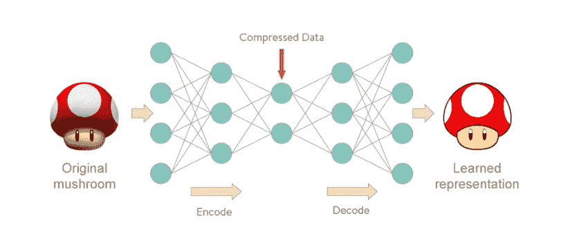

Figure 1: Neural network representation of Autoencoders

# 资料组

至于数据集，我们将使用 Kaggle 提供的信用卡交易数据集:【https://www.kaggle.com/mlg-ulb/creditcardfraud 

该数据集包括 284，807 笔交易。其中，492 笔交易被标记为欺诈。因此，数据集非常不平衡。它只包含数字变量。特性**‘时间’**包含数据集中每个事务和第一个事务之间经过的秒数。特征**‘金额’**是交易金额，该特征可用于依赖于示例的成本敏感学习。特征**‘类’**是响应变量，在欺诈的情况下取值 1，否则取值 0。

你可以在这里找到我的 Kaggle 内核:[https://www . ka ggle . com/mane esha 96/信用卡欺诈检测使用自动编码器](https://www.kaggle.com/maneesha96/credit-card-fraud-detection-using-autoencoders)

完整代码:[https://github.com/Mash96/Credit-Card-Fraud-Detection](https://github.com/Mash96/Credit-Card-Fraud-Detection)

那我们开始吧！！！

## 设置

我们今天将使用 H2O 作为 ML 平台。你可以在这里找到更多信息: [https://www.h2o.ai](https://www.h2o.ai)

```
import h2o
import matplotlib.pyplot as plt
from pylab import rcParams
import numpy as np # linear algebra
import pandas as pd # data processing, CSV file I/O (e.g. pd.read_csv)
import os
from h2o.estimators.deeplearning import H2OAutoEncoderEstimator, H2ODeepLearningEstimator
```

初始化 H2O 服务器

```
h2o.init(max_mem_size = 2) # initializing h2o server
h2o.remove_all()
```

使用 pandas 数据框加载数据集

```
creditData = pd.read_csv(r"File_Path\creditcard.csv") 
creditData.describe()
# H2O method# creditData_df = h2o.import_file(r"File_Path\creditcard.csv") 
```

## 探测

```
creditData.shape> (284807, 31)
```

检查数据集中的空值

```
creditData.isnull().values.any() # pandas method
# creditData_h2o.na_omit() # h2o method
# creditData_h2o.nacnt() # no missing values found> False
```

为了继续，我们需要将熊猫数据框架转换为 H2O 数据框架

```
# Turns python pandas frame into an H2OFrame
creditData_h2o  = h2o.H2OFrame(creditData)# Let’s plot the Transaction class against the Frequency
labels = [‘normal’,’fraud’]
classes = pd.value_counts(creditData[‘Class’], sort = True)
classes.plot(kind = ‘bar’, rot=0)
plt.title(“Transaction class distribution”)
plt.xticks(range(2), labels)
plt.xlabel(“Class”)
plt.ylabel(“Frequency”)
```

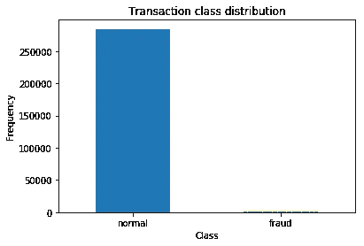

Figure 2

```
fraud = creditData[creditData.Class == 1]
normal = creditData[creditData.Class == 0]
# Amount vs Class
f, (ax1, ax2) = plt.subplots(2,1,sharex=True)
f.suptitle('Amount per transaction by class')ax1.hist(fraud.Amount, bins = 50)
ax1.set_title('Fraud List')ax2.hist(normal.Amount, bins = 50)
ax2.set_title('Normal')plt.xlabel('Amount')
plt.ylabel('Number of Transactions')
plt.xlim((0, 10000))
plt.yscale('log')
plt.show()
```

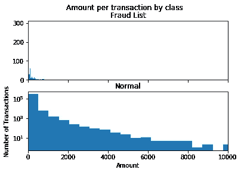

Figure 3

```
# time vs Amount
f, (ax1, ax2) = plt.subplots(2, 1, sharex=True)
f.suptitle('Time of transaction vs Amount by class')ax1.scatter(fraud.Time, fraud.Amount)
ax1.set_title('Fraud List')ax2.scatter(normal.Time, normal.Amount)
ax2.set_title('Normal')plt.xlabel('Time (in seconds)')
plt.ylabel('Amount')
plt.show()
```


Figure 4

```
#plotting the dataset considering the class
color = {1:'red', 0:'yellow'}
fraudlist = creditData[creditData.Class == 1]
normal = creditData[creditData.Class == 0]
fig,axes = plt.subplots(1,2)axes[0].scatter(list(range(1,fraudlist.shape[0] + 1)), fraudlist.Amount,color='red')
axes[1].scatter(list(range(1, normal.shape[0] + 1)), normal.Amount,color='yellow')
plt.show()
```

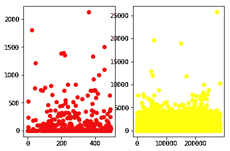

Figure 5: Frauds vs Normals

## 准备数据

*时间*变量对模型预测没有影响。这可以从数据可视化中搞清楚。在进入训练部分之前，我们需要弄清楚哪些变量是重要的，哪些是不重要的。所以我们可以去掉不需要的变量。

```
features= creditData_h2o.drop(['Time'], axis=1)
```

将数据帧分为训练集和测试集，其中 80%用于训练集，其余用于测试集。

```
train, test = features.split_frame([0.8])
print(train.shape)
print(test.shape)> (227722, 30)
> (57085, 30)
```

我们的数据集有很多非欺诈交易。由于这是为了模型训练，我们只发送非欺诈交易。以便模型能够学习正常交易的模式。

```
# converting to pandas dataframe
train_df = train.as_data_frame()
test_df = test.as_data_frame()train_df = train_df[train_df['Class'] == 0]
# drop the Class variable
train_df = train_df.drop(['Class'], axis=1)Y_test_df = test_df['Class'] # true labels of the testing settest_df = test_df.drop(['Class'], axis=1)train_df.shape> (227335, 29)
```

## 模型结构

```
train_h2o = h2o.H2OFrame(train_df) # converting to h2o frame
test_h2o = h2o.H2OFrame(test_df)
x = train_h2o.columns
```

当建立模型时，选择 4 个完全连接的隐藏层，每层具有[14，7，7，14]个节点。前两个用于**编码器**，后两个用于**解码器**。

```
anomaly_model = H2ODeepLearningEstimator(activation = "Tanh",
                               hidden = [14,7,7,14],
                               epochs = 100,
                               standardize = True,
                                stopping_metric = 'MSE', 
                                loss = 'automatic',
                                train_samples_per_iteration = 32,
                                shuffle_training_data = True,     
                               autoencoder = True,
                               l1 = 10e-5)
anomaly_model.train(x=x, training_frame = train_h2o)
```

## 模型评估

*变量重要性:*在 H2O 有一种特殊的方法来分析哪些变量对模型的影响更大。

```
anomaly_model._model_json['output']['variable_importances'].as_data_frame()
```

**可视化**

```
# plotting the variable importance
rcParams['figure.figsize'] = 14, 8
#plt.rcdefaults()
fig, ax = plt.subplots()

variables = anomaly_model._model_json['output']['variable_importances']['variable']
var = variables[0:15]
y_pos = np.arange(len(var))

scaled_importance = anomaly_model._model_json['output']['variable_importances']['scaled_importance']
sc = scaled_importance[0:15]

ax.barh(y_pos, sc, align='center', color='green', ecolor='black')
ax.set_yticks(y_pos)
ax.set_yticklabels(variables)
ax.invert_yaxis()
ax.set_xlabel('Scaled Importance')
ax.set_title('Variable Importance')
plt.show()
```

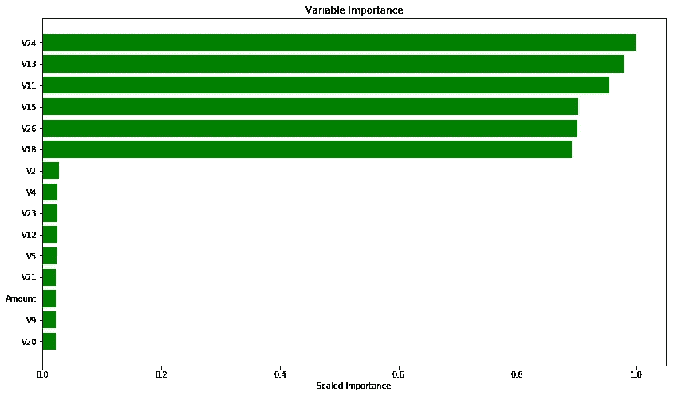

Figure 6

```
# plotting the loss
scoring_history = anomaly_model.score_history()
%matplotlib inline
rcParams['figure.figsize'] = 14, 8
plt.plot(scoring_history['training_mse'])
plt.title('model loss')
plt.ylabel('loss')
plt.xlabel('epoch')
```

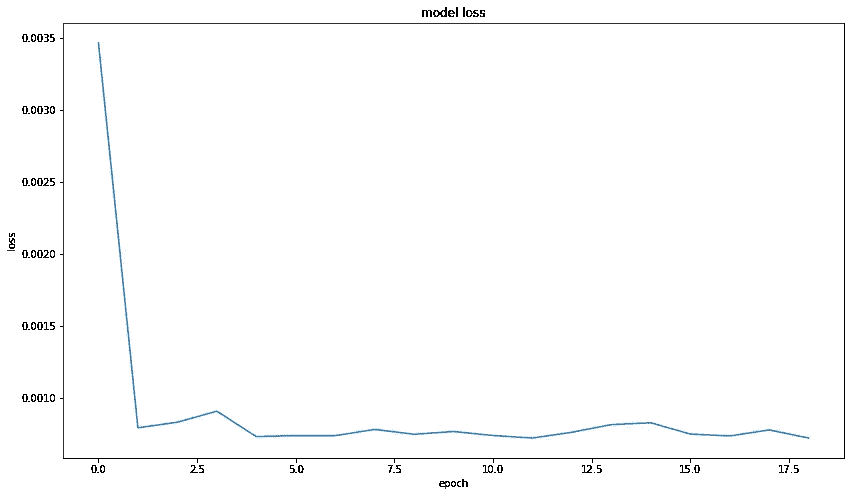

Figure 7

**测试集**包含正常交易和欺诈交易。自动编码器将学习识别输入数据的模式。如果异常测试点与学习的模式不匹配，则自动编码器在重构该数据时可能具有高错误率，从而指示异常数据。这样我们就能识别数据的异常。为了计算误差，它使用**均方误差** (MSE)

```
test_rec_error = anomaly_model.anomaly(test_h2o) 
# anomaly is a H2O function which calculates the error for the dataset# converting to pandas dataframe
test_rec_error_df = test_rec_error.as_data_frame()# plotting the testing dataset against the error
test_rec_error_df['id']=test_rec_error_df.index
rcParams['figure.figsize'] = 14, 8
test_rec_error_df.plot(kind="scatter", x='id', y="Reconstruction.MSE")
plt.show()
```

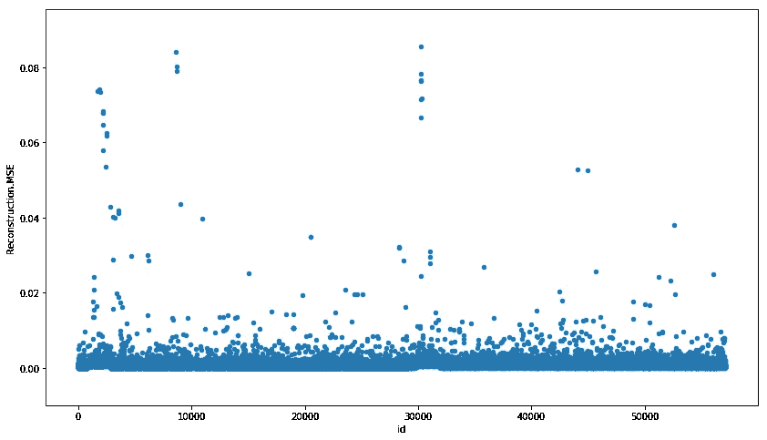

Figure 8: Anomalies in testing set

```
# predicting the class for the testing dataset
predictions = anomaly_model.predict(test_h2o)error_df = pd.DataFrame({'reconstruction_error': test_rec_error_df['Reconstruction.MSE'],
                        'true_class': Y_test_df})
error_df.describe()
```

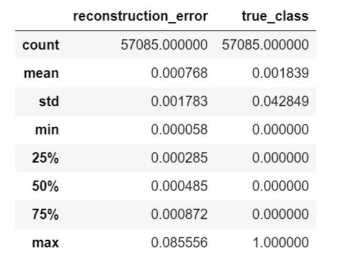

Figure 9

```
# reconstruction error for the normal transactions in the testing dataset
fig = plt.figure()
ax = fig.add_subplot(111)
rcParams['figure.figsize'] = 14, 8
normal_error_df = error_df[(error_df['true_class']== 0) & (error_df['reconstruction_error'] < 10)]
_ = ax.hist(normal_error_df.reconstruction_error.values, bins=10)
```


Figure 10

```
# reconstruction error for the fraud transactions in the testing dataset
fig = plt.figure()
ax = fig.add_subplot(111)
rcParams['figure.figsize'] = 14, 8
fraud_error_df = error_df[error_df['true_class'] == 1]
_ = ax.hist(fraud_error_df.reconstruction_error.values, bins=10)
```

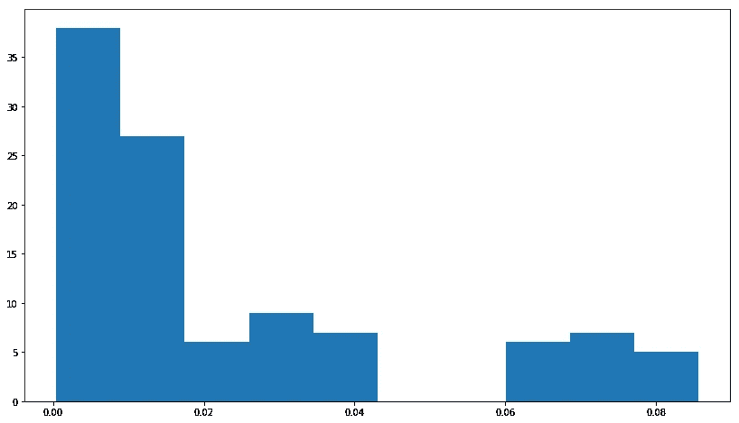

Figure 11

## 受试者工作特征曲线

```
from sklearn.metrics import (confusion_matrix, precision_recall_curve, auc,
                             roc_curve, recall_score, classification_report, f1_score,
                             precision_recall_fscore_support)
fpr, tpr, thresholds = roc_curve(error_df.true_class, error_df.reconstruction_error)
roc_auc = auc(fpr, tpr)plt.title('Receiver Operating Characteristic')
plt.plot(fpr, tpr, label='AUC = %0.4f'% roc_auc)
plt.legend(loc='lower right')
plt.plot([0,1],[0,1],'r--')
plt.xlim([-0.001, 1])
plt.ylim([0, 1.001])
plt.ylabel('True Positive Rate')
plt.xlabel('False Positive Rate')
plt.show();
```

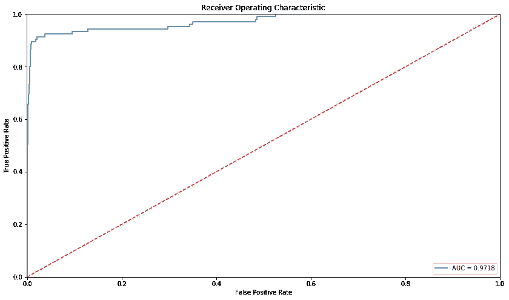

Figure 12

***精度*** 为 **0.9718**

## 精确度和召回率

由于数据是高度不平衡的，所以不能只用精度来衡量。选择精度与召回率作为分类任务的矩阵。

**精度**:测量所得结果的相关性。

[真阳性/(真阳性+假阳性)]

**回忆**:测量返回多少相关结果。

[真阳性/(真阳性+假阴性)]

**真阳性** —预测为欺诈的实际欺诈数量

**误报** —预测为欺诈的非欺诈数量

**假阴性** —预测为非欺诈的欺诈数量。

```
precision, recall, th = precision_recall_curve(error_df.true_class, error_df.reconstruction_error)
plt.plot(recall, precision, 'b', label='Precision-Recall curve')
plt.title('Recall vs Precision')
plt.xlabel('Recall')
plt.ylabel('Precision')
plt.show()
```

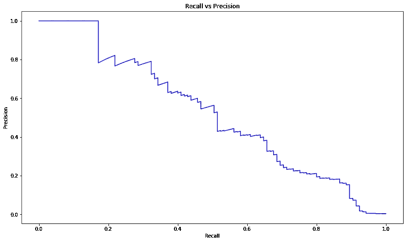

Figure 13

我们需要找到一个更好的阈值来区分异常和正常。这可以通过计算**精度/召回与阈值**图的交集来完成。

```
plt.plot(th, precision[1:], label="Precision",linewidth=5)
plt.plot(th, recall[1:], label="Recall",linewidth=5)
plt.title('Precision and recall for different threshold values')
plt.xlabel('Threshold')
plt.ylabel('Precision/Recall')
plt.legend()
plt.show()
```

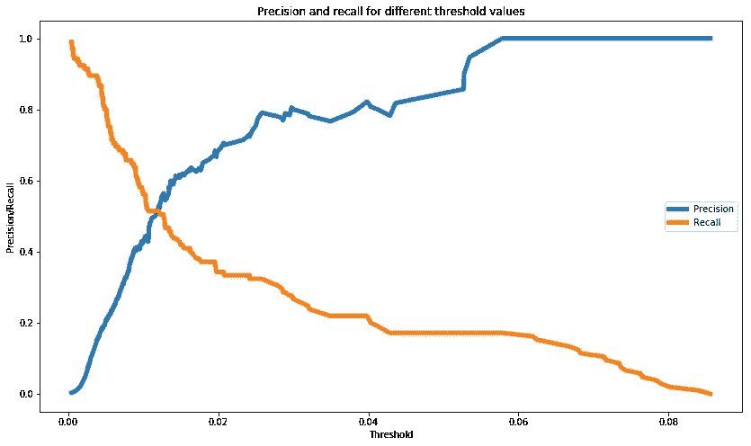

Figure 14

```
# plot the testing set with the threshold
threshold = 0.01
groups = error_df.groupby('true_class')
fig, ax = plt.subplots()for name, group in groups:
    ax.plot(group.index, group.reconstruction_error, marker='o', ms=3.5, linestyle='',
            label= "Fraud" if name == 1 else "Normal")
ax.hlines(threshold, ax.get_xlim()[0], ax.get_xlim()[1], colors="r", zorder=100, label='Threshold')
ax.legend()
plt.title("Reconstruction error for different classes")
plt.ylabel("Reconstruction error")
plt.xlabel("Data point index")
plt.show();
```

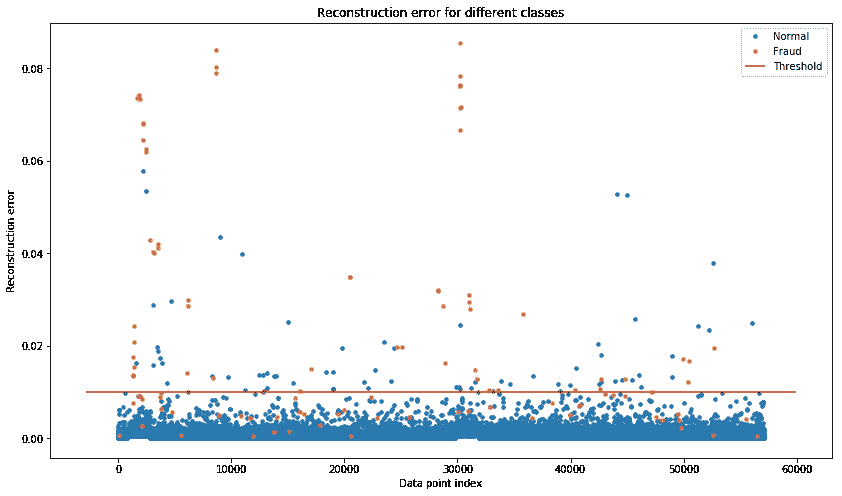

Figure 15

## 混淆矩阵

```
import seaborn as sns
LABELS = ['Normal', 'Fraud']
y_pred = [1 if e > threshold else 0 for e in error_df.reconstruction_error.values]
conf_matrix = confusion_matrix(error_df.true_class, y_pred)
plt.figure(figsize=(12, 12))
sns.heatmap(conf_matrix, xticklabels=LABELS, yticklabels=LABELS, annot=True, fmt="d");
plt.title("Confusion matrix")
plt.ylabel('True class')
plt.xlabel('Predicted class')
plt.show()
```

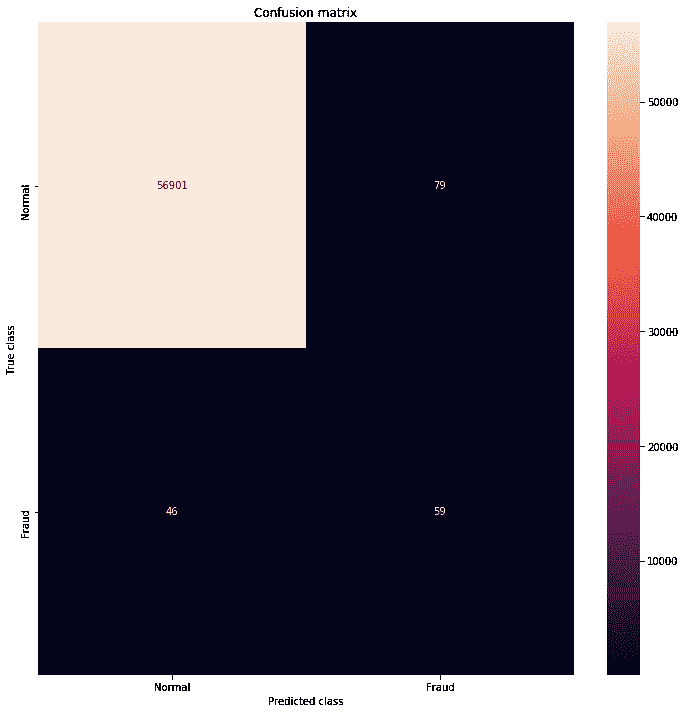

Figure 16

## 分类报告

```
csr = classification_report(error_df.true_class, y_pred)
print(csr)
```

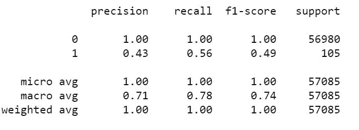

Figure 17

# 结论

我们的模型捕捉到了大部分欺诈数据。在自动编码器中，它提供了很好的准确性。但是，如果我们考察数据集的精度和召回率，它的性能还不够。正如我前面提到的，还有其他异常检测方法在高度不平衡的数据集中表现良好。

我在这个数据集上尝试了更多的方法。所以我很快会带着这些来见你。:)

## 参考

[https://medium . com/@ curiously/credit-card-fraud-detection-using-auto encoders-in-keras-tensor flow-for-hacker-part-VII-20 e0c 85301 BD](https://medium.com/@curiousily/credit-card-fraud-detection-using-autoencoders-in-keras-tensorflow-for-hackers-part-vii-20e0c85301bd)