# 交叉验证代码可视化:有点意思

> 原文：<https://towardsdatascience.com/cross-validation-code-visualization-kind-of-fun-b9741baea1f8?source=collection_archive---------3----------------------->

让我们**想象**来改善你的预测…

让我们说，你正在编写一个漂亮和干净的机器学习代码(例如线性回归)。你的代码是好的，首先你像往常一样用像 *train_test_split* 这样的函数和一些*随机因子把你的数据集分成两部分“训练集和测试集”。*如下图所示，您的预测可能会略微偏低或偏高。

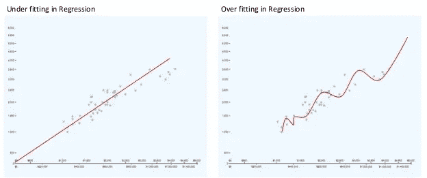

Fig:Under and Over-Fit Prediction

结果也没有改变。那么我们能做什么呢？

顾名思义，交叉验证是学习*线性回归*之后的下一件有趣的事情，因为它有助于使用 ***K 倍*** 策略来改进你的预测。你问的 K 倍是多少？下面用**代码**解释一切。

完整代码:)

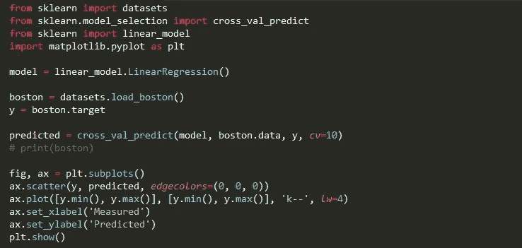

Fig:- Cross Validation with Visualization

代码洞察:

以上代码分为 4 个步骤…

1.  **加载**和**分割目标**数据集。

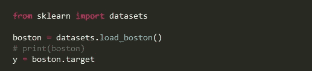

Fig:-Load the dataset

我们正在将数据集中的目标复制到 *y* 变量*中。*要查看数据集，取消 *print* 行的注释。

2.**型号选择**

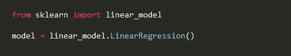

Fig:- Model Selection (LinearRegression())

为了简单起见，我们将使用线性回归。要了解更多信息，请点击“[线性回归:更简单的方法](https://medium.com/@sagarsharma4244/linear-regression-the-easier-way-6f941aa471ea)”帖子。

**3。交叉验证:)**

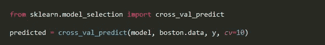

Fig:- Cross Validation in sklearn

这是一个过程，也是 sklearn 中的一个功能

***【cross _ val _ predict(模型，数据，目标，cv)***

在哪里，

***模型*** 是我们选择的要进行交叉验证的模型

***数据*** 是数据。

***目标*** 是 w.r.t .数据的目标值。

***cv*** (可选)为总折叠数(又名 *K-Fold* )。

在这个过程中，我们不像通常那样将数据分为两组(训练集和测试集)，如下所示。

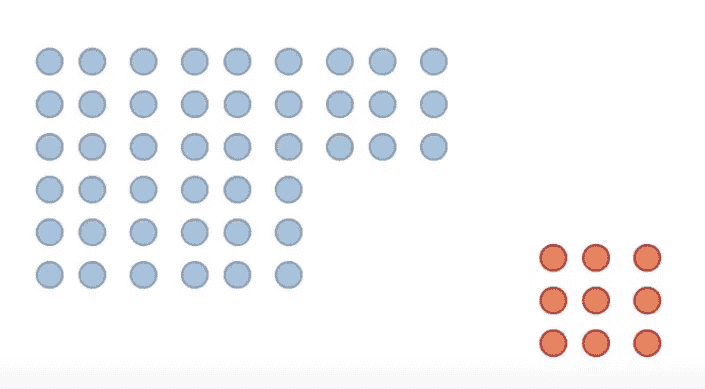

Fig:- Train set (Blue)and Test set (Red)

但是我们把数据集分成相等的 *K* 部分( *K 倍或者* ***cv*** )。**改进预测，更好地推广。**然后在较大的数据集上训练模型，在较小的数据集上测试。我们姑且说 ***cv*** 就是 **6。**

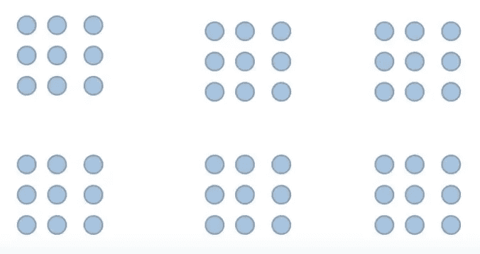

Fig:- 6 equal folds or parts

现在，模型分割的第一次迭代看起来像这样，红色是测试数据，蓝色是训练数据。

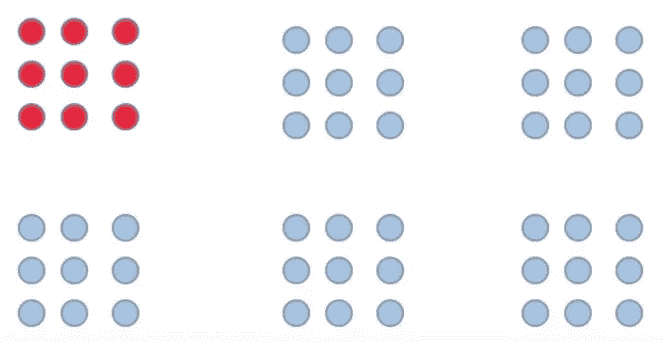

Fig:- cross_val first iteration

第二次迭代将如下图所示。

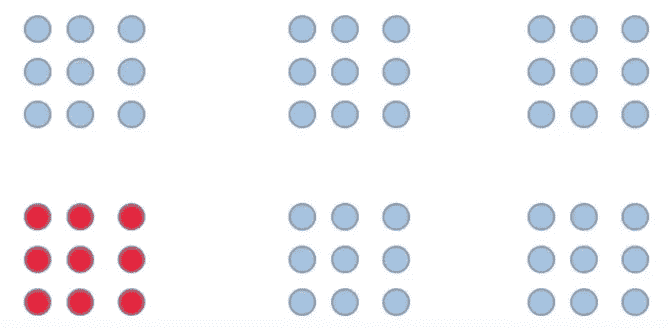

Fig:- cross_val second iteration

依此类推，直到最后一次或第六次迭代，看起来会像下图这样。

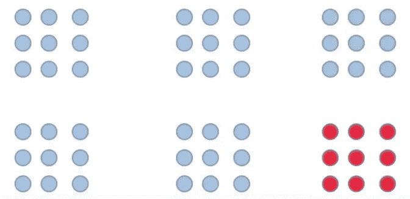

Fig:- cross_val sixth iteration

4.**用 **Matplotlib** 可视化**数据。

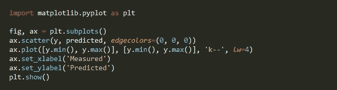

Fig:- Visualize with Matplotlib

为了可视化，我们正在导入 ***matplotlib*** 库。然后制作一个 ***支线剧情*** 。

用黑色(即(0，0，0))轮廓或*边缘颜色*创建 ***散点*** 。

使用 ***ax.plot*** 给出两轴的最小值&最大值，用“ ***k -*** ”表示线条的类型与线宽，即***lw*******= 4***。*

*接下来，给 x 和 y 轴加标签。*

****【PLT . show()】***最后显示图形。*

## *结果呢*

**

*Fig:- Prediction*

*此图显示了使用线性回归模型对波士顿数据集进行的 k 重交叉验证。*

*我确信人们实现了许多类型的交叉验证，但是 K-folds 是一个好的并且容易开始的类型。*

*要获得完整代码，请访问 github 链接: [Github](https://github.com/Sagarsharma4244/Cross-Validation)*

*关注我在[媒体](https://medium.com/@sagarsharma4244)获得类似的职位。*

*我将每周发布 2 篇帖子，所以不要错过**代码**教程。*

*在[脸书](https://www.facebook.com/profile.php?id=100003188718299)、[推特](https://twitter.com/SagarSharma4244)、 [Linkedin](https://www.linkedin.com/in/sagar-sharma-232a06148/) 、 [Google+](https://plus.google.com/+SAGARSHARMA4244) 上联系我。*

*任何评论或者如果你有任何问题，请写在评论里。*

***鼓掌吧！分享一下！跟我来。***

*乐意帮忙。荣誉……..*

# *你会喜欢的以前的故事:*

1.  *[激活功能解释:神经网络](https://medium.com/towards-data-science/activation-functions-neural-networks-1cbd9f8d91d6)*

*2.[线性回归:更简单的方法](https://medium.com/towards-data-science/linear-regression-the-easier-way-6f941aa471ea)*

*3. [DIY Arduino 无线键盘](https://medium.com/towards-data-science/linear-regression-the-easier-way-6f941aa471ea)*

*4.[感知器](https://medium.com/@sagarsharma4244/what-the-hell-is-perceptron-626217814f53)是什么鬼？*

*5.[Tensor flow 中的“张量”是什么鬼？](https://hackernoon.com/what-the-hell-is-tensor-in-tensorflow-e40dbf0253ee)*