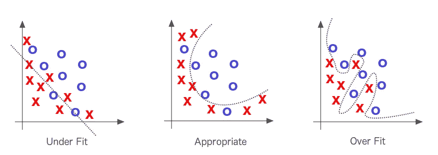
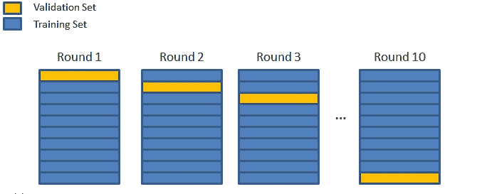
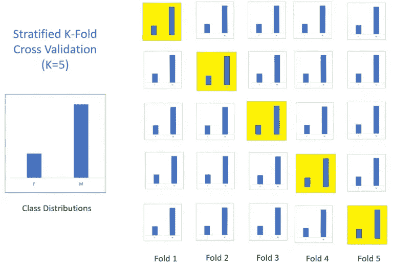
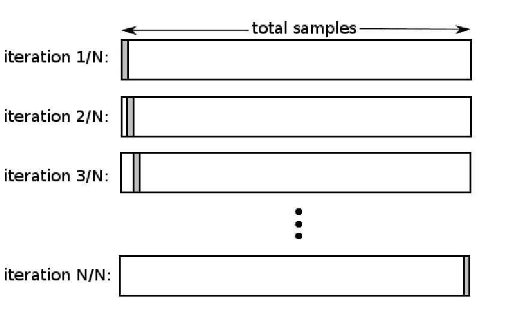
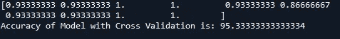

# 交叉验证解释:评估估计性能。

> 原文：<https://towardsdatascience.com/cross-validation-explained-evaluating-estimator-performance-e51e5430ff85?source=collection_archive---------1----------------------->

## 使用交叉验证改进你的 ML 模型。


机器学习工程师或数据科学家的最终目标是开发一个模型，以便根据新数据进行预测或根据未知数据预测未来的一些事件。好的模型不是对已知数据或训练数据给出准确预测的模型，而是对新数据给出良好预测并避免过拟合和欠拟合的模型。

完成本教程后，您将了解:

*   为什么要使用交叉验证是一个用来评估模型在新数据上的技巧的过程。
*   您可以使用一些常用策略来为数据集选择 k 值。
*   scikit-learn 中提供了交叉验证的常用变体，如分层和 LOOCV。
*   k 折叠交叉验证在 Python 中的实际实现

为了找到解决办法，我们应该首先了解这个问题。在我们开始理解交叉验证之前，让我们先理解过度拟合和欠拟合

## **了解欠拟合和过拟合:**

**过度拟合模型:**当统计模型或机器学习算法捕捉到数据的噪声时，就会发生过度拟合。直觉上，当模型或算法与数据拟合得太好时，就会发生过度拟合。

过度拟合模型导致训练数据集具有良好的准确性，但对新数据集的结果较差。这种模型在现实世界中没有任何用处，因为它不能预测新病例的结果。

**欠拟合模型:**当统计模型或机器学习算法无法捕捉数据的潜在趋势时，就会发生欠拟合。直观地说，当模型或算法与数据拟合得不够好时，就会出现拟合不足。拟合不足通常是模型过于简单的结果。简单是指缺少的数据没有得到正确处理，没有异常值处理，移除了不相关的特征或对预测变量没有太大贡献的特征。



## **如何解决过拟合问题:**

***答案是交叉验证***

过度拟合和一般机器学习的一个关键挑战是，在我们实际测试之前，我们无法知道我们的模型在新数据上的表现如何。

为了解决这个问题，我们可以将初始数据集分成单独的*训练*和*测试*子集。

有不同类型的交叉验证技术，但是总体概念是相同的，

**将数据分成若干子集**

****一次拿出一组，在剩余的一组上训练模型****

******等待装置上的测试模型******

*********对数据集的每个子集重复上述过程*********

********

****the process of cross validation in general****

## ******交叉验证的类型:******

******K 倍交叉验证******

******分层 K 折交叉验证******

******留一个交叉验证******

## ******让我们逐一了解每种类型******

## ******k 倍交叉验证:******

********

****该过程有一个称为 k 的参数，它指的是给定数据样本要被分成的组的数量。因此，该程序通常被称为 k 倍交叉验证。当选择了 k 的特定值时，它可以用来代替模型引用中的 k，例如 k=10 成为 10 重交叉验证。****

****如果 k=5，数据集将被分成 5 个相等的部分，下面的过程将运行 5 次，每次都使用不同的维持集。****

****1.将该组作为维持或测试数据集****

****2.将剩余的组作为训练数据集****

****3.在训练集上拟合模型，并在测试集上评估它****

****4.保留评估分数并丢弃模型****

****在上述过程的最后，使用模型评估分数的样本总结模型的技巧。****

> ******如何决定 k 的值？******
> 
> ****选择 k 的值，使得数据样本的每个训练/测试组足够大，以在统计上代表更广泛的数据集。****
> 
> ****k=10 的值在应用机器学习领域是非常常见的，如果您很难为数据集选择一个值，建议您使用它。****
> 
> ****如果选择的 k 值没有平均分割数据样本，则一个组将包含剩余的示例。优选地，将数据样本分成 k 个具有相同样本数量的组，使得模型技能得分的样本全部相等。****

## ******分层 k 折交叉验证:******

****与 K 倍交叉验证相同，只是略有不同****

****将数据分割成多个折叠可以由标准来控制，例如确保每个折叠具有相同比例的具有给定分类值(例如类结果值)的观察值。这被称为分层交叉验证。****

****在下图中，分层 k 倍验证是基于性别设置的，无论是男性还是女性****

********

****stratified k-fold cross validation****

## ******遗漏一个交叉验证(LOOCV):******

****这种方法在训练数据中留出 1 个数据点，即如果原始样本中有 n 个数据点，则 n-1 个样本用于训练模型，p 个点用作验证集。对原始样本可以这样分离的所有组合重复这一过程，然后对所有试验的误差进行平均，以给出总体有效性。****

****可能组合的数量等于原始样本中数据点的数量或 n。****

********

****representation of leave one out cross validation****

****交叉验证是评估模型有效性的一种非常有用的技术，尤其是在需要减轻过度拟合的情况下。****

## ******Python 中交叉验证的实现:******

****在使用交叉验证时，我们不需要单独调用 fit 方法，cross_val_score 方法在对数据实施交叉验证时拟合数据本身。下面是使用 k-fold 交叉验证的示例。****

```
***import pandas as pd
import numpy as np
from sklearn.metrics import accuracy_score, confusion_matrix
from sklearn.ensemble import RandomForestClassifier
from sklearn import svm
from sklearn.model_selection import cross_val_score
#read csv file**data  =  pd.read_csv("D://RAhil//Kaggle//Data//Iris.csv")**#Create Dependent and Independent Datasets based on our Dependent #and Independent features**X  = data[['SepalLengthCm','SepalWidthCm','PetalLengthCm']]
y= data['Species']**model = svm.SVC()**accuracy = cross_val_score(model, X, y, scoring='accuracy', cv = 10)
print(accuracy)**#get the mean of each fold 
print("Accuracy of Model with Cross Validation is:",accuracy.mean() * 100)***
```

******输出:******

********

****模型的精度是每个折叠精度的平均值。****

****在本教程中，您发现了我们为什么需要使用交叉验证，对不同类型的交叉验证技术的温和介绍，以及用于评估机器学习模型技能的 k-fold 交叉验证过程的实际示例。****

****具体来说，您学到了:****

*   ****交叉验证是一个用于避免过度拟合和评估模型对新数据的技能的过程。****
*   ****您可以使用一些常用策略来为数据集选择 k 值。****
*   ****scikit-learn 中提供了交叉验证的常用变体，如分层和重复。****

****如果你喜欢这个博客，给它一些 ***掌声*** 和 ***与你的朋友分享*** 它，你可以在这里 找到更多有趣的文章 [**，敬请关注更多有趣的机器学习技术和概念。**](https://medium.com/search?q=Rahil%20Hussain%20Shaikh)****