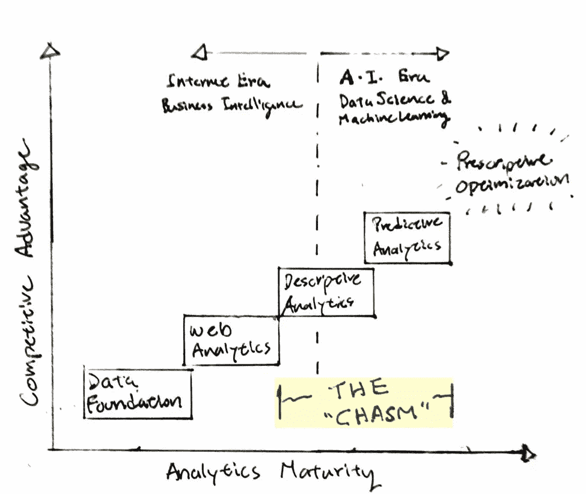
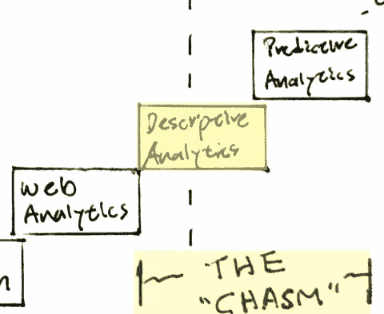
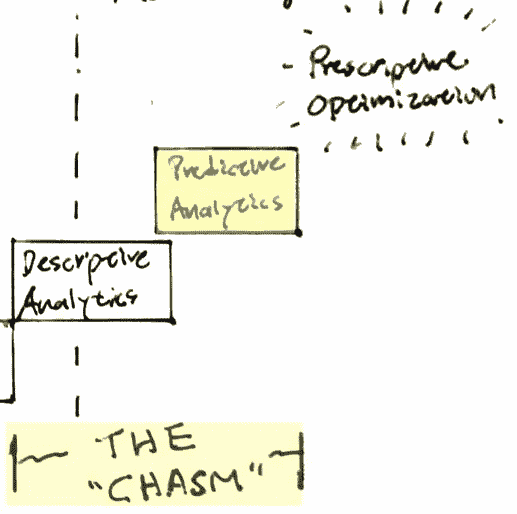
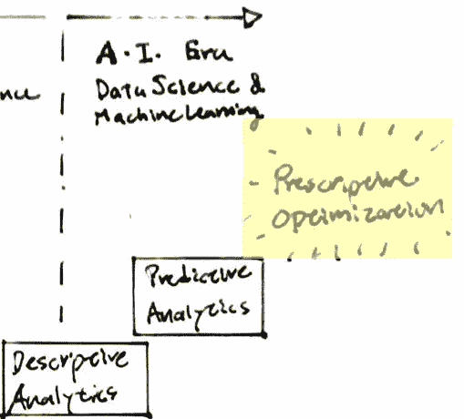

# 跨越您的数据科学鸿沟

> 原文：<https://towardsdatascience.com/crossing-your-data-science-chasm-f57d25393405?source=collection_archive---------4----------------------->

## 增长的分析路线图

场景——你是一家新兴的电子商务/SaaS 创业公司。你已经建立了你的网站，你已经对你的信息进行了 A/B 测试，你已经有了你的搜索引擎优化和社会广告购买。您已经设置了电子邮件点滴活动和提醒。您还可以获得基本的 BI 报告，了解渠道流量和转化率。流量还过得去，收入也在增长。你很可能处于最初的成长阶段；你穿着溜冰鞋飞翔，生意蒸蒸日上。你认为你找到了自己的声音；你在扩张。你在为更多的增长进行再投资；你在市场营销上投入了大量资金，事情似乎暂时进展顺利。

然后，交通突然慢了下来。广告购买不像以前那样有效了。促销仍然会带来一个高峰，但这是暂时的，短暂的。总体增长似乎无法度过难关，LTV 正在走下坡路，这意味着盈利需要两倍的时间。为什么？虽然可能有许多原因，但最有可能的原因是，随着时间的推移，过去一直有效的销售和营销引擎不可避免地开始变慢。著名成长黑客出身的风投[陈楚翔](https://twitter.com/andrewchen)解释了一个明显的“垃圾点击率定律”案例。

> *随着时间的推移，所有的营销策略都会导致糟糕的点击率。*
> 
> *—陈楚翔*

我们都听说过“[跨越鸿沟](https://en.wikipedia.org/wiki/Crossing_the_Chasm)”这个词:所有成功的技术产品最终都要跨越鸿沟；从早期用户跃升为主流消费者。找到产品与市场的契合度很难，而实现这一飞跃也并非易事。

比方说，你现在已经取得了你的第一个滩头阵地，不管你是从零开始，带着一个新奇的想法开始网上销售，还是你正在数字化改造你的线下业务。你已经建立了一批忠实的追随者，他们相信你的事业和你的品牌。要进入下一个层次，你必须密切关注内部运营的优化以及扩张的机会。现在比以往任何时候都更重要的是，拥有做出正确决策所需的所有信息，并进行更多的赢钱下注，而不是输钱下注。现在你必须更深入地思考，锻炼你以前从未想过要使用的数据肌肉。你需要知道谁是你的客户，他们什么时候可能购买，他们打算买什么——换句话说，从知道“发生了什么”到“为什么会发生”和“将会发生什么”，或者简而言之，预测分析。

这就是数据科学和机器学习发挥作用的地方。

但是等一下，你说，你已经研究过这个问题，但是在市场上找不到合理的现成解决方案。也许你试图雇用一名数据科学家，但发现很难找到人才/成本/技能的正确组合？或者也许你认为你所拥有的指标和你的决策已经足够好了，因为它们已经让你走了这么远，对吗？

这就是我想称之为**数据科学鸿沟**的东西——网络分析/BI 报告与预测分析之间的鸿沟。这就像从谷歌分析(Google Analytics)到谷歌 deep mind(alpha go 的)。

由于当今数据科学的不可及性，[购买与构建](https://www.forbes.com/sites/chuckcohn/2014/09/15/build-vs-buy-how-to-know-when-you-should-build-custom-software-over-canned-solutions/#5b37fec4c371)的典型选择失败了。由于人才短缺，商业先例稀缺，以及缺乏负担得起的解决方案，中小型企业经常发现自己被排除在数据科学和见解之外，而这些科学和见解可能会有所不同。

Google Analytics、Optimizely 和 Mixpanel 等产品试图填补网络分析和报告的空白。然而，高级分析和机器学习——以及更普遍的人工智能——仍然遥不可及。我们想改变这种情况。我们相信数据科学中人的因素。为了有效地跨越鸿沟，您需要获得专家的建议，以清晰地概括和解释要采取哪些步骤来实现这一目标。另一方面，你需要一个人来解释和负责结果，以及设计对你的业务有意义的上市。

为了帮助您入门，我们在这里提供了一个分析路线图，帮助您导航到下一个级别所需的内容。让我们一起穿越你的 **#DataScienceChasm** 。

# 描述性分析

对于即插即用工具，困难的部分是诊断问题。当一个指标上涨或下跌时，需要知识和经验来理解原因并回到正轨。商业智能和报告可以告诉你发生了什么，但要知道为什么你需要更深入。

描述性分析正好位于数据科学鸿沟的边缘——SaaS 工具可以解决这里和那里的问题，但许多问题需要经验丰富的眼睛。几种有用的分析和技术包括:

*   季节性和历史趋势
*   产品购买周期
*   促销和折扣有效性
*   用户细分和聚类
*   漏斗转换分析
*   市场篮子分析

大公司通常会有许多内部分析师全职致力于上述领域，以优化和加速他们的业务。在 LinkedIn，每个产品线都有广泛的用户细分和购买漏斗优化。例如，当您根据您的个人资料结账时，您可能会看到不同的订购产品。对于较小的公司来说，没有资源来雇佣全职分析师。需要通过 DSaaS(数据科学即服务)服务来跨越这一鸿沟，DSaaS 服务提供的分析和算法可以在不花费大量 R&D 的情况下立即交付结果，并缩短洞察时间。

# 预测分析

有效地跨越鸿沟进入高速增长是关于知道在哪里分配你的资源。如果你知道哪些用户更有可能购买你的产品呢？如果你知道接下来的几周将对你本季度的销售产生巨大的影响，你会怎么做？

你对某些事件或结果的概率越高，多活一年的机会就越大。一些预测分析包括:

*   用户获取倾向模型
*   回购或流失模式
*   用户终身价值预测
*   销售预测和促销计划
*   用户终身价值(LTV)

大公司甚至有更多的高级数据科学家在研究这些问题。数据是一大优势。如果你能够有效地利用数据来了解你的业务，并知道应该关注哪里，你将会成为前 1%的公司。

# 规定性优化

规定性优化是数据科学和机器学习的圣杯。想象一个全自动、自我学习、低代码部署的人工智能连接组件，这些组件根据实时购买行为和基于行动的协议对您的业务做出反应。

AI 处理订购、运输、定价、电子邮件和客户服务，为您的业务提供优化。
您可能需要的一些关键组件是:

*   动态更新产品层次结构
*   基于购买行为的目的驱动的产品类别
*   智能定价模型
*   自主人工智能在学习时更新规则和流程

在接下来的几周，我们将花更多时间深入探讨数据科学主题，为您简单解释它如何应用于您的业务。如果你有特别感兴趣的话题想看，请留下评论！

无论您在分析路线图的哪个位置，都有学习和改进的空间。数据科学的旅程是漫长的，但会飞速发展，最终，独角兽企业是值得努力的回报。如果有什么我们能帮忙的，请给我们写信！

( [*Tresl*](https://tresl.co/) *是一家 DSaaS 公司，专注于通过我们的专家数据科学家团队和即插即用人工智能驱动的产品来实现数据科学。*)

特别感谢 [George Dy](https://medium.com/@georgedyjr) 、 [Bruno Wong](https://medium.com/@brunowong) 的剪辑！

*原载于 2018 年 3 月 18 日*[*tresl.co*](https://tresl.co/crossing-your-data-science-chasm/)*。*