# 创业公司中的文化差异

> 原文：<https://towardsdatascience.com/cultural-nuances-in-startup-b6df7984af43?source=collection_archive---------11----------------------->

文化差异无处不在——学校、工作场所、人际关系，创业领域也不例外。不同地区的创业公司最看重什么概念或创意？创业公司在全球各地的营销方式不同吗？来自 RISE 2018 创业榜单的数据告诉了我们一些有趣的故事，从电梯推介到公关渠道。

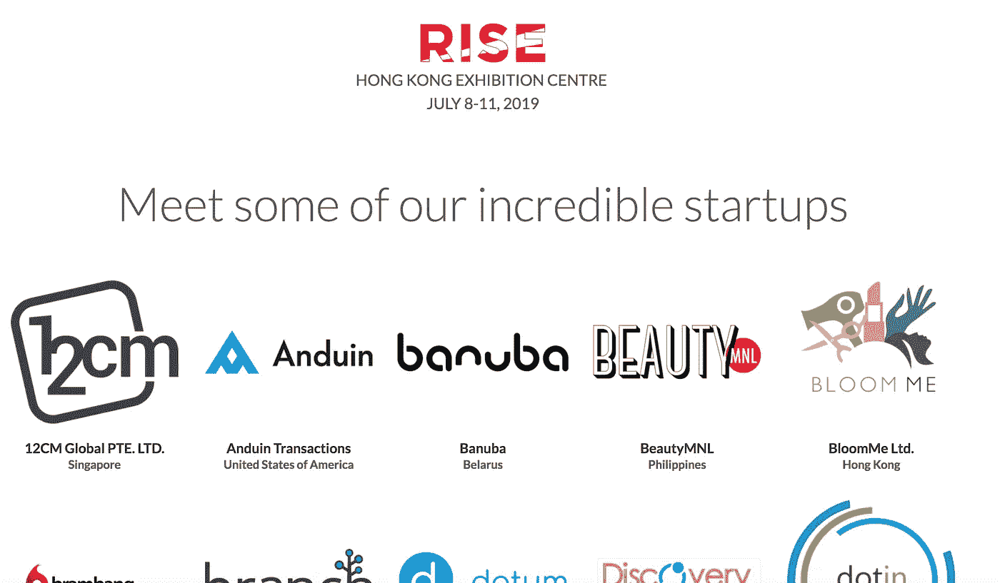

# 崛起大会

[RISE 2018](https://riseconf.com/) 是在香港举行的为期 4 天的科技大会，初创公司设立展台展示产品，投资者寻找具有高潜力的公司，行业领袖分享他们的见解。

今年，在为期 4 天的活动中，来自 58 个国家的 750 多家初创公司参展。香港吸引了超过 150 家本地初创企业参展，随后是印度、新加坡、马来西亚和美国。大多数公司总部设在亚洲，但我们也看到来自欧洲、南美和非洲不同大陆的公司。

**金融科技**和**电子商务&零售**是所有 25 个行业中最受欢迎的类别，分别有 104 家和 103 家公司加入。特别是香港的 Fintech 带来了 35 家公司，在所有地区-行业配对中名列榜首。

我去年 7 月去过那里，那真是大开眼界(至少对我来说)。今年我没有拿到门票，但我在 RISE 网站上找到的[数据](https://github.com/mr5iff/rise-2018-analysis/blob/master/raw_data/all.json)同样有趣，如果不是更多的话。

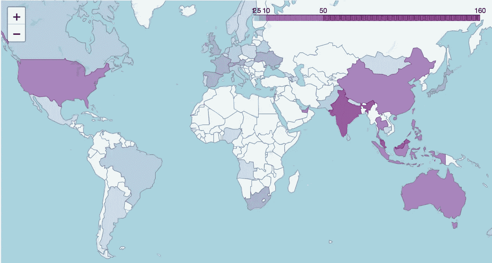

58 regions participated

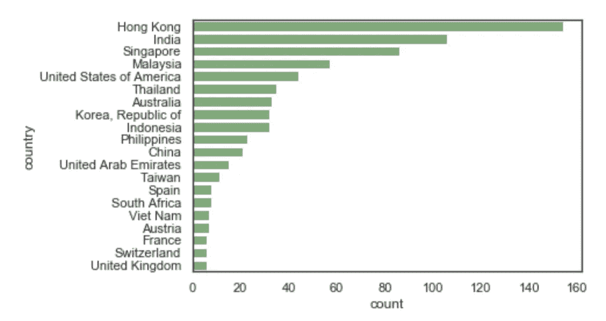

top 20 countries — most are based in Asia

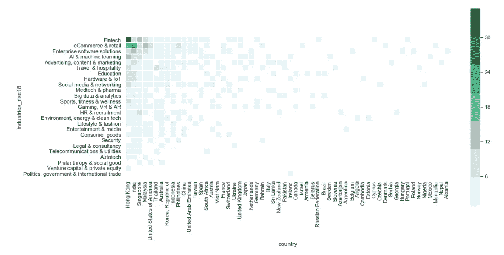

# 电梯推销术

有趣的部分开始了——所有的初创公司都被要求提供“电梯推介”

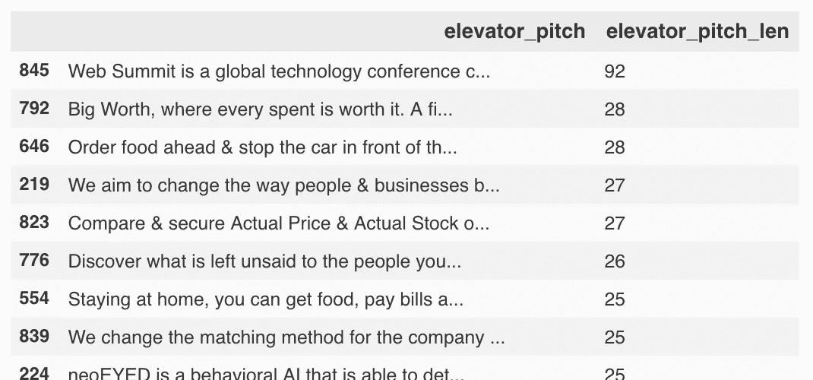

大多数公司给出了一个 17-18 个单词(平均值-中间值)的标语，概括了他们是谁以及他们提供了什么(可能与电梯推销中的预期不同)。但是有一个 outliner——[网络峰会](https://websummit.com/)——放一个 92 字的段落！

```
Web Summit is a global technology conference company headquartered in Dublin, Ireland. We run a series of international gatherings across the world. Our flagship event is Web Summit, currently held in Lisbon, Portugal. In the last eight years, Web Summit has grown from a small team to a company of over 200 focused on disrupting the conference industry through technology and data science. In 2018, over 100,000 startups, investors, speakers and attendees will gather at Web Summit events, including MoneyConf in Ireland, Collision in the North America and RISE in Hong Kong.
```

如果你不知道，网络峰会是举办 RISE 会议的团队。

## 嵌入产品线的概念

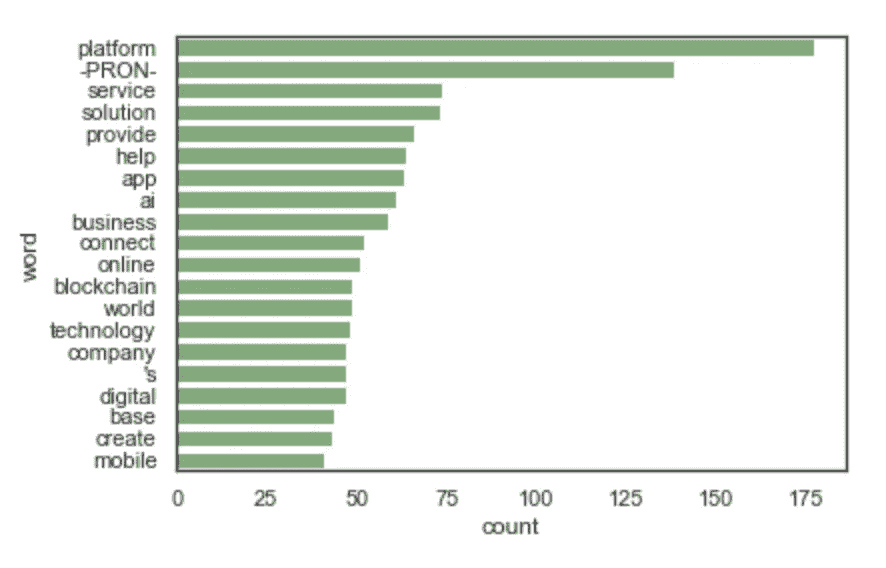

most common word stem (lemma)

以上是使用所有电梯营销中最常见的“单词”的公司数量(它们可能不是实际使用的单词，而是单词的基本形式——“lemma”)。

在常用词中，“平台”是使用频率最高的，有 177 家公司使用了这个词。平台创业永远不会老。还是平台即服务？

许多创业公司都包含类似“**服务**”、“**解决方案**”、“**提供**”、“**帮助**”这样的词语——提供服务和解决方案是许多创业公司想要传达给客户的一个关键理念。

毫无疑问，艾(排名第 8)和(排名第 12)名列前茅。也许几年后，人工智能将会名列榜首？或者另一种情况，只有少数公司会把“人工智能”放在他们的营销线上，因为它不再值得一提。

> [艾是新电](https://medium.com/syncedreview/artificial-intelligence-is-the-new-electricity-andrew-ng-cc132ea6264) —吴恩达

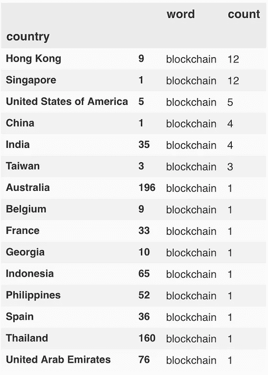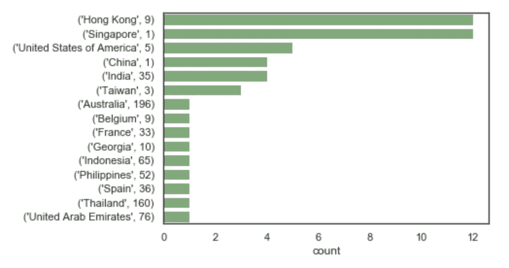

countries with startups using “blockchain” in their elevator pitch

除了人工智能，“区块链”是另一个热门主题，主要出现在香港和新加坡，每个城市都有 12 家公司的口号中包含这个词。**相对而言，“区块链”在新加坡更受欢迎，因为它在新加坡排名第二**，而在香港，它在电梯推介中仅排在第十位。

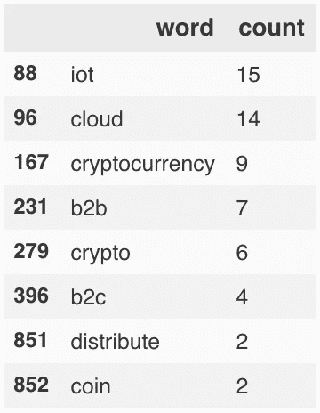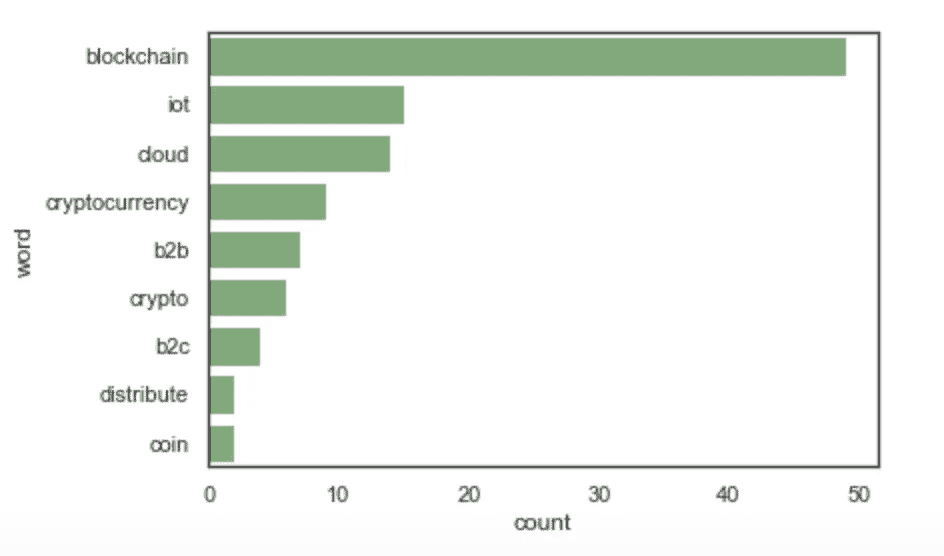

其他概念，如 IoT(物联网)、云和密码/加密货币(少于 15 家公司)等，没有最初预期的那么受欢迎。尤其是“区块链”和“密码”之间的受欢迎程度差距——这可能表明**的初创公司更愿意将自己推销为“区块链”公司，而不是“密码”公司。**

## 文化差异和行业趋势

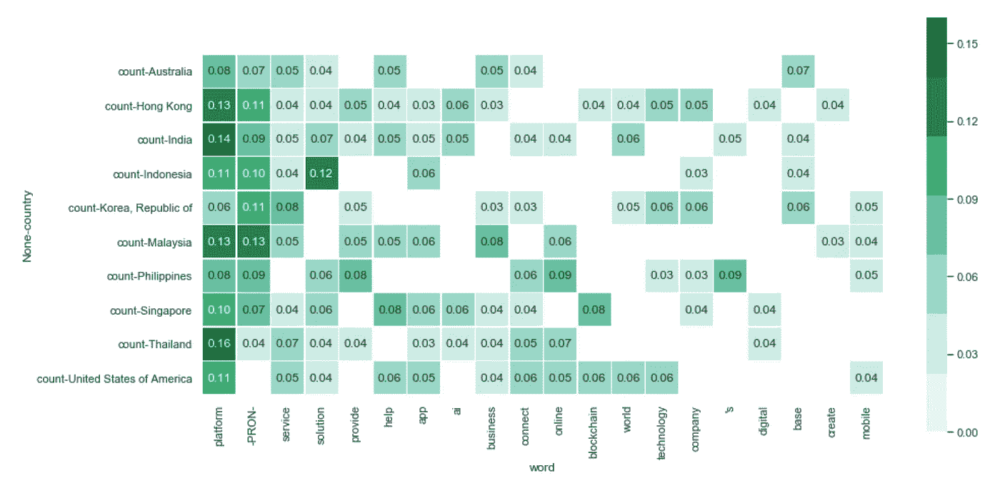

% of companies using the top 20 common words in each region

我们已经知道“**平台**”是初创公司非常常见的主题，在上面的热图中，我们确实观察到不同地区的一些相对偏好。泰国、印度、马来西亚、香港看起来更像是“平台”，在韩国相对没那么受欢迎(文化差异？).

这种分布确实反映了一些有趣的文化差异模式。韩国创业公司更侧重于“**我们**”(-PRON-)、“**服务**”和“**技术**”；印尼强调“**解决方案**”、“ **app** ”、“**平台**”；比起其他国家的初创公司，香港、印度、韩国和美国的公司更喜欢称之为“**世界**”；菲律宾“**上线**”，“有事**的**”，“有事**联系**”。

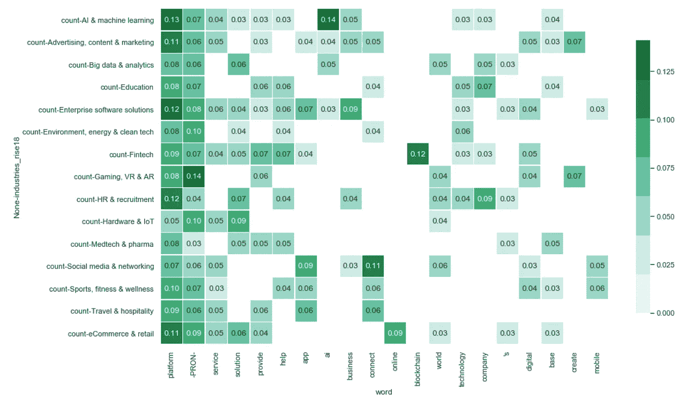

% of companies using the top 20 common words in each industry

对于行业的衡量标准也有几句话要说。如果你不是一家电子商务公司，声称自己是“**在线**”可能是多余的。硬件&物联网公司很可能是某个东西的**解决方案**。广告&营销、大数据以及企业解决方案初创公司正在将更多的 **AI** 概念应用到他们的产品中。如果你不是一家金融科技公司，但你确实想脱颖而出，考虑在你的电梯推介中加入“**区块链**”(如果这有意义的话)。

# 公关渠道

除了电梯推销之外，初创公司还被要求提供脸书、Twitter、Linkedin 等公关渠道的网址，以及像 [Crunchbase](https://www.crunchbase.com/) 和 [AngelList](https://angel.co/) 等初创平台的个人资料页面。

下面的热图显示了每个地区拥有相应公关渠道的*公司的百分比。(我认为，假设初创公司会填写表格是有道理的，如果他们维持这样的渠道，除非他们真的很懒……)*

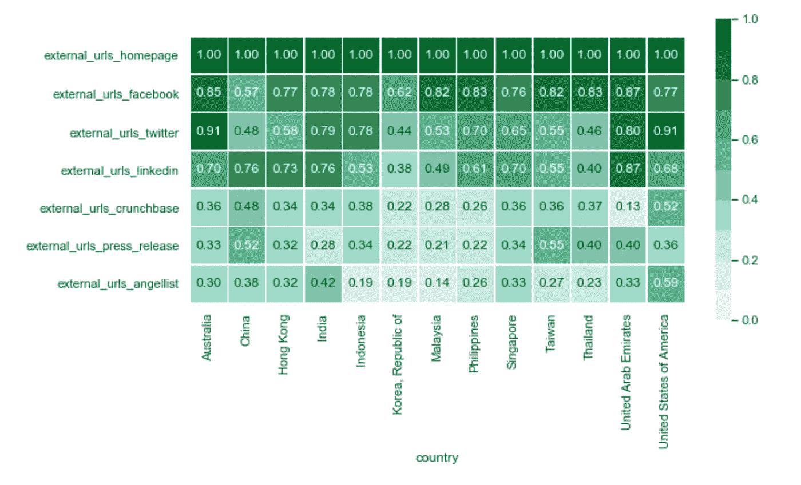

% of companies within each region having a certain PR channel

## 对社交媒体渠道(脸书、推特、Linkedin)的观察

#1: **脸书是许多东盟国家**(马来西亚、菲律宾、泰国)、台湾和香港的主要渠道。而美国和澳大利亚的公司似乎更关心 Twitter。

#2:乍一看，韩国的初创公司似乎不太依赖社交媒体作为公关渠道(排名最低)。虽然这可能是真的，但也可能是因为**本地化的社交媒体(Naver、Kakao 等)在韩国非常受欢迎**，因此脸书、Twitter 和 Linkedin 等西方世界的社交媒体可能不是他们的首选。

#2.5:中国也有与韩国相似的模式，但原因可能不同。**脸书和 Twitter 被中国的防火长城屏蔽了，但 Linkedin 没有，这解释了 Linkedin 比脸书和 Twitter 高出 20%的原因。**

## 对创业概况的观察(AngelList、Crunchbase、新闻稿)

#3: AngelList 在大多数地区的覆盖率似乎相对较低，尤其是在东盟国家、韩国和台湾。但 AngelList 在美国初创公司中更受欢迎(59%比 52%)，两家公司都是美国公司。

# 4:**中国大陆和台湾似乎比其他地区的同行更重视“新闻稿”**，都有超过 50%的公司提供新闻稿链接；另一方面，**美国公司不太关心“新闻稿”** (36%)，但在 AngelList (59%)和 Crunchbase (52%)中更看重初创公司简介。

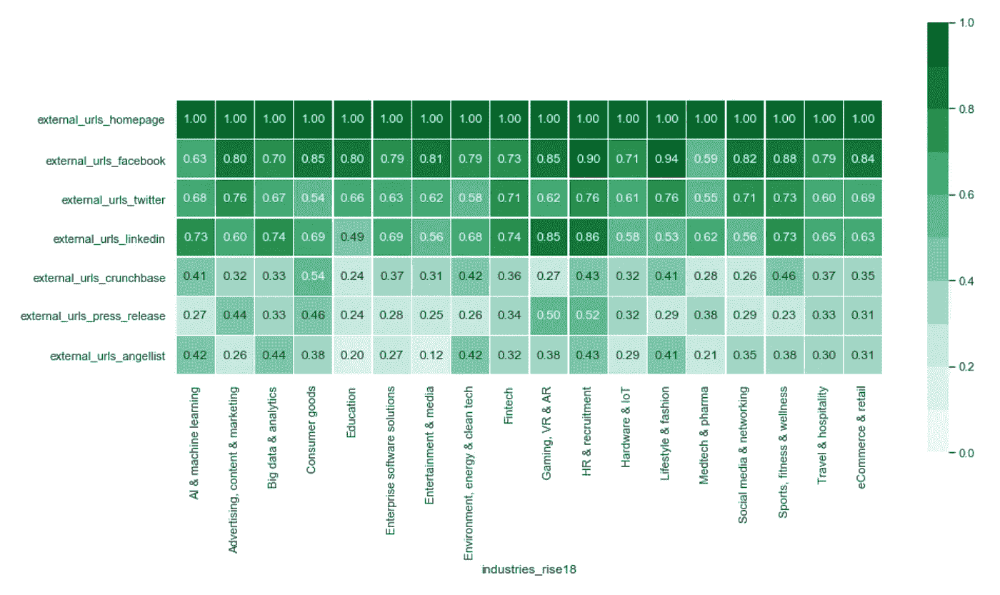

% of companies within each industry having certain PR channel

在行业方面，这种模式似乎更加明显。

对于生活时尚领域的初创公司来说，脸书几乎是必不可少的(94%)，而 Linkedin 个人资料更像是可选的(56%)。一般来说，医药创业公司做的公关最少，可能是因为他们的客户是关心实际技术的机构，受炒作和营销的影响较小。

在人工智能和机器学习领域，Linkedin 与(脸书+ Twitter)的相对重要性是相反的——也许他们的客户更加专业？(但我们没有在企业解决方案领域进行观察，因此这可能是一种过度解读)。

# **结论**

我发现一些趋势和观察像是“常识”——作为一个香港人，我知道 Twitter 不如脸书受欢迎，中国屏蔽了脸书和 Twitter。有些观察结果可能是过度解读，这是正常的，因为我们没有采用非常稳健的统计方法来得出这些观察结果。但一些见解确实激励我更深入地思考，并尝试联系我们现有的知识，比如韩国和中国的公关渠道。

数据和分析可以在[我的 github](https://github.com/mr5iff/rise-2018-analysis) 中找到。在[笔记本](https://github.com/mr5iff/rise-2018-analysis/blob/master/RISE2018_analysis.ipynb)中，我准备了一些交互式可视化(从交互式世界地图到使用单词嵌入的 t-SNE 可视化)，但后来我意识到没有办法将其嵌入到这篇文章中。但是我仍然在探索这个数据集的过程中获得了很多乐趣，我希望你也喜欢阅读这个。