# 好奇心驱动的学习变得容易第一部分

> 原文：<https://towardsdatascience.com/curiosity-driven-learning-made-easy-part-i-d3e5a2263359?source=collection_archive---------3----------------------->

> 本文是🕹️. tensor flow 深度强化学习课程的一部分点击查看教学大纲[。](https://simoninithomas.github.io/Deep_reinforcement_learning_Course/)

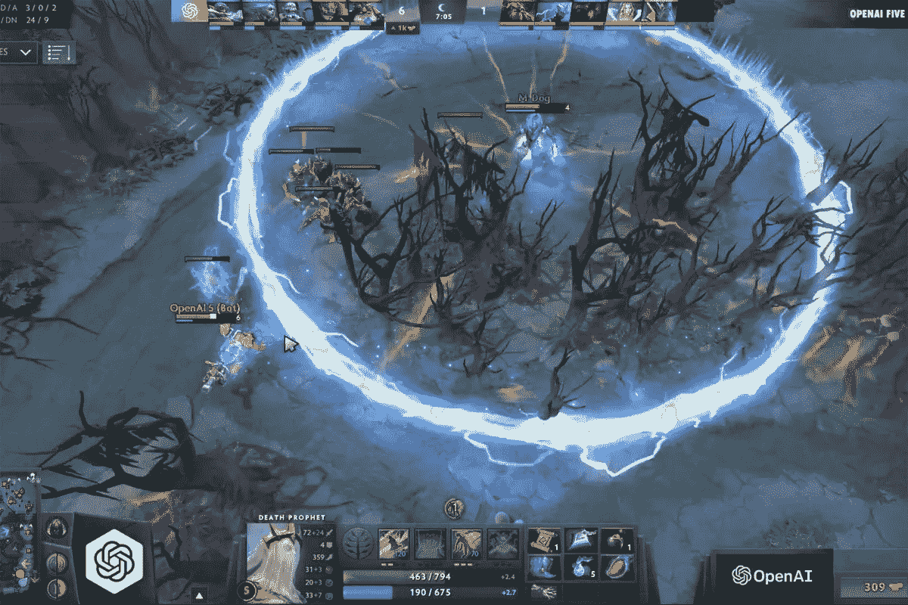

OpenAI Five contest

近年来，我们在深度强化学习方面看到了很多创新。从 2014 年的 [DeepMind 和深度 Q 学习架构](https://deepmind.com/research/dqn/)到 2018 年的 [OpenAI 与 OpenAI five 玩 dota 2](https://blog.openai.com/openai-five/)，我们生活在一个令人兴奋和充满希望的时刻。

今天我们将学习好奇心驱动的学习，**深度强化学习中最令人兴奋和最有前途的策略之一。**

强化学习基于[回报假设](https://medium.freecodecamp.org/an-introduction-to-reinforcement-learning-4339519de419)，即每个目标都可以被描述为回报的最大化。然而，当前外在奖励(即环境给予的奖励)的问题是**这个函数是由人硬编码的，不可扩展。**

好奇心驱动学习的想法是建立一个奖励函数，它是代理固有的**(由代理自身生成)。这意味着代理将是一个自学者，因为他既是学生，也是反馈大师。**

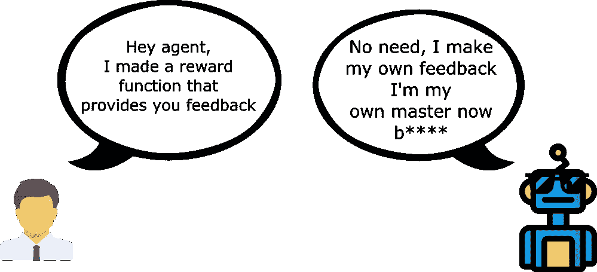

听起来很疯狂？是的，但这是一个天才的想法，在 2017 年的论文[通过自我监督预测的好奇心驱动的探索](https://pathak22.github.io/noreward-rl/)中再次提出。第二篇论文[好奇心驱动学习的大规模研究改善了结果。](https://pathak22.github.io/large-scale-curiosity/)

他们发现，好奇心驱动的学习代理表现得就像他们有外在奖励一样好，**并且能够更好地概括未探索的环境。**

> 编辑:自 90 年代以来，好奇心一直是强化学习研究的一个主题，J. Schmidhuber 先生的出色工作，你可以在这里阅读[。](http://people.idsia.ch/~juergen/interest.html)

在第一篇文章中，我们将讨论这个理论，并解释好奇心如何在理论上驱动学习。

然后，在第二篇文章中，我们将实现一个好奇心驱动的 PPO 代理来玩超级马里奥兄弟。

听起来很有趣？让我们开始吧！

# 强化学习中的两个主要问题

现代 RL 面临两个问题:

首先，**稀疏奖励或不存在奖励问题**:即大多数奖励不包含信息，因此被设置为零。然而，由于奖励是对 RL 代理的反馈，如果他们没有收到任何反馈，他们对哪种行为是适当的(或不适当的)的知识不会改变。

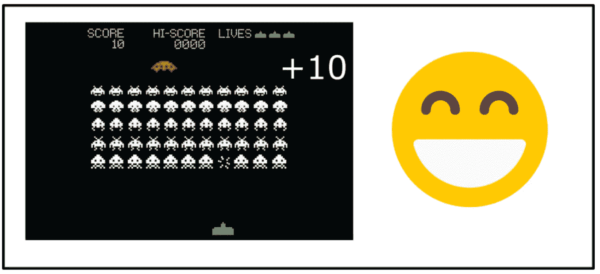

Thanks to the reward, our agent knows that this action at that state was good

例如，在 Vizdoom“末日家园”中，你的代理只有在找到防弹衣时才会得到奖励。但是，马甲离你的起点很远，所以你的大部分回报会是零。

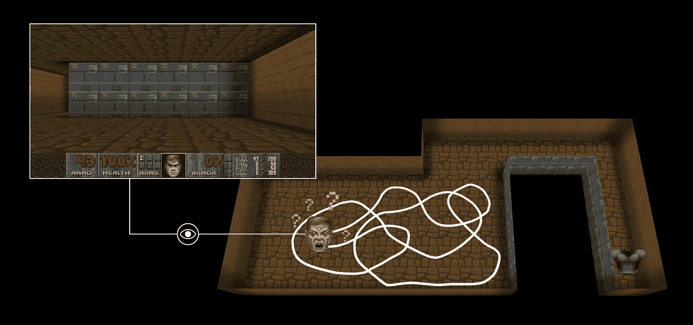

[A big thanks to Felix Steger for this illustration](https://vimeo.com/felixsteger)

因此，如果我们的代理没有收到有用的反馈(密集奖励)，它将需要更长的时间来学习一个最优策略。

第二个大问题是**外在奖励函数是手工制作的——也就是说，在每个环境中，一个人必须实现一个奖励函数**。但是我们如何在大而复杂的环境中扩展它呢？

# 一个新的奖励函数:好奇心

好奇心是一种内在的奖励，它等于我们的代理人在给定其当前状态的情况下预测其自身行为后果的**误差(也就是在给定当前状态和采取的行动的情况下预测下一个状态)。**

为什么？因为好奇的想法是**鼓励我们的代理人采取行动，减少代理人预测其自身行动结果的能力的不确定性**(在代理人花费较少时间的区域**、或具有复杂动态的区域**，不确定性会更高)。

因此，测量误差需要**建立环境动力学模型，在给定当前状态和行动 a 的情况下预测下一个状态。**

> 这里我们可以问的问题是，如何计算这个误差？

为了计算好奇心，我们将使用第一篇论文中介绍的一个模块，称为内在好奇心模块。

# 介绍内在好奇心模块

## 需要一个好的特征空间

在开始描述模块之前，我们必须问自己**给定我们当前的状态和我们的动作，我们的代理如何预测下一个状态？**

我们知道，我们可以将好奇心定义为给定我们的状态 st 和动作 at 的预测新状态(st+1)与真实新状态之间的误差。

但是，请记住，大多数时候，我们的状态是 4 帧(像素)的堆栈。这意味着我们需要找到一种方法来预测下一个帧堆栈，这非常困难，原因有二:

首先，很难直接预测像素，想象你在厄运中你向左移动，你需要预测 248*248 = 61504 像素！

第二，研究人员认为这不是正确的做法，并举了一个好例子来证明这一点。

想象一下，你需要研究树叶在微风中的运动。首先，对微风建模已经很难，因此在每个时间步预测每片树叶的像素位置要困难得多。

问题是，因为你总是有一个大的像素预测误差，代理将总是好奇，即使树叶的移动不是代理动作的结果**，因此它的持续好奇是不可取的。**

Trying to predict the movement of each pixel at each timeframe is really hard

因此，我们**需要将原始的感觉输入(像素阵列)转换成一个只有相关信息的特征空间，而不是在原始的感觉空间(像素)中进行预测。**

我们需要定义什么规则必须尊重一个好的特征空间，有 3 个:

*   需要对代理可以控制的**事物进行建模。**
*   还需要对代理无法控制但**可以影响代理的事情进行建模。**
*   需要不受不受代理人控制且对其没有影响的事情的影响。

举个例子，你的代理是一辆汽车，如果我们想创建一个好的特征表示，我们需要建模:

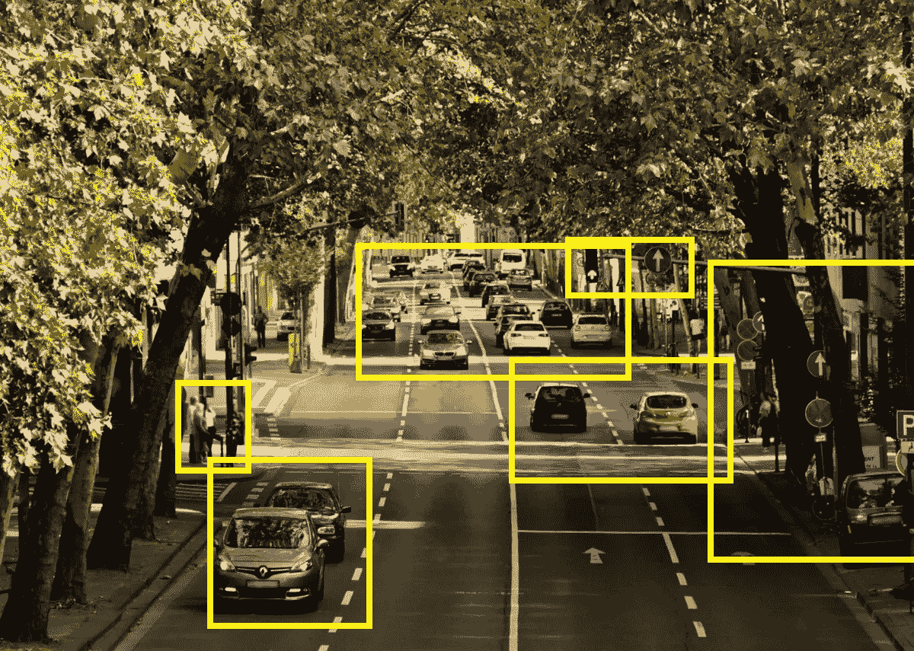

The yellow boxes are the important elements

我们的车(由我们的代理控制)，其他的车(我们不能控制但可以影响代理)但我们不需要对树叶建模(不影响代理我们也不能控制)。通过这种方式，我们将获得噪声更少的要素制图表达。

期望的嵌入空间应该:

*   在尺寸上要紧凑(去掉观察空间中不相关的部分)。
*   保存足够的观察信息。
*   稳定:**因为不稳定的奖励让强化代理很难学习。**

## 内在好奇心模块

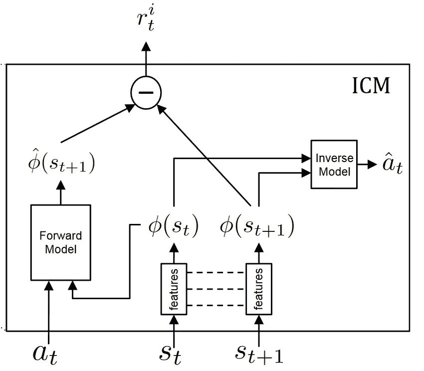

ICM Taken from the [Paper](https://pathak22.github.io/noreward-rl/resources/icml17.pdf)

内在好奇心模块是帮助我们产生好奇心的系统**。**由两个神经网络组成。

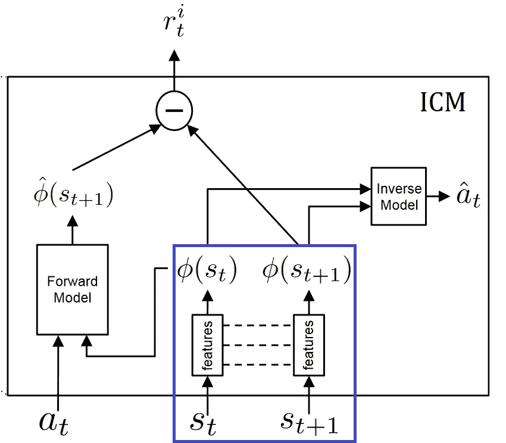

请记住，我们只想预测环境中的变化**，这些变化可能是由于我们的代理的行为引起的，或者会影响代理，而忽略其他变化。**这意味着，我们需要将感觉输入**转换成一个特征向量，其中只表示与代理执行的动作相关的信息，而不是从原始感觉空间(像素)进行预测。**

为了学习这个特征空间:我们**使用自我监督**，在给定代理的当前和下一个状态(st 和 st+1)的情况下，在预测代理动作(t)的代理逆动力学任务上训练神经网络。

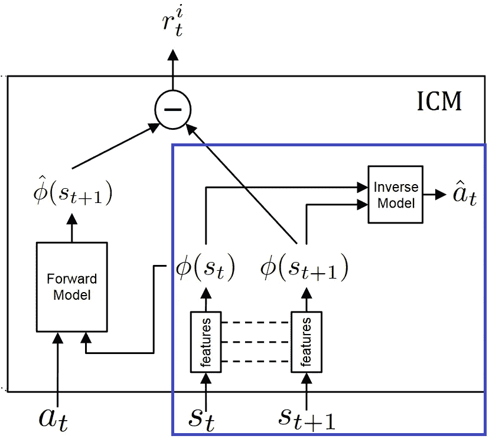

Inverse Model Part

由于神经网络仅需要预测动作，**它没有动机在其特征嵌入空间内表示环境中不影响代理本身的变化因素。**

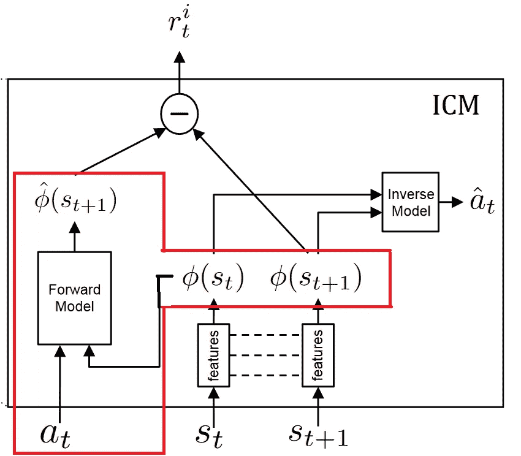

Forward Model Part

然后，我们使用该特征空间来训练前向动力学模型，该模型在给定当前状态 phi(st)和动作 at 的特征表示的情况下，预测下一状态 phi(st+1)，**的未来表示。**

并且我们将正向动力学模型的预测误差提供给代理**作为鼓励其好奇心的内在奖励。**

好奇心=预测值 _phi(st+1) — phi(st+1)

因此，ICM 中有两种模型:

*   *逆模型*(蓝色):将状态 st 和 st+1 编码成特征向量 phi(st)和 phi(st+1)，训练成预测动作βt

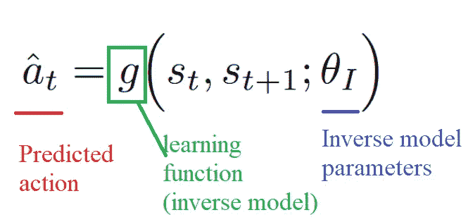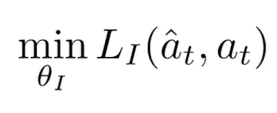

Inverse Loss function that measures the difference between the real action and our predicted action

*   *正向模型*(红色):以 phi(st)和 at 为输入，预测 st+1 的特征表示 phi(st+1)。

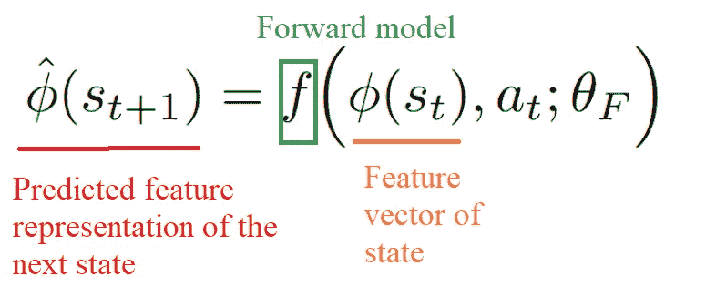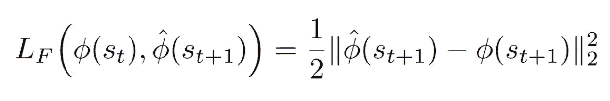

Forward Model Loss function

那么从数学上来说，好奇心将是我们预测的下一个状态的特征向量和下一个状态的真实特征向量之差。

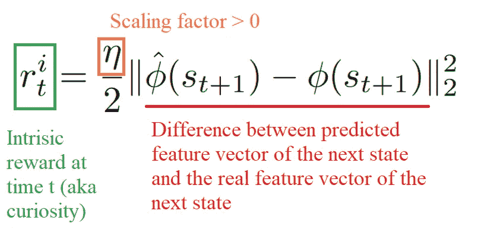

最后，该模块的整体优化问题是反向损耗、正向损耗的组合。

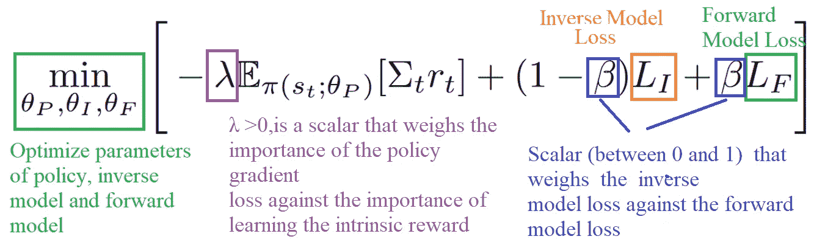

那真是浪费了大量的信息和数学！

概括一下:

*   由于外部奖励实现和稀疏奖励问题，**我们想要创建一个对代理来说是内在的奖励。**
*   为了做到这一点，我们创造了好奇心，**，这是代理在给定其当前状态的情况下预测其行为后果的错误。**
*   使用好奇号将促使我们的智能体**倾向于预测误差较高的转换**(在智能体花费时间较少的区域或动态复杂的区域**预测误差较高)，从而更好地探索我们的环境。**
*   但是因为我们不能通过预测下一帧来预测下一个状态(太复杂了)，所以我们使用了一个**更好的特征表示，它将只保留可以由我们的代理控制或影响我们的代理的元素。**
*   为了产生好奇心，我们使用由两个模型组成的内在好奇心模块:**逆模型**用于学习状态和下一状态的特征表示，以及**正向动力学**模型用于产生下一状态的预测特征表示。
*   好奇号将等于预测φ(ST+1)(正向动力学模型)和φ(ST+1)(反向动力学模型)之间的差值

**今天就到这里吧！既然你理解了这个理论，你应该阅读两篇论文实验结果[好奇心驱动的自我监督预测探索](https://pathak22.github.io/noreward-rl/) [和好奇心驱动学习的大规模研究。](https://pathak22.github.io/large-scale-curiosity/)**

**下一次，我们将实现一个 PPO 代理，使用好奇心作为内在奖励来玩超级马里奥兄弟。**

**如果你喜欢我的文章，请点击👏只要你喜欢这篇文章，其他人就会在媒体上看到。别忘了跟着我！**

**如果你有任何想法，评论，问题，欢迎在下面评论或者给我发邮件:hello@simoninithomas.com，或者发推特给我。**

************

**不断学习，保持牛逼！**

## **Tensorflow 🕹️深度强化学习课程**

**📜[教学大纲](https://simoninithomas.github.io/Deep_reinforcement_learning_Course/)**

**📹[视频版](https://www.youtube.com/channel/UC8XuSf1eD9AF8x8J19ha5og?view_as=subscriber)**

**第一部分:[强化学习简介](https://medium.com/p/4339519de419/edit)**

**第 2 部分:[用 Q-Learning 更深入地研究强化学习](https://medium.freecodecamp.org/diving-deeper-into-reinforcement-learning-with-q-learning-c18d0db58efe)**

**第 3 部分:[深度 Q 学习简介:让我们玩毁灭战士](https://medium.freecodecamp.org/an-introduction-to-deep-q-learning-lets-play-doom-54d02d8017d8)**

**第 3 部分+: [深度 Q 学习的改进:决斗双 DQN，优先体验重放，固定 Q 目标](https://medium.freecodecamp.org/improvements-in-deep-q-learning-dueling-double-dqn-prioritized-experience-replay-and-fixed-58b130cc5682)**

**第 4 部分:[关于带有厄运和翻转的政策梯度的介绍](https://medium.freecodecamp.org/an-introduction-to-policy-gradients-with-cartpole-and-doom-495b5ef2207f)**

**第五部分:[优势演员介绍评论家方法:我们来玩刺猬索尼克吧！](https://medium.freecodecamp.org/an-intro-to-advantage-actor-critic-methods-lets-play-sonic-the-hedgehog-86d6240171d)**

**第 6 部分:[刺猬索尼克 2 和 3 的近似策略优化(PPO)](/proximal-policy-optimization-ppo-with-sonic-the-hedgehog-2-and-3-c9c21dbed5e)**