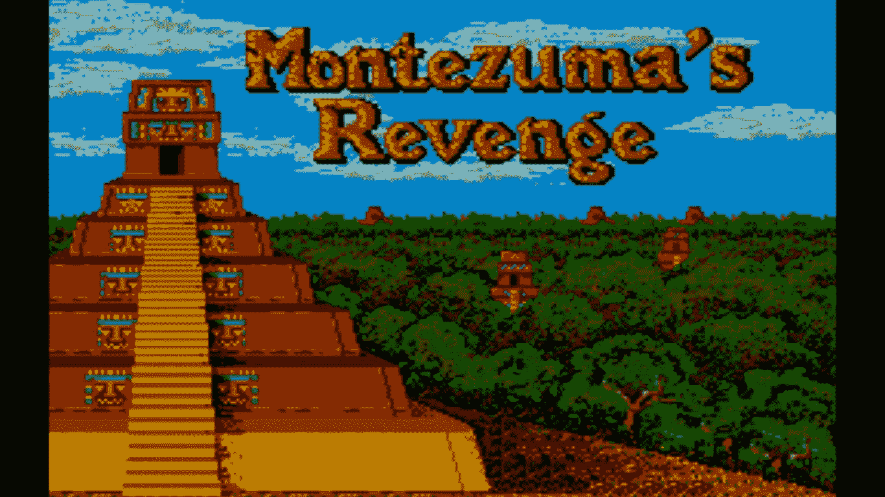
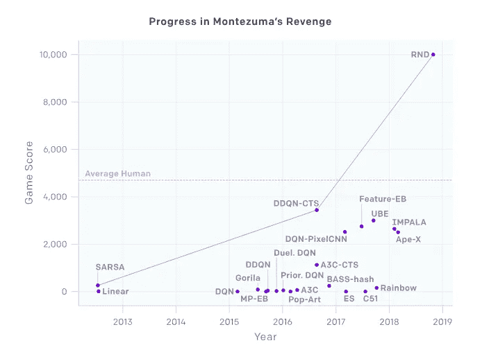
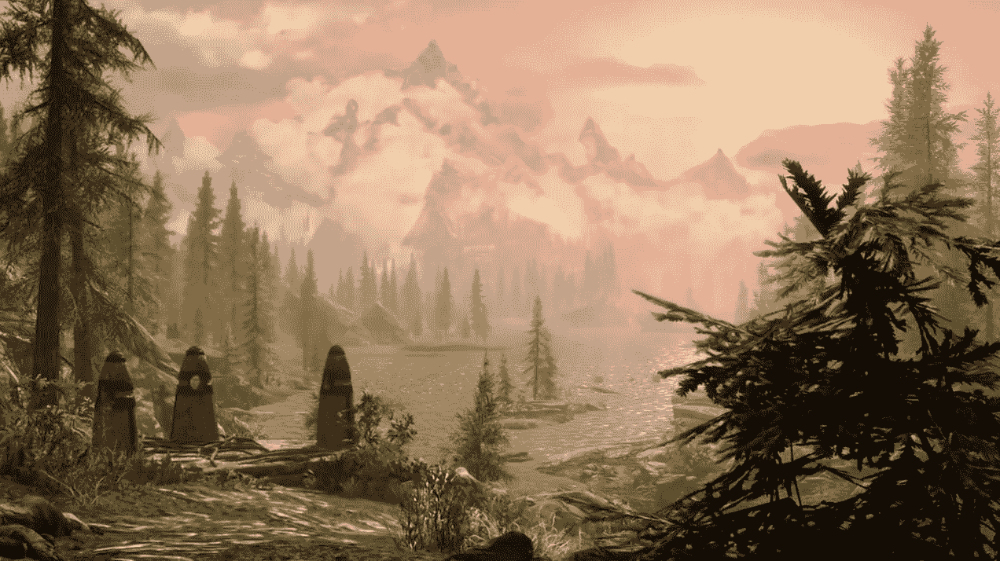
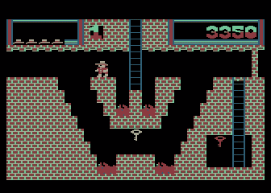
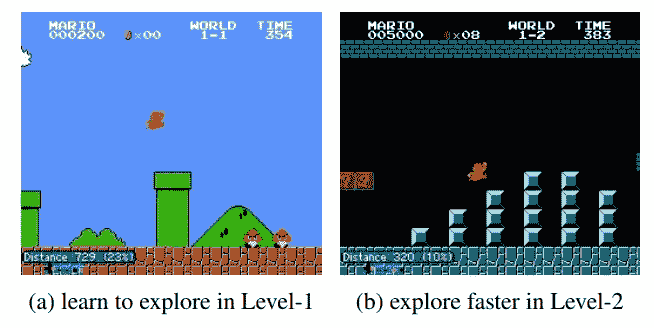
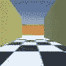
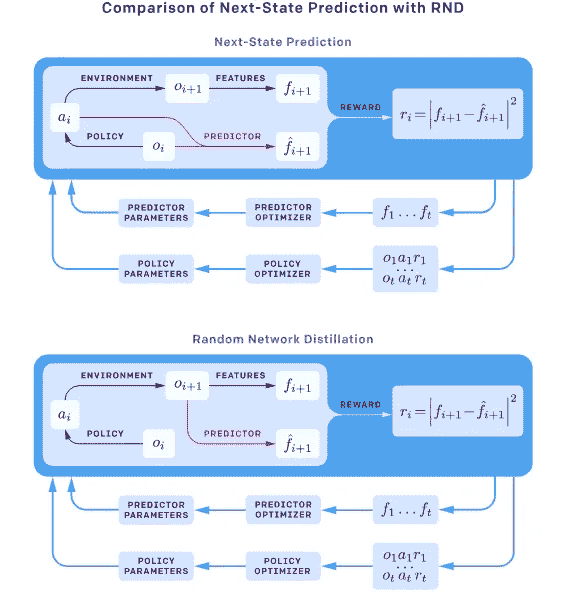
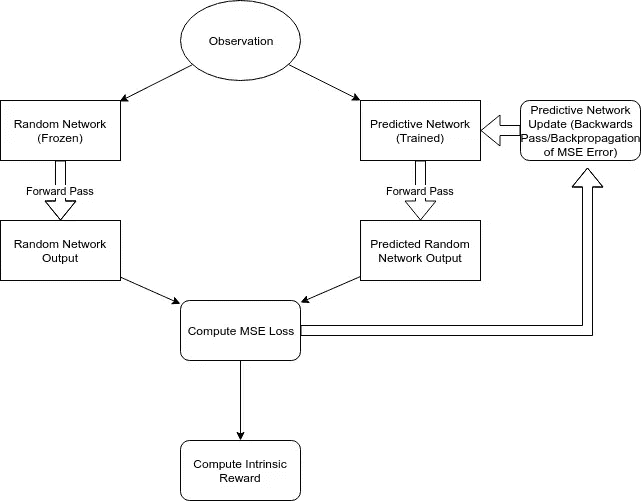
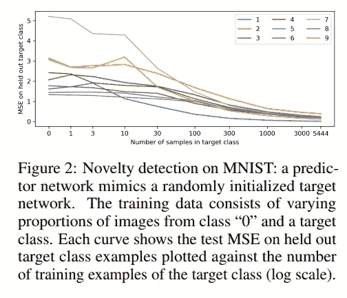

# 深度强化学习中的好奇心

> 原文：<https://towardsdatascience.com/curiosity-in-deep-reinforcement-learning-understanding-random-network-distillation-747b322e2403?source=collection_archive---------8----------------------->

## 理解随机网络蒸馏

Learning to play Montezuma’s Revenge, a previously difficult deep RL task, has seen big breakthroughs with Exploration by Random Network Distillation (source: [Parker Brothers Blog](http://atariage.com/forums/blog/729/entry-14810-montezumas-revenge-parker-brothers/))

学习玩 Atari 游戏是深度强化学习(RL)算法的一个流行的基准任务。这些游戏在简单性和复杂性之间提供了一个很好的平衡:一些游戏(如 [Pong](https://gym.openai.com/envs/Pong-v0/) )足够简单，可以用基本算法解决，如[香草政策梯度](http://karpathy.github.io/2016/05/31/rl/)，而其他游戏足够复杂，以至于[甚至可以难倒最先进的算法](https://www.washingtonpost.com/news/innovations/wp/2015/02/25/5-classic-atari-games-that-totally-stump-googles-artificial-intelligence-algorithm/?utm_term=.b7b62f177cce)。

在最简单和最复杂的游戏之间是一系列有用的任务，这些任务已经成为许多深度 RL 研究论文的核心。

Taken from the [OpenAI Blog](https://blog.openai.com/reinforcement-learning-with-prediction-based-rewards/).

一个以前“未解决”的雅达利游戏，蒙特祖马的复仇，最近被一种算法解决了(某种程度上)，该算法能够在得分方面超过人类的表现。研究人员能够鼓励代理人在第一关探索不同的房间，这是在这个特定的游戏中赢得分数的一个很好的方式。

# 通过好奇心进行探索

当一个人类玩冒险游戏(比如蒙特祖马的复仇)时，会有一种**内在的探索欲望**。游戏设计者构建这样的游戏来鼓励这种行为，通常需要游戏玩家为了取得进步而探索。这可以说是让冒险游戏变得有趣的原因(问问任何喜欢过 [Skyrim](https://www.wired.com/2011/06/skyrim-e3-hands-on/) 的人)。)

Adventure games like Montezuma’s Revenge or [Skyrim](https://kotaku.com/5858870/before-you-start-tips-for-playing-skyrim-the-best-way) take advantage of the player’s natural desire to explore, making exploration a key component to completing in-game tasks.

一般深度 RL 算法通常通过**随机策略**执行“探索”:从神经网络提供的动作可能性分布中随机采样动作。这样做的结果，尤其是在早期(当政策还没有时间收敛的时候)，是一个明显的随机行动选择。

这在某些情况下行得通。例如，Pong 可以通过随机移动球拍并观察结果来解决。球被偏转的一些幸运时刻可以开始优化。

在像蒙特祖马的复仇这样的游戏中，这种行为让我们一无所获；想象一下，游戏开始时，虚拟人物随机地左右移动，跳跃。他最终会掉进熔岩或者直接撞上敌人而没有获得积分。没有积分或奖励，算法就没有优化的信号。

So, you’re just going to flail around randomly? Good luck with that ([source](http://www.atariprotos.com/8bit/software/monty/monty.htm)).

## 好奇心

很多人都强调要找到更好的方法去探索。[基于好奇心的探索](https://openreview.net/pdf?id=rJNwDjAqYX)可以被视为试图模仿人类玩家的好奇心驱动行为。

但我们如何创造一个好奇的代理人呢？

有很多方法可以实现这一点，但[有一种方法](https://arxiv.org/pdf/1705.05363.pdf)，它使用**下一状态预测**，由于其简单性和可扩展性而特别有趣。

基本思路是，在政策模型的基础上，再训练一个**独立预测模型**。该预测模型将来自当前状态和所选动作的观察作为输入，并产生下一个观察的预测。对于勘探程度较高的轨迹，我们假设**这种损失会很小**(因为我们通过监督学习不断训练预测模型)。在较少被探索的轨迹中，我们假设**这种损失会很大**。

那么，我们所能做的就是创建一个新的奖励函数(称为“内在奖励”)，它提供与预测模型的损失成比例的奖励。因此，代理人在探索新的轨迹时会收到强有力的回报信号。

“Learning to explore” through curiosity in level 1 leads to faster progress in level 2 using next-state prediction in this Mario emulator task ([source](https://arxiv.org/pdf/1705.05363.pdf)).

这项技术在超级马里奥模拟器中取得了令人鼓舞的效果。

# 拖延代理:电视问题

这种技术并不完美。这里有一个已知的问题:代理被他们环境中的随机或有噪声的元素所吸引。这有时被称为“白噪音”问题或“电视问题”；它也被称为“拖延症”。

为了演示这种效果，设想一个代理人通过观察他所看到的像素来学习在迷宫中导航。

A next-state prediction curious agent learns to successfully navigate a maze ([source](https://blog.openai.com/reinforcement-learning-with-prediction-based-rewards/)).

代理最终表现良好；他被驱使去寻找迷宫中未被探索的部分，因为他有能力在被充分探索的区域做出好的预测(或者更确切地说，他没有能力在未被探索的区域做出好的预测。)

现在，在迷宫的墙壁上放一台“电视”，迅速连续地播放随机选取的图片。由于图像的来源是随机的，代理无法准确预测下一个将出现什么图像。预测模型将产生高损失，这给代理人带来高“内在”回报。最终的结果是一个代理谁更喜欢停下来看电视，而不是继续探索迷宫。

The next-state prediction curious agent ends up “procrastinating” when faced with a TV, or source of random noise, in the environment ([source](https://blog.openai.com/reinforcement-learning-with-prediction-based-rewards/)).

# 利用随机网络提炼避免拖延

在[探索随机网络蒸馏](https://arxiv.org/pdf/1810.12894.pdf) (RND)中提出了一个解决电视噪音问题的方法，这是最近由[开放 AI](https://openai.com/) 的一些好人发表的一篇论文。

这里的新思想是将类似的技术应用于上述的下一状态预测方法，但是去除了对前一状态的依赖。

Next-State prediction vs. RND overview ([source](https://blog.openai.com/reinforcement-learning-with-prediction-based-rewards/)).

RND 不是预测下一个状态，而是从下一个状态进行观察，并试图预测下一个状态。这是一个相当琐碎的预测，对不对？

RND 的**随机网络**部分的目的是将这个**琐碎的预测任务**转化为**硬预测任务**。

## 使用随机网络

这是一个聪明的解决方案，尽管有违直觉。

这个想法是我们使用一个随机初始化的神经网络来映射观察到一个潜在的观察向量。这个函数的输出本身其实并不重要；重要的是，我们有一些未知的、确定性的函数(随机初始化的神经网络)，以某种方式转换观察值。

因此，我们的预测模型的任务不是预测下一个状态，而是**预测给定观察状态**的未知随机模型的输出。我们可以使用随机网络的输出作为标签来训练这个模型。

当代理处于**熟悉状态**时，预测模型应该对随机网络的预期输出做出**良好预测** **。当代理处于**不熟悉状态**时，预测模型将对随机网络输出**做出**不良预测。**

这样，我们可以定义一个内在的回报函数，它再次与预测模型的损失成比例。

Conceptual overview of the intrinsic reward computation. Only the next-state observation is used.

这可以被解释为“新奇检测”方案，其中当观察结果是新的或预测模型不熟悉时，计算的损失较高。

作者用 MNIST 作为这个想法的概念证明。在这个实验中，他们通过一个随机初始化的神经网络给一个班的 MNIST 角色喂食。然后，他们训练一个并行网络，根据给定的输入预测随机网络的输出。正如预期的那样，随着来自目标类的训练样本的数量增加，他们看到来自目标类的并行网络的损失下降。

MNIST proof-of-concept, from the [research paper](https://arxiv.org/pdf/1810.12894.pdf).

这样，当代理看到一个随机噪声源时，它就不会被卡住。它不再试图预测屏幕上不可预测的下一帧，而是只需要了解这些帧如何被随机网络转换。

**探索蒙特祖马的复仇**

先前的下一状态预测好奇心机制由于糟糕的解决方案而未能解决蒙特祖马的报复，但 RND 似乎已经克服了这些问题。

受好奇心驱使的代理人探索房间，并学习收集钥匙以打开新房间。

尽管取得了成功，代理只是“偶尔”通过第一关。这是因为需要仔细管理密钥的使用，才能通过最后一道门来完成关卡。LSTM 等内部国家模式将需要克服这一障碍。

因此，虽然 RND 已经让代理人在得分方面超过了人类的平均表现，但在掌握游戏之前还有一段路要走。

*这是关于实验性深度强化学习算法系列帖子的一部分。查看该系列之前的一些帖子:*

[了解演变的政策梯度](https://medium.com/@michael.r.klear/understanding-evolved-policy-gradients-cbc2d6b974a1)