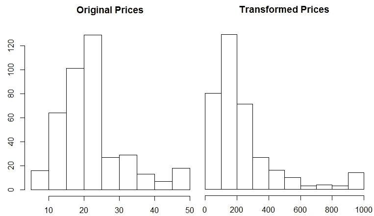

# 深度学习的自定义损失函数:用 Keras 预测住宅价值

> 原文：<https://towardsdatascience.com/custom-loss-functions-for-deep-learning-predicting-home-values-with-keras-for-r-532c9e098d1f?source=collection_archive---------2----------------------->


Source: 4047259 at pixabay.com

我最近开始和 R 一起阅读“[深度学习”，我对 R 对深度学习的支持印象深刻。书中介绍的一个用例是预测波士顿的房价，这是一个有趣的问题，因为房价可能会有很大的变化。这是一个机器学习问题，可能最适合经典方法，如 XGBoost，因为数据集是结构化的，而不是感知数据。然而，它也是一个数据集，深度学习提供了一个真正有用的能力，即编写新的损失函数的容易程度，这可能会提高预测模型的性能。这篇文章的目标是展示深度学习如何通过使用自定义损失函数来改善浅层学习问题。](https://www.manning.com/books/deep-learning-with-r)

[](https://www.amazon.com/Deep-Learning-R-Francois-Chollet/dp/161729554X) [## 用 R 进行深度学习

### 使用 R 的深度学习介绍了使用强大的 Keras 库及其 R 语言的深度学习世界…

www.amazon.com](https://www.amazon.com/Deep-Learning-R-Francois-Chollet/dp/161729554X) 

我在处理金融数据时遇到过几次的一个问题是，您经常需要构建预测模型，其中的输出值可能有很大的范围，跨越不同的数量级。例如，在预测房价时会发生这种情况，一些房屋的价值为 10 万美元，而其他房屋的价值为 1000 万美元。如果你在这些问题上使用标准的机器学习方法，如线性回归或随机森林，通常模型会过度拟合具有最高值的样本，以减少平均绝对误差等指标。但是，您实际需要的可能是用相似的权重处理样本，并使用相对误差等误差度量来降低用最大值拟合样本的重要性。

```
**# Standard approach to linear regression** fit <- lm(y ~ x1 + x2 + x3 + ... + x9, data=df)**# Linear regression with a log-log transformation** fit <- nls( log10(y) ~ log(x1*b1 + x2*b2 + ... + x9*b9), 
   data = df, start = list(b1=1, b2=1, ... , b9 = 1))
```

您实际上可以在 R 中使用诸如非线性最小二乘法( *nls* )之类的软件包显式地做到这一点。上面的代码示例显示了如何使用内置优化器构建线性回归模型，该优化器将对具有大标签值的样本进行加权，以及使用 *nls* 方法，该方法显示了如何对预测值和标签执行对数转换，这将给予样本相对相等的权重。第二种方法的问题是，您必须明确地说明如何使用模型中的特性，这就产生了一个特性工程问题。这种方法的另一个问题是，如果不编写自己的似然函数和优化器，它不能直接应用于其他算法，如随机森林。这是一个针对特定场景的，在该场景中，您希望将误差项排除在对数转换之外，而不是简单地将对数转换应用于标签和所有输入变量。

深度学习为处理这些类型的问题提供了一个优雅的解决方案，其中，您可以探索不同的内置和自定义损失函数，这些函数可以与提供的不同优化器一起使用，而不是编写自定义的可能性函数和优化器。这篇文章将展示如何在使用 Keras 时用 R 编写自定义损失函数，并展示如何使用不同的方法对不同类型的数据集有益。

下图是我将在这篇文章中涉及的内容的预览。它显示了在波士顿房价数据集上训练的四个不同的 Keras 模型的训练历史。每种模型使用不同的损失函数，但是根据相同的性能指标，平均绝对误差进行评估。对于原始数据集，自定义损失函数不会提高模型的性能，但在修改后的数据集上，结果更有希望。


Performance of the 4 loss functions on the original housing prices data set. All models used MAE for the performance metric.

## 用深度学习改善浅层问题

深度学习的一个很大的特点是，它既可以应用于感性数据的深度问题，如音频和视频，也可以应用于结构化数据的浅层问题。对于浅层学习(c *经典 ML* )问题，通过使用提供有用信号的定制损失函数，你经常可以看到对浅层方法的改进，例如 [XGBoost](https://github.com/dmlc/xgboost) 。

然而，并不是所有的浅层问题都能受益于深度学习。我发现，在构建需要为不同数量级的数据创建预测的回归模型时，自定义损失函数非常有用。例如，预测某个地区的房价，该地区的房价可能会大幅波动。为了展示这在实践中是如何工作的，我们将使用 Keras 提供的波士顿住房数据集:

[](https://keras.io/datasets/#boston-housing-price-regression-dataset) [## 数据集- Keras 文档

### 来自 IMDB 的 25，000 个电影评论的数据集，由情绪(正面/负面)标记。评论已经过预处理…

keras.io](https://keras.io/datasets/#boston-housing-price-regression-dataset) 

这个数据集包括 20 世纪 70 年代波士顿郊区的房价。每条记录有 13 个描述房屋属性的属性，在训练数据集中有 404 条记录，在测试数据集中有 102 条记录。在 R 中，数据集可以如下加载:`dataset_boston_housing()`。数据集中的标签代表房屋的价格，以千美元计。价格从 5k 美元到 50k 美元不等，价格分布如左图所示。原始数据集具有相似数量级的值，因此自定义损失函数可能不适用于拟合该数据。右侧的直方图显示了标签的变换，这可能得益于使用自定义损失。



The Boston data set with original prices and the transformed prices.

为了转换数据，我将标签转换回绝对价格，对结果求平方，然后除以一个大因子。这导致最高和最低价格之间的差别是 100 倍，而不是 10 倍。我们现在有一个预测问题，可以受益于自定义损失函数的使用。生成这些图的 R 代码如下所示。

```
x <- (train_targets*1000)^2/2500000
hist(train_targets, main = "Original Prices")
hist(x, main = "Transformed Prices")
```

# **Keras 中的损失函数**

Keras 包括许多有用的损失函数，用于训练深度学习模型。像`mean_absolute_error()`这样的方法适用于数值数量级大致相等的数据集。还有像`mean_squared_logarithmic_error()`这样的函数，它们可能更适合转换后的房屋数据。以下是由 Keras 的 [R 接口提供的一些损失函数:](https://keras.rstudio.com/)

```
keras::loss_mean_absolute_error()
keras::loss_mean_absolute_percentage_error()
keras::loss_mean_squared_error()
keras::loss_mean_squared_logarithmic_error()
```

[中的功能损失。R](https://github.com/rstudio/keras/blob/b8b8eb81dbef6887a61bd7a2cd667fc0f03d239b/R/losses.R) 引用 Python 函数，为了真正理解这些函数是如何工作的，我们需要跳入 Python [损失代码](https://github.com/keras-team/keras/blob/master/keras/losses.py)。我们将探讨的第一个损失函数是[均方误差](https://github.com/keras-team/keras/blob/master/keras/losses.py#L13)，定义如下。该函数计算预测值和实际值之间的差值，对结果求平方(使所有值为正)，然后计算平均值。注意，该函数使用了对张量对象而不是 Python 原语进行操作的后端操作[。当在 R 中定义自定义损失函数时，将使用相同的方法](https://www.tensorflow.org/api_docs/python/tf/keras/backend/)

```
def mean_squared_error(y_true, y_pred):    
    return K.mean(K.square(y_pred - y_true), axis=-1)
```

我们将探讨的下一个内置损失函数基于预测值和目标值的自然对数之间的差异来计算误差。这里定义[为](https://github.com/keras-team/keras/blob/master/keras/losses.py#L28)，如下图所示。该函数使用 *clip* 操作来确保负值不会被传递给 log 函数，并且将 1 加到 clip 结果确保所有 log 变换的输入都将具有非负的结果。这个函数类似于我们将在 r 中定义的函数。

```
def mean_squared_logarithmic_error(y_true, y_pred):    
    first_log = K.log(K.clip(y_pred, K.epsilon(), None) + 1.)
    second_log = K.log(K.clip(y_true, K.epsilon(), None) + 1.)    
    return K.mean(K.square(first_log - second_log), axis=-1)
```

我们将探讨的两个自定义损失函数在下面的 R 代码段中定义。第一个函数 mean log absolute error(*MLAE*)计算预测值和实际值的对数变换之间的差值，然后对结果取平均值。与上面的内置函数不同，这种方法不会平方误差。与上面的对数函数的另一个不同之处是，该函数对数据应用了一个显式的比例因子，将房价转换回其原始值(5，000 到 50，0000)而不是(5，50)。这很有用，因为它减少了将+1 加到预测值和实际值上的影响。

```
**# Mean Log Absolute Error** MLAE <- function( y_true, y_pred ) {
  K <- backend()
  K$mean( K$abs( K$log( K$relu(y_true *1000 ) + 1 ) - 
      K$log( K$relu(y_pred*1000 ) + 1)))
}**# Mean Squared Log Absolute Error** MSLAE <- function( y_true, y_pred ) {
  K <- backend()
  K$mean( K$pow( K$abs( K$log( K$relu(y_true *1000 ) + 1 ) - 
    K$log( K$relu(y_pred*1000 ) + 1)), 2))
}
```

像 Python 函数一样，R 的自定义损失函数需要对张量对象而不是 R 原语进行操作。为了执行这些操作，您需要使用`backend()`获得对后端的引用。在我的系统配置中，这将返回对 tensorflow 的引用。

第二个函数计算对数误差的平方，类似于内置函数。主要区别在于我使用的是`relu`操作，而不是`clip`操作，并且我在缩放值，这是特定于住房数据集的。

## 评估损失函数

我们现在有四个不同的损失函数，我们希望评估原始和转换后的住房数据集的性能。本节将介绍如何设置 Keras、加载数据、编译模型、拟合模型以及评估性能。本节的完整代码清单可在 [github](https://github.com/bgweber/StartupDataScience/blob/master/DeepLearning/LossFunctions.R) 上获得。

首先，我们需要建立深度学习的环境。这可以通过`Keras`包和`install_keras`功能完成。

```
**# Installation**
devtools::install_github("rstudio/keras")
library(keras)
install_keras(method = "conda")
```

安装完成后，我们将加载数据集并应用我们的转换来扭曲房价。最后两个操作可以注释掉使用原房价。

```
**# load the data set** library(keras)
data <- dataset_boston_housing()
c(c(train_data,train_targets), c(test_data,test_targets)) %<-% data**# transform the training and test labels** train_targets <- (train_targets*1000)^2/2500000
test_targets <- (test_targets*1000)^2/2500000
```

接下来，我们将创建一个用于预测房价的 Keras 模型。我已经使用了“用 R 进行深度学习”中的[样本问题](https://github.com/jjallaire/deep-learning-with-r-notebooks/blob/master/notebooks/3.6-predicting-house-prices.Rmd)中的网络结构。该网络包括两层全连接的 relu 激活神经元和一个无变换的输出层。

```
**# The model as specified in "Deep Learning with R"** model <- keras_model_sequential() %>%
  layer_dense(units = 64, activation = "relu",
              input_shape = dim(train_data)[[2]]) %>%
  layer_dense(units = 64, activation = "relu") %>%
  layer_dense(units = 1)
```

为了编译这个模型，我们需要指定一个优化器、损失函数和一个度量标准。我们将对所有不同的损失函数使用相同的指标和优化器。下面的代码定义了一个损失函数列表，对于第一次迭代，模型使用均方误差。

```
**# Compile the model, and select one of the loss functions** losses <- c(keras::loss_mean_squared_error,  
    keras::loss_mean_squared_logarithmic_error, MLAE, MSLAE)model %>% compile(
  optimizer = "rmsprop",
  loss = losses[1],
  metrics = c("mae")
)
```

最后一步是拟合模型，然后评估性能。我使用了 100 个 epochs，批量大小为 5，20%的验证分割。在训练了训练数据集的模型之后，基于测试数据集上的平均绝对误差来评估模型的性能。

```
**# Train the model with validation** model %>% fit(
  train_data,
  train_targets,
  epochs = 100,
  batch_size = 5,
  verbose = 1,
  validation_split = 0.2
)**# Calculate the mean absolute error** results <- model %>% evaluate(test_data, test_targets, verbose = 0)
results$mean_absolute_error
```

我用不同的损失函数训练了四个不同的模型，并将这种方法应用于原始房价和转换后的房价。所有这些不同组合的结果如下所示。


Performance of the Loss Function of the Housing Price Data Sets

在原始数据集上，在损失函数中应用对数变换实际上增加了模型的误差。这并不奇怪，因为数据是正态分布的，并且在一个数量级内。对于转换的数据集，平方对数误差方法优于均方误差损失函数。这表明，如果您的数据集与内置损失函数不兼容，自定义损失函数可能值得探索。

转换数据集上四个不同损失函数的模型训练历史如下所示。每个模型使用相同的误差度量(MAE ),但不同的损失函数。一个令人惊讶的结果是，所有应用对数变换的损失函数的验证误差都要高得多。


Performance of the 4 loss functions on the transformed housing prices data set. All models used MAE for the performance metric.

深度学习对于浅层学习问题来说是一个有用的工具，因为你可以定义定制的损失函数，这可能会大大提高你的模型的性能。这并不适用于所有问题，但如果您有一个不能很好地映射到标准损失函数的预测问题，这可能是有用的。

[本·韦伯](https://www.linkedin.com/in/ben-weber-3b87482/)是[意外收获数据](https://angel.co/windfall-data)的首席数据科学家，我们的任务是建立最准确和全面的净值模型。意外收获团队正在壮大，并正在招聘[工程师](https://angel.co/windfall-data/jobs/191572-senior-data-engineer)和[数据科学家](https://angel.co/windfall-data/jobs/335043-data-scientist)。