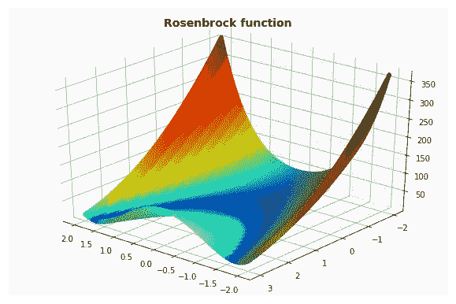
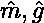
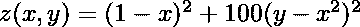
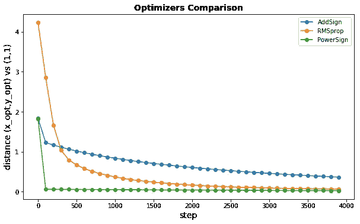
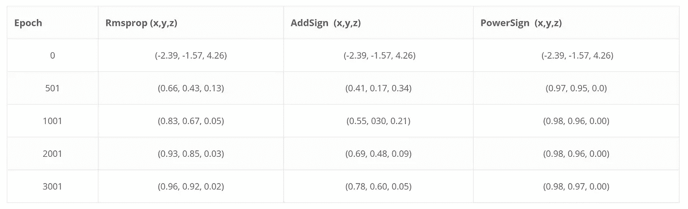

# TensorFlow 中的自定义优化器

> 原文：<https://towardsdatascience.com/custom-optimizer-in-tensorflow-d5b41f75644a?source=collection_archive---------5----------------------->

# 介绍

当对非结构化数据建模时，例如在语言或图像处理中，神经网络起着非常重要的作用。这种网络的想法是使用节点和边来模拟大脑的结构，这些节点和边具有由激活函数处理的数字权重。这种网络的输出主要产生预测，例如分类。这是通过使用一些优化损失函数对给定目标进行优化来实现的。

在[之前的一篇文章](https://www.bigdatarepublic.nl/regression-prediction-intervals-with-xgboost/)中，我们已经讨论了定制这个损失函数的重要性，对于梯度推进树的情况。在本帖中，我们将讨论如何定制优化器来加速和改进寻找损失函数(局部)最小值的过程。

# 优化者

虽然神经网络的架构在从数据中提取信息时起着重要作用，但所有(大多数)都是通过基于损失函数梯度的更新规则来优化的。

更新规则由优化器决定。不同优化器的性能和更新速度可能会有很大差异。梯度告诉我们更新的方向，但是我们可能采取多大的一步还不清楚。小步让我们保持在正确的轨道上，但是可能要花很长时间才能达到(局部)最小值。大步加快了这个过程，但它可能会把我们推离正确的方向。

[亚当](http://ruder.io/optimizing-gradient-descent/index.html#adam)【2】和[rms prop](http://ruder.io/optimizing-gradient-descent/index.html#rmsprop)【3】是两个非常流行的优化器，仍然在大多数神经网络中使用。两者都使用梯度及其平方的指数衰减平均值来更新变量。

通过生成固定的数值更新或代数规则，已经进行了寻找新的优化器的研究。

使用控制器递归神经网络，一个团队[1]发现了两种新的有趣的优化器，PowerSign 和 AddSign，它们都是高性能的，并且比当前流行的优化器(如 Adam)需要更少的资源。

# 在 TensorFlow 中实现优化器

Tensorflow 是一个流行的用于实现神经网络的 python 框架。虽然文档非常丰富，但要找到阅读它的方法通常是一个挑战。

在这篇博文中，我将解释如何实现 PowerSign 和 AddSign。

优化器包括两个重要步骤:

*   **compute_gradients()** 更新计算图形中的梯度
*   **apply_gradients()** 更新变量

在运行 Tensorflow 会话之前，应该启动一个优化器，如下所示:

`tf.train.GradientDescentOptimizer`是类`GradientDescentOptimizer`的对象，顾名思义，它实现了梯度下降算法。

方法 **minimize()** 以“成本”作为参数被调用，由两个方法 **compute_gradients()** 和 **apply_gradients()** 组成。

对于这篇文章，以及 AddSign 和 PowerSign 的实现，我们必须仔细看看这最后一步 **apply_gradients()** 。

该方法依赖于我们将要创建的(new) `Optimizer`(类)来实现以下方法: **_create_slots()** ， **_prepare()** ， **_apply_dense()** ， **_apply_sparse()** 。

**_create_slots()** 和 **_prepare()** 创建并初始化附加变量，如动量。

**_apply_dense()** 和 **_apply_sparse()** 实现实际的 Ops，更新变量。Ops 一般都是用 C++写的。您无需自己更改 C++头文件，仍然可以通过这些方法返回一些操作的 python 包装器。

这是按如下方式完成的:

现在让我们把所有东西放在一起，展示 PowerSign 和 AddSign 的实现。

首先，您需要以下模块来添加 Ops，

现在让我们实现 AddSign 和 PowerSign。这两个优化器实际上非常相似，都利用了动量的符号

`m`和`g`进行渐变更新。

The momentum and gradient, respectively.

## PowerSign

对于 PowerSign，变量的更新工作如下:

以下代码中的衰减率`f_n`被设置为 1。我不会在这里讨论这个问题，我可以参考文献[1]了解更多细节。

## 添加标志

AddSign 与 PowerSign 非常相似，如下所示:

# 优化器的性能测试

Rosenbrock 函数是一个著名的优化算法性能测试。该函数是非凸的，定义如下:

生成的形状绘制在下图中。正如我们所见，它在 x = 1 和 y = 1 时有一个最小值。

Rosenbrock function

以下脚本通过给定优化器在每个时期生成真实最小值与近似最小值的欧几里德距离。

下面绘制了运行 4000 个时期的每个优化器的性能比较。

虽然性能因超参数的选择而有很大差异，但需要注意 PowerSign 的极快收敛。下面，已经绘制了几个时期的近似值的坐标。

## 最终讨论

Tensorflow 允许我们创建自己的定制程序。最近的研究进展产生了两个新的有前途的优化器，即 PowerSign 和 AddSign。PowerSign 的快速早期收敛使其成为一个有趣的优化器，可以与 Adam 等其他优化器结合使用。

参考:

1.  有关 PowerSign 和 AddSign 的更多信息，请参见 arxiv 论文“具有强化学习的神经优化器搜索”，Bello 等人。艾尔。，[https://arxiv.org/abs/1709.07417.](https://arxiv.org/abs/1709.07417.)
2.  金马博士和巴律师事务所(2015 年)。亚当:一种随机优化方法。学习表征国际会议，1-13。
3.  未发表过的
4.  通过[这篇 StackOverflow 帖子](https://stackoverflow.com/questions/38431054/how-to-create-an-optimizer-in-tensorflow)，我发现了很多有用的信息，并试图将其捆绑到这篇帖子中。