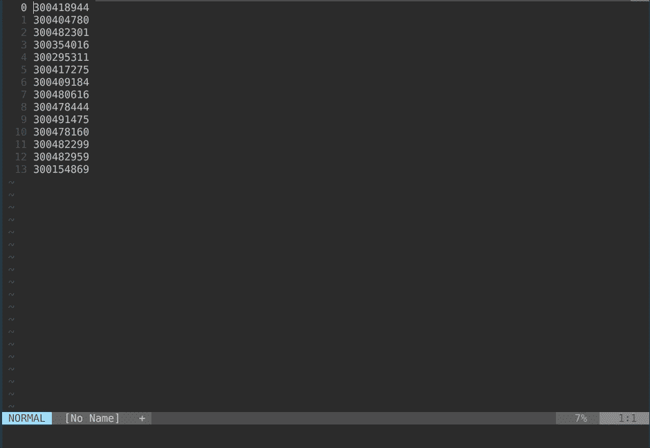

# 自定义 Vim 函数来格式化你的文本

> 原文：<https://towardsdatascience.com/custom-vim-functions-to-format-your-text-b694295f7764?source=collection_archive---------4----------------------->


Vim 是一个了不起的文本编辑器，多年来，它让我在编写代码或编辑文本时效率大大提高。虽然最初的学习曲线有点陡峭，但花时间学习不用鼠标导航和编辑文件是非常值得的。但是使 Vim 更加强大的是它是可破解的——如果您发现自己为某些任务反复执行一系列按键，您可以创建自己的函数，在整个 Vim 中使用。

有时我会收到客户的 Excel 电子表格，他们希望我查看与他们在 Excel 列中提供给我的一系列数字相关的数据。如果我将这些数字粘贴到 Vim 中，我将得到如下所示的内容:

```
300418944
300404780
300482301
300354016
300295311
300417275
300409184
300480616
300478444
300491475
300478160
300482299
300482959
300154869
```

如果我要在 SQL 查询的`WHERE`子句中使用这个数字列表作为 SQL 列表，我需要用引号将所有数字括起来，并在每个数字的末尾加上一个逗号。最后，我需要将所有的行折叠成一行，并用括号将那一行括起来。本质上，我需要获取这些数字并创建一个元组。所以我想要这样的东西:

```
(‘300418944’, ‘300404780’, ‘300482301’, ‘300354016’, ‘300295311’, ‘300417275’, ‘300409184’, ‘300480616’, ‘300478444’, ‘300491475’, ‘300478160’, ‘300482299’, ‘300482959’, ‘300154869’)
```

手动操作会花费相当多的时间，尤其是在给定一个包含数百个数字的列表的情况下。这就是 Vim 的亮点——我们可以在我们的`vimrc`文件中创建一个函数来为我们处理这些步骤。

```
“ convert rows of numbers or text (as if pasted from excel column) to a tuplefunction! ToTupleFunction() range
    silent execute a:firstline . “,” . a:lastline . “s/^/’/”
    silent execute a:firstline . “,” . a:lastline . “s/$/’,/”
    silent execute a:firstline . “,” . a:lastline . “join”
    silent execute “normal I(“
    silent execute “normal $xa)”
    silent execute “normal ggVGYY”
endfunctioncommand! -range ToTuple <line1>,<line2> call ToTupleFunction()
```

这个函数不仅会格式化你的文本，还会将结果复制到你的剪贴板，这样你就可以将它粘贴到你使用的任何 SQL 查询编辑器中。

让我们分解函数体的每一行。

```
silent execute a:firstline . “,” . a:lastline . “s/^/’/”
```

对于所有可视选择的行，上面的行跳转到每一行的开头，并插入一个单引号。

```
silent execute a:firstline . “,” . a:lastline . “s/$/’,/”
```

这一行位于每一行的末尾，并插入一个单引号和逗号。

下一行代码将所有的文本行合并成一行:

```
silent execute a:firstline . “,” . a:lastline . “join”
```

现在我们在行首添加一个左括号:

```
silent execute “normal I(“
```

然后插入结束的那个:

```
silent execute “normal $xa)”
```

该函数的最后一行选择整个文本，并将其复制到剪贴板(我有一个自定义的映射，用于复制到剪贴板:`vnoremap YY "*y`)。

最后，下面是实际运行的函数:



如果您希望有一个类似的函数来创建一个数组，那么您只需要对`ToTupleFunction`做一点小小的修改，并给这个函数起一个新名字。

```
“ convert rows of numbers or text (as if pasted from excel column) to an arrayfunction! ToArrayFunction() range
    silent execute a:firstline . “,” . a:lastline . “s/^/’/”
    silent execute a:firstline . “,” . a:lastline . “s/$/’,/”
    silent execute a:firstline . “,” . a:lastline . “join”
    " these two lines below are different by only one character!
    silent execute “normal I[“
    silent execute “normal $xa]”command! -range ToArray <line1>,<line2> call ToArrayFunction()
```

就是这样！希望这是有帮助的，如果你们有任何很酷的 Vim 函数，你们经常用来写代码或者只是写一般的东西，请在评论中告诉我！

 [## 想在数据科学方面变得更好吗？

### 当我在我发布独家帖子的媒体和个人网站上发布新内容时，请单击此处获得通知。](https://bobbywlindsey.ck.page/5dca5d4310) 

*原载于 2017 年 7 月 30 日*[*【bobbywlindsey.com】*](https://www.bobbywlindsey.com/2017/07/30/vim-functions/)*。*