# 顾客评论:借助网络搜集、数据分析和基本的自然语言处理，找出你的优势和劣势

> 原文：<https://towardsdatascience.com/customer-reviews-identify-your-strengths-and-weaknesses-with-the-help-of-web-scraping-data-b87a3636ef55?source=collection_archive---------9----------------------->


Photo: [https://pixabay.com/en/stars-rating-travel-four-hotel-1128772/](https://pixabay.com/en/stars-rating-travel-four-hotel-1128772/)

客户反馈是描述用户对公司及其服务体验的重要信息来源。就像在产品开发中一样，有效利用反馈可以帮助识别和优先考虑公司进一步发展的机会。

多亏了互联网，今天我们可以接触到无数的资源，在那里人们愿意与不同的公司和服务分享他们的经验。为什么不利用这个机会提取一些有价值的信息，并获得一些可操作的见解，以提供最佳的客户体验？


我在 Flixbus 担任数据科学孵化团队的产品负责人，flix bus 是一家主要的欧洲电动汽车公司，在欧洲各地提供城际巴士服务。Flixbus network 每天为 28 个国家的 1，700 多个目的地提供 120，000 多次连接，最近还将其业务扩展到了美国市场。

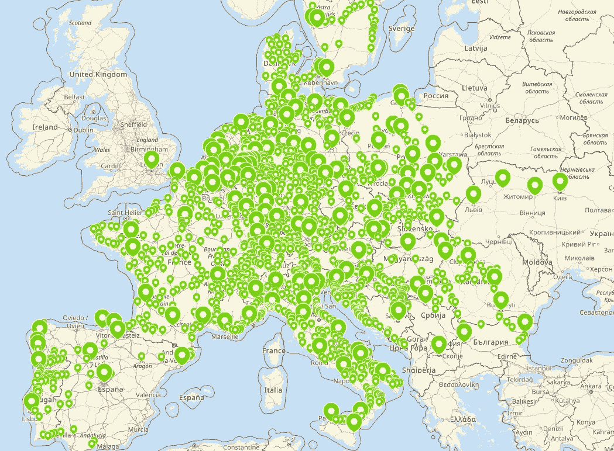

Source: [https://www.flixbus.com/bus-routes](https://www.flixbus.com/bus-routes)

虽然该公司已经建立了收集客户反馈的流程，但我还是决定看看除此之外万维网还能提供什么。这就是我如何遇到 Trustpilot.com 的，在这个平台上，用户可以与世界上几乎任何一家公司分享他们的经验。令我惊讶的是，我发现在过去的几年里有超过 2000 条关于 Flixbus.com 的顾客评论。这个数字每天都在增长。

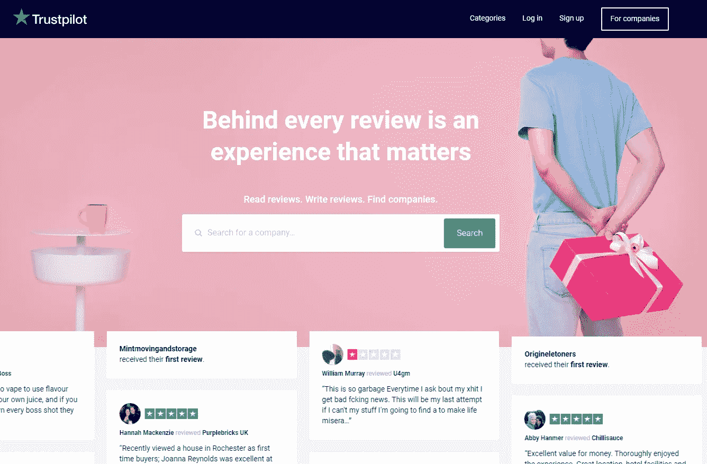

Source: [https://www.trustpilot.com/](https://www.trustpilot.com/)

每条评论都包含:1-5 分等级的评分，表示客户对服务的总体满意度、评论发布的日期、有用的评论者信息(如国家位置)以及带标题的自由格式文本评论本身。虽然评级表明总体客户情绪，但包含描述客户体验主要痛点的极有价值信息的是评论。

通过收集所有这些评论，我们可以收集大量的定量和定性数据，对其进行分析，并确定需要改进的地方。幸运的是，python 提供了库来轻松处理这些任务。

## 删除评论

对于网络抓取，我决定使用 BeautifulSoup 库，它可以完成这项工作，而且使用起来非常简单。如果你以前没有抓取网页的经验，但是你想自己尝试，我强烈推荐你阅读这篇伟大的文章:[“用 Python 和 BeautifulSoup 抓取网页”。](https://www.dataquest.io/blog/web-scraping-beautifulsoup/)

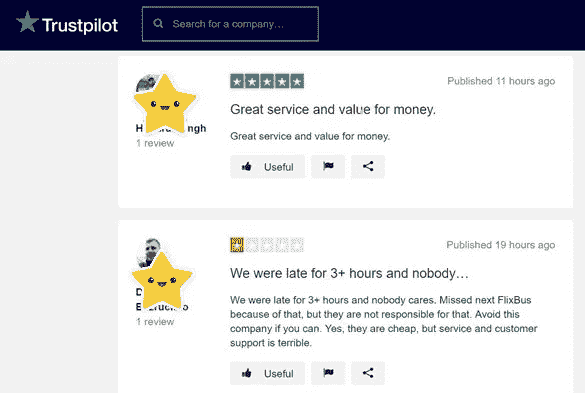

Source: [https://www.trustpilot.com/review/flixbus.com](https://www.trustpilot.com/review/flixbus.com)

好的……所以在研究了 Trustpilot 网站的结构后，我列出了可能需要收集的数据点:

1.  审查人姓名
2.  审核标题
3.  审查机构
4.  日期
5.  审查者的国家/地区

虽然这可能看起来是一个有限的数据列表，但它足以进行深入的数据分析，这将在后面进行。

作为第一步，我想分享一个自定义功能，从一个特定的 Trustpilot.com 公司的评论页面抓取所有评论:

你可以简单的复制粘贴，用这个功能给同一个点评平台上的任何其他公司刮点评。你所需要做的就是指定一个链接(链接到一个页码，其中页码将被变量 *p* 替换)，循环浏览的评论页数，并且你可以改变睡眠时间(包括以防万一，以避免节流)。

```
df = scrape_reviews(PATH = '[https://www.trustpilot.com/review/flixbus.com?languages=all&page='](https://www.trustpilot.com/review/flixbus.com?languages=all&page='),
                   n_pages = 80)
```

运行刮擦功能会为我们提供以下数据框架:

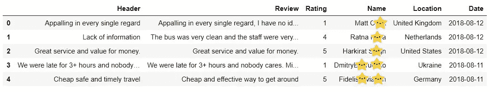

结果，我们有来自 100 个不同国家的 2080 条评论！是不是很牛逼？:)

## 数据分析

有了这些信息，我们可以从定量分析开始。为了便于理解，我们来看看 Flixbus.com 的评分分布:

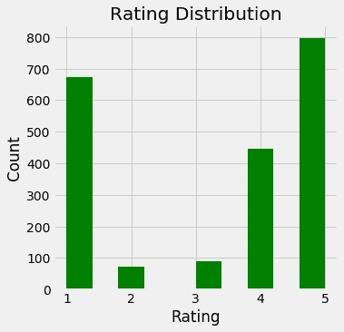

嗯，看起来我们有两个极端，非常高兴的顾客和不幸遇到我们服务问题的顾客。不过看到正面评价超过负面评价还是很棒的。

此外，我们可以看到平均月评分是如何随着时间的推移而发展的:

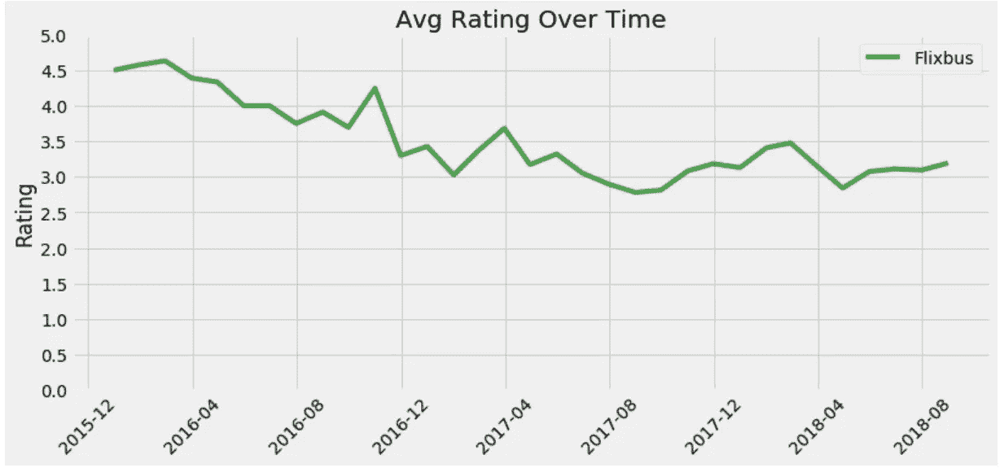

尽管在 2015 年底有一个良好的开端，但平均评级在接下来的两年中不断下降，在 2017 年 9 月达到历史最低点，约为 2.8。从那时起，评级趋势为横向通道，目前的平均评级为 3.2。

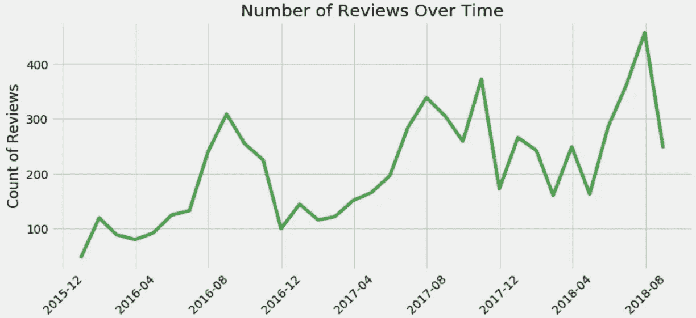

就每月的评论数量而言，我们看到了明显的季节性增长趋势。我们观察到每年 8 月和 9 月左右的本地高峰，这很可能与公共汽车旅行的旺季有关。

考虑到我们还收集了每个评论者的国家位置，我们可以将这些信息可视化，以查看大多数评论来自哪里。

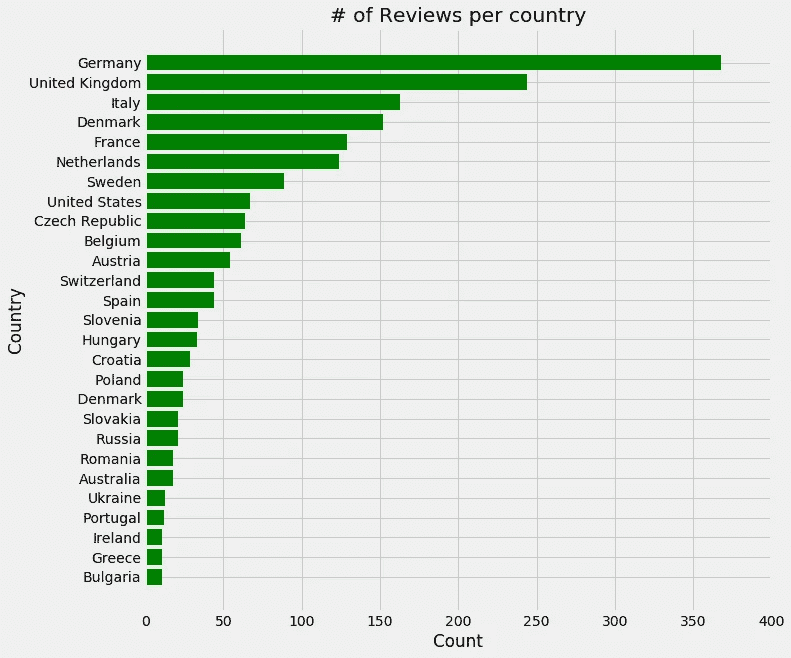

(countries with more than 10 reviews displayed in the graph above)

由于 Flixbus 是一家总部设在德国的公司，所以毫不奇怪德国名列榜首，其次是英国、意大利、丹麦和法国。

接下来，让我们关注占所有数据 70%的评论数量排名前 10 位的国家。

按年份划分评论，我们看到大多数评论都是在 2017 年产生的，其中最大一部分来自德国。2018 年，类似的帖子数量持续增长，然而，现在英国在发布评论的数量上处于领先地位。

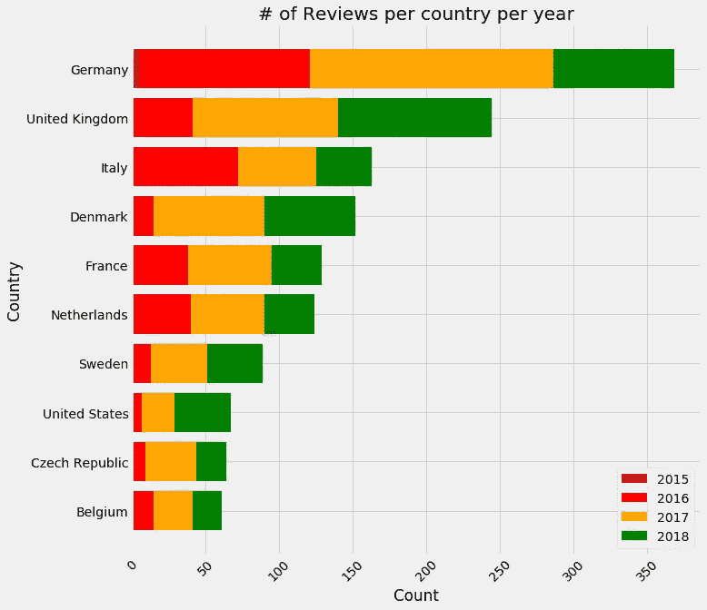

为了更好地了解每个国家的总体情绪，让我们来看看评级的份额:

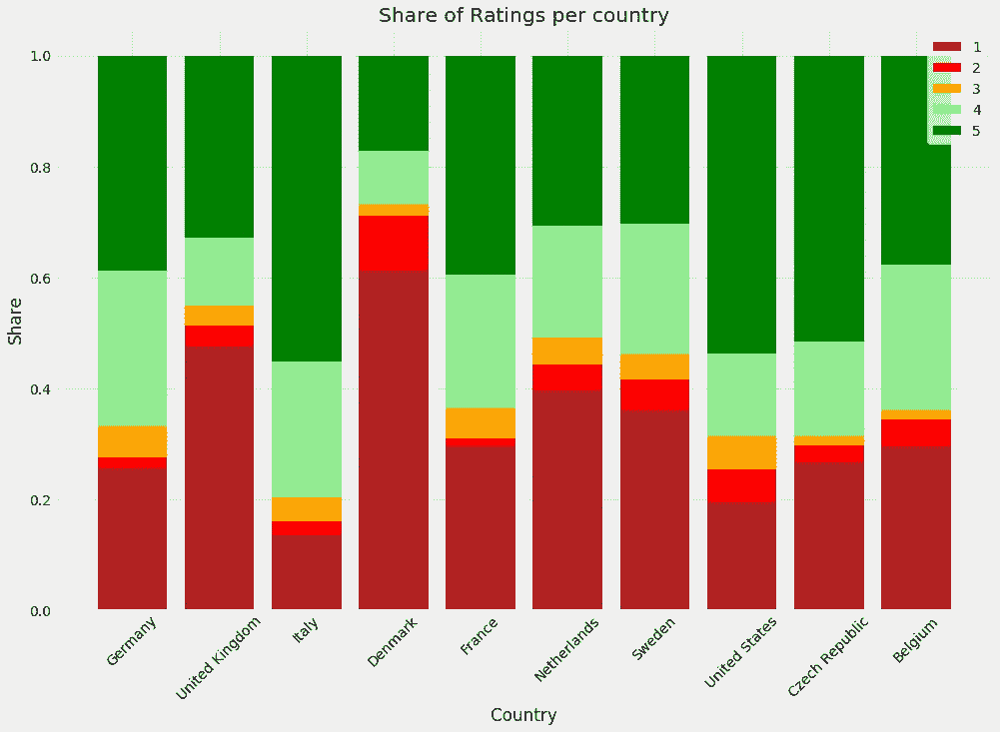

如上图所示，意大利、美国和捷克共和国获得五星好评的比例最高，其次是德国、法国和比利时。相反，丹麦以 1 星评级的最大份额脱颖而出。

现在，为了理解评论的内容，我们将应用一些基本的 NLP。

## 自然语言处理

以前，我们认为丹麦是负面评价最多的国家之一。因此，在把所有国家放在一起看之前，让我们先试着了解一下丹麦的具体情况。

作为第一步，我们必须使用 python 的 *googletrans* 库将评论从丹麦语翻译成英语。在这项工作中，我只关注了 1 星评论，总共有 93 条评论，以确定来自该国的客户提到的主要痛点。

一旦翻译完成，在 *nltk* 库的帮助下，我们可以对文本进行标记，删除停用词并对它们进行词条化，以避免不必要的不一致。最后一步，我们统计单词，并使用 nltk 的频率分布图绘制出 30 个最常提到的单词。

正如你所看到的，我们有很多词并没有真正指出具体的问题。很自然，我们经常看到客户提到“巴士”和公司名称。然而，我们也能发现一些经常使用的词，如票、时间、服务、司机、钱等等。这可能在一定程度上说明了问题，但仍不清楚这些问题。

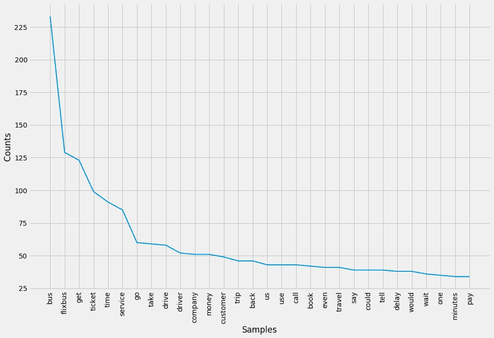

为了获得更多的上下文，我们可以继续使用二元模型，它提供了以下结果:

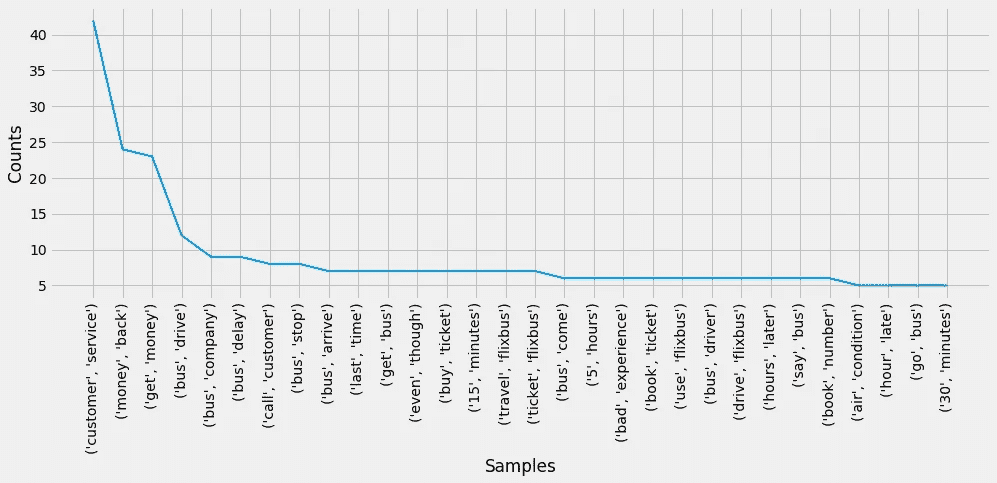

使用 bi-grams，我们可以获得更清晰的上下文，并可以轻松识别一般问题，包括:客户服务、退款(或退款)、延误、公交车站、公交车司机的问题以及公交车上的空调。因此，只需几秒钟，我们就可以总结客户在 93 条评论中提到的主要问题！

现在，让我们对所有 10 个国家和 1 星评级的评论使用相同的方法。

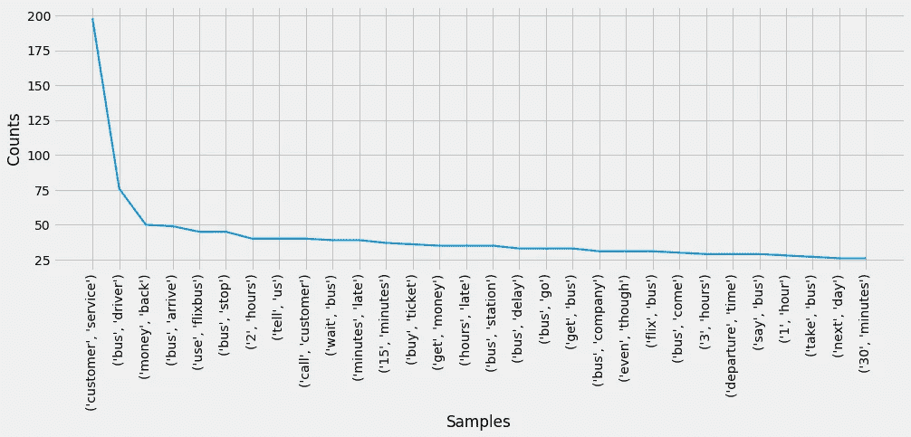

您会注意到，结果与我们在前面的图表中看到的没有很大的不同，但是，二元模型的排名略有变化。一个具有领域知识的人会立即识别许多客户体验方面，包括:

1.  客户服务
2.  公交车司机
3.  退款
4.  延误(迟到和/或离开)

有了这个结果，我们现在已经确定了 4 个需要进一步深入研究的主要领域，以发现改善客户体验和我们服务满意度的机会。

另一方面，我们可以对 5 星评价进行同样的分析，以了解客户最喜欢我们服务的什么。

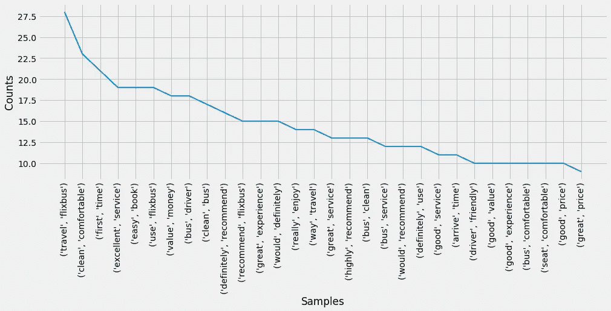

看上面的图表，很高兴看到许多评论者特别指出:

1.  我们公共汽车的清洁和舒适
2.  我发现用我们的平台订票很容易
3.  欣赏物有所值
4.  愿意向他人推荐我们的服务

## 结论

上面描述的方法非常简单，远没有发挥出它的全部潜力。然而，如果有数以千计的各种语言的评论，它可以在几分钟内提供一些有价值的见解，帮助理解客户问题并得出主要的棘手问题。

希望这对你有用，你可以将这里分享的一些知识应用到你自己的工作中！