# Arvato 金融解决方案的客户细分报告

> 原文：<https://towardsdatascience.com/customer-segmentation-report-for-arvato-financial-solutions-b08a01ac7bc0?source=collection_archive---------10----------------------->

【Udacity 数据科学家纳米学位的顶点项目

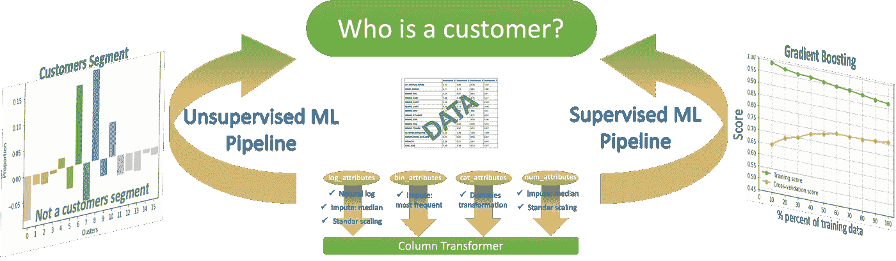

# **简介**

在这个项目中，监督和非监督学习技术用于分析德国一家邮购销售公司的客户的人口统计数据，与普通人群的人口统计信息进行对比。这个项目的目标是描述客户群体的特征，并建立一个能够为 Arvato 金融解决方案预测客户的模型。

这个项目的数据由贝塔斯曼 Arvato Analytics 的 Udacity partners 提供，代表了一项现实生活中的数据科学任务。它包括一般人群数据集、客户细分数据集、带有回复的邮寄活动数据集以及需要进行预测的测试数据集。

## **问题陈述**

该项目有四个主要部分:

1.  数据预处理

在这一部分，我们需要对数据进行预处理，以便进一步分析。

将按列和行分析缺失值，数据将按类型划分，然后进行后续转换。

2.客户细分

在这一部分，我们需要分析一般人群和客户细分数据集，并使用无监督学习技术进行客户细分，确定最能描述公司核心客户群的人群部分。

我将使用主成分分析(PCA)技术进行降维。然后，使用肘形曲线来确定 KMeans 算法的最佳聚类数。最后，我将应用 KMeans 对人口和客户进行细分，并确定公司目标群的描述。

3.监督学习模型

在这一部分中，我们需要使用营销活动的响应来建立机器学习模型，并使用模型来预测哪些个人最有可能转变为公司的客户。

我将使用几个机器学习分类器，并使用学习曲线分析选择最好的。然后，我将参数化模型并进行预测。

4.卡格尔竞赛

这部分的结果需要提交给 Kaggle 比赛

## **指标**

预测概率的受试者操作特征曲线( [ROC_AUC](https://en.wikipedia.org/wiki/Receiver_operating_characteristic) )下的面积将用于评估模型的性能。ROC 曲线是通过在各种阈值设置下绘制真阳性率(TPR)对假阳性率(FPR)来创建的。AUC 提供了对所有可能的分类阈值的综合绩效衡量。解释 AUC 的一种方式是模型对随机目标人的排序高于随机非目标人的概率。因此，ROC 分析提供了为客户预测任务选择可能的最佳模型的工具。

# **结果与讨论**

## 数据预处理

与本项目相关的有两个数据描述 Excel 电子表格和四个数据文件:

*   德国普通人口的人口统计数据。它有 891211 个人(行)和 366 个特征(列)。

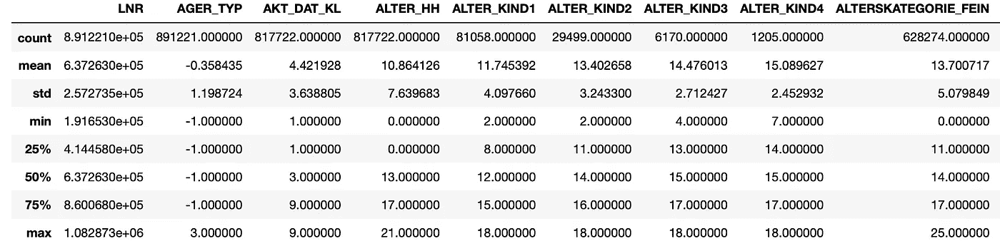

Descriptive statistics for the first few attributes of AZDIAS data set

*   `CUSTOMERS`:邮购公司客户的人口统计数据。它有 191652 行和 369 个特征。

Descriptive statistics for the first few attributes of CUSTOMERS data set

*   `MAILOUT_TRAIN`:作为营销活动目标的个人的人口统计数据；42982 人和 367 个特征，包括人的响应。
*   `MAILOUT_TEST`:作为营销活动目标的个人的人口统计数据；42833 人和 366 个特征。

不幸的是，这些数据集中有许多缺失值，并且并非所有列出的特性都在给定的 Excel 电子表格中有解释。

**分析缺失值的列和行**

首先，我创建了 python 缺失值代码字典，其中“键”中的键是:值对是属性，值是从 DIAS attributes-Values 2017 . xlsx 解析的缺失代码列表。

有趣的是，字典中的 366 个条目中只有 275 个，这意味着有许多特性没有在给定的属性描述文件中列出，并且一些缺少值的属性根本没有输入并在数据集中作为 numpy 而不是数字(np.nan)列出。

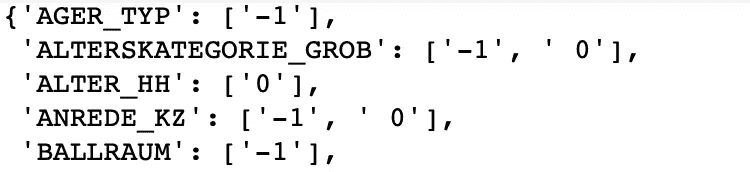

First three items from missing keys dictionary

接下来，与 AZDIAS 数据集的缺失值代码相对应的值被转换为 np.nan 值，并对每个属性分析缺失值的最终数量。

分析表明，大多数列的缺失数据不到 30%，而有 41 个属性的缺失数据超过 30%(参见下面这些列中缺失值的分布)。这 41 个属性已从分析中删除。

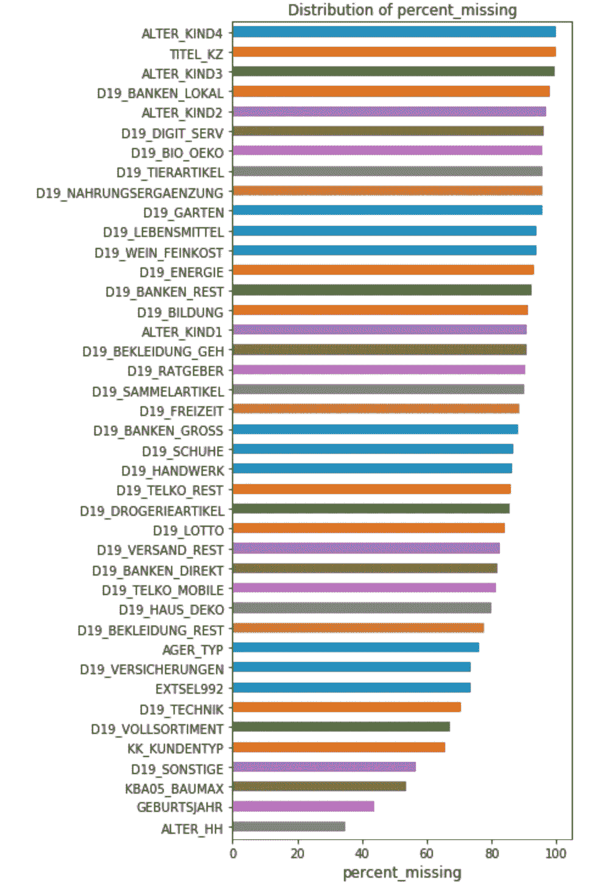

Attributes with more than 30% of missing values dropped from analysis

此外，基于以下原因删除了其他列:

*   具有唯一值的列，LNR
*   具有超过 10 个类别的分类列，以避免一次性编码后的许多附加属性(CAMEO_INTL_2015 除外)
*   具有来自另一特征的重复信息的列(例如 fein vs grob)
*   一些属性，没有给出描述，并且很难预测列的含义和类型(分类对顺序对混合)。

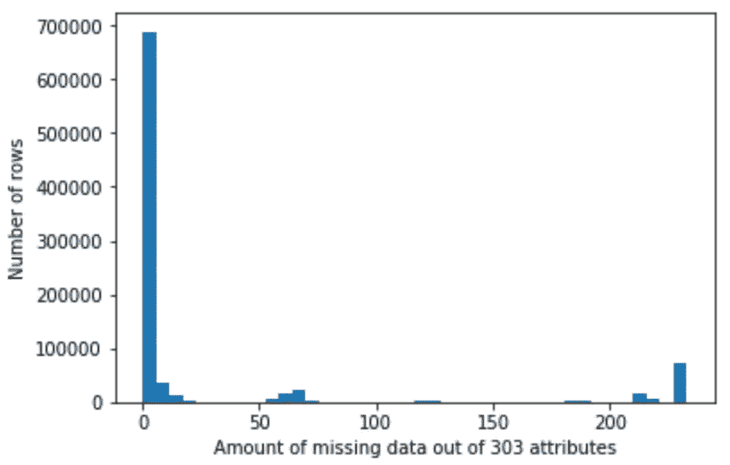

按行对缺失值的集合表明，删除列后，每行中缺失数据的最大数量是 303 个属性中的 233 个属性。每行中缺失数据量的分布表明，大多数行的缺失属性少于 25 个。因此，数据被分成两个子集:azdias，带有<=25 missing attributes (737235 rows) and azdias with > 25 个缺失属性(153986 行)。对 6 个随机选择的列的值分布的比较表明，在两个数据集中有相似的分布(见下面的 6 个不同属性的条形图，这些属性具有很少的 nan 和许多 nan 数据集)。

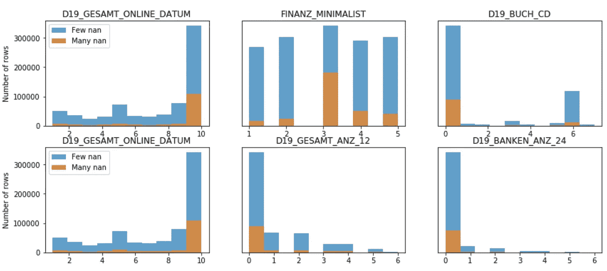

Comparison of distribution of values between dataset with few missing values (blue) vs dataset with many missing values (orange)

**分配属性类型**

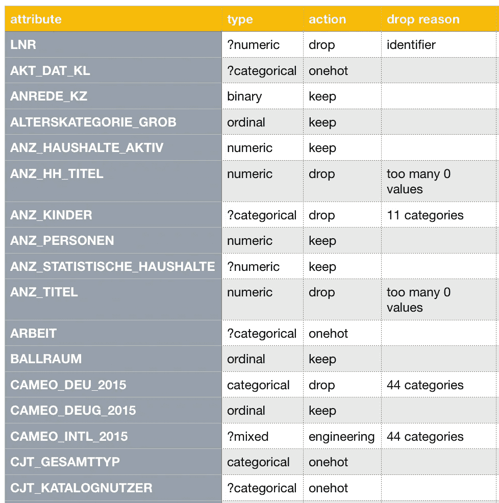

Part of the manually created table with attributes types and actions.

为了进行数据工程和转换步骤，所有的属性应该被分配到以下类型:分类的、数字的、顺序的、二进制的、混合的。对于这一步，我已经手动创建了 attribute_types.csv 文件，其中包含属性名称、类型、操作(保留、删除、单热或工程)和删除原因列。

由于不是所有的列都提供了描述，我必须通过名称找到相似的列，并猜测它的类型，这样的列在类型前面用问号列出(例如？分类)。与任何列出的属性都不相似的缺失描述属性的类型也被视为分类属性。

OST_WEST_KZ 特征对于 OST 编码为 0，对于 WEST 运动模式编码为 1。时间功能 EIGEFUEGT_AM 已转换为年份格式。四个混合功能重新设计如下:

*   PRAEGENDE _ jugendjhre-->运动(1:主流，2:前卫)和世代十年(4:40，5:50，6:60，7:70，8:80，9:90)
*   CAMEO_INTL_2015 —>财富(1:富裕家庭，2:富裕家庭，3:舒适家庭，4:不太富裕家庭，5:较贫困家庭)和寿命(1:未成家夫妇和单身，2:有孩子的年轻夫妇，3:有学龄儿童的家庭，4:老年家庭和成熟夫妇，5:退休老人)
*   WOHNLAGE—> RURAL _ neighborhood(0:非农村，1:农村)
*   plz 8 _ BAUMAX—> plz 8 _ BAUMAX _ FAMILY(0:0 家庭，1:主要是 1-2 家庭住宅，2:主要是 3-5 家庭住宅，3:主要是 6-10 家庭住宅，4:主要是 10+家庭住宅和 PLZ8_BAUMAX_BUSINESS (0:不是商业，1:商业)

**标准化和应对困难**

在我们对数据应用降维技术之前，我们需要执行特征缩放，以便主成分向量不受特征在尺度上的自然差异的影响。对于这一步，所有缺失的 np.nan 数据都需要丢弃或估算。对付南人有几种策略。用 nan 删除数据点的简单选择会导致大量信息的丢失(约 30%)。一个更好的策略是用平均值或最频繁值对缺失值进行插补。在大多数情况下，估算值不会完全正确，但会系统地高于或低于实际值。但是，通常它会比完全删除数据点或列给出更准确的结果。

因此，我选择的策略是用最频繁的值来估算二进制数据，用列中的中值来估算数值数据。分类缺失值在转换为虚拟列后将被赋值为零。然后使用标准化程序来缩放特征。标准化程序的优点是，它不会将值限制在特定的范围内，并且受异常值的影响要小得多。

**数据转换管道**

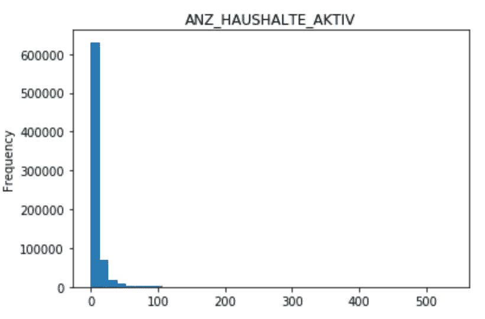

Distribution of skewed data for ANZ_HAUSHALTE_AKTIV attribute (skew=8.3)

首先，我使用倾斜阈值为 1.0 的熊猫[倾斜](https://pandas.pydata.org/pandas-docs/stable/generated/pandas.DataFrame.skew.html)方法识别倾斜的数值连续属性。这些属性被指定为 *log_attributes* ，并通过以下步骤为这些属性创建管道:自然对数转换、中值插补和标准缩放。二进制属性( *bin_attributes* )仅通过最常用值进行插补。*dummiestratransformation*类是为分类属性的转换而创建的( *cat_attributes* )。在这种转换中，没有删除多余的虚拟列，以保留关于由零编码的丢失值的隐藏信息。所有其他数值和顺序属性( *num_attributes* )转换被合并到管道中，通过中值插补和使用标准缩放器缩放。最后，创建了 [ColumnTransformer](https://scikit-learn.org/stable/modules/generated/sklearn.compose.ColumnTransformer.html) 对象，它将几个特征转换管道合并成一个转换器。这个对象进一步用于所有部分的数据转换。

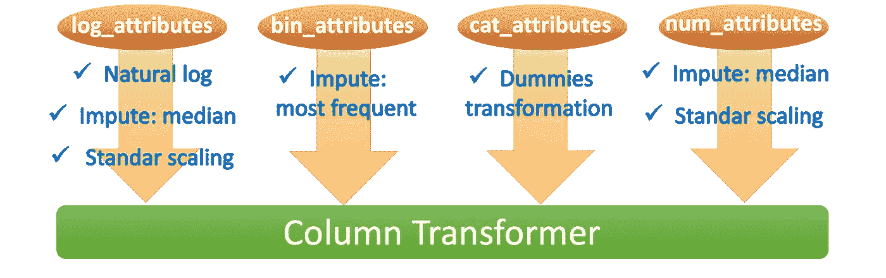

Column transformation scheme for pipeline column transformer

> transformers = [('log '，log_pipeline，log_attributes)，
> ('binary '，binary_pipeline，bin_attributes)，
> ('cat '，cat_pipeline，cat_attributes)，
> ('num '，num_pipeline，num_attributes)]
> 
> CT = sk learn . compose . column transformer(transformers = transformers)

**关于异常值的快速说明**

我使用了 [Tukey](https://en.wikipedia.org/wiki/Outlier#Tukey's_fences) 规则来检测四分位数范围(IQR)之外的异常值:IQR = Q3 — Q1。然而，仅移除经历了对数变换的六个属性的异常值会导致大约 30%的数据丢失。所以，我决定保留那些点。

**数据预处理汇总**

总之，所有数据集都经历清洗过程( *clean_data* 函数)，该过程:(1)删除列和行，(2)重新设计 4 个混合类型特征，以及(3)通过由流水线特征联合组成的列变换器进行变换。值得注意的是，流水线的使用极大地方便了转换和建立机器学习模型。它可以防止可能导致算法过度拟合的数据泄漏，改进代码组织，并降低在训练集和测试集中混淆列的风险。

总体而言，在提取转换加载(ETL)管道步骤之后，AZDIAS 数据被转换为 737235 行 x 410 列，客户数据被转换为 134245 行 x 410 列数据集。

## **客户细分**

**PCA**

[主成分分析](https://en.wikipedia.org/wiki/Principal_component_analysis)对数据进行降维处理。我绘制了累积解释方差与多个主成分的关系(用线表示)以及解释方差柱状图(见下文)。大约 175 个成分后，解释的变化明显减少。这一数量的转换特征导致 92%的解释方差。因此，项目的聚类部分保留了 175 个变换后的特征。

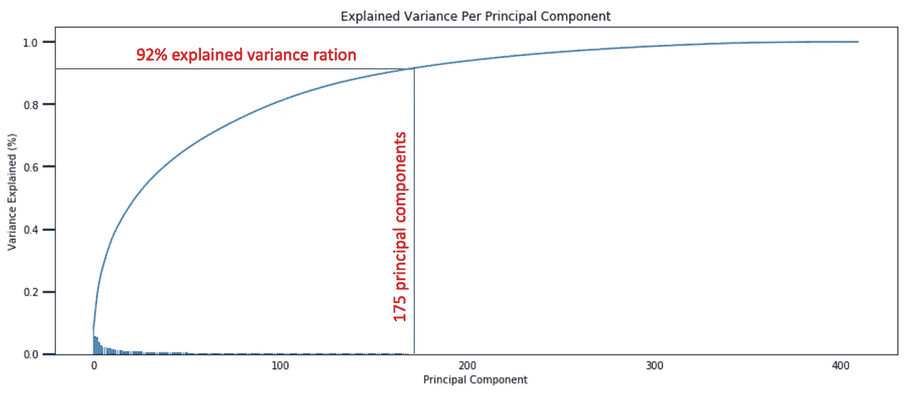

The plot of fraction of explained variance in the data represented by each principal component vs number of principal components.

第一、第二和第三主成分分别具有 8.0%、6.0%和 5.0%的方差，并且与接下来的三个潜在特征相关:

1.  最突出的特征是 CAMEO_DEUG_2015，HH_EINKOMMEN_SCORE，财富和最突出的负面特征是 MOBI_REGIO，KBA13_ANTG1，KBA05_ANTG1。因此，第一个主成分与规模、财富和家庭类型有关。家庭越大，收入和财富所对应的成分越高。负值:该部分与和其他家庭共用单元的概率较高和流动性较低成反比。
2.  最突出的特征是 KBA13_HERST_BMW_BENZ，KBA13 _ SEG _ OBEREMITTELKLASSE，KBA13_MERCEDES，KBA13_BMW 最突出的负面特征是 KBA13_SITZE_5。这种成分与拥有昂贵的汽车有关。
3.  最突出的特点是世代 _ 十年，CJT_TYP_1，CJT_TYP_2，金融 _SPARER。最突出的负面特征是孔比亚尔特和 CJT_TYP_5。这一部分与年龄、客户和金融类型有关。较高的成分与年龄较大的人和存钱的人的概率较高有关。

**K-均值聚类**

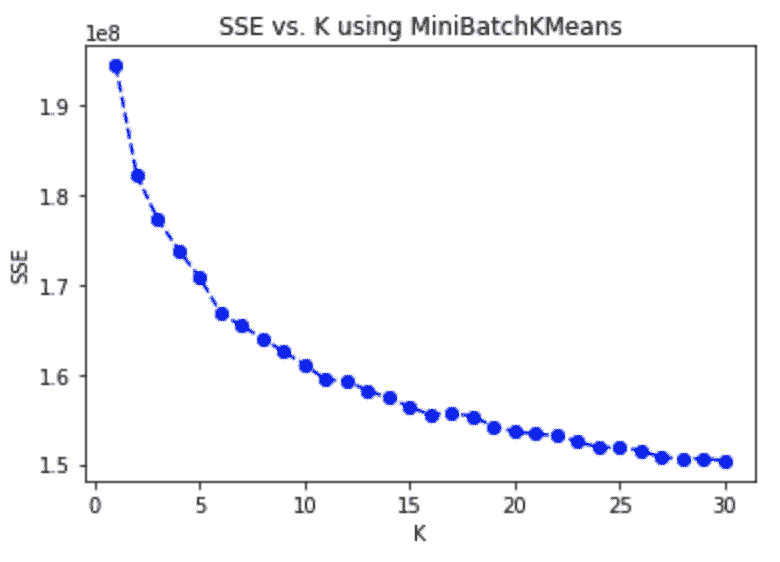

Average sum of squared errors (SSE) vs number of clusters

[肘](https://en.wikipedia.org/wiki/Elbow_method_(clustering))方法被用于在 PCA 转换的数据上识别用于[k-均值聚类](https://en.wikipedia.org/wiki/K-means_clustering)的理想聚类数。将组内距离的误差平方和(SSE)的平均值对从 1 到 30 的组数作图。在此图中，聚类是使用 MiniBatchKmeans 方法创建的，批处理大小=40000。

该图表明，分数在前 16 个聚类中快速下降，然后在 17 个聚类中上升，然后在更大数量的聚类中继续下降，但是斜率更低。因此，选择 16 个类作为 k-means 聚类的理想数目。

**无监督机器学习流水线**

无监督学习管道由以下步骤组成:数据转换、PCA 和 KMeans(见下文)。

> cluster _ Pipeline = Pipeline([
> (' transform '，ct)，
> ('pca '，PCA(n_components=175))，
> ('kmeans '，KMeans(n_clusters=16) )
> ))
> 
> cluster _ pipeline . fit(azdias _ cleaned)
> general _ predictions = cluster _ pipeline . predict(azdias _ cleaned)customers _ predictions = cluster _ pipeline . predict(customers _ cleaned)

拟合和预测方法应用于 AZDIAS 数据，预测方法应用于客户数据。

**客户数据与 AZDIAS 数据的比较**

使用每组中的人口比例对普通人群和 AZDIAS 数据的聚类结果进行相互比较。

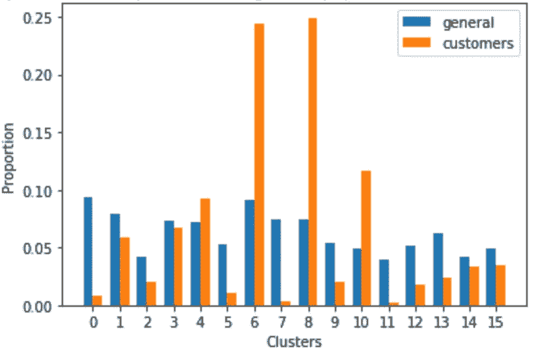

Proportion of people for the general population and the customer data

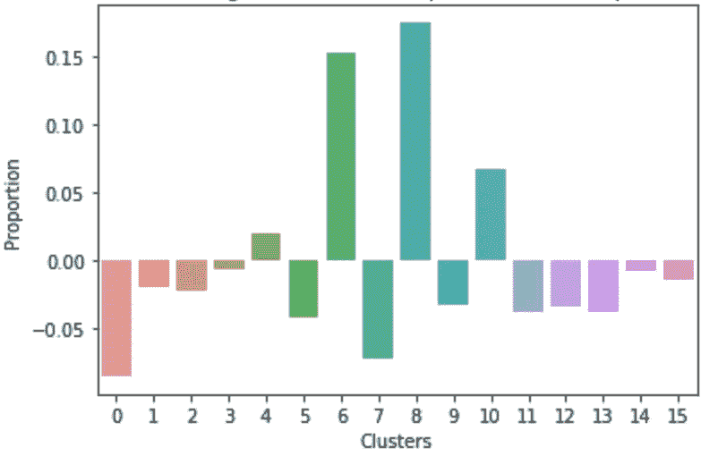

Difference in proportion between customers and general audience: positive is overrepresented and negative is underrepresented

比较每个集群中普通受众和客户受众的比例和比例差异(customers _ ratio-general _ ratio ),表明存在客户代表过多和不足的集群。在客户数据中，客户和一般受众之间的比例具有最高正差异的聚类过多(感兴趣的聚类#6 和#8)。客户和普通受众之间比例负差异最大的聚类在客户数据中代表性不足(无兴趣聚类#0 和#7)。它们的潜在特征中的聚类中心被映射到原始特征以识别人的类型。

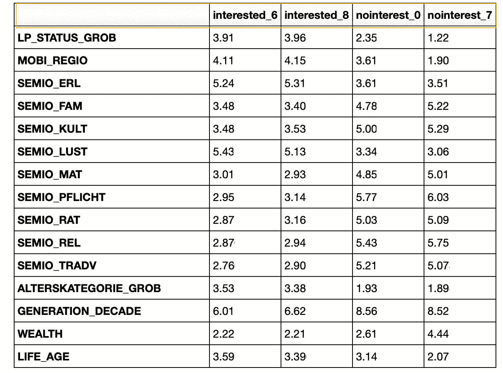

Comparison table of attribute values for overrepresented and underrepresented clusters.

因此，使用邮购公司的人(#6 和#8)是富有的，年龄在 45-60 岁之间(altersketoporie _ GROB = ~ 3.4)，平均年龄为 60 岁(GENERATION_DECADE 分别= 6.1 和 6.6)，是存钱的人或投资者的概率很高(FINANZ_SPARER 分别=1.3 和 1.6)。在代表性不足的群体中，他们是高收入者(LP_STATUS_GROB=4)对低收入者(1.2 和 2.3)。这些人具有低运动模式(MOBI _ 区域=4.2)。这些人也有宗教信仰和传统观念。

在诸如 D19_GESAMT_DATUM (8.2 对 2.8)、D19_KINDERARTIKEL (0.6 对 2.2)、D19_VERSAND_DATUM (9.0 va 3.3)、D19_KONSUMTYP_MAX (6.1 对 2.1)等类别中，两个过度表示的集群之间也存在一些差异。并非所有列出的特性都有说明，但总体 D19_*特性与使用某组产品的频率有关。因此，该方法区分了具有高和低交易活动的两组。

另一方面，在公司中任职人数不足的人最高达 45 岁(altersketagorie _ GROB = 1.8 和 1.9)。这些人出生于 80、90 年代(GENERATION_DECADE = 8.6)，金融兴趣不高(FINANZ _ MINIMALIST = 1、2)。这些人是穷人，他们是概率极低的存钱者(FINANZ_SPARER > 3.9)。其中一个聚类表明，这些人具有高移动模式(MOBI _ 雷吉欧=1.9)，这意味着他们没有自己的家，另一个具有中等移动模式(MOBI _ 雷吉欧=3.8)。这些人很可能是感性的；宗教和传统思想的可能性很小。

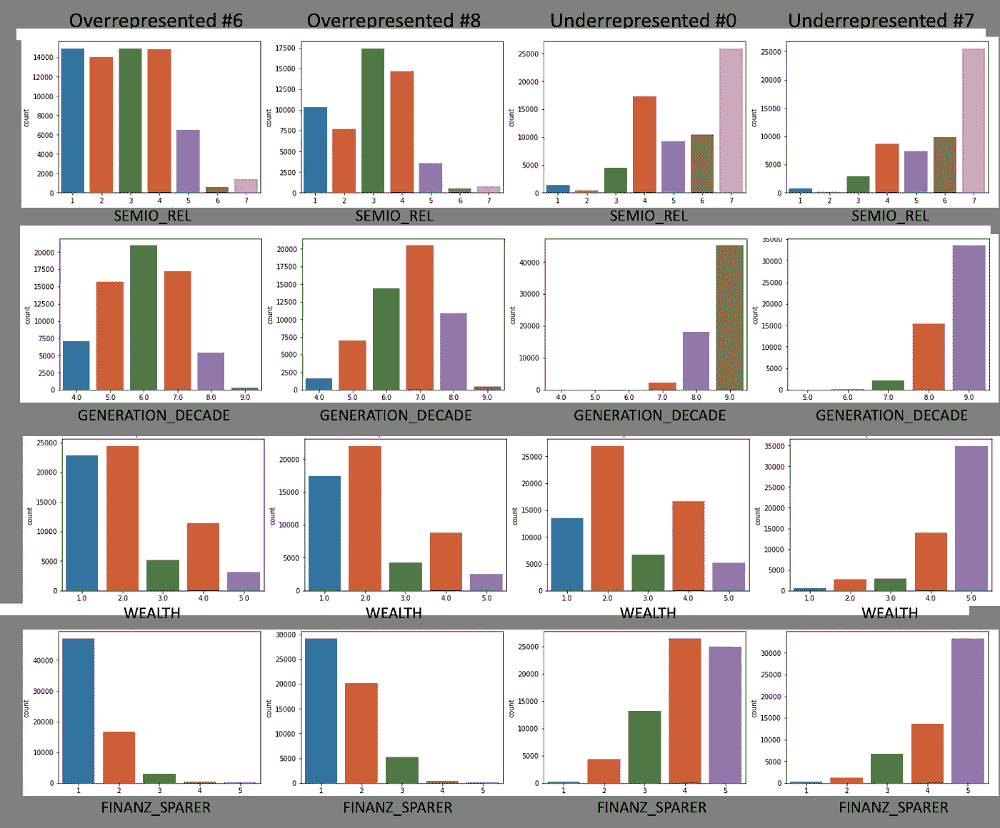

Comparison bar plot for SEMIO_REL, GENERATION_DECADE, WEALTH and FINANZ_SPARER feature in four clusters

## **监督学习模型**

现在，我们准备分析 MAILOUT 数据集，并建立一个监督学习模型，能够预测该人是否成为客户。“邮件发送”数据文件中的每一行都代表一个具有“响应”列的邮件发送活动的目标个人。值得注意的是，MAILOUT_TRAIN 数据集中只有约 1.2%是客户。这里，应用了类似的转换管道和清理，只是没有删除任何行以避免信息丢失(在 clean_data 函数中使用 test_set=True 属性)。

通常，为了建立监督模型，我们需要将数据分成训练和测试数据集，在训练数据集上建立监督模型，并在测试数据集上进行预测。在我们的例子中，我们已经得到了 MAILOUT_TEST 数据集，可以通过将它提交给 Kaggle competion 来评估模型的性能。因此，在这一部分有两种可能的途径可走:

*   将数据集拆分为训练集和验证集
*   使用交叉验证技术

我决定使用交叉验证，因为只有 532 名(1.2%)客户。在分割数据集的情况下，该值将减少 20%。因此，我使用 5 重交叉验证(Scikit-learn 0.2 版本中的默认值)来获得学习曲线，并使用 GridSearchCV 参数化模型。

**监督学习管道**

监督学习管道由两个步骤组成:之前引入的列转换器和分类器。

> 管道=管道([
> ('变换'，ct)，
> ('分类器'，分类器)
> ))
> 
> pipeline . fit(maiout _ train _ cleaned)
> 预测= pipeline . predict _ proba(maiout _ train _ cleaned)

**量词**

使用默认参数测试了几种集成方法，以选择最佳分类器。集成学习是在其他模型的基础上建立一个模型的方法。Scikit-learn 中的随机森林分类器、Adaboost 分类器和梯度提升分类器都是建立在决策树模型之上的集成分类器(默认)。
这些集成模型对于分类和回归问题都非常有效，通常具有以下优势:

*   提高机器学习算法的稳定性和准确性；
*   减少一个模型的单个估计值的方差，因为它们合并了几个模型的几个估计值；
*   有助于避免过度拟合。

**分类器评估**
用于模型评估采用学习曲线法。学习曲线显示了不同数量的训练样本(训练数据的 10%-100%)的估计量的验证和训练分数。它是一种工具，可以发现我们从添加更多的训练数据中获益多少，以及估计量是更容易受到方差误差还是偏差误差的影响。

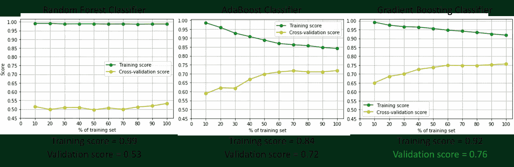

Learning curves for three different classifier, score = roc_auc score

对学习曲线的分析表明，随机森林分类器在训练集上具有微小的误差(roc_auc 得分=53%)，这意味着该模型严重过拟合数据。验证集的误差(roc_auc 得分=53%)很大，这是一个高偏差模型。注意，曲线已经收敛，添加更多数据不会改进分类器。这是一个高偏差模型。

Adaboost 分类器表现出更好的性能。虽然随着训练集大小的增加，训练 roc_auc 分数降低了高达 84%,但是对于验证集，它增加了高达 72%。两条曲线几乎是收敛的，并且分数不会随着训练集中点数的增加而显著提高。

梯度提升分类器的验证分数提高了 76%，而训练分数降低了 92%。两条曲线不收敛，增加更多的点可以进一步提高分数。因此，梯度推进是最佳模型，并将用于 GridSearch 参数化。

**分类器参数化**

梯度推进分类器的参数化使用网格搜索来执行。网格搜索使用交叉验证测试指定超参数的所有可能组合，然后在验证集上选择具有最高分数(roc_auc)的模型。下面给出了在网格搜索中测试的具有不同超参数的梯度推进流水线的初始化。

> gbc _ pipeline = SML . make _ pipeline(CT，GradientBoostingClassifier())
> 
> parameters = { ' classifier _ _ learning _ rate ':[0.1，0.2]，' classifier _ _ n _ estimators ':[100]，' classifier__max_depth': [3，5]，' classifier _ _ min _ samples _ split ':[2，4]}
> 
> grid _ obj = GridSearchCV(gbc _ pipeline，parameters，scoring = 'roc_auc ')

最佳分类器具有以下超参数:learning_rate=0.1，n_estimators=100，决策树 max_depth=3，决策树 min_sample_split=4(默认值=2)。使用参数化模型在训练集上计算的分数明显高于默认模型(0.8976 比 0.8968)。

特征重要度图表明，最重要的特征是 D19_SOZIALES，遗憾的是没有关于它的描述。下一个重要特征与消费类型(D19_KONSUMTYP_MAX)和运动年份 EINGESOGENAM_HH_JAHR(信息不可用)相关。

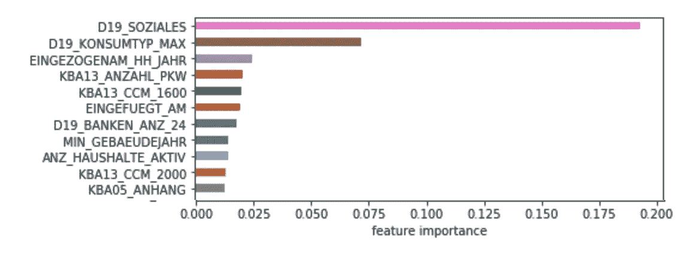

Feature importances plot

## **Kaggle 比赛**

最后将监督模型应用于 MAILOUT_TEST 数据。获得的成为顾客的概率被提交给 Kaggle competition。最终得分为 0.789，仅比本届冠军得分低 0.009。

# **结论**

在这个由 Bertelsmann Arvato Analytics 的 Udacity partners 提供的项目中，分析了德国人口和客户群的真实人口统计数据。

*   在第一部分中，对数据进行了评估和预处理。这一部分是必须完成的最困难的步骤之一，因为有 366 个列要分析，并且不是所有的列都有描述。发现了许多缺失值和缺失的属性信息。创建了列转换管道，该管道进一步用于受监督和不受监督的部分。
*   在无监督的部分，使用 PCA 对描述 92%的解释方差的 175 个潜在特征进行维数减少。k 均值聚类为 16 个聚类，识别出 2 个聚类是公司的目标客户。这些都是 45-60 岁的传统意义上的富人。
*   最后，选择梯度推进分类器并参数化，建立监督模型，在 KAGGLE 上的测试数据集上进行预测。监督学习算法的最终性能为 78.9%。

这个项目可能有一些改进。例如，有其他方法预处理数据:为删除行和列选择另一个阈值，为列选择不同的转换，应用最小最大缩放器而不是标准缩放器，以另一种方式估算数据。

监督模型的改进可以通过使用 PCA 降维来测试。我们还可以选择在过度表示和不足表示数据的聚类中具有最大差异的属性，并仅使用这些属性构建监督模型。

最后，我想尝试的一个技巧是随机地将客户数据集中的数据添加到 MAILOUT_TRAIN 数据集中，使得客户和非客户的数量相等。由于现在我们在这个数据集中只有 1.2%的客户，在 50%的数据集上训练的模型可以是更好的预测器。