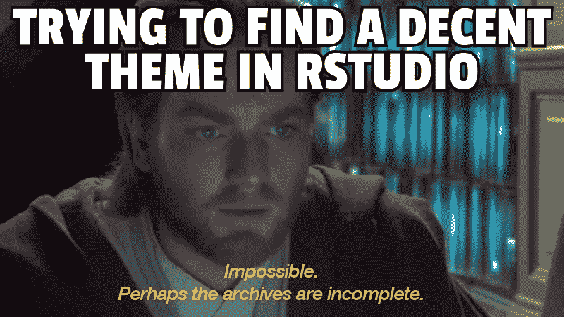
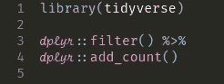
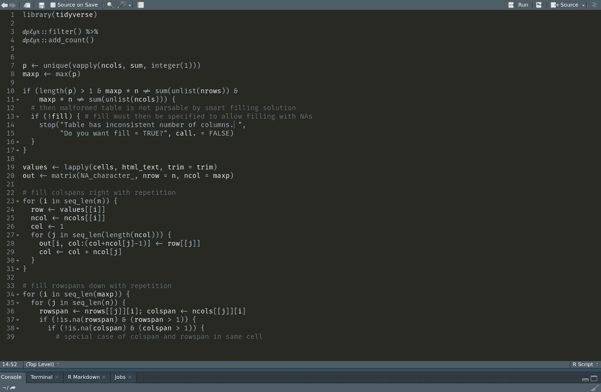

# 如何定制你的 RStudio 主题(最后)

> 原文：<https://towardsdatascience.com/customize-your-rstudio-theme-914cca8b04b1?source=collection_archive---------7----------------------->

## 按照这些简单的步骤在 RStudio 中安装自定义主题-包括主题！



当我的大脑在一个数据科学的早晨疲惫不堪后被挖掘出来时，我的浏览器将会不可避免地指向一个被 [RescueTime](https://www.rescuetime.com/) 归类为“娱乐”的大杂烩网站来自 Stack Overflow 上的[热点网络问题](https://stackexchange.com/questions)页面(“问题:为什么恶魔的治愈速度比天使快？”)去调查[哈德利过去六个月的](https://github.com/hadley)承诺。

在我感觉我已经看完了整个互联网之后，我有时会开始摆弄我的 IDE 主题，好像改变我的函数调用的十六进制颜色实际上会改进我的工作。这并不是说我目前的字体或配色方案不完美，这是一个有趣的合理化，如果我有一些 dope 连字，我实际上会工作得更快。

我通过提醒自己奥利佛·文德尔·霍马斯早在 19 世纪说过的话来强化我对这些细枝末节的痴迷；据说是关于他的 Win95 设置:

> “一瞬间的洞察力有时抵得上一生的经验”

所以也许，所有这些磨利斧头的行为，可以说，实际上是有益的。也许，这让我们对积极的黑天鹅更加敏感。好了，这是一个健康的合理化！

# 多么甜蜜的更新！

我经常在 RStudio 中工作，虽然大多数 ide 和文本编辑器都有优秀的主题和样式，如 Sublime、Atom、Visual Studio Code，但我们 RStudio 人在这方面一直很有限。我们有一些基本的主题，仅此而已。

好吧，几个月前一切都变了。RStudio v1.2xxx 预览版于 10 月发布，具有大量新功能，包括:

*   D3 功能
*   能够在后台运行 R 作业
*   更多 SQL 功能
*   酷派 plumbr API 工具

但对我们来说，最可爱的功能是能够导入我们自己的主题！本文将快速介绍如何在 RStudio 中复制 [Panda 语法主题](https://panda.siamak.work/)。

我们开始吧。

# 用 get 获取主题

RStudio 现在允许您上传。 *tmThemes* 和。 *rsThemes* 文件。我黑了一个类似熊猫的主题，放在一个回购中供你下载。我还在 repo 中加入了一个很棒的字体，叫做“Fira Code iScript ”,我们稍后会讲到。用这个 git 命令下载文件:

```
git clone [https://github.com/bradlindblad/rstudio-panda.git](https://github.com/bradlindblad/rstudio-panda.git)
```

## 安装字体

Fira Code iScript 是由 Ken Crocken 制作的一款优秀字体，它是 Fira Code 和 Script12 的混搭。这种字体在有斜体的地方使用 Script12 字样，在其他地方使用 Fira 代码。要安装它，双击*。您下载的 tff* 文件，然后在您的系统中安装字体，这将因每个操作系统而异。

它最终会看起来像这样:



很酷，是吧？要在 RStudio 中使用这种字体，请按照下列步骤操作:

*   如果你还没有打开 RStudio
*   导航到工具>全局选项>外观
*   使用编辑器字体框选择 Fira 代码脚本

注意，按照这个过程，你可以安装几乎任何你想要的字体。

## 安装熊猫主题

接下来我们将安装熊猫主题。跟随:

*   导航到工具>全局选项>外观
*   在编辑器主题框下，单击添加
*   导航到您克隆的 *panda.thTheme* 文件
*   打开

现在你所需要的只是快速重启，你就可以开始一个新的甜蜜主题了！这是它在我的系统中的样子(Linux Mint 19，深色):



不错！


Obi Wan is pleased

# 制作你自己的主题

如果熊猫主题不适合你，你可以用这个[在线编辑器](https://tmtheme-editor.herokuapp.com/#!/editor/theme/Monokai)制作你自己的。这允许你制作任何你想要的自定义主题。你只需要从网站上下载主题，然后像上面那样上传到 RStudio。

祝你在拖延中好运！