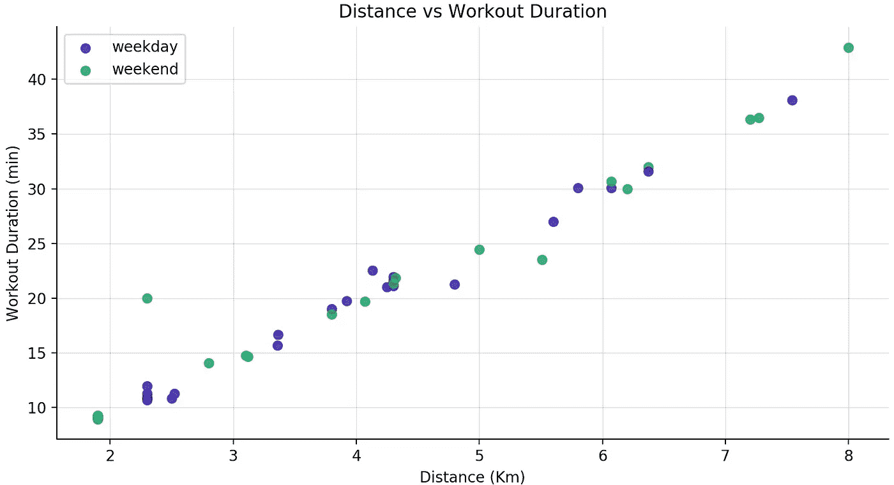
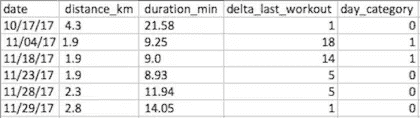
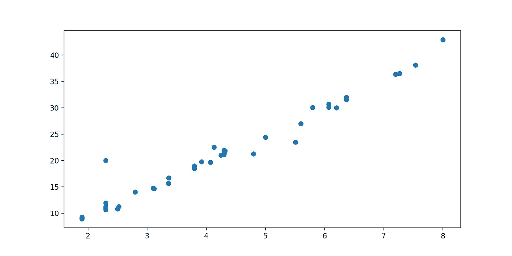
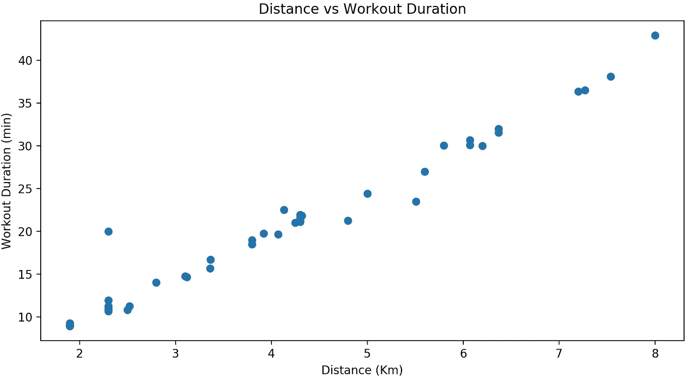
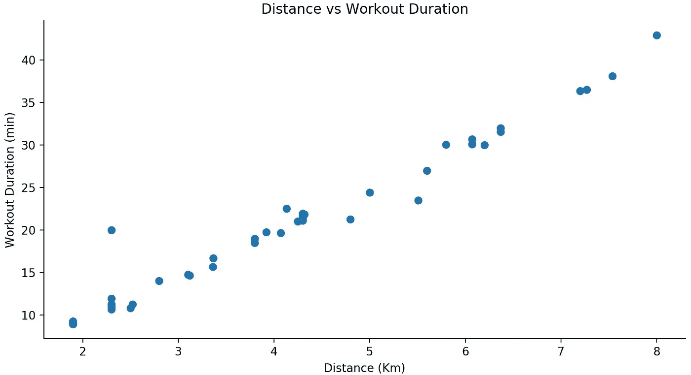
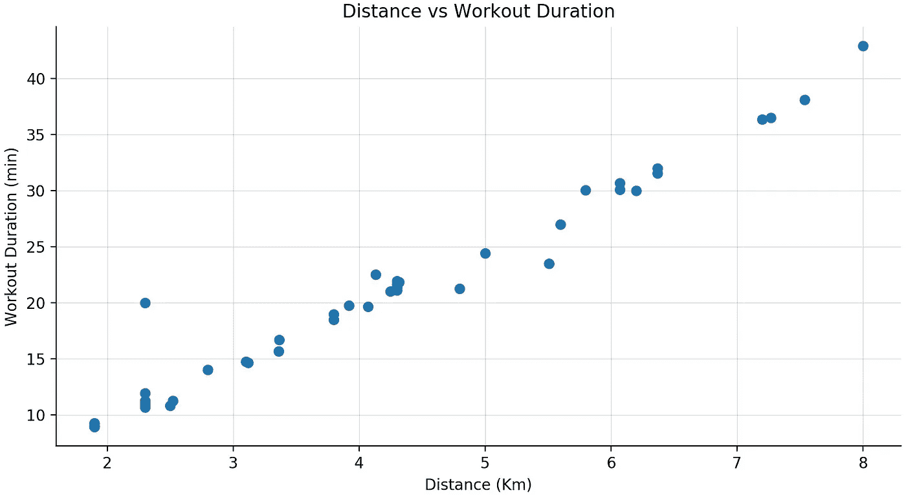
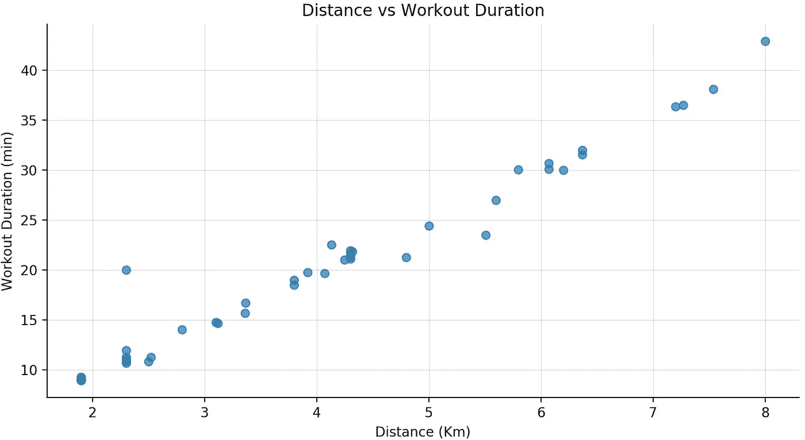
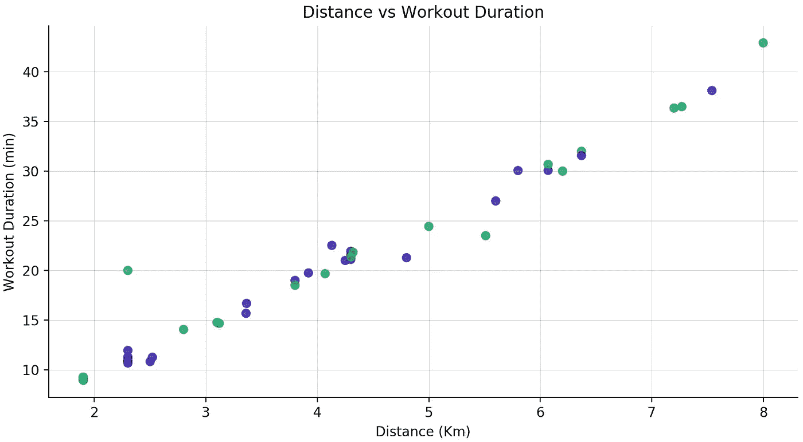
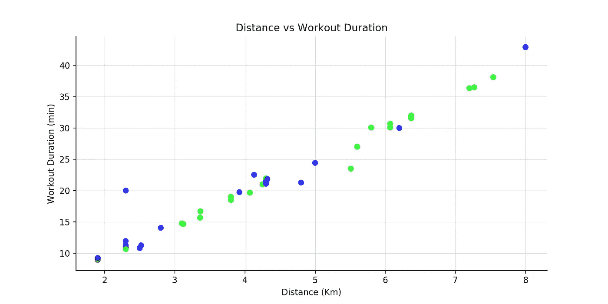

# 使用 Python Matplotlib 自定义地块

> 原文：<https://towardsdatascience.com/customizing-plots-with-python-matplotlib-bcf02691931f?source=collection_archive---------3----------------------->

## 通过漂亮的可视化效果获得更好的洞察力



数据科学和数据分析的核心部分是如何可视化数据。你如何利用可视化工具在定义你如何交流见解方面有着重要的作用。

我选择的探索和可视化数据的语言是 Python。

在这篇文章中，我想向您介绍我的框架，从可视化原始数据到拥有一个漂亮的情节，不仅引人注目，而且强调您想要传达的核心见解。

在这个例子中，我将使用在[上一篇文章](/k-means-in-real-life-clustering-workout-sessions-119946f9e8dd)中使用的一组锻炼时间。它看起来像这样



Workout Dataset, where day category = 0/1 corresponds to weekday/weekend

一个简单的散点图应该是这样的



您可以用下面的代码复制它

```
import pandas as pd
import matplotlib.pyplot as plt#loading dataset
df = pd.read_csv(‘workout_log.csv’)
df.columns = [‘date’, ‘distance_km’, ‘duration_min’, ‘delta_last_workout’, ‘day_category’] def scatterplot(df, x_dim, y_dim):
  x = df[x_dim]
  y = df[y_dim] fig, ax = plt.subplots(figsize=(10, 5))
  ax.scatter(x, y) plt.show()scatterplot(df, ‘distance_km’, ‘duration_min’)
```

对我来说，通常的下一步是标记轴并添加标题，这样每个图都被适当地标记。



代码变化很小，但绝对有所不同。

```
import pandas as pd
import matplotlib.pyplot as plt#loading dataset
df = pd.read_csv(‘workout_log.csv’)
df.columns = [‘date’, ‘distance_km’, ‘duration_min’, ‘delta_last_workout’, ‘day_category’] def scatterplot(df, x_dim, y_dim):
  x = df[x_dim]
  y = df[y_dim] fig, ax = plt.subplots(figsize=(10, 5))
  ax.scatter(x, y)

  #adds a title and axes labels
  ax.set_title('Distance vs Workout Duration')
  ax.set_xlabel('Distance (Km)')
  ax.set_ylabel('Workout Duration (min)') plt.show()scatterplot(df, ‘distance_km’, ‘duration_min’)
```

## 去掉那个*盒子*怎么样？

为了改变图周围的缺省框，我们必须实际移除一些图的边界。



```
import pandas as pd
import matplotlib.pyplot as plt#loading dataset
df = pd.read_csv(‘workout_log.csv’)
df.columns = [‘date’, ‘distance_km’, ‘duration_min’, ‘delta_last_workout’, ‘day_category’] def scatterplot(df, x_dim, y_dim):
  x = df[x_dim]
  y = df[y_dim] fig, ax = plt.subplots(figsize=(10, 5))
  ax.scatter(x, y)

  #adds a title and axes labels
  ax.set_title('Distance vs Workout Duration')
  ax.set_xlabel('Distance (Km)')
  ax.set_ylabel('Workout Duration (min)')

  #removing top and right borders
  ax.spines['top'].set_visible(False)
  ax.spines['right'].set_visible(False) plt.show()scatterplot(df, ‘distance_km’, ‘duration_min’)
```

## 主要网格线

我通常喜欢在我的图中添加一些主要的网格线。它通过减少白色背景的数量来提高可读性。你可以调整它的宽度`linewidth`和透明度`alpha`。



```
import pandas as pd
import matplotlib.pyplot as plt#loading dataset
df = pd.read_csv(‘workout_log.csv’)
df.columns = [‘date’, ‘distance_km’, ‘duration_min’, ‘delta_last_workout’, ‘day_category’] def scatterplot(df, x_dim, y_dim):
  x = df[x_dim]
  y = df[y_dim] fig, ax = plt.subplots(figsize=(10, 5))
  ax.scatter(x, y)

  #adds a title and axes labels
  ax.set_title('Distance vs Workout Duration')
  ax.set_xlabel('Distance (Km)')
  ax.set_ylabel('Workout Duration (min)')

  #removing top and right borders
  ax.spines['top'].set_visible(False)
  ax.spines['right'].set_visible(False) #adds major gridlines
  ax.grid(color='grey', linestyle='-', linewidth=0.25, alpha=0.5) plt.show()scatterplot(df, ‘distance_km’, ‘duration_min’)
```

## 美学

你可以看到图中的一些*点*重叠。为了进一步提高可读性，我们可以调整*点*‘透明度——`alpha`。



```
import pandas as pd
import matplotlib.pyplot as plt#loading dataset
df = pd.read_csv(‘workout_log.csv’)
df.columns = [‘date’, ‘distance_km’, ‘duration_min’, ‘delta_last_workout’, ‘day_category’]def scatterplot(df, x_dim, y_dim):
  x = df[x_dim]
  y = df[y_dim] fig, ax = plt.subplots(figsize=(10, 5)) #customizes alpha for each dot in the scatter plot
  ax.scatter(x, y, alpha=0.70)

  #adds a title and axes labels
  ax.set_title('Distance vs Workout Duration')
  ax.set_xlabel('Distance (Km)')
  ax.set_ylabel('Workout Duration (min)')

  #removing top and right borders
  ax.spines['top'].set_visible(False)
  ax.spines['right'].set_visible(False) #adds major gridlines
  ax.grid(color='grey', linestyle='-', linewidth=0.25, alpha=0.5) plt.show()scatterplot(df, ‘distance_km’, ‘duration_min’)
```

仍然有一点重叠，但至少透明度提高了大部分点的可读性。

## 颜色；色彩；色调

由于我们有了*天类别*，我们也可以尝试用不同的颜色来标识我们图中的每个点。

为此，您可以从两种不同的方法中进行选择:

*   使用像 [Adobe Kuler 的色轮](https://color.adobe.com/create/color-wheel/)这样的工具自己选择颜色
*   使用 Python 的[颜色贴图](https://matplotlib.org/users/colormaps.html)

**#1 定义您自己的调色板**



```
import pandas as pd
import matplotlib.pyplot as plt#loading dataset
df = pd.read_csv(‘workout_log.csv’)
df.columns = [‘date’, ‘distance_km’, ‘duration_min’, ‘delta_last_workout’, ‘day_category’]def scatterplot(df, x_dim, y_dim):
  x = df[x_dim]
  y = df[y_dim]fig, ax = plt.subplots(figsize=(10, 5))

  #defining an array of colors  
  colors = ['#2300A8', '#00A658'] #assigns a color to each data point
  ax.scatter(x, y, alpha=0.70, color=colors)

  #adds a title and axes labels
  ax.set_title('Distance vs Workout Duration')
  ax.set_xlabel('Distance (Km)')
  ax.set_ylabel('Workout Duration (min)')

  #removing top and right borders
  ax.spines['top'].set_visible(False)
  ax.spines['right'].set_visible(False)#adds major gridlines
  ax.grid(color='grey', linestyle='-', linewidth=0.25, alpha=0.5)plt.show()scatterplot(df, ‘distance_km’, ‘duration_min’)
```

**#2 使用 Python 绘制彩色地图**



为了根据*天类别*绘制每个点，我需要在代码中引入一些新的组件

*   导入颜色映射库
*   将*天类别*作为参数，可以映射出相应的颜色
*   使用`scatter`方法中的参数`c`分配颜色序列
*   使用参数`cmap`指定要使用的颜色图。我将使用*桥*彩色地图

```
import pandas as pd
import matplotlib.cm as cm
import matplotlib.pyplot as plt#loading dataset
df = pd.read_csv(‘workout_log.csv’)
df.columns = [‘date’, ‘distance_km’, ‘duration_min’, ‘delta_last_workout’, ‘day_category’]def scatterplot(df, x_dim, y_dim, category):
  x = df[x_dim]
  y = df[y_dim] fig, ax = plt.subplots(figsize=(10, 5)) #applies the custom color map along with the color sequence
  ax.scatter(x, y, alpha=0.70, c= df[category], cmap=cm.brg)

  #adds a title and axes labels
  ax.set_title('Distance vs Workout Duration')
  ax.set_xlabel('Distance (Km)')
  ax.set_ylabel('Workout Duration (min)')

  #removing top and right borders
  ax.spines['top'].set_visible(False)
  ax.spines['right'].set_visible(False) #adds major gridlines
  ax.grid(color='grey', linestyle='-', linewidth=0.25, alpha=0.5) plt.show()scatterplot(df, ‘distance_km’, ‘duration_min’, ‘day_category’)
```

## 传说

到目前为止，我们一直使用原生的`scatter`方法来绘制每个数据点。为了添加一个图例，我们需要稍微修改一下代码。

我们将不得不

*   将*日类别*作为参数，这样我们就有了自己的标签
*   将数字(0，1)标签转换为分类标签(工作日、周末)
*   遍历数据集，为每个数据点分配一个标签


```
import pandas as pd
import matplotlib.cm as cm
import matplotlib.pyplot as plt#loading dataset
df = pd.read_csv(‘workout_log.csv’)
df.columns = [‘date’, ‘distance_km’, ‘duration_min’, ‘delta_last_workout’, ‘day_category’]def scatterplot(df, x_dim, y_dim, category):
   x = df[x_dim]
   y = df[y_dim] #converting original (numerical) labels into categorical labels
   categories = df[category].apply(lambda x: 'weekday' if x == 0 else 'weekend') fig, ax = plt.subplots(figsize=(10, 5)) #assigns a color to each data point
   colors = ['#2300A8', '#00A658'] #iterates through the dataset plotting each data point and assigning it its corresponding color and label
   for i in range(len(df)):
     ax.scatter(x.ix[i], y.ix[i], alpha=0.70, color = colors[i%len(colors)], label=categories.ix[i]) #adds title and axes labels
   ax.set_title('Distance vs Workout Duration')
   ax.set_xlabel('Distance (Km)')
   ax.set_ylabel('Workout Duration (min)') #removing top and right borders
   ax.spines['top'].set_visible(False)
   ax.spines['right'].set_visible(False) #adds major gridlines
   ax.grid(color='grey', linestyle='-', linewidth=0.25, alpha=0.5)
   #adds legend
   ax.legend(categories.unique())
   plt.show()scatterplot(df, 'distance_km', 'duration_min', 'day_category')
```

现在你知道了！定制的散点图，现在可以更容易地理解数据并获得一些见解。

*感谢阅读！*