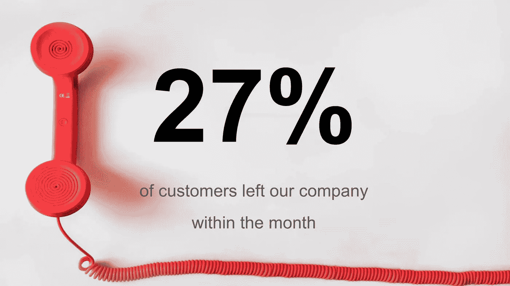
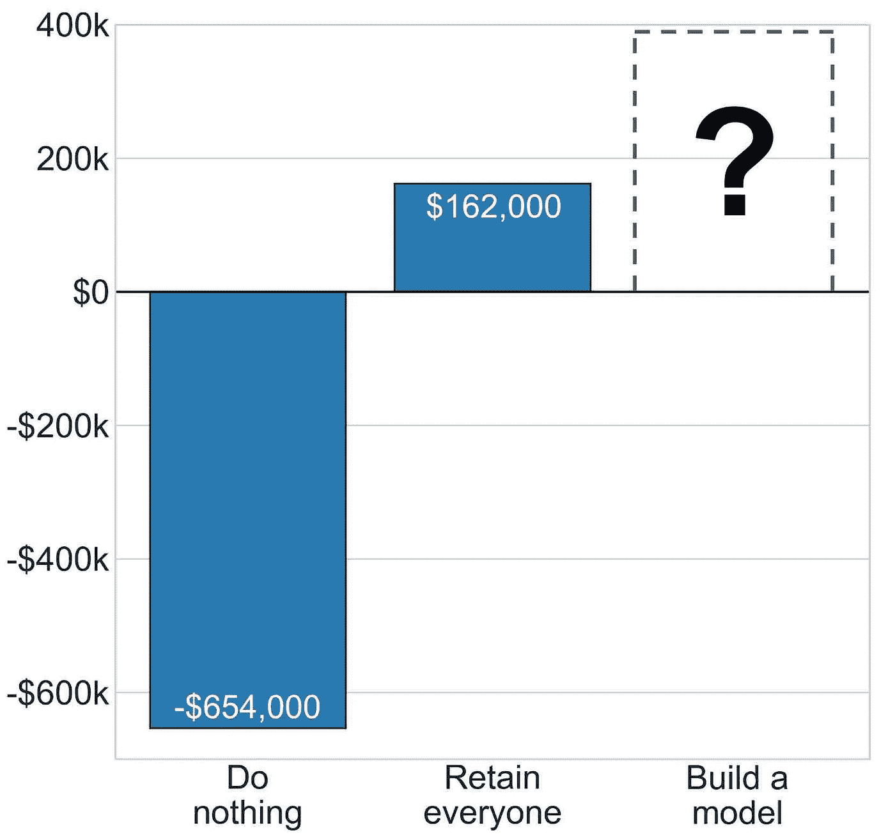
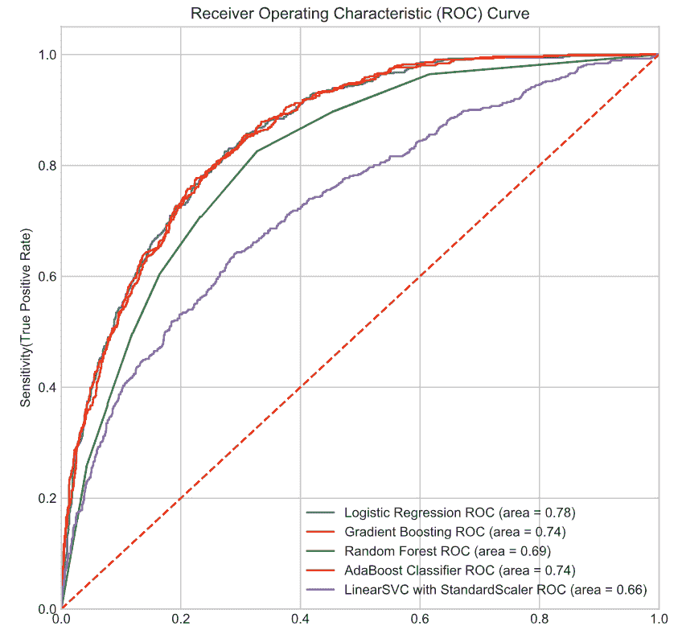
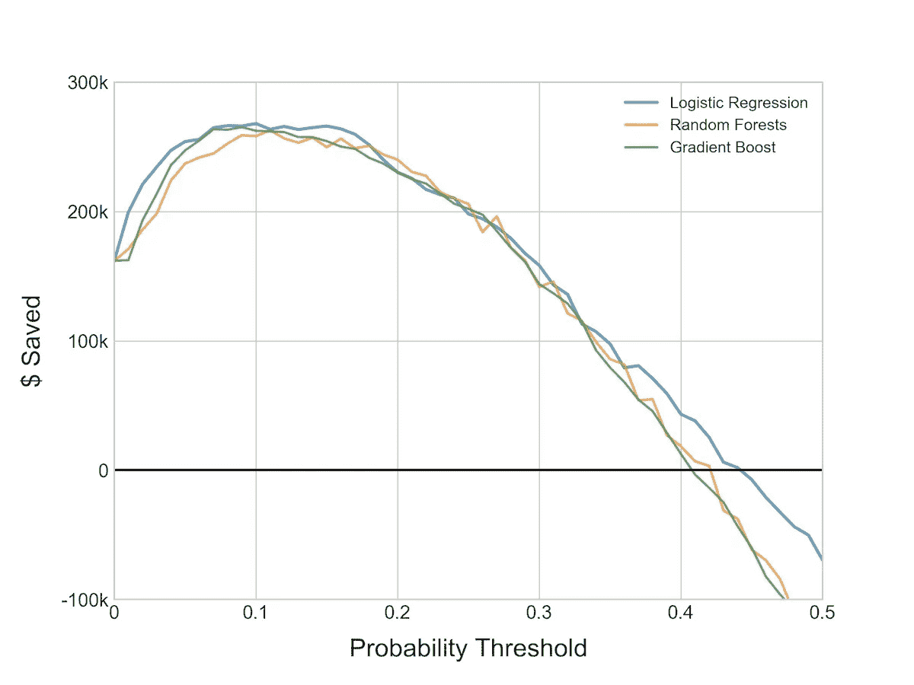
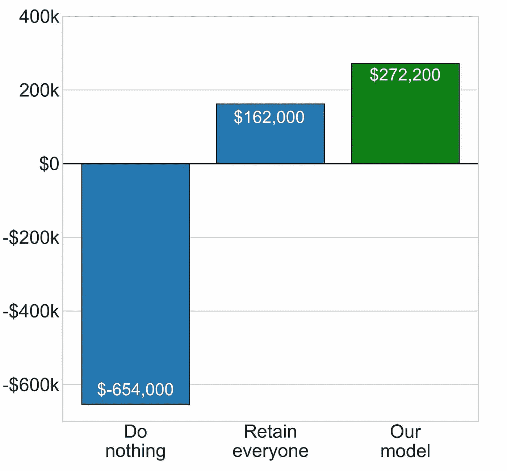

# 切断绳索:预测电信公司的客户流失

> 原文：<https://towardsdatascience.com/cutting-the-cord-predicting-customer-churn-for-a-telecom-company-268e65f177a5?source=collection_archive---------12----------------------->


你可以在这里找到 Github 项目库中的[代码，或者在这里](https://github.com/athena15/project_mcnulty)查看[的最终演示幻灯片。](https://docs.google.com/presentation/d/11sF4lvK3YN3HboN2kcaCh0DWFBSYYQvWvHPWNumpTps/edit?usp=sharing)

# 为什么要研究客户流失？

客户流失是大多数企业面临的最大问题之一。[根据哈佛商业评论](https://hbr.org/2014/10/the-value-of-keeping-the-right-customers)，**发现一个新客户的成本是留住一个现有客户的 5 到 25 倍**。换句话说，你现有的客户价值连城！

防止客户流失是一项重要的业务职能。这也是一个经常用漫无目的的、粗略的方法来处理的问题。通过建立一个模型，用机器学习算法预测客户流失，理想情况下，我们可以将不满意的客户问题扼杀在萌芽状态，并保持收入流动。

# 背景



我使用了来自 Kaggle.com 的[数据集，其中包括一家名为 Telco 的电信公司的 7033 条独特的客户记录。每个条目都有关于客户的信息，包括以下特征:](https://www.kaggle.com/blastchar/telco-customer-churn)

> 服务—客户订购的服务(互联网、电话、有线电视等。)
> 
> 每月账单总额
> 
> 任期——他们成为客户多长时间了
> 
> 基本的人口统计信息——他们是否是老年人，是否有家属，等等。

在我们的研究中，因变量是客户在过去一个月中是否有过“**搅动**”。事实上，我们有整整 27%的客户被贴上了上个月离开公司的标签。随着流失率如此之高，如果我们不干预，公司失去大部分客户只是几个月的事情。


Churn!

# 假设

出于我们分析的目的，我们做了两个假设:

1.  **对于每个离开公司的客户，电信公司需要花费 500 美元来替换该客户。**营销、广告、活动和外展——成本不断增加。
2.  我们可以通过投资 100 美元留住每个可能流失的客户。这可以通过折扣、改善服务(例如提升网速)或提供额外津贴来实现。

# 树立标杆



Let’s make our model better.

为了宣告胜利，我们需要知道成功是什么样子的！我们成功的主要衡量标准是我们的模型相对于默认的虚拟模型的表现如何。请将此视为“维持现状”选项。因为我们知道花 100 美元留住一个客户从长远来看会为我们节省 500 美元——但是我们不知道哪些客户可能会流失——**我们默认的“虚拟”模式就是在我们所有的*客户身上花 100 美元，以确保我们抓住那些流失的客户。***这是我们想要击败的模式。

# 方法学

对于我们的模型，我们首先查看了几种不同的机器学习算法，以确定应该使用哪种算法。我们的第一步是**使用训练-测试-分割将我们的数据分割成训练集和测试集**，这将允许我们稍后交叉验证我们的结果。**我们还对训练-测试-分割进行了分层，**以确保我们的目标变量在训练和测试集中的比例相同。

```
# Stratify our train-test-split so that we have a balanced split
X_train, X_test, y_train, y_test = train_test_split(X, y, test_size=0.3, random_state=40, stratify=y)
```

我们还使用了一些**少数过采样**来平衡我们的数据集。由于我们数据库中只有大约 27%的记录被标记为“搅动的”，在没有过采样的情况下将我们的数据输入我们的算法会导致它对我们的目标变量分类不足。我们使用 **imblearn 的 SMOTE 使我们的少数民族类达到数据集的 50%** 。

```
sm = SMOTE(random_state=42, ratio=1.0)
X_train_res, y_train_res = sm.fit_sample(X_train, y_train)
```

现在我们的数据已经平衡了，我们接着执行**另一个训练测试分割**——这一次只是在我们的训练数据上。这样做的原因是为了不违反交叉验证的基本原则——根据测试数据提供的结果做决定。

```
X_train_2, X_test_2, y_train_2, y_test_2 = train_test_split(X_train_res, y_train_res, test_size=0.33, random_state=20)
```

在所有这些辉煌的数据管理之后，我们绘制了一条 ROC 曲线，以比较每个算法在识别真阳性(灵敏度)和假阳性(特异性)方面的表现。



The ROC Curve, in all its glory.

基于这个图，我们决定用 4 个主要的分类模型前进:逻辑回归、梯度推进、随机森林和 AdaBoost。我们着手调整这些模型，以充分利用它们。

对于我们的分析，**召回是我们的目标指标**。我们最关心的是用我们的模型捕捉尽可能多的*真阳性*(可能流失的人)，我们不太关心我们可能会把一些*假阴性*(没有流失的人)一起扫进去。

了解了这一点，我们然后使用 Sci-Kit Learn 的 GridSearchCV 函数，它允许我们调整我们的模型。我们将召回率设置为优化的评分标准，然后使用不同超参数的组合来找到最适合的模型。我们的目标是从我们的模型中挤出最后一点召回，不能少！

```
pipe = Pipeline([('scaler', StandardScaler()),
                 ('clf', RandomForestClassifier())])
​
param_grid = [{'clf__max_depth': [4, 5, 6],
               'clf__max_features': [5, 10, 15, 20],
               'clf__n_estimators': [50, 100, 150]}]
​
gs = GridSearchCV(pipe, param_grid, cv=5, n_jobs=-1, scoring='recall')
gs.fit(X_train_res, y_train_res)
```

GridSearchCV 还包括一个方便的交叉验证功能(这就是 CV 的含义！)，所以我们在每个模型的新参数通道上执行**分层 K 折交叉验证**。不用说，我们在试图避免过度拟合我们的模型时非常仔细。

最后，我们分析的很大一部分与创建一个**“节省的净美元”函数**有关，该函数将确定我们在留住客户上花了多少钱，而不是因为不必替换他们而节省了多少钱。这和回忆一起，构成了我们判断是否有一个成功模型的决策标准。

# 结果



All of our models performed well.

调整了我们的模型后，结果是 3 个模型并驾齐驱。**我们的最后一步是调整每个模型的概率阈值(在 i = .01 和 i = 1 之间)。**这让我们能够优化“节省的净美元”功能。本质上，对于每个概率阈值 *i* ，我们要求我们的模型预测客户是否会流失——即使是非常低和非常高的 I 值。当然，当 *i* 接近 0 时，我们的模型基本上会预测*每个人*都会流失——相反，当它接近 1 时，没有人会流失。通过绘制这个函数，我们能够看到优化我们的“净节省美元”函数的确切概率。



Making money by keeping customers.

最终，**Logistic 回归模型胜出。**它显示了 81%的出色召回率，并且**最大化了我们的“净节省美元”功能。总的来说，我们的模型为我们节省了 272，200 美元，轻松击败了“现状”模型。这种模式只节省了(微不足道的)16.2 万美元。**

感谢阅读！如果你喜欢这个帖子，[在 LinkedIn 上找到我](https://www.linkedin.com/in/brennerheintz/)，在 Medium 上给我鼓掌，或者[在这里给我发电子邮件](mailto:brenner.heintz@gmail.com)。向前向上，朋友们！