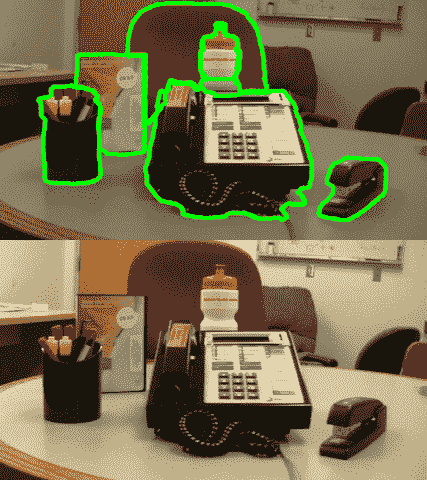
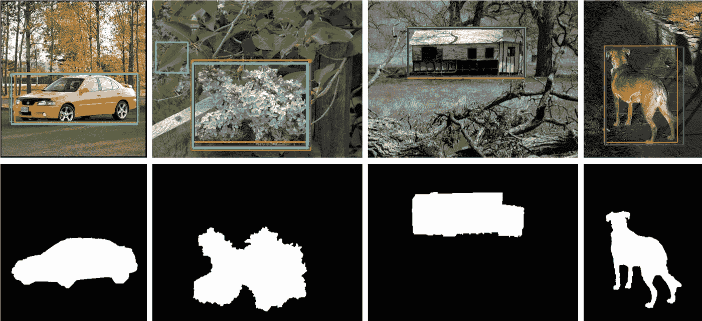
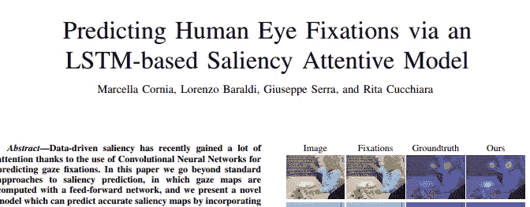
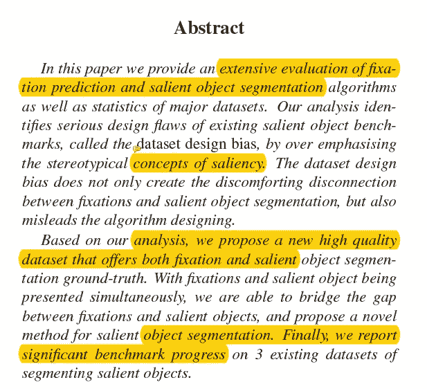
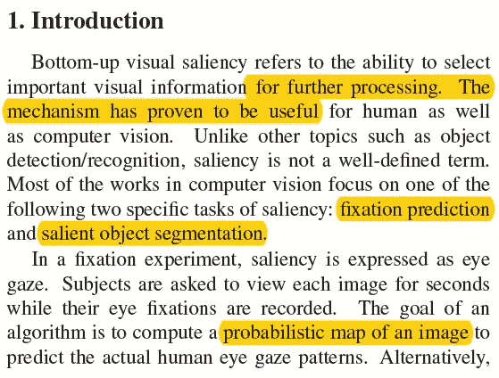
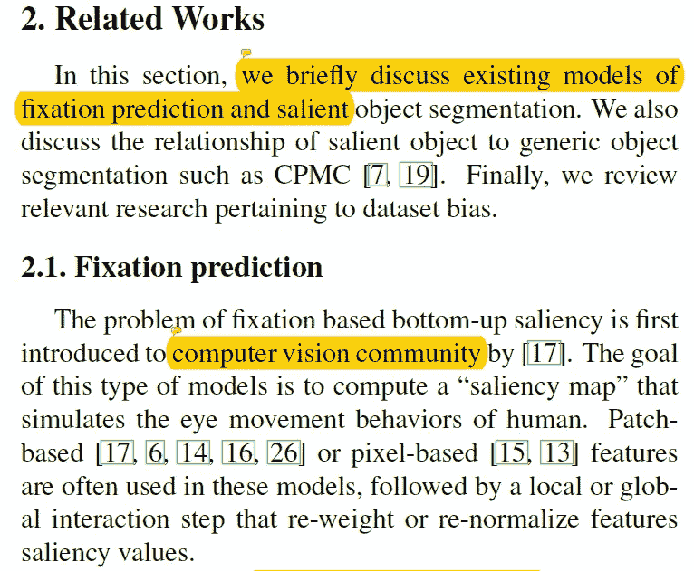
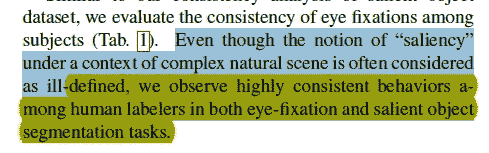
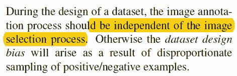
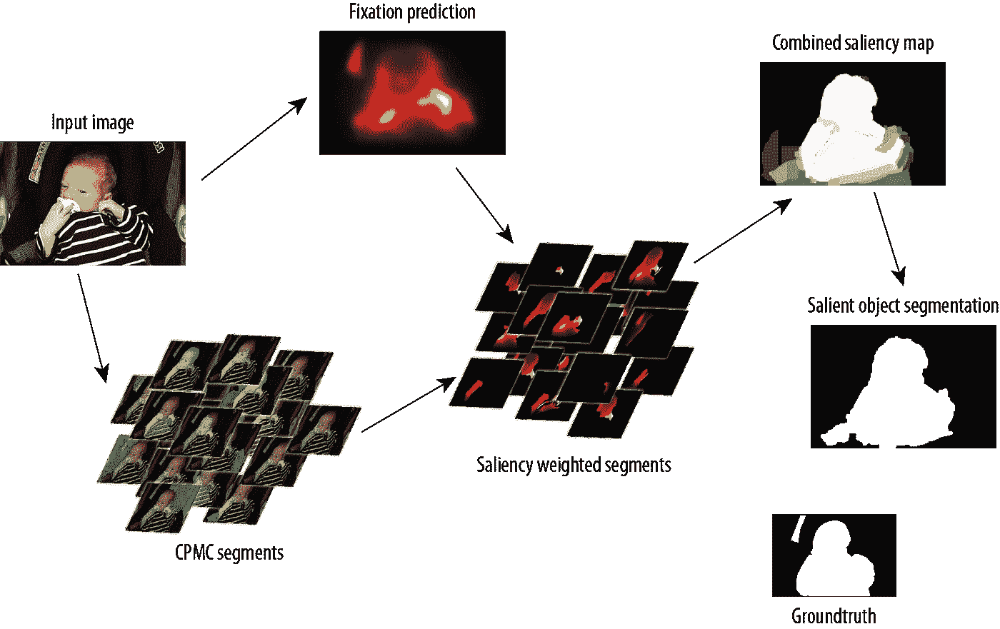
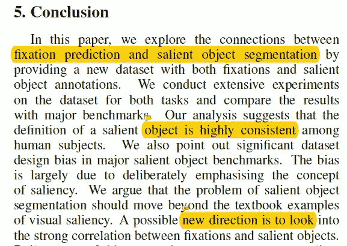

# 【CVPR 2014 /论文摘要】显著对象分割的秘密

> 原文：<https://towardsdatascience.com/cvpr-2014-paper-summary-the-secrets-of-salient-object-segmentation-9c777babdc5?source=collection_archive---------7----------------------->

Gif from this [website](https://giphy.com/gifs/computer-vision-11aRERI0c2KNFu/links)

我已经知道什么是分割，但是我不知道什么是显著对象分割。因此，我决定通过阅读 2014 年 CVPR 上发表的一篇论文来改变这一现状。

> 请注意，这篇文章是为了让未来的我回顾并记住这篇文章的内容。

**显著物体检测/注视预测**

Image from this [website](https://mmcheng.net/msra10k/)

**显著的** →最显著的或最重要的。(来自[谷歌搜索](https://www.google.ca/search?q=salient+def&rlz=1C1CHBF_enCA771CA771&oq=Salient+def&aqs=chrome.0.69i59j0j69i61j69i60j69i61j0.717j0j7&sourceid=chrome&ie=UTF-8))

因此，从上面的图像中，我们可以得出结论，显著对象检测是一个用于分割图像中最重要的对象的术语。

Image from this [paper](https://arxiv.org/pdf/1611.09571.pdf)

从上面的论文中我们可以得出结论，当我们希望预测人眼在观看图像时看得最多的地方时，使用术语注视预测。

**摘要**

这篇文章声称，我们目前评估显著对象基准的方式存在巨大的偏差(称为数据集偏差)。(请记住，本文发表于 2014 年。)此外，本文还介绍了一种显著对象分割的新方法，该方法优于现有的模型。

**简介**

所以在我们继续之前，我们需要知道一个术语。

> **数据集设计偏差** →一种特殊类型的偏差，由实验者对数据集图像的非自然选择引起。(更多信息[请点击此处](https://medium.com/microsoft-design/how-to-recognize-exclusion-in-ai-ec2d6d89f850))

这篇论文的作者告诉我们两件事。计算机视觉中的显著性不是一个明确定义的术语，它可以被理解为 a)分割，其中我们分割图像中最重要的对象，或者 b)眼睛注视预测。然而，现有的方法存在两个问题。

1.  如果一个模型专注于一个问题，它往往会忽略与另一个问题的联系。
2.  如果一个模型在一个数据集上进行基准测试，它往往会过度适应该数据集，从而产生固有的偏差。

**相关作品**

该论文再次描述了每个问题是什么，例如注视预测是眼睛凝视预测，并且对于显著对象分割是试图分割给定图像中最重要的对象的任务。本文还讨论了对象识别任务(我们试图在它们各自的每一类中找到对象)与显著对象分割之间的联系。最后，作者讨论了一个数据集偏差，这在视觉显著性分析中心偏差是一个巨大的问题。这是当实验参与者专注于观看图像的中心，而摄影师想要将焦点对准图像的中心时的原因。

**数据集分析**

这一节的题目是巨大的，主要是因为它是本文的核心贡献之一。我不得不说，我不知道他们做的所有统计分析的细节，但是，一旦我研究了他们。我一定会再写一篇博文。

**在帕斯卡数据集** 上的心理物理实验在这里，作者进行了一些实验来收集用于注视预测的地面真实数据[帕斯卡 2010 数据 se](http://host.robots.ox.ac.uk/pascal/VOC/voc2010/) t 上

**评估数据集一致性**
为了比较不同标注者(来自之前的实验)之间的一致程度，作者进行了一些广泛的分析，以了解受试者之间的一致性。(对于显著对象分割以及注视预测)。作者发现一个有趣的事实是…..(如下所示)

**基准测试** 在这里，作者比较了许多执行显著对象分割的先进算法，并发现当算法没有在 [FT 数据集](http://ivrlwww.epfl.ch/supplementary_material/RK_CVPR09/)上训练时，它们的性能显著下降。

**数据集设计偏差** 作者在这一节真的是全力以赴，他们进行了很多统计分析，比如比较局部颜色对比度、全局颜色对比度、局部 gPB 边界强度、对象大小等。他们把建国总结成一段话

基本上，在 FT 数据集中，在我们想要分割的对象和该对象的背景图像之间存在强烈的对比。这使得模型更容易学习如何分割对象，但不能很好地概括。

**注视和 F-measure**
这里作者讨论了中心偏差问题的影响，以及许多最先进的算法抵消中心偏差问题的方法。例如，在 [AWS](http://jov.arvojournals.org/article.aspx?articleid=2192215) 和 [SIG](https://ieeexplore.ieee.org/document/5963689/) 中，他们在 s-AUC 中对其算法性能进行了基准测试，消除了中心偏差问题。

**从注视到显著物体检测**

对于这一部分，上面的图片，一步一步地描述了作者的方法来执行显著的对象分割，这是一个惊人的工作。(他们声称这很简单，但在我看来真的一点也不简单…)

1.  使用 [CPMC](http://www.robots.ox.ac.uk:5000/~vgg/rg/papers/constrainedmincut.pdf) 执行无监督分割方法
2.  获得对象内注视的空间分布
3.  具有一个函数，其中给定一个建议的对象候选遮罩及其固定图(来自步骤 1 和 2)，估计该区域相对于地面实况的重叠分数(交集/并集)。

**结论**

同样，本文已经证明了在注视预测和显著对象检测之间存在强相关性的事实。使用这种知识，他们提出了一种执行显著对象分割的新方法，其中他们首先执行片段生成过程，然后使用注视预测的显著性评分机制。最后，本文还描述了数据集中的偏差，这在视觉显著性分析中心偏差是一个巨大的问题。

**遗言**

这篇论文包含了大量的信息，并且作为显著对象分割任务以及眼睛注视跟踪的非常好的介绍。非常有趣…

如果发现任何错误，请发电子邮件到 jae.duk.seo@gmail.com 给我，如果你想看我所有写作的列表，请[在这里查看我的网站](https://jaedukseo.me/)。

同时，在我的 twitter [这里](https://twitter.com/JaeDukSeo)关注我，并访问[我的网站](https://jaedukseo.me/)，或我的 [Youtube 频道](https://www.youtube.com/c/JaeDukSeo)了解更多内容。如果你感兴趣的话，我还做了解耦神经网络的比较。

**参考**

1.  李，杨，侯，x，科赫，c，瑞格，J. M .，，尤耶，A. L. (2014)。显著对象分割的秘密。佐治亚理工学院。
2.  MSRA10K Salient Object Database. (2014). 南开大学媒体计算实验室. Retrieved 28 April 2018, from [https://mmcheng.net/msra10k/](https://mmcheng.net/msra10k/)
3.  (2018).Arxiv.org。检索于 2018 年 4 月 28 日，来自[https://arxiv.org/pdf/1611.09571.pdf](https://arxiv.org/pdf/1611.09571.pdf)
4.  如何识别 AI 中的排斥—微软设计—中？(2017).中等。检索于 2018 年 4 月 28 日，来自[https://medium . com/Microsoft-design/how-to-recognize-exclusion-in-ai-EC 2d 6d 89 f 850](https://medium.com/microsoft-design/how-to-recognize-exclusion-in-ai-ec2d6d89f850)
5.  帕斯卡视觉对象类挑战 2010 (VOC2010)。(2018).Host.robots.ox.ac.uk 检索 2018 年 4 月 28 日，来自[http://host.robots.ox.ac.uk/pascal/VOC/voc2010/](http://host.robots.ox.ac.uk/pascal/VOC/voc2010/)
6.  频率调谐显著区域检测。(2018).Ivrlepfl.ch 于 2018 年 4 月 28 日检索，来自 http://ivrlwww.epfl.ch/supplementary_material/RK_CVPR09/
7.  图像签名:突出稀疏的显著区域。(2018).Ieeexplore.ieee.org。检索于 2018 年 4 月 28 日，来自 https://ieeexplore.ieee.org/document/5963689/
8.  加西亚-迪亚兹，a .，莱博兰，v .，Fdez-Vidal，x .，和帕尔多，X. (2012 年)。光学可变性、视觉显著性和眼睛注视之间的关系:一种计算方法。视觉杂志，12(6)，17–17。doi:10.1167/12.6.17