# 【CVPR 2018 /论文摘要】去相关批量归一化

> 原文：<https://towardsdatascience.com/cvpr-2018-paper-summary-decorrelated-batch-normalization-6917d2a8fcf6?source=collection_archive---------19----------------------->

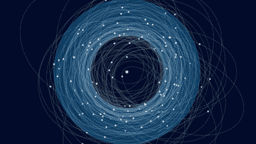

GIF from this [website](https://giphy.com/gifs/data-Si60783lTJw5y)

标准化有多种不同版本，如实例标准化或组标准化。这是一种新的方法，其中该层对给定数据执行统计白化。

> **请注意，这篇帖子是为了我未来的自己复习这篇论文上的材料，而不是从头再看一遍。**

Paper from this [website](https://arxiv.org/pdf/1804.08450.pdf)

**摘要**

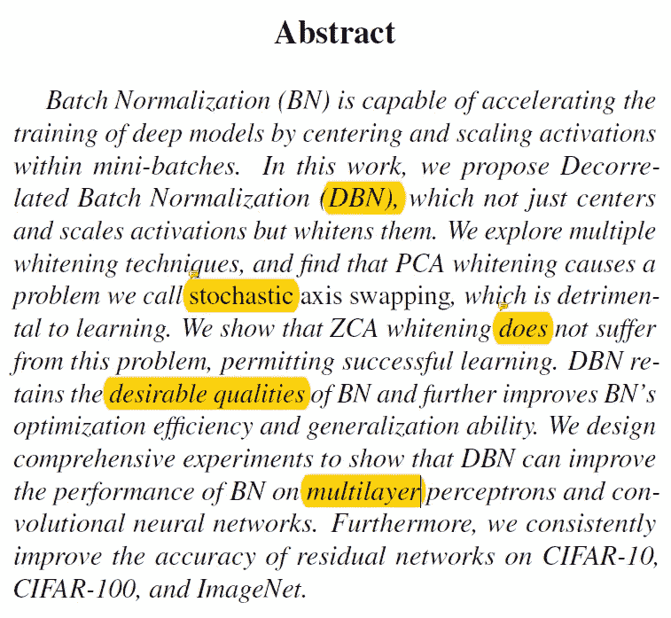

批量标准化是一种标准化给定小批量的技术，在这项工作中，作者将这一概念扩展到去相关批量标准化，其中执行 ZCA 白化。并且 ZCA 白化是为了白化数据而使用的白化技术。

**简介**

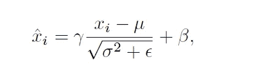

批量规范化用于加速深度网络的训练，从它的出现开始，就被广泛应用于深度学习的各个领域。(而且方程式如上图。)需要注意的一点是，在训练期间，我们使用数据均值和方差，但在测试期间，我们使用移动平均均值和方差。众所周知的事实是，如果我们白化输入，训练变得更有效，因为协方差矩阵的更好条件导致在更新权重时更好地调节 Hessian，使得梯度下降更新更接近牛顿更新。然而，典型的批处理规范执行标准化，然后白化数据。因此，本文的作者开发了一个新的层，在其中执行给定数据的白化。(作者解决了反向传播的问题，用于执行数据白化的技术的选择，以及在执行白化操作时如何决定批量大小。)

**相关工作**

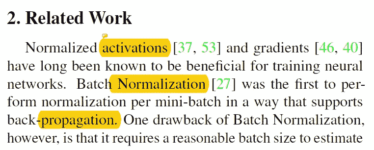

众所周知，归一化数据有助于深度神经网络的收敛。BN 的一个问题是，我们需要一个合理的批量大小来估计平均值和方差，为了解决这个问题，开发了层归一化。还有其他尝试，如批量重新规范化和流规范化。作者的工作与自然神经网络密切相关，然而作者指出了他们的方法更稳定的事实。获得去相关数据的另一种方法是添加额外的正则化项。然而，这些方法并不是为了加速训练。

**去相关批量标准化**

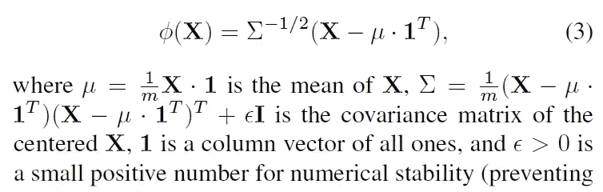

如上所述，数学上我们可以定义去相关操作(其中输入维度和输出维度是相同的。).然而，上述白化操作并不是唯一的，因为 sigma 协方差矩阵仅定义到旋转(单击此处的[以获得更多解释)，并且由于这种现象，作者称之为随机轴交换，这是不可取的。随机轴交换会导致输入维度的随机排列，这会混淆学习算法并损害性能。](https://stats.stackexchange.com/questions/117427/what-is-the-difference-between-zca-whitening-and-pca-whitening)

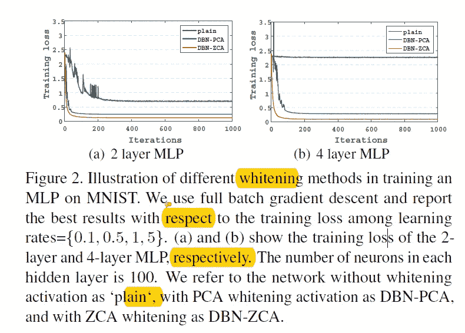

如上所述，我们可以看到，如果发生随机轴交换，网络将无法很好地运行。(甚至根本没有。)为了克服这个问题，作者使用了 ZCA 美白。

ZCA 白化将 L2 距离下的白化引入的失真最小化。并且相对于西格玛值的反向传播可以在下面看到。

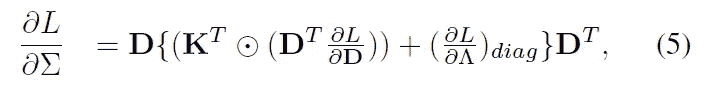

当我们对输入值 x 求导时，它可以是下面这样的。

与批量标准化类似，作者使用了 sigma 和平均值的运行平均值以及可学习参数 alpha 和 beta 的概念。DBN 的完整算法如下所示。

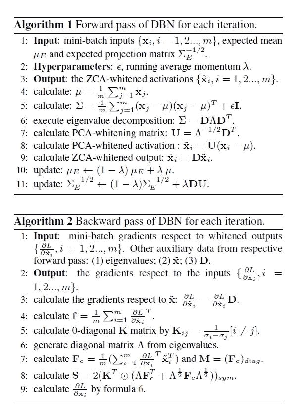

最后，如引言部分所讨论的，作者将特征分成组并对每个组执行白化，而不是一起白化整批。

**实验**

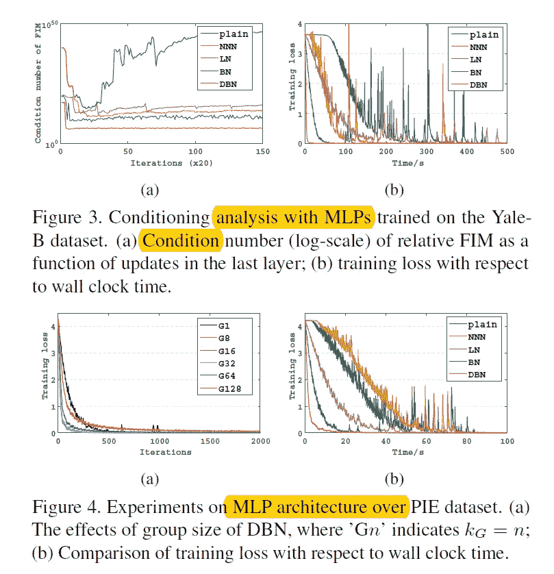

正如上面看到的所有实验，如条件分析以及不同数据集上训练损失的比较，我们可以看到 DBN 表现出最好的性能。

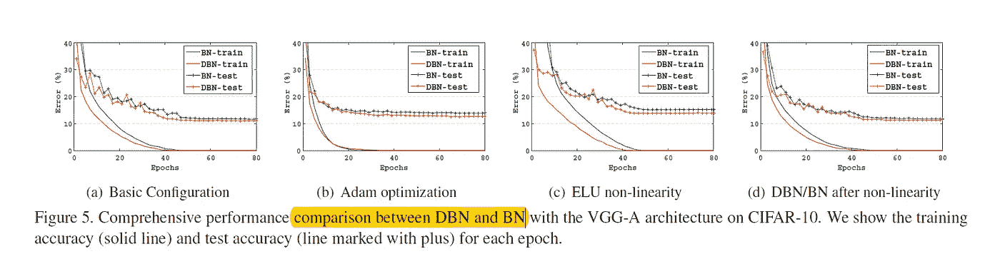

当作者将 VGG-A 架构与 BN 或 DBN 进行比较时，我们可以看到 DBN 在一般化方面表现更好。(最右边的结果是在非线性之后应用 BN/DBN 时的结果。)

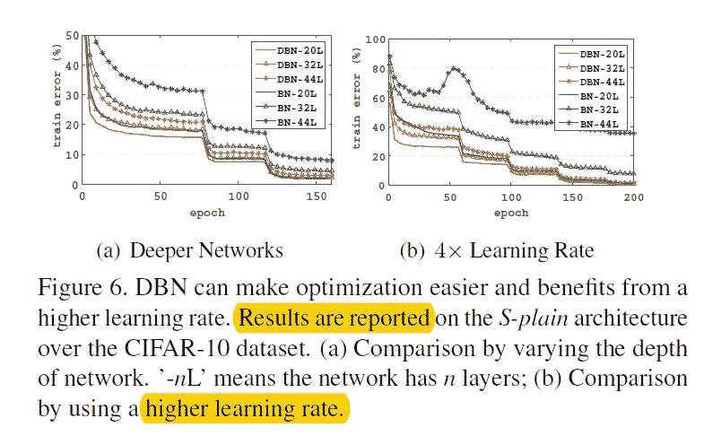

如上所述，当网络使用 DBN 而不是 BN 时，训练更加稳定。(更容易优化)。我们也可以更积极地设定学习率。

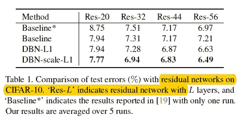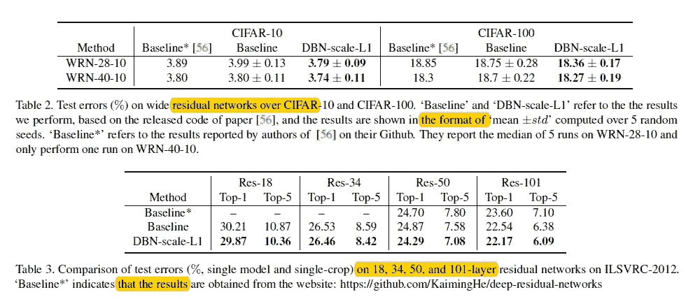

跳过所有需要的贪婪的细节，作者能够通过使用 DBN 的网络超越基线性能。

**结论**

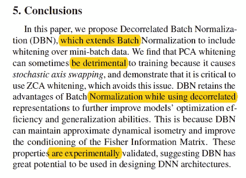

总之，作者介绍了去相关批处理标准化，其中给定数据的性能白化。(而不是标准化)。此外，他们能够超越基线表现。最后，他们发现使用 PCA 美白并不是一个好的选择。

**最后的话**

最后，如果有人感兴趣的话，我已经链接了斯坦福讲座的 pdf，其中也包含了这个主题。

如果发现任何错误，请发电子邮件到 jae.duk.seo@gmail.com 给我，如果你想看我所有写作的列表，请点击这里查看我的网站。

同时，在我的推特[这里](https://twitter.com/JaeDukSeo)关注我，访问[我的网站](https://jaedukseo.me/)，或者我的 [Youtube 频道](https://www.youtube.com/c/JaeDukSeo)了解更多内容。我还实现了[广残网，请点击这里查看博文 pos](https://medium.com/@SeoJaeDuk/wide-residual-networks-with-interactive-code-5e190f8f25ec) t。

**参考**

1.  (2018).Cs231n.stanford.edu。检索于 2018 年 8 月 19 日，来自[http://cs 231n . Stanford . edu/slides/2018/cs 231n _ 2018 _ lecture 07 . pdf](http://cs231n.stanford.edu/slides/2018/cs231n_2018_lecture07.pdf)
2.  (2018).Arxiv.org。检索于 2018 年 8 月 19 日，来自[https://arxiv.org/pdf/1804.08450.pdf](https://arxiv.org/pdf/1804.08450.pdf)
3.  美白？，W. (2018)。ZCA 美白和 PCA 美白有什么区别？。交叉验证。检索于 2018 年 8 月 19 日，来自[https://stats . stack exchange . com/questions/117427/zca-whiting-and-PCA-whiting 的区别是什么](https://stats.stackexchange.com/questions/117427/what-is-the-difference-between-zca-whitening-and-pca-whitening)