# 【CVPR 2018 /论文摘要】TextureGAN:用纹理补片控制深度图像合成

> 原文：<https://towardsdatascience.com/cvpr-2018-paper-summary-texturegan-controlling-deep-image-synthesis-with-texture-patches-50040c0e5cf?source=collection_archive---------5----------------------->

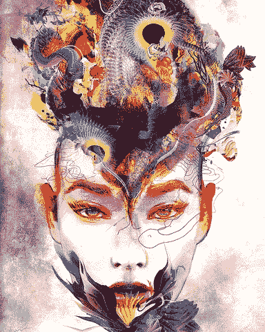

GIF from this [website](https://giphy.com/gifs/love-trippy-psychedelic-nThJsjZVIqT6w)

有不同类型的 GAN 的，今天我将看看一个 GAN，它能够生成不同纹理的真实图像。

> **请注意，这个姿势是为了我未来的自己复习这篇论文上的材料，而不是从头再看一遍。**

Paper from this [website](https://arxiv.org/pdf/1706.02823.pdf)

**摘要**

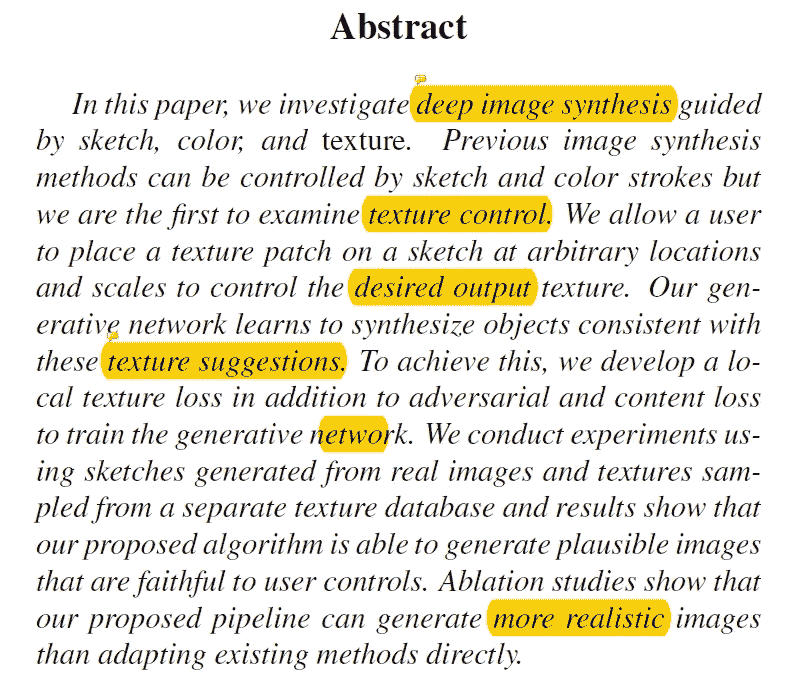

本文的作者是第一个在生成合成图像时尝试纹理控制的人。用户可以控制纹理的方式是通过在包含用户想要生成的目标纹理的草图中放置一个补丁。通过消融研究，研究人员展示了他们的方法是多么有效。

**简介**

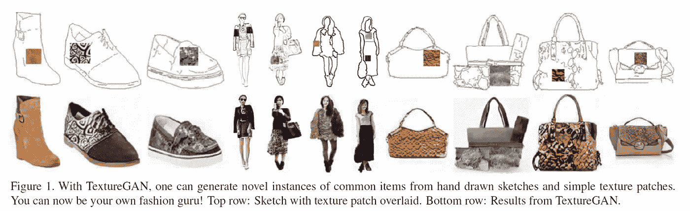

计算机视觉的最大挑战之一是让普通用户生成逼真的图像。相关的研究已经持续了 20 多年。由于 GAN 和可变自动编码器，使用端到端数据管道生成图像的技术有了很大的提高，但尽管如此，在纹理生成方面的研究仍然有限。纹理生成很难的几个原因是:1)获取细节很难，2)保持在边界内很难，3)包围 3D 对象形状很难。在本文中，作者提出了新的损失，并使用大量的数据来克服这一问题。

**相关工作**

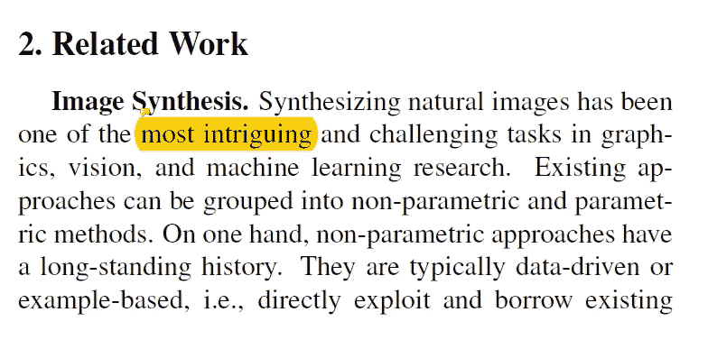

图像合成是计算机视觉中的一个巨大课题，主要有两种方法来实现。(非参数和参数方法)。非参数方法有很长的历史，并且使用更传统的技术。诸如深度学习之类参数方法已经给出了有希望的结果。(包括泛化)。GAN 可用于创建假图像，对于图像合成，这意味着它可以生成逼真的假图像。并且为了使 GAN 更能被人类理解，提出了有条件的 GAN。在计算机视觉中，纹理合成和风格转换密切相关。给定一个图像，纹理合成创建一个具有相似纹理的新图像，对于样式转换，模型尝试转换样式，同时保持图像的上下文相同。(最后，作者解释了他们的工作如何不同于传统的或其他众所周知的方法。)

**质感甘**

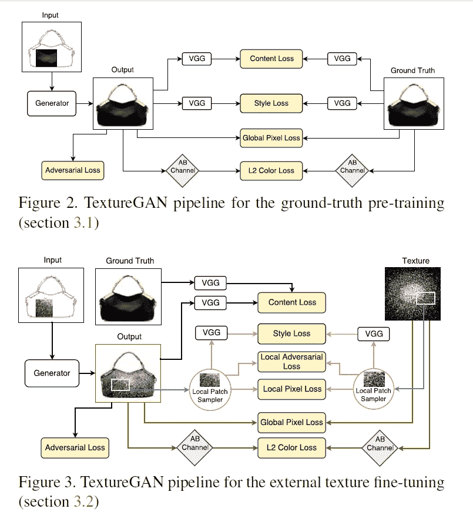

在这一节中，作者提出了纹理 GAN，一个条件生成网络，它能够从具有覆盖纹理的输入草图生成逼真的图像。他们的模型的一个优点是，用户可以直接将目标纹理片放在草图中。(关于这种 GAN 的一个令人印象深刻的事实是，它知道确切的边界，例如，点状纹理只能出现在裙子上，而不能出现在腿上。).注意作者使用了 LAB 色彩空间而不是 RGB 色彩空间，他们使用了“ [*Scribbler:用草图和颜色控制深度图像合成*](http://scribbler.eye.gatech.edu/paper.pdf) ”中介绍的网络架构。

作者首先训练纹理 GAN 来再现地面真实图像，如包或鞋。然后，他们微调网络，使其能够生成逼真的纹理。(见上图)。

***地面实况预训练***

在这一节中，作者讨论了他们用来成功训练网络的各种损失函数。总之，有…..

**特征损失:**使用更深层的 VGG 19 和 L2 损失函数，尝试捕捉结构相似性。

**对抗性损失:**损失函数，使甘的画面更加清晰逼真。(但仅在灰度图像上，L 通道在实验室空间上。)

**风格损失:**鼓励甘再现纹理细节的损失函数。(仅在 L 声道上)。通过匹配来自 VGG 19 的特征矩阵的 Gram 矩阵来完成。

**像素损失/颜色损失**:损失函数，帮助生成更忠实于用户输入纹理片的纹理细节，并添加颜色约束(仅在 AB 通道上)

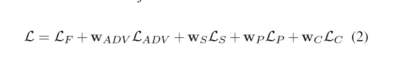

以上是预训练阶段的总损失函数。

***外部纹理微调***

关于纹理 GAN 的训练的一个困难是作者没有应用不同纹理的同一物体的地面真实图像。(网络擅长生成高级特征，但机器人擅长生成低级纹理细节。)为了克服这一点，作者对网络进行了微调，以复制和传播他们没有地面真实输出的纹理。因此，作者保留了除样式损失之外的所有内容，并修改了像素和颜色损失。(带有附加损失函数)

**局部纹理损失:**一个损失函数(由三项组成)，只适用于输出图像的小局部区域。

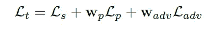

**局部对抗性损失:**损失函数，强制该对具有相同的纹理。
**局部风格损失和像素损失**:类似于上一节的像素和颜色损失，但仅适用于局部。

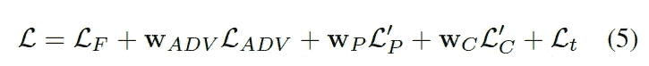

以上是外部微调级的最终损耗函数。

**训练设置**

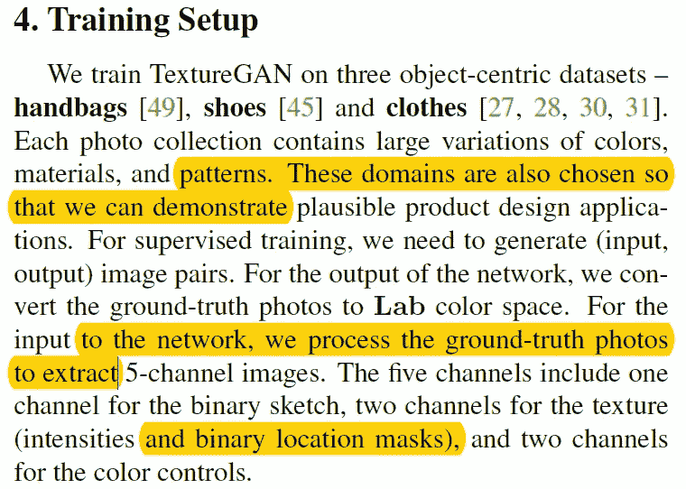

作者使用了三个不同的数据集，其中包含了颜色、材料和图案的巨大差异。(对于从网络输出的图像，图像从 LAB 空间转换到 RGB，对于网络的输入，地面真实图像被处理以提取 5 通道图像。)

***分割遮罩***

由于作者只希望输出纹理的样本与输入纹理的样本相匹配，所以他们从图像的前景中采样小块。(所以背景纹理不再是问题)

***预处理数据生成***

对于草图生成，作者使用了 deep edge detection、Canny edge detection、xDoG，甚至包括合成草图。对于纹理补片，他们从地面真实图像中随机裁剪特定区域，并将其放置在随机调整大小的分割区域内。

**用于微调的数据生成**

此外，他们甚至通过谷歌搜索“皮革”一词并手动选择图像来收集更多数据。

**培训详情**

对于预训练，他们使用学习率为 1e-2 的 Adam Optimizer 进行微调 1e-3。损失函数的权重如下所示。

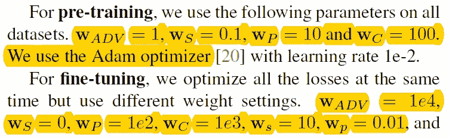

**结果和讨论**

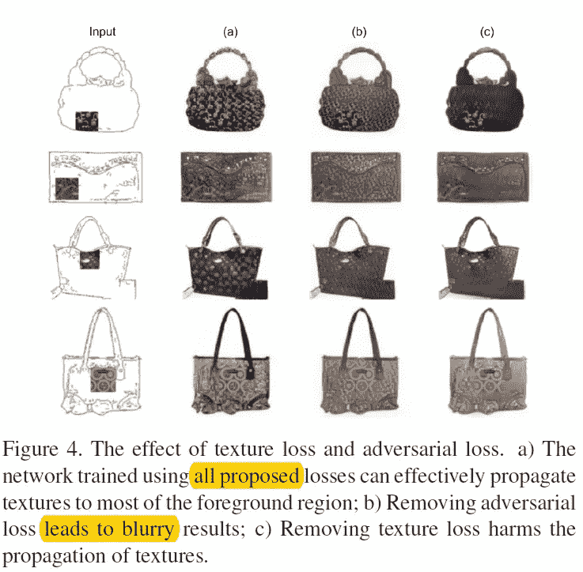

如上所述，当作者关闭了原始损失函数中的一些损失项时。所生成图像的图像质量开始下降，这表明为了生成逼真的图像，需要所有的损失函数。

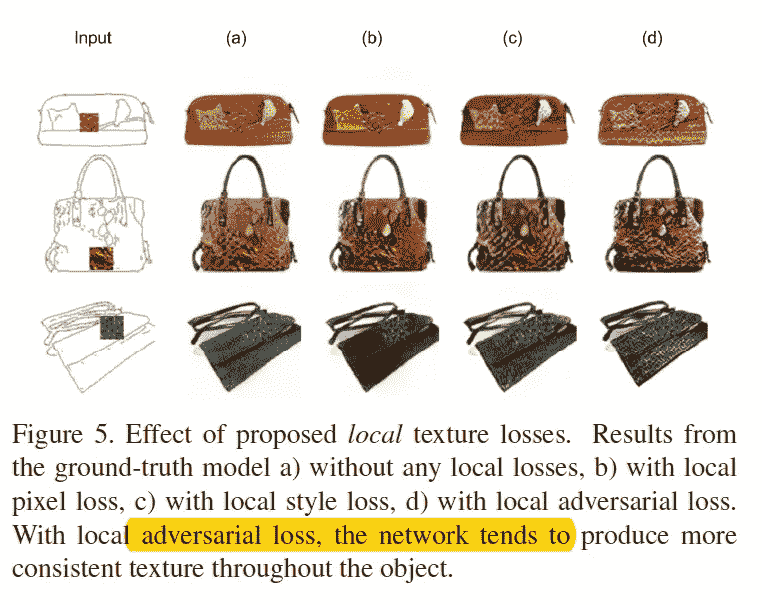

此外，作者还发现，对于变化较少的图像(如鞋子)，GAN 即使没有外部纹理微调也能生成逼真的图像。然而，具有更复杂结构的图像，如手提包，外部纹理微调变得至关重要。(如上图。)下面是一些生成的结果。

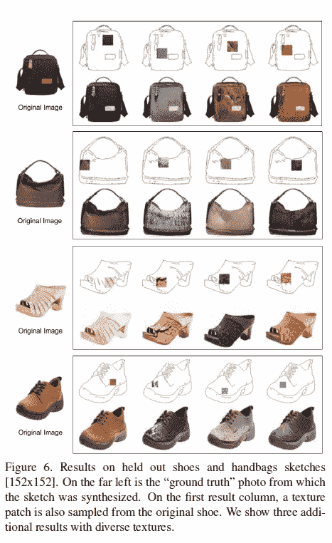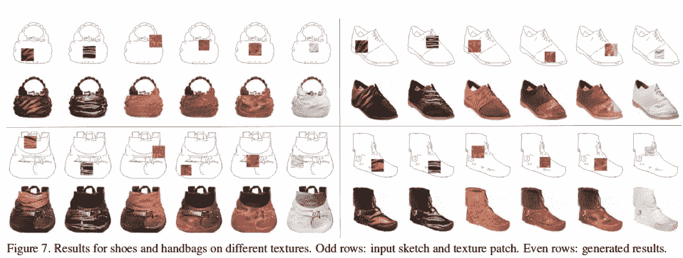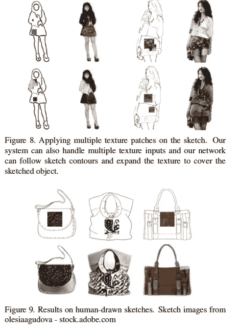

**结论**

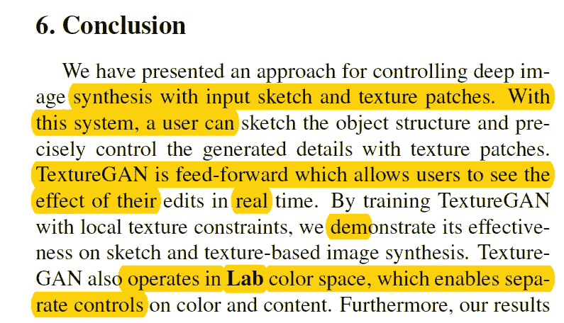

总之，本文作者提出了一种利用输入草图和纹理片控制深度图像合成的方法。他们的纹理 GAN 在生成各种不同纹理的真实图像方面做得非常好。这是由于复杂的损失函数和转换 RGB 图像到 LAB 颜色空间。

**最后的话**

由于神经网络是通用函数逼近器，设计一个好的损失函数是至关重要的。

如果发现任何错误，请发电子邮件到 jae.duk.seo@gmail.com 给我，如果你想看我所有写作的列表，请点击这里查看我的网站。

同时，在我的推特[这里](https://twitter.com/JaeDukSeo)关注我，访问[我的网站](https://jaedukseo.me/)，或者我的 [Youtube 频道](https://www.youtube.com/c/JaeDukSeo)了解更多内容。我还实现了[广残网，请点击这里查看博文 pos](https://medium.com/@SeoJaeDuk/wide-residual-networks-with-interactive-code-5e190f8f25ec) t。

**参考**

1.  (2018).Arxiv.org。检索于 2018 年 7 月 15 日，来自[https://arxiv.org/pdf/1706.02823.pdf](https://arxiv.org/pdf/1706.02823.pdf)
2.  (2018).Scribbler.eye.gatech.edu。检索于 2018 年 7 月 15 日，来自[http://scribbler.eye.gatech.edu/paper.pdf](http://scribbler.eye.gatech.edu/paper.pdf)