# [ CVPR 2018 /论文摘要]利用周期和形状一致性生成对抗网络翻译和分割多模态医学卷

> 原文：<https://towardsdatascience.com/cvpr-2018-paper-summary-translating-and-segmenting-multimodal-medical-volumes-with-cycle-and-e6381b4a2690?source=collection_archive---------14----------------------->

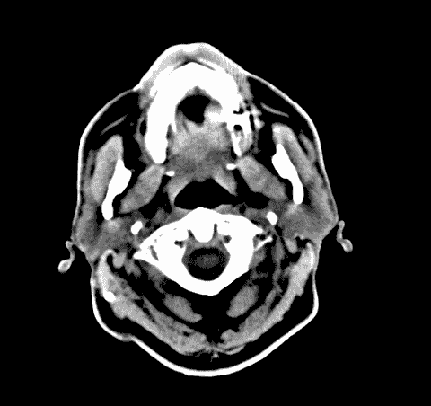

GIF from this [website](https://giphy.com/gifs/ct-vrwUtfcsRZJss)

最有才华的研究员之一的有趣的论文之一。

> **请注意，这篇帖子是给未来的自己看的，回顾这篇论文上的材料，而不是从头再看一遍。**

Paper from this [website](http://Translating and Segmenting Multimodal Medical Volumes with Cycle- and Shape-Consistency Generative Adversarial Network)

**摘要**

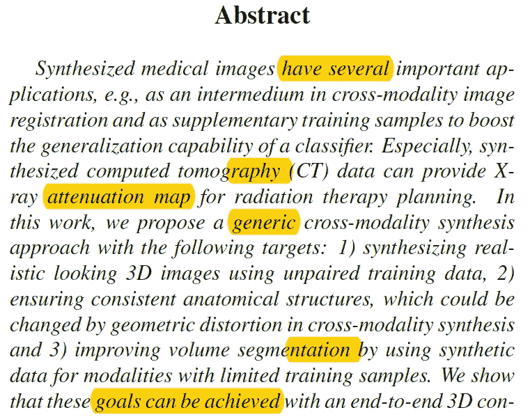

合成的医学数据(例如 CT 图像)有许多不同的用例。它可以用来增加训练数据的数量，也可以用来为放射治疗计划提供 x 射线衰减图。本文作者提出了一种跨通道合成方法，可以实现多通道的合成。
1)根据不成对的数据创建合成的 3D 逼真图像
2)确保一致的解剖结构
3)通过使用有限训练样本上的合成数据改进体积分割。

一个非常有趣的事实是，上述所有目标都可以通过端到端模型实现，该模型由互利的生成器和分段器组成。生成器通过对抗损失、循环一致性损失以及形状一致性损失来训练，这由分割器来监督。(以配合目标 2)。从分段器的角度来看，生成器创建了更多的训练数据供模型学习。并且作者表明，将该任务作为耦合网络来解决比试图单独解决更有益。

**简介**

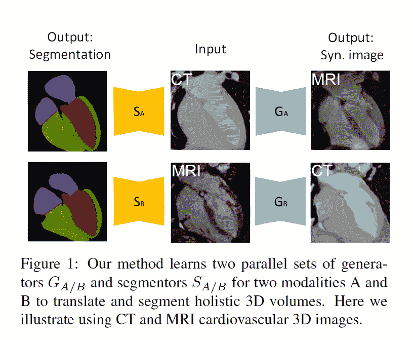

目前在临床领域中，非常需要开发一种跨模态图像传输分析系统来辅助临床治疗。在医学领域，很难收集某些类型的数据，这不仅是因为患者的隐私问题，而且是因为在临床实践中还没有很好地建立新的成像模式。本文针对这两个问题，首先进行跨模态图像传输，其次利用生成的图像提高分割性能。

作者使用 GAN 的生成图像，但是，有几个问题。首先，必须保留图像中存在的器官的形状，因为它们捕获医疗信息；其次，从一开始就缺乏训练 gan 的数据会导致许多问题。本文的作者提出了一种通用的解决方案，其中，给定两种模态中的两组不成对的数据，网络通过利用从另一个域以端到端的方式翻译的合成数据，同时学习用于跨域体积到体积翻译的生成器和更强的分割器。他们使用了 4496 张核磁共振成像和计算机断层成像的心血管三维图像

**相关工作**

医学图像合成主要有两个目标，第一是从不同领域生成逼真的图像，第二是使用从不同领域生成的数据来提高分类任务的性能。并且在这方面已经做了相当多的工作，然而，还没有探索从未配对的跨域数据中学习。最后，一些其他研究包括对抗性学习被用作对分割或检测网络的额外监督。

**提议的方法**

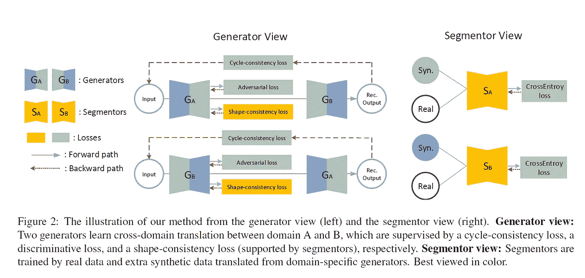

在这一节中，作者首先从解释图像到图像的转换开始，然后转到卷到卷的转换。

***未配对数据的图像到图像转换***

最近，GAN 已被用于执行图像生成，如风格转移或有条件的 GAN。然而，对于正确的损失计算，成对数据并不总是可获得的。CycleGAN 和其他方法已经提出推广有条件 GAN。

***不成对卷到卷翻译中的问题***

缺乏直接监督是一个大问题，因为它在几何变换方面具有固有的模糊性。简而言之，当几何失真被平移回原始域时，它可以被恢复，而不会引起数据保真度成本的任何损失。

***卷对卷循环一致性/形状一致性***

首先，为了训练 GAN，作者使用了如下所示的成本函数。

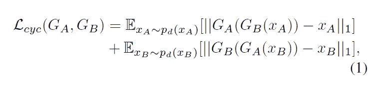

此外，该论文的作者引入了更多的损失函数，包括分段网络，以保持由循环 GAN 生成的数据的形状。和下面的损失函数，也作为 GANs 的正则化。

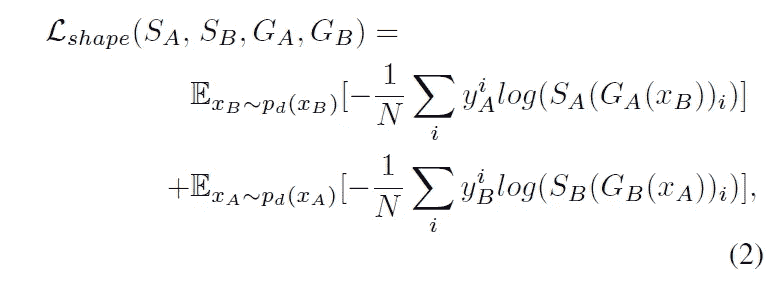

***多模态体积分割/目标***

在 GAN 的训练期间，分割网络也被训练，并且当 GAN 创建更真实的数据时，分割器利用这些图像。

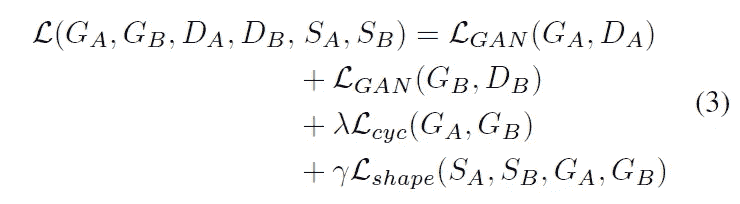

最终的损失函数可以在上面看到，λ和α是要调整的超参数，所有其他成本函数都在上面解释过。

**网络架构和细节/培训细节**

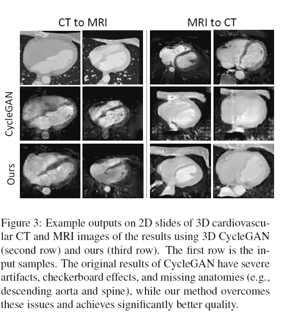

网络实际上对体数据使用 3D 卷积运算。因此，与 2D 卷积运算网络相比，训练要困难得多。此外，作者使用了实例规范化。本文的发电机网络受 U-Net 的影响较大，但下采样操作不太积极。鉴别器受 PatchGAN 影响，且对于分割网络，再次使用 U-Net 型网络。如上所述，我们可以看到作者的生成器网络在生成合成图像方面比纯循环 GAN 做得更好。

对于优化器，作者使用 Adam，他们在分割网络之前预训练生成器和鉴别器。最后，作者还降低了训练后期的学习率。

**实验结果**

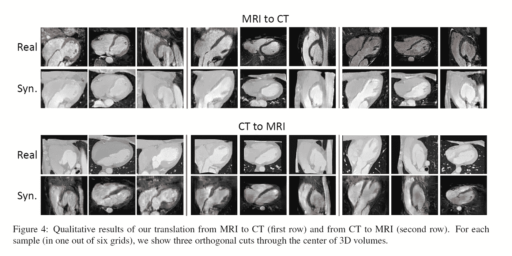

作者使用了来自各种心血管疾病患者的 4354 次对比心脏 CT 扫描，以及 142 次采用新压缩传感扫描协议的心脏 MRI 扫描。(域 A 设置为 CT，域 B 设置为 MRI。)

***跨域翻译评测***

如上图所示，生成的图像没有显示任何几何变换，看起来非常逼真。此外，作者提出了一种 S-core 来评估合成图像的形状变化质量。较高的分数意味着在给定的图像中有较少的变换，我们可以看到作者的网络优于比较的网络。

***分割评估***

这里作者训练了两个分割网络，并遵循不同的方法来衡量性能。这两种不同的方法是临时方法和作者(端到端)方法。(如下图所示)

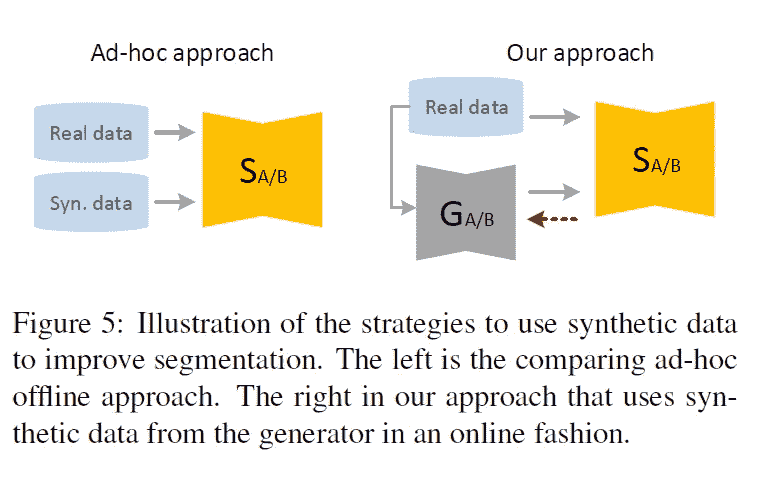

利用骰子点数，作者测量了不同方法的性能差异。并且我们可以观察到作者的方法给出了最佳性能。

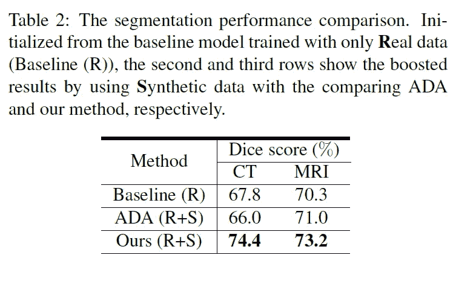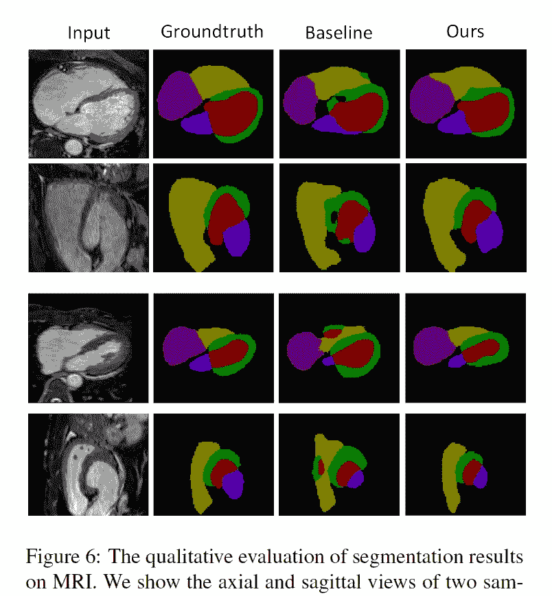

上面是一个分割蒙版的例子，下面是性能图。

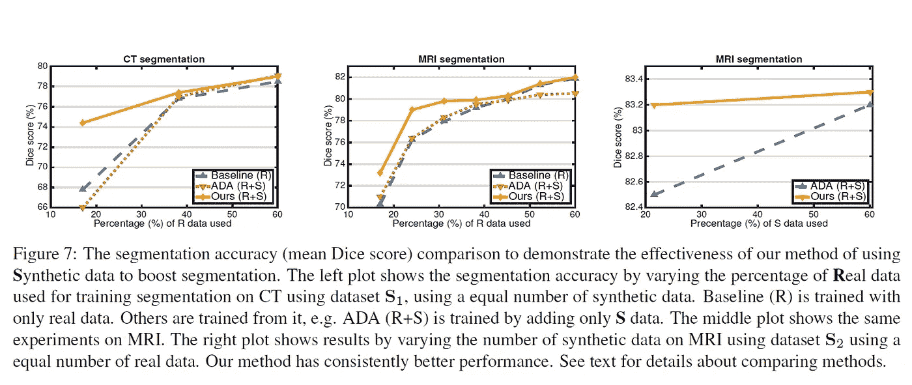

***合成数据与真实数据之间的差距***

减少真实数据和生成数据之间的分布差距是这个项目的关键。如下所示，与仅给出真实数据的基线骰子得分相比，作者的方法具有显著更小的差距。

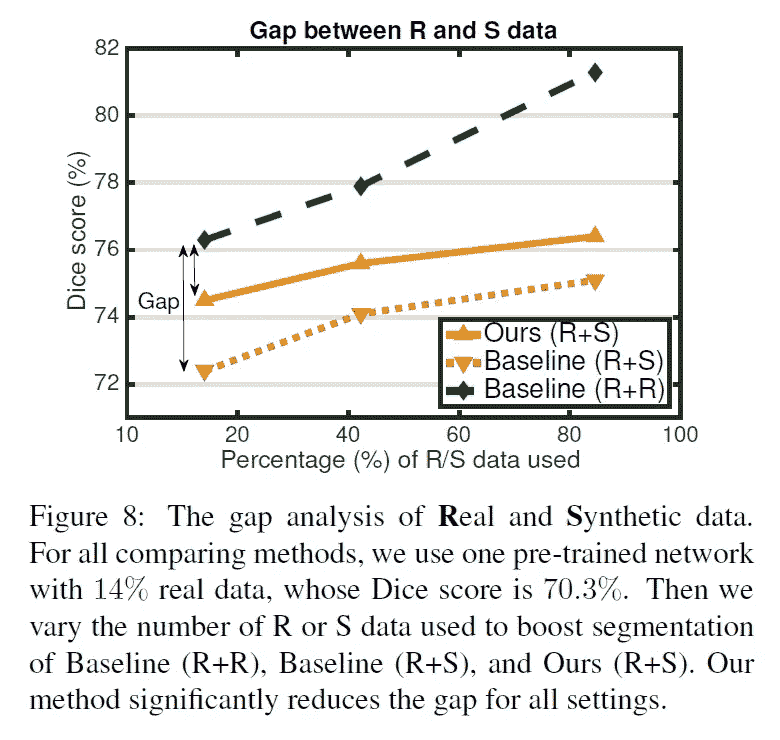

**结论**

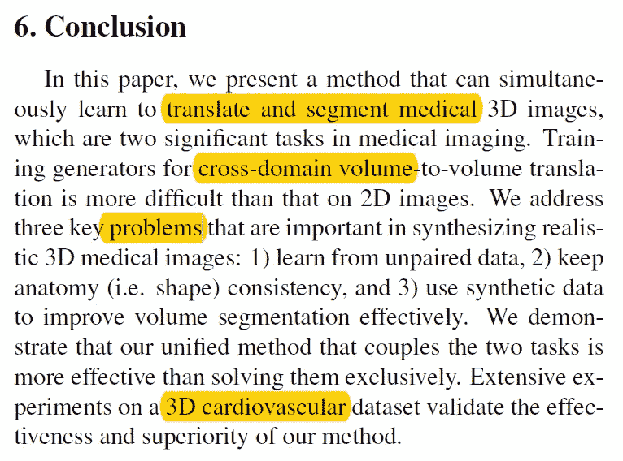

总之，本文作者成功地展示了在进行跨模态翻译时如何对医学图像进行分割的方法。这是通过具有从不成对的数据中学习、保持一般结构的 GAN 和能够利用所生成的合成数据的分段网络来实现的。

**遗言**

光是这一篇论文所做的实验数量就非同一般，难怪张是其中的佼佼者。

如果发现任何错误，请发电子邮件到 jae.duk.seo@gmail.com 给我，如果你想看我所有写作的列表，请在这里查看我的网站。

同时，在我的 twitter 上关注我[这里](https://twitter.com/JaeDukSeo)，访问[我的网站](https://jaedukseo.me/)，或者我的 [Youtube 频道](https://www.youtube.com/c/JaeDukSeo)了解更多内容。我还实现了[广残网，请点击这里查看博文](https://medium.com/@SeoJaeDuk/wide-residual-networks-with-interactive-code-5e190f8f25ec) t。

**参考**

1.  张中，杨，李，郑，于(2018)。基于周期和形状一致性生成对抗网络的多模态医学卷翻译和分割。Arxiv.org。检索于 2018 年 7 月 10 日，来自[https://arxiv.org/abs/1802.09655](https://arxiv.org/abs/1802.09655)