# [ CVPR /论文摘要]再谈显著目标检测:多个显著目标的同时检测、排序和分类

> 原文：<https://towardsdatascience.com/cvpr-paper-summary-revisiting-salient-object-detection-simultaneous-detection-ranking-and-b759a9226d63?source=collection_archive---------13----------------------->

GIF from this [website](https://giphy.com/gifs/montereybayaquarium-face-otter-sea-1xlGfZ07Dq62jqKT9t)

> **请注意，这篇帖子是为了我未来的自己复习这篇论文上的材料，而不是从头再看一遍。**

Paper from this [website](http://openaccess.thecvf.com/content_cvpr_2018/CameraReady/2523.pdf)

**摘要**

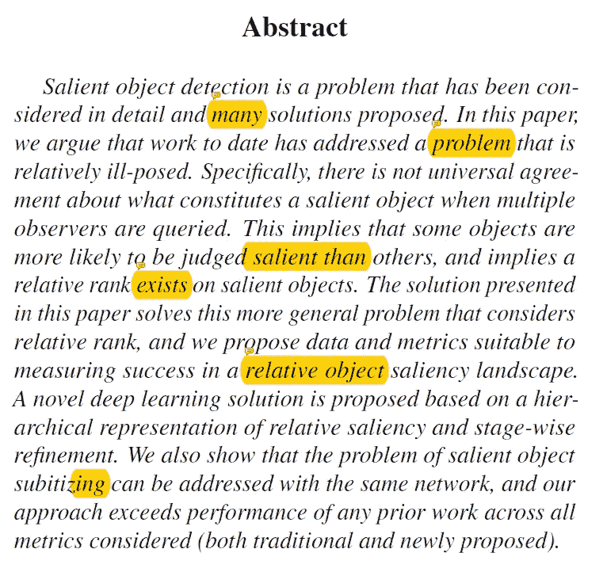

许多研究人员提出了显著对象检测任务的解决方案，然而本文的作者认为，迄今为止大多数工作都解决了一个相对不适定的问题。具体来说，当有多个观察者时，对于什么构成显著物体没有普遍的一致意见。(这意味着一些对象比其他对象排名更突出，并且在对象之间存在排名。).本文的作者提出了一种方法/数据集，其性能优于传统的和新提出的工作。

**简介**

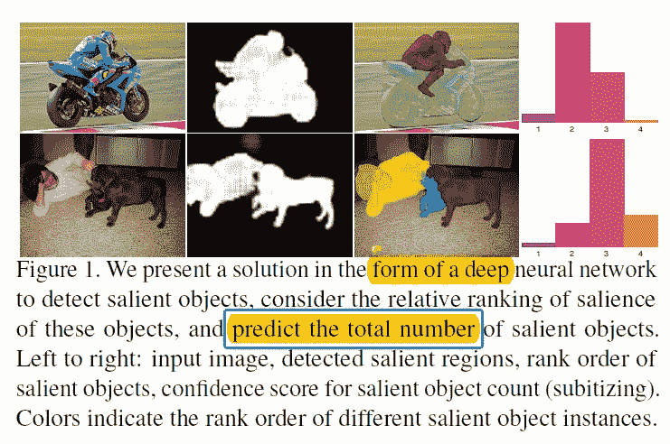

大多数显著目标检测任务考虑单个显著目标或多个显著目标，但是它们没有考虑不同的人可以将一些目标排列得比其他目标更显著。(此外，一些物体可以被认为更普遍地突出。因此，在本文中，作者更广泛地考虑了显著对象检测的问题，其包括检测图像中的所有显著区域，并通过向不同的显著区域分配置信度来解决观察者之间的可变性。(如上所述，模型不仅检测图像中的所有显著对象，还对它们进行排序。).

**显著物体检测/替换**

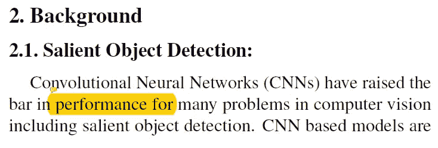

卷积神经网络提高了许多涉及图像的任务的性能标准。一些 CNN 使用超像素方法来实现显著对象检测。其他方法包括使用快捷连接来聚合多级特征。本文的作者通过应用新的机制来控制网络中的信息流，同时重要的是包括一个隐含携带确定相对显著性所必需的信息的堆叠策略，来使用逐级细化。除了分割之外，最近的工作还包括对图像中的显著对象进行子分类，这涉及对图像中的显著对象进行计数。

**提议的网络架构**

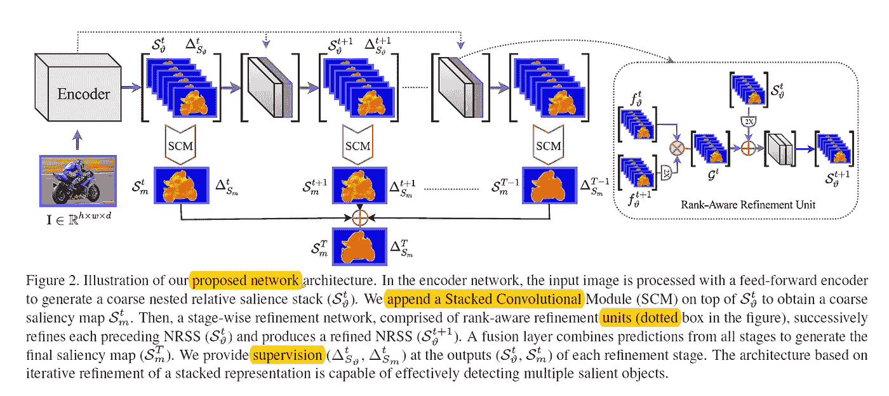

*用于粗略预测的前馈网络*

对于这一部分，作者使用 ResNet-101 作为编码网络，生成特征图。此外，为了用自上而下的细化网络增强编码器网络的主干，作者首先附加一个额外的卷积层以获得嵌套的相对显著性堆栈(NRSS)，然后附加堆栈卷积模块(SCM)以计算每个像素的粗略水平显著性分数。(作者对某些网络使用了 atrous 金字塔池。)

*分阶段细化网络*

大多数现有的工作共享一个公共的逐级解码结构来恢复每个像素的分类。这是因为尽管 CNN 中的最深层具有最丰富的可能特征表示，但是仅依靠解码阶段的卷积和解卷积来恢复丢失的信息可能会降低预测的质量。受此启发，作者提出了一种基于多级融合的细化网络，通过将初始粗略表示与在早期层表示的更精细特征相结合，来恢复解码阶段丢失的上下文信息。(该单元恢复丢失的空间信息，并对图像中呈现的对象的显著性进行分级。)

*多级显著图融合/地面真实的堆叠表示*

为了组合不同 SCM 做出的不同预测，作者在网络末端添加了一个融合层，将不同阶段的预测显著图连接起来。此外，作者生成了一组对应于不同显著性级别(由观察者间协议定义)的堆叠地面实况图。

*显著物体分群网络*

为了生成给定图像的置信度得分，作者再次使用 ResNet-101 作为基础模型，但去掉了最后一层。(并且已经附加了完全连接的网络以生成存在于输入图像中的 0、1、2、3 和 4+个显著对象的置信度得分，随后是另一个完全连接的层导致生成每个类别的最终置信度得分。

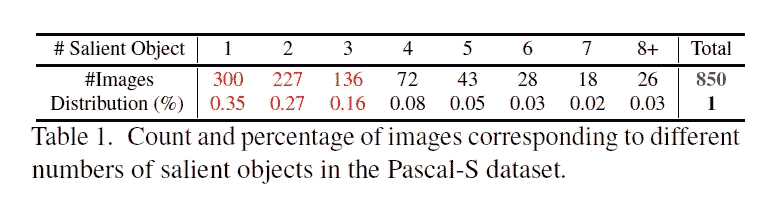

最后，作者为 Pascal-S 数据集创建了子分类基础事实，如上所述，可以看到图像中显著对象数量的分布。

**实验**

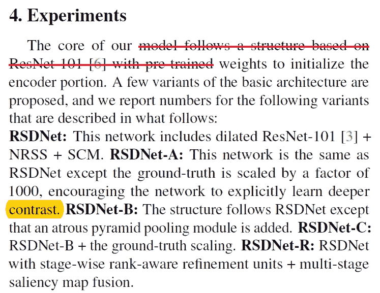

作者添加了多种不同的网络体系结构，它们是…..
RSDNet(expanded ResNet-101，NRSS，SCM)，RSDNet-A(同 RSDNet 但 gt 标签缩放 1000，使网络学习更多对比度。)、RSDNet-B (atrous 金字塔池模块)、RSDNet-C (RSDNet-B +地面实况缩放)、RSDNet-R(具有逐级秩感知细化单元的 RSDNet+多级显著图融合)。).

*数据集和评估指标*

作者使用了 PASCAL 的数据集，并将图像分成两个子集，425 个用于训练，425 个用于测试。使用的指标包括精确召回(PR)曲线、F-measure(沿曲线的最大值)、ROC 曲线下面积(AUC)和平均绝对误差(MAE)。此外，作者还引入了显著对象排序(SOR)分数来评估显著对象的排序。

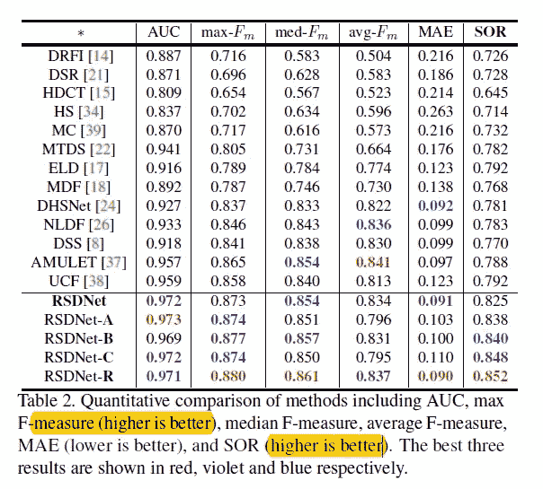

从上表可以明显看出，RSDNet-R 优于许多现有技术方法。值得注意的是，尽管作者的模型是在 Pascal-S 数据的子集上训练的，但它优于其他也利用大规模显著性数据集的算法。(即使没有 CRF)。最后一列(SOR)分数也是作者发明的新度量分数。

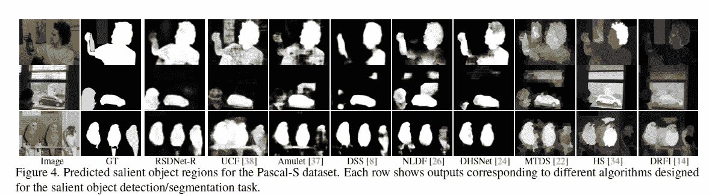

如上所述，作者的方法能够生成最接近地面真实遮罩的显著图。

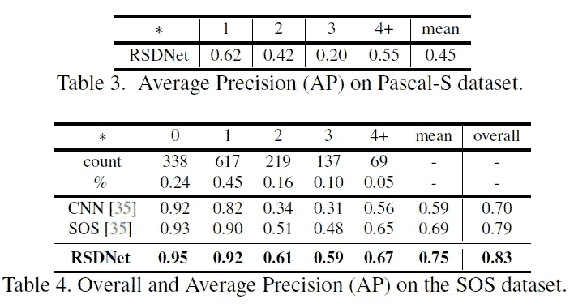

即使在其他任务上，如显著对象子分类，作者的方法也优于现有的方法。(需要注意的是，没有很多其他基线可以与这个分数进行比较。).

*检查嵌套的相对显著性堆栈*

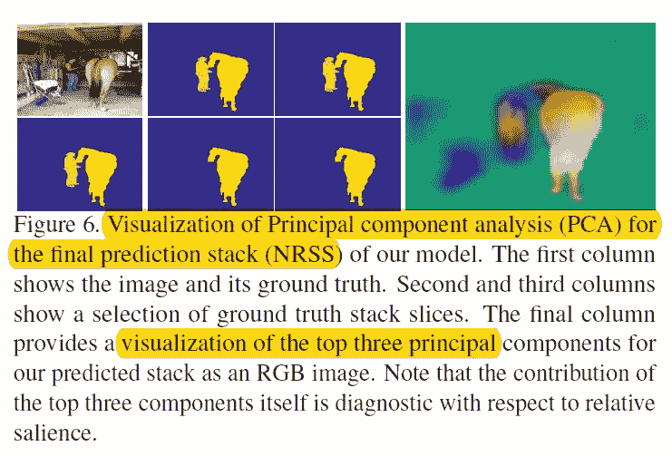

当作者对嵌套的相对显著性堆栈进行主成分分析，并以 RGB 图像的形式可视化时，我们可以看到这三个分量本身就足以看出显著对象的排序。

**结论**

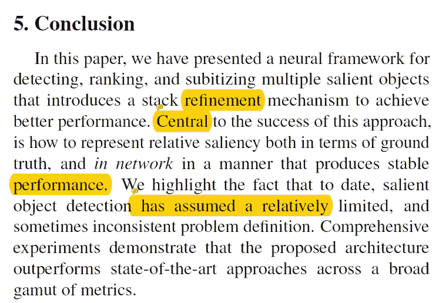

作者提出了一种神经框架，不仅可以检测给定图像中的显著对象，还可以根据它们的显著性对它们进行排序。他们的方法不仅优于传统方法，也优于新提出的方法。

**遗言**

如果发现任何错误，请发电子邮件到 jae.duk.seo@gmail.com 给我，如果你想看我所有写作的列表，请[在这里查看我的网站](https://jaedukseo.me/)。

同时，在我的 twitter [这里](https://twitter.com/JaeDukSeo)关注我，并访问[我的网站](https://jaedukseo.me/)，或我的 [Youtube 频道](https://www.youtube.com/c/JaeDukSeo)了解更多内容。我也实现了[广残网，请点击这里查看博文 pos](https://medium.com/@SeoJaeDuk/wide-residual-networks-with-interactive-code-5e190f8f25ec) t。

**参考**

1.  (2018).Openaccess.thecvf.com。检索于 2018 年 9 月 11 日，来自[http://open access . the CVF . com/content _ cvpr _ 2018/camera ready/2523 . pdf](http://openaccess.thecvf.com/content_cvpr_2018/CameraReady/2523.pdf)

Photo by Scott Webb from Pexels