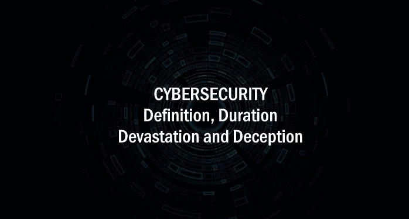

# 网络安全:定义、持续时间、破坏和欺骗，Simon Smith eVestigator 网络调查员兼硕士

> 原文：<https://towardsdatascience.com/cybersecurity-definition-duration-devastation-and-deception-simon-smith-cyber-investigator-44e5a14637ed?source=collection_archive---------5----------------------->

Cybersecurity: Definition, Duration, Devastation and Deception, Simon Smith eVestigator — Cyber Forensics Expert

**西蒙·史密斯**

我叫西蒙·史密斯。不认识我的人可以查看我在[https://www.linkedin.com/in/simonsmithinvestigator](https://www.linkedin.com/in/simonsmithinvestigator)的个人资料

我被要求解释我对所谓的“网络安全人才短缺”的立场。我花了一些时间，所以我想分享我的答案。这可以结合与工作相关的事实证据来理解:

[https://www . LinkedIn . com/feed/update/urn:Li:LinkedIn article:6268034510613544960](https://www.linkedin.com/feed/update/urn:li:linkedInArticle:6268034510613544960/)

**网络安全——由于所谓的“网络安全人才短缺”而出现的新一批专家(的确如此)，政府和我听说的一些人提出的培训方法近乎疏忽。**

有基础技能。这就像去参加第五节丹黑带课程，是的，那天晚上你可能学了 1 个动作，而且那天晚上还能重复。第二天你会忘记的，这对你来说并不自然，因为你没有在过去的 20 年里通过等级和基础技能达到目的，而这些技能是掌握手臂、臀部、腿部和头部每一个动作的必备艺术。您错过了“手臂学派”、“腿学派”教导的重要元素，因为它们相互依赖。如果一个人不工作，他们都不会工作。你没有达到那个更高的水平。那天晚上你做的是一个短期记忆运动，不是经过身体训练的自然运动。

你旁边的第五个丹甚至没有想到任何来自“手臂学校”或“臀部学校”的训练，因为它是内置的。这就像呼吸。这很自然。他无缝地完成了这个动作，可以重做或完美地适应它，而不需要使用任何记忆，而是利用他身体的自然本能“随波逐流”，就像呼吸一样。

网络安全不是每个人的“行业”。这是一个级别，一个级别，一种方式。这是一门学科。这需要成为 6 个或更多“行业”的专家。这不是一份你可以直接学习的工作——它必须从你对其他行业专业知识的直觉知识中感受到。这就像呼吸，很自然。你需要打好基础。

这个组织有两扇门和一个秘密的活板门。一个**输入**门和一个**输出**门和一个地下室。然后，您需要理解通过这些门以任何方式进入的每个元素的“输入和输出”的工作方式。这包括数字、人力、文档、业务、流程、培训、监控、审核、账单、费用、**整个业务**。所有在里面被完全计算出来的东西都在活板门中被过滤，所有通过的东西都需要和下面描述的一样的等级。我可以更进一步，但这超出了范围，人们可能会在大师课上问这个问题。

这个原则留待以后讨论。关于技能短缺和风险或无风险的话题，我已经在上面和文章中提到了。我想说的是，人们似乎认为他们可以参加课程并报名参加，即使你可以，你还想参加吗？

发生网络犯罪时，谁会受到损失？

最终，股东和所有人都失去了工作，或者有人失去了生命、自由或隐私(或者数百万)。

**谁负责？**

会议室。因此，他们必须而且在很多地方被引用，如果不是负责公司生活的网络安全人员的话。网络安全是董事会和立法关注的问题，这是事实，也是不争的事实。这不是一份你可以在下班时带些食物回家的工作，而是:

*   你做对了，公司就能生存；
*   你做错了，公司就完蛋了。

除了生命受到威胁，这也是网络勒索和网络跟踪的一部分，该公司将面临法定罚款。如果你认为网络保险就是答案，请三思。仔细阅读政策。

**现实生活:**

**事实:**凭经验，我见过。公司停工也会毁掉公司，不仅仅是罚款。我甚至没有提到我参与的无数死亡威胁、诱拐儿童、邪教、强奸、自杀和网络跟踪案件，其中包括诱捕、勒索和一起持枪案件。

对于那些新手来说，如果你不说出自己的名字，我来说。如果我认为你会危及这个行业，我建议你参考这篇文章:

这完全是一种行业误解。公司可以选择雇佣他们想要的人，但在他们理解网络安全的定义(包括澳大利亚政府)甚至谷歌和脸书之前，你将继续拿生命、身份、安全和工作冒险，这不是我们任何一方想要生活的世界。

___________

# 座右铭——你不能取代人类的优秀——你可以帮助它

记住，人类是任何系统中最薄弱的一环。技术第二！

[🏆](https://www.google.com.au/url?sa=t&rct=j&q=&esrc=s&source=web&cd=1&ved=0ahUKEwjoiqfr6-fTAhXEEbwKHUyWCVsQFggoMAA&url=http%3A%2F%2Femojipedia.org%2Ftrophy%2F&usg=AFQjCNHE92AW4PY3XeDn9sAMkTO914D-uQ&sig2=ULzHbLsJw2JkP7bcX7UOGQ)在 2018 年 12 月之前投票选出西蒙·史密斯为 2018 年度网络专业人士:
[https://Cyber security-Excellence-awards . com/candidates/Simon-Smith/](https://cybersecurity-excellence-awards.com/candidates/simon-smith/)

在 LinkedIn 上连接见解和媒体请求:[https://www.linkedin.com/in/simonsmithinvestigator](https://www.linkedin.com/in/simonsmithinvestigator)
[http://www.cybersecurity.com.au](http://www.cybersecurity.com.au/)
[http://www.cyberblog.com.au](http://www.cyberblog.com.au/)，
[http://www.evestigatortestimonials.com.au](http://www.evestigatortestimonials.com.au/)

点击这里通过我的 YouTube 频道订阅所有媒体采访:[https://www.youtube.com/c/evestigatorAu/?sub_confirmation=1](https://www.youtube.com/c/evestigatorAu/?sub_confirmation=1)