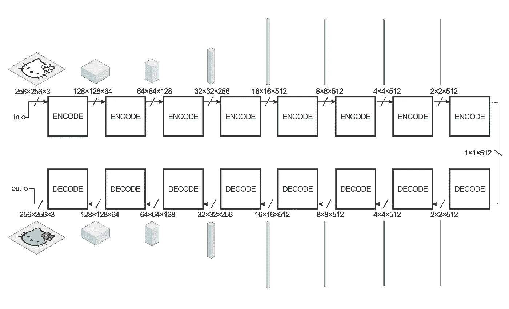
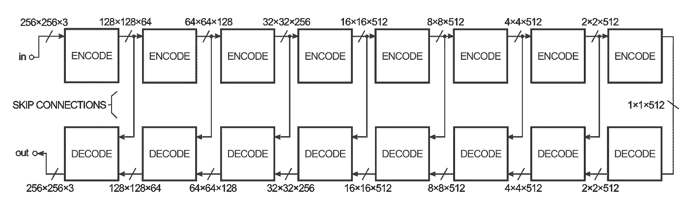
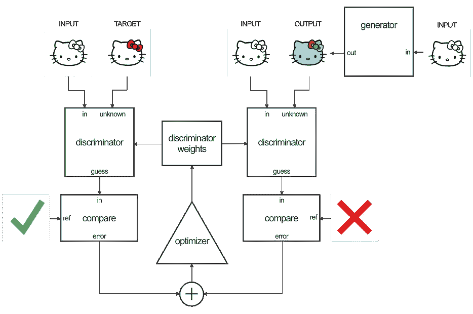
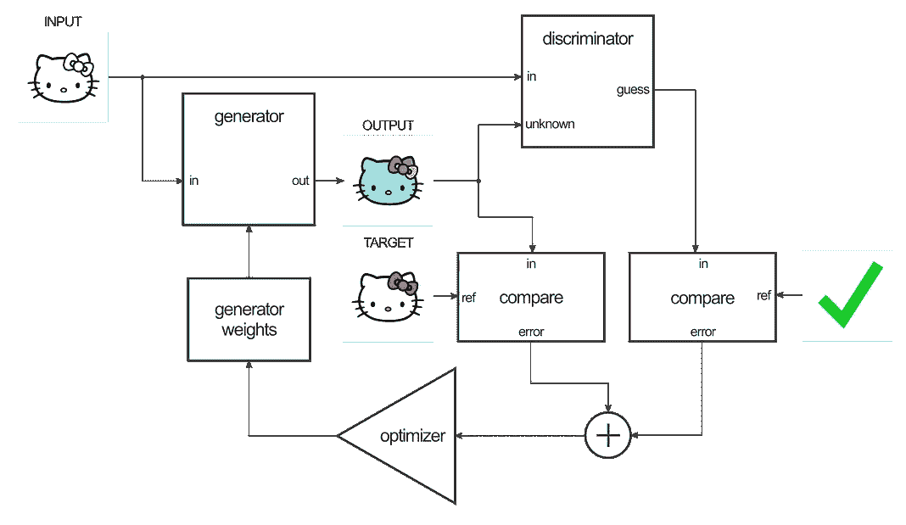
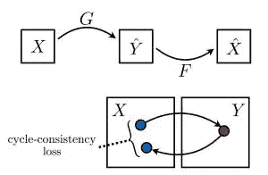

# CycleGANS 和 Pix2Pix

> 原文：<https://towardsdatascience.com/cyclegans-and-pix2pix-5e6a5f0159c4?source=collection_archive---------0----------------------->

**演职员表**:展示这些博客的节略版，解释 pix2pix 和 cycleGANs 背后的思想和概念。

[*克里斯多夫·黑塞*](https://twitter.com/christophrhesse) *博客:*

 [## 张量流——仿射层中的像到像转换

### 确保你已经安装了 Tensorflow 0.12.1 首先 python -c "导入 tensor flow；打印(tensorflow。__version__)" …

affinelayer.com](https://affinelayer.com/pix2pix/) 

Olga Liakhovich 博客:

[](https://www.microsoft.com/developerblog/2017/06/12/learning-image-image-translation-cyclegans/) [## 用 CycleGANs 学习图像到图像的翻译

### 我们最近与全球图片社 Getty Images 合作，探索图像到图像的翻译…

www.microsoft.com](https://www.microsoft.com/developerblog/2017/06/12/learning-image-image-translation-cyclegans/) 

# 像素 2 像素:

论文:[https://phillipi.github.io/pix2pix/](https://phillipi.github.io/pix2pix/)

pix2pix 使用条件生成对抗网络(cGAN)来学习从输入图像到输出图像的映射。

数据集的一个例子是输入图像是黑白图片，而目标图像是图片的彩色版本。在这种情况下，生成器试图学习如何给黑白图像着色。鉴别器正在查看生成器的彩色化尝试，并试图了解生成器提供的彩色化与数据集中提供的真实彩色化目标图像之间的差异。

发生器的结构称为“编码器-解码器”，在 pix2pix 中，编码器-解码器大致如下:



这些体积是为了给你一种感觉，它们旁边的张量维度的形状。本例中的输入是一个 256x256 的图像，具有 3 个颜色通道(红色、绿色和蓝色，对于黑白图像都是相同的)，输出是相同的。

生成器获取一些输入，并试图用一系列编码器(卷积+激活函数)将其减少为更小的表示。这个想法是，通过以这种方式压缩它，我们有希望在最终编码层之后获得数据的更高级表示。解码层执行相反的操作(去卷积+激活功能),并反转编码器层的动作。

为了提高图像到图像变换的性能，作者使用了一个“U-Net”来代替编译码器。这是同样的事情，但是“跳过连接”直接将编码器层连接到解码器层:



如果不需要编码/解码部分，跳过连接为网络提供了绕过编码/解码部分的选项。

这些图表是一个轻微的简化。例如，网络的第一层和最后一层没有批范数层，而中间的几层有丢失单元。

**鉴别器**

鉴别器的工作是获取两个图像，一个输入图像和一个未知图像(它将是来自生成器的目标或输出图像)，并决定第二个图像是否是由生成器生成的。


该结构看起来很像发生器的编码器部分，但工作方式略有不同。输出是 30×30 的图像，其中每个像素值(0 到 1)表示未知图像的相应部分的可信度。在 pix2pix 实现中，这个 30x30 图像的每个像素对应于输入图像的 70x70 补丁的可信度(由于输入图像是 256x256，所以补丁重叠很多)。这种架构被称为“PatchGAN”。

**训练**

训练这个网络有两个步骤:训练鉴别器和训练生成器。

为了训练鉴别器，生成器首先生成输出图像。鉴别器查看输入/目标对和输入/输出对，并猜测它们看起来有多真实。然后基于输入/输出对和输入/目标对的分类误差来调整鉴别器的权重。

然后基于鉴别器的输出以及输出和目标图像之间的差异来调整发生器的权重。



Discriminator and Generator training

# CycleGANs

原创 [CycleGAN 论文](https://arxiv.org/pdf/1703.10593.pdf)

虽然 PIX2PIX 可以产生真正神奇的结果，但挑战在于训练数据。您想要学习转换的两个图像空间需要预先格式化为一个包含两个紧密相关图像的 X/Y 图像。根据您尝试在两种图像类型之间进行转换，这可能会很耗时、不可行，甚至是不可能的(例如，如果两个图像配置文件之间没有一对一的匹配)。这就是 CycleGAN 的用武之地。

CycleGANs 背后的关键思想是，他们可以建立在 PIX2PIX 架构的能力上，但允许你将模型指向两个离散的、*不成对的图像集合*。例如，一个图像集合，组 X，将充满阳光海滩照片，而组 Y 将是阴天海滩照片的集合。CycleGAN 模型可以学习在这两种美学之间转换图像，而无需将紧密相关的匹配合并到单个 X/Y 训练图像中。

CycleGANs 能够在没有明确的 X/Y 训练图像的情况下学习如此出色的翻译的方法包括引入一个*完整翻译周期*的概念，以确定整个翻译系统有多好，从而同时改进两个生成器。



这种方法是 CycleGANs 为图像到图像的翻译带来的巧妙力量，以及它如何在非配对图像风格之间实现更好的翻译。

最初的 CycleGANs 论文[“使用循环一致对抗网络的不成对图像到图像的翻译”](https://arxiv.org/pdf/1703.10593.pdf)由朱俊彦等人发表。

# 损失函数

CycleGANs 的强大之处在于他们如何设置损失函数，并使用全周期损失作为额外的优化目标。

作为复习:我们正在处理 2 个生成器和 2 个鉴别器。

## 发电机损耗

让我们从发电机的损耗函数开始，它由两部分组成。

**第 1 部分**:如果伪造(生成)的图像非常好，鉴别器无法区分这些图像与真实图像，则生成器成功。换句话说，鉴别器对假图像的输出应该尽可能接近 1。在张量流术语中，发电机希望最小化:

```
g_loss_G_disc = tf.reduce_mean((discY_fake — tf.ones_like(discY_fake)) ** 2)g_loss_F_dicr = tf.reduce_mean((discX_fake — tf.ones_like(discX_fake)) ** 2)
```

注意:上面的“**”符号是 Python 中的幂运算符。

**第 2 部分**:我们需要捕捉**循环损耗**:当我们使用另一个发生器从一个发生器回到图像的原始空间时，原始图像(我们开始循环的地方)和循环图像之间的差异应该被最小化。

```
g_loss_G_cycle = tf.reduce_mean(tf.abs(real_X — genF_back)) + tf.reduce_mean(tf.abs(real_Y — genG_back))g_loss_F_cycle = tf.reduce_mean(tf.abs(real_X — genF_back)) + tf.reduce_mean(tf.abs(real_Y — genG_back))
```

最后，发电机损耗是这两项之和:

G _ loss _ G = G _ loss _ G _ disc+G _ loss _ G _ 循环

因为循环损耗非常重要，所以我们想增加它的影响。我们为这个乘数使用了一个 L1λ常数(在论文中使用了值 10)。

现在发电机损耗的大结局看起来像:

G _ loss _ G = G _ loss _ G _ disc+L1 _λ* G _ loss _ G _ cycle

g _ loss _ F = g _ loss _ F _ disc+L1 _ 拉姆达* g_loss_F_cycle

**鉴频器损耗**

鉴别器需要做出两个决定:

1.  真实图像应标记为真实(推荐值应尽可能接近 1)
2.  鉴别器应该能够识别生成的图像，从而预测假图像为 0。

```
DY_loss_real = tf.reduce_mean((DY — tf.ones_like(DY))** 2)DY_loss_fake = tf.reduce_mean((DY_fake_sample — tf.zeros_like(DY_fake_sample)) ** 2)DY_loss = (DY_loss_real + DY_loss_fake) / 2DX_loss_real = tf.reduce_mean((DX — tf.ones_like(DX)) ** 2)DX_loss_fake = tf.reduce_mean((DX_fake_sample — tf.zeros_like(DX_fake_sample)) ** 2)DX_loss = (DX_loss_real + DX_loss_fake) / 2
```