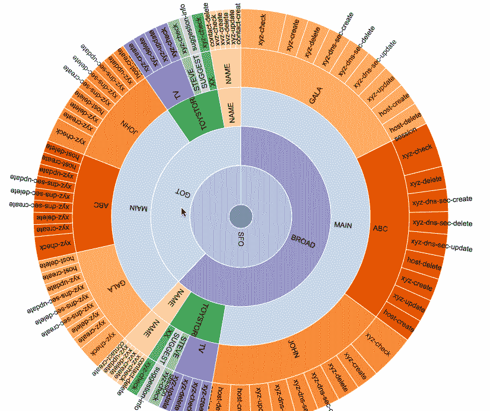
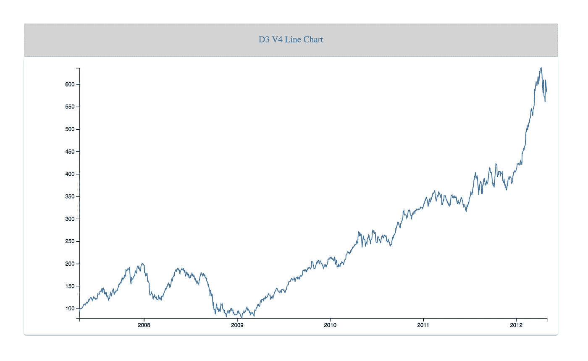

# D3 . js——现在就把它作为定制的模块化包使用吧！！

> 原文：<https://towardsdatascience.com/d3-js-the-custom-modular-bundle-now-bebd6f25bc8b?source=collection_archive---------0----------------------->

Charts created using D3 — [https://github.com/richavyas/D3-Charts](https://github.com/richavyas/D3-Charts)

## 我们今天呼吸数据！！！！

当今是一个大数据世界，我们每天都在与数字打交道。数字是迷人的，但让我们都同意，阅读这些数字是令人生畏的，也是令人疲惫的。这就是数据可视化的起源！！！

我从事数据可视化已经有几年了。2013 年，当我开始研究数据的最佳工具 viz 时，几乎没有任何挣扎， [**D3.js**](https://d3js.org/) 赢得了这场战斗。我在很多地方读到过它的学习曲线和复杂性，但我是一名 JavaScript 工程师，它对我很有用。这里有大量的例子'[' https://bl.ocks.org/mbostock](https://bl.ocks.org/mbostock)'和超级支持的 D3 社区，像我这样的人可以使用现有的，并根据具体要求创建自定义图表。

与此同时，我们的网络社区正在发生变化，它正在向模块化冲刺。 [NPM](https://www.npmjs.com/) ，没有处方药也没有狂欢的流浪艺人，LOL，接管了几乎每一个框架，它已经成为一个最强大的规范，将软件包作为依赖项安装，而不是将任何东西作为外部资源加载。

# 重点是**只进口**需要的东西。

在这个阶段，当 D3 v4.0.0 在 6 月份发布时，支持 ES6 并包含所有的导入/导出语句就不足为奇了。

我两天前开始用它做实验。从官方文档来看，D3 4.0 是一个模块[的集合，这些模块](https://github.com/d3)被设计成一起工作；您可以单独使用这些模块，也可以将它们作为默认构建的一部分一起使用。最后一行， ***你可以一起使用它们作为默认构建的一部分*** 是我花时间在这上面的最有说服力的原因。

我拿了 D3 的线图，[https://bl.ocks.org/mbostock/3883245,](https://bl.ocks.org/mbostock/3883245,)，并打算使用 ES2015 模块和[汇总](http://rollupjs.org/)构建一个定制的 D3 4.0 捆绑包。

## 让我们谈谈代码。

d3 折线图是 [d3 形状](https://github.com/d3/d3-shape)模块的一部分，有更多的依赖关系，如 d3 刻度、d3 轴、D3 选择等。

代码库可以在这里查看:[https://github.com/richavyas/d3-v4-line-chart](https://github.com/richavyas/d3-v4-line-chart)

## D3.js

此文件包含来自其他模块的导入语句，默认情况下会导出这些语句。

## package.json

提到了 npm 安装的依赖关系。

它有一个关键步骤:

## " build ":" roll up-c | uglifyjs-c-m > D3 . min . js "

它仅为要包含的模块创建缩小的 d3 文件。

## 汇总.配置

npm 导入/导出和默认的文件

## index.html

负责图表创建的文件，包括，而不是整个 d3.js 库。

## 怎么建？？？

*   npm 安装
*   npm 运行构建
*   http-服务器

这将启动一个节点服务器，并生成一个 D3 折线图，如下所示:

灵感来源于[迈克的枪托](https://medium.com/@mbostock)原帖:[https://bl.ocks.org/mbostock/3883245](https://bl.ocks.org/mbostock/3883245)

这个 D3 V4 折线图定制包经过优化，只包含您需要的代码。感谢阅读。❤️，如果你觉得值得分享的话。