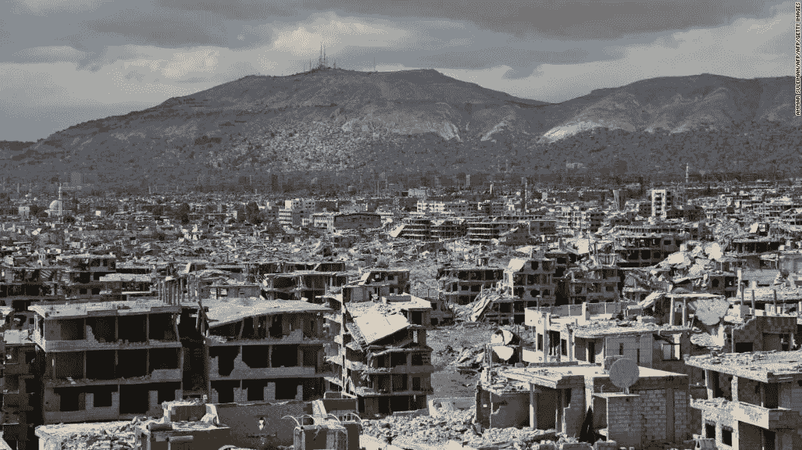
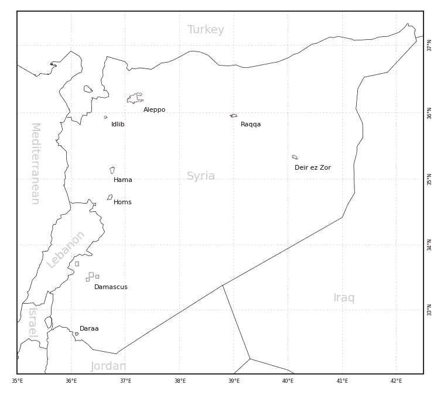
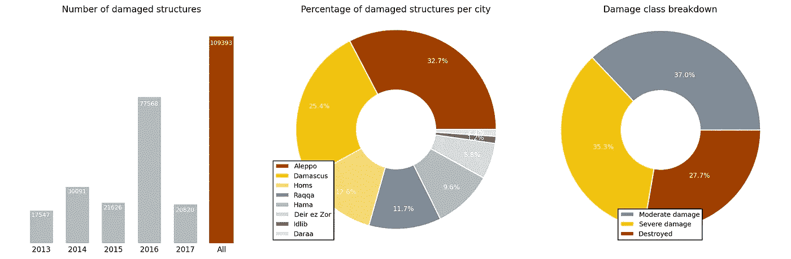
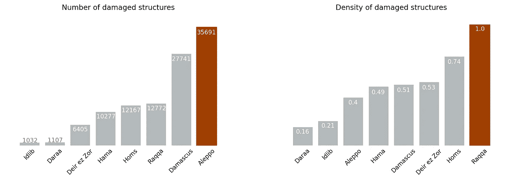
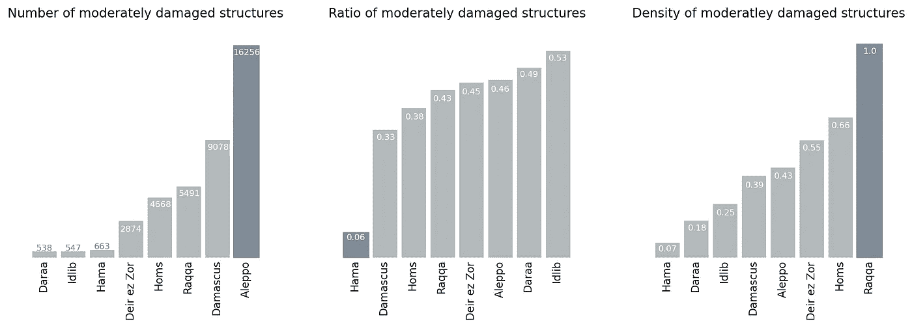
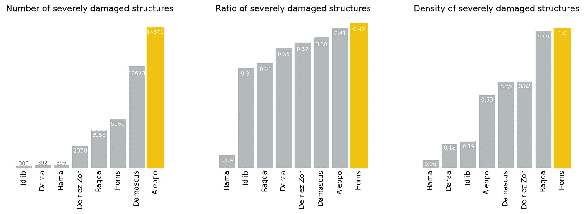
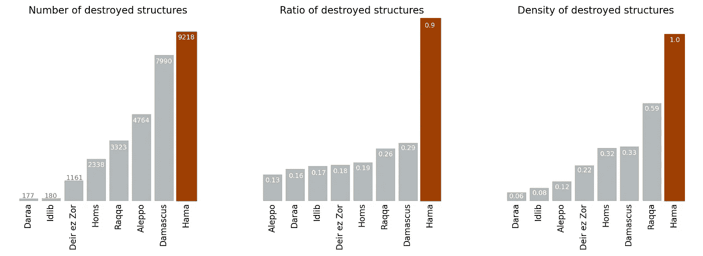
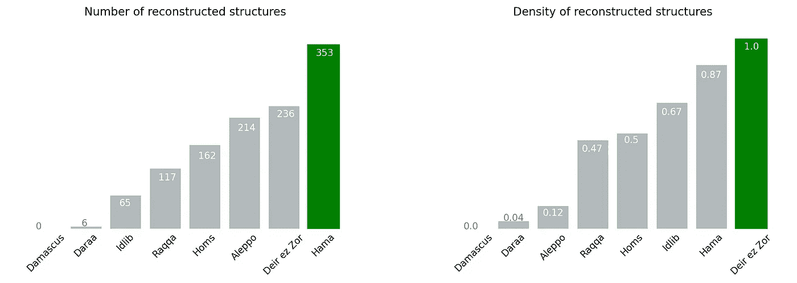

# 叙利亚内战造成的破坏:数据说明了什么

> 原文：<https://towardsdatascience.com/damage-caused-by-the-syrian-civil-war-what-the-data-say-ebad5796fca8?source=collection_archive---------4----------------------->

Jobar neighborhood, Damascus, 2018–02–27 ([Source](https://edition.cnn.com/2018/03/15/middleeast/syria-then-now-satellite-intl/index.html)).

七年多的战争让整个叙利亚城市成为废墟。数字还不清楚，但据估计重建这个国家将花费大约 2000 亿美元。

利用 2013 年至 2017 年拍摄的卫星图像， [UNOSAT](https://unitar.org/unosat/) (训研所的业务卫星应用方案)对叙利亚八个最大的城市进行了全面的损害评估。

我研究了 UNOSAT 的数据，在这篇文章中，我解释了我的发现。

# 数据

联合国组织卫星数据是通过目视检查 2013 年 9 月至 2017 年 11 月期间拍摄的高分辨率卫星图像收集的。检测到的受损结构分为四类:1) *中度*受损，2) *严重*受损，3) *毁坏*，或 4) *无可见损坏*。评估了叙利亚最大的八个城市，即阿勒颇、大马士革、德拉、代尔祖尔、哈马、霍姆斯、伊德利卜和拉卡(图 1)。不同城市的评估重复了不同的时间。[数据](https://www.unitar.org/unosat/maps/SYR/CE20130604SYR/)以 *shapefile* 和 *geodatabase* 格式提供下载。

Figure 1: Cities assessed by UNOSAT.

# 评估摘要

截至 2017 年 11 月，共有 109，393 个检测到的受损结构。2016 年见证了最高的破坏，共有 77，568 个结构(图 2-左)。

37%检测到的结构被中度损坏。 35.3%为*严重损坏*，其余 27.7%为*毁坏*(图 2—右图)。

阿勒颇占受损建筑总数的 32.7%(图 2 —中间)。

Figure 2: Summary of UNOSAT assessment.

# 损伤计数与密度

阿勒颇共有 35，691 座受损建筑，是受损数量最多的城市。其次分别是大马士革、拉卡、霍姆斯、哈马、代尔祖尔、德拉和伊德利卜(图 3—左)。

另一方面，拉卡的受损密度(单位面积受损建筑的数量)最高，其次是霍姆斯、代尔祖尔、大马士革、哈马、阿勒颇、伊德利卜和德拉(图 3 —右)。

值得注意的是，阿勒颇(破坏数量排名第一)的破坏密度是拉卡的 40%(图 3 —右图)。

Figure 3: Damaged structures: count (left), and density (right).

# 中度损坏的结构

阿勒颇以 16256 座中度受损建筑的数量位居第一。其次分别是大马士革、拉卡、霍姆斯、代尔祖尔、哈马、伊德利卜和德拉(图 4 —左)。

伊德利卜的 *m* 中度受损结构(被归类为*中度受损*的结构比例)最高。另一方面，哈马的*中度受损的*建筑仅占该市总数的 6%。这意味着，无论是*严重受损的*还是*被毁的*构筑物，都占到了城市受损构筑物的 94%(图 4 —中)。

拉卡的*中度损坏*结构密度最高(图 4 —右图)。

Figure 4: Moderately damaged structures: count (left), ratio (middle), and density (right).

# 严重受损的结构

阿勒颇再次成为严重受损*建筑数量第一的城市，共有 14671 座建筑。其次分别是大马士革、霍姆斯、拉卡、代尔祖尔、哈马、德拉和伊德利卜(图 5 —左)。*

霍姆斯的*严重受损*建筑比例最高。阿勒颇紧随其后，位居第二(图 5 —中间)。

至于*严重破坏*的密度，霍姆斯和拉卡以几乎相似的值占主导地位(图 5 —右图)。

Figure 5: Severely damaged structures: count (left), ratio (middle), and density (right).

# 被毁的建筑

哈马在被摧毁的建筑的数量(图 6-左)、比例(图 6-中)和密度(图 6-右)上都排在第一位。注意哈马 90%的受损建筑是如何被摧毁的。

Figure 6: Destroyed structures: count (left), ratio (middle), and density (right).

# 重建的结构

总共有 1153 个*重建的*结构(结构从*损坏*到*无可见损坏*)。哈马的建筑数量最多，有 353 座。大马士革没有(图 7-左)。另一方面，代尔祖尔的*重建*结构密度最高(图 7 —右)。

Figure 7: Reconstructed structures: count (left), and density (right).

# 摘要

*   利用 2013 年至 2017 年期间拍摄的卫星图像，联合国组织卫星评估了叙利亚八个最大城市的损失。
*   截至 2017 年 11 月，检测到的受损结构总数为 109，393 个。
*   阿勒颇占受损建筑总数的 32.7%。
*   拉卡的受损建筑密度最高。
*   哈马拥有最高数量和密度的*被摧毁的*建筑。
*   总共有 1153 个*重建的*结构。哈马的票数最高。代尔祖尔的密度最高。